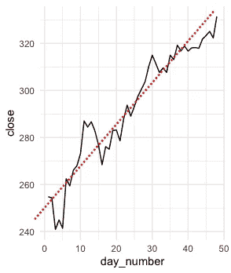
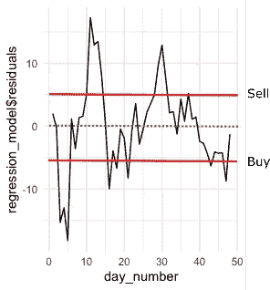

# 用 R 实现一个交易算法

> 原文：<https://towardsdatascience.com/implementing-a-trading-algorithm-with-r-315a175538bd?source=collection_archive---------25----------------------->


克里斯·利维拉尼在 [Unsplash](https://unsplash.com/s/photos/stocks?utm_source=unsplash&utm_medium=referral&utm_content=creditCopyText) 上的照片

这个故事解释了如何用 r 实现移动平均线交易算法。如果你对建立你的自动交易管道感兴趣，你应该首先阅读[这篇](/automated-stock-trading-with-r-part-1-5a1020831096?source=social.tw)文章。这个故事是一个纯粹的技术指南，侧重于编程和统计，而不是财务建议。

在整个故事中，我们将构建一个 R 函数，它将历史股票数据和任意阈值作为输入，并基于它来决定是否是购买给定股票的好时机。我们会看看苹果股票。这篇文章可能需要一定程度的统计知识。大学水平的统计学模块介绍应该足够了。

# **1。移动平均算法**

移动平均交易算法利用了股票趋势的波动。我们首先确定给定时间序列的斜率是否为正。为了简单起见，我们设计的这个算法只适用于积极趋势的股票。然后我们取消历史时间序列的趋势，检查最近的波动是高于还是低于移动平均线。如果当前价格低于移动平均线，并且我们手中没有该股票，我们就买入该股票。如果它高于移动平均线，并且股票目前在我们的持股范围内，我们就卖出股票。

图 1 代表苹果股票在过去 50 天的收盘价。我们对这个时间序列进行去趋势化，这样红色虚线就与 x 轴对齐了。



图 1:苹果股票收盘价(美元)

图 2 显示了苹果股票在过去 50 天的走势。去趋势时间序列看起来是平稳的，即它具有恒定的均值和方差。如果我们想要非常严格，我们可以测试平稳性，以确保它具有理想的属性。我们选择任意阈值为+-5%。如果股票的 5 天平均价格比去趋势时间序列低 5%，我们就买入，如果比去趋势时间序列高 5%，我们就卖出。如果交易成功，在此期间，我们将获得 10%以上的收益。



图 2:去除趋势后的 APPL 股票时间序列残差

# 2.代码实现


凯文·Ku 在 [Unsplash](https://unsplash.com/s/photos/code?utm_source=unsplash&utm_medium=referral&utm_content=creditCopyText) 上的照片

该函数有两个输入。雅虎 API 的历史数据和买卖股票的任意阈值。

```
moving_average_model <- function(data,trend_deviation_treshold = -5) {…}
```

然后，我们访问当前持有的股票，以检查我们在过去购买了哪些股票。下面，我们检查一下我们的投资组合中目前是否持有苹果股票。

```
holdings <- current_holdings()if ((holdings %>% filter(stock == "APPL"))$stock == "APPL") {stock_in_portfolio = TRUE} else {stock_in_portfolio = FALSE}
```

然后，我们将历史数据声明为一个数据框，将包含日期的行名称转换为一个单独的列，只考虑过去 70 天(股票市场开放时大约 50 个工作日)的收盘价和日期。最后，我们创建一个额外的列，为每一天提供一个数字。最近一天的数字最高。

```
data <- as.data.frame(data) %>%tibble::rownames_to_column("date")data_close <- data %>%select(date, close = AAPL.Close) %>%filter(date > as.Date(Sys.Date() - 70)) %>%arrange(date) %>%mutate(day_number = row_number())
```

下一步是消除时间序列的趋势。我们已经为上面的每个日期创建了一个数字递增的变量。如果我们把它作为一个独立的变量，用日期来绘制，这将会形成一条直线。因此，我们可以使用这个变量来消除趋势。如果我们回归这个变量上的股票价格，这将使时间序列趋向。然后，我们可以处理回归的残差，以确定当前价格是高于还是低于移动平均线。

```
formula <- close ~ day_numberregression_model <- lm(formula = formula,data = data_close)
```

你可能会注意到，我们不抑制常数项，也不考虑在进一步的分析。我们只关心当前价格相对于平均价格的位置。因此，我们只能分析残差。

```
recent_5 <- residual_values %>%rename("residual" = "regression_model$residuals") %>%filter(day_number > max(day_number) - 6) %>%summarise(close_mean = mean(residual, na.rm = TRUE))
```

首先，我们计算最近 5 个工作日的平均收盘均值。

```
recent_5_50 <- residual_values %>%rename("residual" = "regression_model$residuals") %>%filter(day_number <=  max(day_number) - 6) %>%summarise(close_mean = mean(residual, na.rm = TRUE))
```

然后，我们计算过去 5 到 50 个工作日的平均值。接下来，我们计算最近 5 天的平均值与 6 到 50 个工作日平均值的偏差。

```
trend_deviation <- ((recent_5$close_mean - recent_5_50$close_mean) /recent_5_50$close_mean) * 100
```

如果过去 5 天的当前偏差低于 5 到 50 天，我们就买入股票。如果我们已经持有苹果股票，如果偏离超过阈值，我们就卖出。我们也检查每一次给定股票的时间序列有一个正斜率。

```
if (trend_deviation < trend_deviation_treshold &regression_model$coefficients[[2]] > 0 &stock_in_portfolio == FALSE) {decision_sell <-  FALSEdecision_buy <- TRUE} else if (trend_deviation > -trend_deviation_treshold &regression_model$coefficients[[2]] > 0 &stock_in_portfolio == TRUE) {decision_sell <-  TRUEdecision_buy <- FALSE}
```

最后一步是创建一个数据框，记录算法所做决策的细节。我们创建一个唯一的 id，包括股票名称和日期，记录运行日期，访问股票价格的日期，股票名称，给定股票的收盘价，计算的趋势偏差，我们选择的阈值，5 天和 45 天的平均值，买入决定和卖出决定。

```
output <- data.frame(id = paste0("APPL-", Sys.Date()),run_time = as.character(Sys.time()),stock_date = (data %>% filter(date == max(date)))$date,stock = "APPL",close_price = (data %>% filter(date == max(date)))$AAPL.Close,trend_deviation = trend_deviation,threshold = trend_deviation_treshold,recent_5_avg = recent_5$close_mean,recent_5_50_avg = recent_5_50$close_mean,decision_buy = decision_buy,decision_sell = decision_sell)
```

# 3.摘要


照片由[马库斯·斯皮斯克](https://unsplash.com/@markusspiske?utm_source=unsplash&utm_medium=referral&utm_content=creditCopyText)在 [Unsplash](https://unsplash.com/s/photos/economy?utm_source=unsplash&utm_medium=referral&utm_content=creditCopyText) 拍摄

我们已经使用 r 实施了移动平均线交易策略。我们只是查看给定股票的历史数据，检查它是否有正趋势，计算当前平均趋势偏差，并基于此做出决策。

然后，我们在主[交易管道](/automated-stock-trading-with-r-part-1-5a1020831096?source=social.tw)中调用这个算法，并将这个决定的细节记录到 google sheets 中。

将来，我会将上述算法扩展到多只股票，这样我们就可以提供我们感兴趣的股票列表，算法/管道会自动交易它们。我们还可以对输入进行额外的健全性检查，并进行平稳性检查，以确保消除趋势的时间序列具有理想的属性。

***来自《走向数据科学》编辑的提示:*** *虽然我们允许独立作者根据我们的* [*规则和指导方针*](/questions-96667b06af5) *发表文章，但我们不认可每个作者的贡献。你不应该在没有寻求专业建议的情况下依赖一个作者的作品。详见我们的* [*读者术语*](/readers-terms-b5d780a700a4) *。*

**附录**

移动平均交易函数的完整代码

```
moving_average_model <- function(data,trend_deviation_treshold = 3) {holdings <- current_holdings()if ((holdings %>% filter(stock == "APPL"))$stock == "APPL") {stock_in_portfolio = TRUE} else {stock_in_portfolio = FALSE}data <- as.data.frame(data) %>%tibble::rownames_to_column("date")data_close <- data %>%select(date, close = AAPL.Close) %>%filter(date > as.Date(Sys.Date() - 70)) %>%arrange(date) %>%mutate(day_number = row_number())formula <- close ~ day_numberregression_model <- lm(formula = formula,data = data_close)residual_values <- bind_cols(as.data.frame(regression_model$residuals),data_close)recent_5 <- residual_values %>%rename("residual" = "regression_model$residuals") %>%filter(day_number > max(day_number) - 6) %>%summarise(close_mean = mean(residual, na.rm = TRUE))recent_5_50 <- residual_values %>%rename("residual" = "regression_model$residuals") %>%filter(day_number <= max(day_number) - 6) %>%summarise(close_mean = mean(residual, na.rm = TRUE))trend_deviation <- ((recent_5$close_mean - recent_5_50$close_mean) /recent_5_50$close_mean) * 100if (trend_deviation < trend_deviation_treshold &regression_model$coefficients[[2]] > 0 &stock_in_portfolio == FALSE) {decision_sell <-  FALSEdecision_buy <- TRUE} else if (trend_deviation > -trend_deviation_treshold &regression_model$coefficients[[2]] > 0 &stock_in_portfolio == TRUE) {decision_sell <-  TRUEdecision_buy <- FALSE}output <- data.frame(id = paste0("APPL-", Sys.Date()),run_time = as.character(Sys.time()),stock_date = (data %>% filter(date == max(date)))$date,stock = "APPL",close_price = (data %>% filter(date == max(date)))$AAPL.Close,trend_deviation = trend_deviation,threshold = trend_deviation_treshold,recent_5_avg = recent_5$close_mean,recent_5_50_avg = recent_5_50$close_mean,decision_buy = decision_buy,decision_sell = decision_sell)output}
```