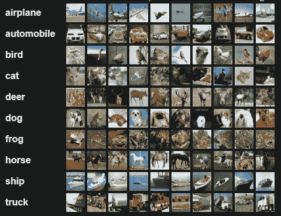
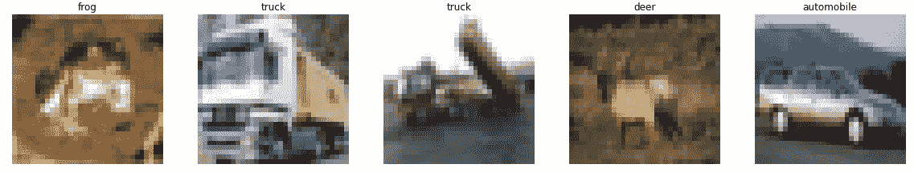
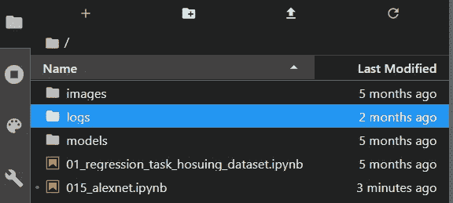
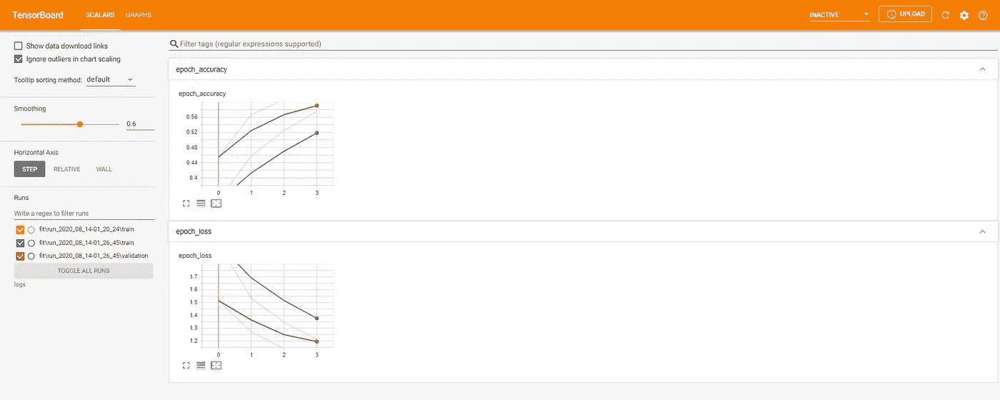
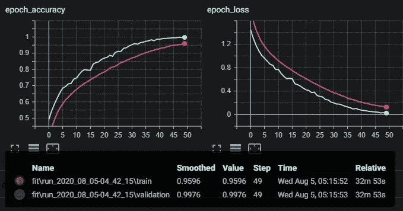

# 使用 TensorFlow 2.0+和 Keras 实现 AlexNet CNN 架构

> 原文：<https://towardsdatascience.com/implementing-alexnet-cnn-architecture-using-tensorflow-2-0-and-keras-2113e090ad98?source=collection_archive---------1----------------------->


由[乌列尔 SC](https://unsplash.com/@urielsc26?utm_source=unsplash&utm_medium=referral&utm_content=creditCopyText) 在 [Unsplash](https://unsplash.com/s/photos/neural-network?utm_source=unsplash&utm_medium=referral&utm_content=creditCopyText) 上拍摄的照片

## 技术的

## 了解如何实施 2012 年开启深度卷积神经网络革命的神经网络架构。

> [**在我主持的这个现场培训环节，用 TensorFlow 和 Keras 学习 AI 和深度学习的基础知识。**](https://www.oreilly.com/live-events/practical-introduction-to-the-world-of-computer-vision-and-deep-learning-with-tensorflow-keras/0636920060577/0636920061406/)

# 介绍

**本文的主要内容将介绍如何使用 TensorFlow 和 Keras 实现 AlexNet 卷积神经网络(CNN)架构。**

但首先，请允许我提供一个 AlexNet CNN 架构背后的简短背景。

AlexNet 在赢得 ImageNet 大规模视觉识别挑战赛(ILSSVRC 2012 竞赛)时首次用于公共场合。正是在这次比赛中，AlexNet 展示了深度卷积神经网络可以用于解决图像分类。

AlexNet 以微弱优势赢得了 ILSVRC 2012 大赛。

详细介绍 CNN 架构内部组件的[研究论文](https://papers.nips.cc/paper/4824-imagenet-classification-with-deep-convolutional-neural-networks.pdf)也介绍了一些新颖的技术和方法，如高效的计算资源利用；数据扩充、GPU 训练和防止神经网络内过度拟合的多种策略。

我写了一篇[文章](/what-alexnet-brought-to-the-world-of-deep-learning-46c7974b46fc)，介绍了 AlexNet 带给计算机视觉和深度学习世界的关键思想和技术。

## 以下是本文中的一些关键学习目标:

*   ***介绍用 Keras 和 TensorFlow 实现神经网络***
*   ***用 TensorFlow 进行数据预处理***
*   ***用冲浪板训练可视化***
*   ***标准机器学习术语和术语的描述***

# AlexNet 实现

AlexNet CNN 可能是理解深度学习概念和技术的最简单的方法之一。

与最近几年出现的一些最先进的 CNN 架构相比，AlexNet 并不是一个复杂的架构。

AlexNet 对于初学者和中级深度学习从业者来说足够简单，可以获得一些关于模型实现技术的良好实践。

本文中的所有代码都是使用 Jupyter 实验室编写的。在本文的最后是一个 GitHub 链接，其中包含了实现部分的所有代码。

*那么我们开始吧。*

## 1.工具和库

我们从导入以下库开始实施:

*   [***tensor flow***](https://www.tensorflow.org/)*:机器学习模型实现、训练、部署的开源平台。*
*   [***Keras***](https://keras.io/)*:一个开源库，用于实现运行在 CPU 和 GPU 上的神经网络架构。*
*   [***Matplotlib***](https://matplotlib.org/)*:可视化 python 工具，用于演示交互式图表和图像。*

```
import tensorflow as tf
from tensorflow import keras
import matplotlib.pyplot as plt
import os
import time
```

## 2.资料组

CIFAR-10 数据集包含 60，000 幅彩色图像，每幅图像的尺寸为 *32x32px* 。数据集内的图像内容是从 10 个类别中取样的。



[CIFAR-10 数据集中的类](https://www.cs.toronto.edu/~kriz/cifar.html)

CIFAR-10 图像由 AlexNet 网络的一些创建者、 [Alex Krizhevsky](https://www.cs.toronto.edu/~kriz/index.html) 和 [Geoffrey Hinton](https://www.cs.toronto.edu/~hinton/) 聚合而成。

深度学习 Keras 库通过其[数据集模块](https://keras.io/api/datasets/)，相对容易地提供对 CIFAR10 数据集的直接访问。使用 Keras，访问通用数据集，如 [CIFAR10](https://keras.io/api/datasets/cifar10/) 或 [MNIST](https://keras.io/api/datasets/mnist/) ，变成了一项微不足道的任务。

```
(train_images, train_labels), (test_images, test_labels) = keras.datasets.cifar10.load_data()
```

为了在可视化阶段引用图像的类名，用变量名`*CLASS_NAMES*.`初始化包含类的 python 列表

```
CLASS_NAMES= ['airplane', 'automobile', 'bird', 'cat', 'deer', 'dog', 'frog', 'horse', 'ship', 'truck']
```

默认情况下，CIFAR 数据集分为 50，000 个训练数据和 10，000 个测试数据。我们需要的数据集的最后一个分区是验证数据。

通过获取训练数据中的最后 5000 个图像来获得验证数据。

```
validation_images, validation_labels = train_images[:5000], train_labels[:5000]
train_images, train_labels = train_images[5000:], train_labels[5000:]
```

> **训练数据集**:这是我们用来直接训练神经网络的一组数据集。训练数据是指在训练期间暴露给神经网络的数据集分区。
> 
> **验证数据集**:这组数据集在训练期间被用来评估网络在不同迭代中的性能。
> 
> **测试数据集**:数据集的这个分区在训练阶段完成后评估我们网络的性能。

TensorFlow 提供了一套功能和操作，可通过定义的输入管道轻松操作和修改数据。

为了能够访问这些方法和过程，我们需要将数据集转换为 TensorFlow 熟悉的高效数据表示。这是使用[*TF . data . dataset*](https://www.tensorflow.org/api_docs/python/tf/data/Dataset)*API 实现的。*

*更具体地说，[*TF . data . Dataset . from _ tensor _ slices*](https://www.tensorflow.org/api_docs/python/tf/data/Dataset#from_tensor_slices)方法采用训练、测试和验证数据集分区，并返回相应的 TensorFlow 数据集表示。*

```
*train_ds = tf.data.Dataset.from_tensor_slices((train_images, train_labels))
test_ds = tf.data.Dataset.from_tensor_slices((test_images, test_labels))
validation_ds = tf.data.Dataset.from_tensor_slices((validation_images, validation_labels))*
```

## *3.预处理*

*任何机器学习中的预处理都与数据从一种形式到另一种形式的转换相关联。*

*通常，进行预处理是为了确保所使用的数据符合适当的格式。*

*首先，让我们将 CIFAR-10 数据集中的图像可视化。*

*下面的代码片段使用 Matplotlib 库将来自五幅训练图像的数据的像素信息呈现到实际图像中。还存在图像中每个描绘的内容所属的类别的指示符。*

**原谅图像的模糊；CIFAR-10 图像尺寸较小，这使得实际图片的可视化有点困难。**

```
*plt.figure(figsize=(20,20))
for i, (image, label) in enumerate(train_ds.take(5)):
    ax = plt.subplot(5,5,i+1)
    plt.imshow(image)
    plt.title(CLASS_NAMES[label.numpy()[0]])
    plt.axis('off')*
```

**

*将对呈现给网络的数据施加的主要预处理转换是:*

*   *标准化和规范化图像。*
*   *将图像尺寸从 *32x32* 调整到 *227x227* 。AlexNet 网络输入需要 227x227 的图像。*

*我们将创建一个名为`process_images.`的函数*

*该函数将执行我们需要的所有数据预处理工作。这个函数在机器学习工作流程中被进一步调用。*

```
*def process_images(image, label):
    # Normalize images to have a mean of 0 and standard deviation of 1
    image = tf.image.per_image_standardization(image)
    # Resize images from 32x32 to 277x277
    image = tf.image.resize(image, (227,227))
    return image, label*
```

## *4.数据/输入管道*

*到目前为止，我们已经获得并分区了数据集，并创建了一个函数来处理数据集。下一步是构建输入管道。*

*输入/数据管道被描述为一系列连续调用的函数或方法。输入管道是一系列函数，这些函数或者作用于数据，或者对流经管道的数据执行操作。*

*让我们获得我们创建的每个数据集分区的大小；数据集分区的大小是必需的，以确保数据集在通过网络之前被彻底混洗。*

```
*train_ds_size = tf.data.experimental.cardinality(train_ds).numpy()
test_ds_size = tf.data.experimental.cardinality(test_ds).numpy()
validation_ds_size = tf.data.experimental.cardinality(validation_ds).numpy()
print("Training data size:", train_ds_size)
print("Test data size:", test_ds_size)
print("Validation data size:", validation_ds_size)*
```

***对于我们的基本输入/数据管道，我们将进行三个主要操作:***

1.  ***预处理数据集内的数据***
2.  ***打乱数据集***
3.  ***数据集内的批量数据***

```
*train_ds = (train_ds
                  .map(process_images)
                  .shuffle(buffer_size=train_ds_size)
                  .batch(batch_size=32, drop_remainder=True))test_ds = (test_ds
                  .map(process_images)
                  .shuffle(buffer_size=train_ds_size)
                  .batch(batch_size=32, drop_remainder=True))validation_ds = (validation_ds
                  .map(process_images)
                  .shuffle(buffer_size=train_ds_size)
                  .batch(batch_size=32, drop_remainder=True))*
```

## *5.模型实现*

*在本节中，我们将从头开始实现 AlexNet CNN 架构。*

*通过利用 [Keras Sequential API](https://www.tensorflow.org/api_docs/python/tf/keras/Sequential) ，我们可以在彼此堆叠的模型中实现连续的神经网络层。*

*以下是 AlexNet CNN 架构组成的层类型，并附有简要说明:*

> ***卷积层**:卷积是一个数学术语，描述两组元素之间的点积相乘。在深度学习中，卷积运算作用于卷积层中的滤波器/内核和图像数据阵列。因此，卷积层只是一个包含滤波器和通过卷积神经网络的图像之间的卷积运算的层。*
> 
> *[**批量标准化层**](/batch-normalization-explained-algorithm-breakdown-23d2794511c) :批量标准化是一种技术，它通过引入一个附加层来减轻神经网络内不稳定梯度的影响，该附加层对来自前一层的输入执行操作。这些操作对输入值进行标准化和规范化，然后通过缩放和移位操作转换输入值。*
> 
> *[下面的 max-pooling 操作有一个 2x2 的窗口，并滑过输入数据，输出内核感受域内像素的平均值。](/you-should-understand-sub-sampling-layers-within-deep-learning-b51016acd551)*
> 
> ***展平图层**:取一个输入形状，将输入图像数据展平成一维数组。*
> 
> ***密集层**:密集层内部嵌入了任意数量的单元/神经元。每个神经元都是一个感知器。*

***Alex net CNN 中值得一提的一些其他操作和技术有:***

> *[**激活函数**](https://en.wikipedia.org/wiki/Activation_function#:~:text=In%20artificial%20neural%20networks%2C%20the,0)%2C%20depending%20on%20input.) :将神经元的结果或信号转化为归一化输出的数学运算。作为神经网络组件的激活函数的目的是在网络中引入非线性。包含激活函数使神经网络具有更大的表示能力和解决复杂的函数。*
> 
> ***整流线性单元激活函数(ReLU)** :一种对神经元的值结果进行转换的激活函数。ReLU 对来自神经元的值施加的变换由公式 ***y=max(0，x)*** 表示。ReLU 激活函数将来自神经元的任何负值钳制为 0，而正值保持不变。这种数学变换的结果被用作当前层的输出，并被用作神经网络内的连续层的输入。*
> 
> ***Softmax 激活函数**:一种激活函数，用于导出输入向量中一组数字的概率分布。softmax 激活函数的输出是一个向量，其中它的一组值表示一个类或事件发生的概率。向量中的值加起来都是 1。*
> 
> *[**辍学**](/understanding-and-implementing-dropout-in-tensorflow-and-keras-a8a3a02c1bfa) **:** 辍学技术通过随机减少神经网络内互连神经元的数量来工作。在每一个训练步骤中，每个神经元都有可能被遗漏，或者更确切地说，被排除在连接神经元的整理贡献之外。*

***代码片段代表 AlexNet CNN 架构的 Keras 实现。***

```
*model = keras.models.Sequential([
    keras.layers.Conv2D(filters=96, kernel_size=(11,11), strides=(4,4), activation='relu', input_shape=(227,227,3)),
    keras.layers.BatchNormalization(),
    keras.layers.MaxPool2D(pool_size=(3,3), strides=(2,2)),
    keras.layers.Conv2D(filters=256, kernel_size=(5,5), strides=(1,1), activation='relu', padding="same"),
    keras.layers.BatchNormalization(),
    keras.layers.MaxPool2D(pool_size=(3,3), strides=(2,2)),
    keras.layers.Conv2D(filters=384, kernel_size=(3,3), strides=(1,1), activation='relu', padding="same"),
    keras.layers.BatchNormalization(),
    keras.layers.Conv2D(filters=384, kernel_size=(3,3), strides=(1,1), activation='relu', padding="same"),
    keras.layers.BatchNormalization(),
    keras.layers.Conv2D(filters=256, kernel_size=(3,3), strides=(1,1), activation='relu', padding="same"),
    keras.layers.BatchNormalization(),
    keras.layers.MaxPool2D(pool_size=(3,3), strides=(2,2)),
    keras.layers.Flatten(),
    keras.layers.Dense(4096, activation='relu'),
    keras.layers.Dropout(0.5),
    keras.layers.Dense(4096, activation='relu'),
    keras.layers.Dropout(0.5),
    keras.layers.Dense(10, activation='softmax')
])*
```

## *6.张量板*

*至此，我们已经实现了自定义的 AlexNet 网络。*

*在我们继续用数据对网络进行训练、验证和评估之前，我们首先必须设置一些监控设施。*

*[TensorBoard](https://www.tensorflow.org/tensorboard) 是一款提供一套可视化和监控机制的工具。对于本教程中的工作，我们将利用 TensorBoard 来监控网络训练的进度。*

*更具体地说，我们将监控以下指标:t *培训损失、培训准确度、验证损失、验证准确度。**

*在下面的代码片段中，我们创建了一个目录的引用，我们希望所有的 TensorBoard 文件都存储在这个目录中。函数`get_run_logdir` 返回根据训练阶段开始的当前时间命名的确切目录的位置。*

*为了完成当前的过程，我们将存储特定训练课程的 TensorBoard 相关文件的目录传递给 [TensorBoard 回调](https://www.tensorflow.org/api_docs/python/tf/keras/callbacks/TensorBoard)。*

```
*root_logdir = os.path.join(os.curdir, "logs\\fit\\")def get_run_logdir():
    run_id = time.strftime("run_%Y_%m_%d-%H_%M_%S")
    return os.path.join(root_logdir, run_id)run_logdir = get_run_logdir()
tensorboard_cb = keras.callbacks.TensorBoard(run_logdir)*
```

## *7.培训和结果*

*为了训练网络，我们必须编译它。*

*编译过程包括指定以下项目:*

> ***损失函数**:一种量化机器学习模型表现*好坏的方法。量化是基于一组输入的输出(成本)，这些输入被称为参数值。参数值用于估计预测，而“损失”是预测值和实际值之间的差异。**
> 
> ****优化算法**:神经网络内的优化器是一种算法实现，它通过最小化损失函数提供的损失值来促进神经网络内的梯度下降过程。为了减少损失，适当地选择网络内的权重值是至关重要的。**
> 
> ****学习率**:神经网络实现细节的一个组成部分，因为它是一个因子值，决定了对网络权值的更新水平。学习率是一种超参数。**

```
**model.compile(loss='sparse_categorical_crossentropy', optimizer=tf.optimizers.SGD(lr=0.001), metrics=['accuracy'])
model.summary()**
```

**我们还可以通过运行`model.summary()`函数来提供网络摘要，以便更深入地了解网络的层组成。**

```
**Model: "sequential" _________________________________________________________________ Layer (type)                 Output Shape              Param #    ================================================================= conv2d (Conv2D)              (None, 55, 55, 96)        34944      _________________________________________________________________ batch_normalization (BatchNo (None, 55, 55, 96)        384        _________________________________________________________________ max_pooling2d (MaxPooling2D) (None, 27, 27, 96)        0          _________________________________________________________________ conv2d_1 (Conv2D)            (None, 27, 27, 256)       614656     _________________________________________________________________ batch_normalization_1 (Batch (None, 27, 27, 256)       1024       _________________________________________________________________ max_pooling2d_1 (MaxPooling2 (None, 13, 13, 256)       0          _________________________________________________________________ conv2d_2 (Conv2D)            (None, 13, 13, 384)       885120     _________________________________________________________________ batch_normalization_2 (Batch (None, 13, 13, 384)       1536       _________________________________________________________________ conv2d_3 (Conv2D)            (None, 13, 13, 384)       147840     _________________________________________________________________ batch_normalization_3 (Batch (None, 13, 13, 384)       1536       _________________________________________________________________ conv2d_4 (Conv2D)            (None, 13, 13, 256)       98560      _________________________________________________________________ batch_normalization_4 (Batch (None, 13, 13, 256)       1024       _________________________________________________________________ max_pooling2d_2 (MaxPooling2 (None, 6, 6, 256)         0          _________________________________________________________________ flatten (Flatten)            (None, 9216)              0          _________________________________________________________________ dense (Dense)                (None, 4096)              37752832   _________________________________________________________________ dropout (Dropout)            (None, 4096)              0          _________________________________________________________________ dense_1 (Dense)              (None, 4096)              16781312   _________________________________________________________________ dropout_1 (Dropout)          (None, 4096)              0          _________________________________________________________________ dense_2 (Dense)              (None, 10)                40970      ================================================================= Total params: 56,361,738 Trainable params: 56,358,986 Non-trainable params: 2,752 _________________________________________________________________**
```

**至此，我们已经准备好训练网络了。**

**通过 TensorFlow 启用 Keras 模块，训练自定义 AlexNet 网络非常简单。我们只需调用`fit()`方法并传递相关参数。**

> ****Epoch:** 这是一个数值，表示网络暴露于训练数据集中所有数据点的次数。**

```
**model.fit(train_ds,
          epochs=50,
          validation_data=validation_ds,
          validation_freq=1,
          callbacks=[tensorboard_cb])**
```

**在笔记本中执行这个代码单元后，网络将开始根据所提供的数据进行训练和验证。您将开始看到如下所示的培训和验证日志:**

```
**Train for 1562 steps, validate for 156 steps
Epoch 1/50
   1/1562 [..............................] - ETA: 3:05:44 - loss: 5.6104 - accuracy: 0.0625WARNING:tensorflow:Method (on_train_batch_end) is slow compared to the batch update (0.168881). Check your callbacks.
1562/1562 [==============================] - 42s 27ms/step - loss: 2.0966 - accuracy: 0.3251 - val_loss: 1.4436 - val_accuracy: 0.4920
Epoch 2/50
1562/1562 [==============================] - 39s 25ms/step - loss: 1.5864 - accuracy: 0.4382 - val_loss: 1.2939 - val_accuracy: 0.5447
Epoch 3/50
1562/1562 [==============================] - 39s 25ms/step - loss: 1.4391 - accuracy: 0.4889 - val_loss: 1.1749 - val_accuracy: 0.5859
Epoch 4/50
1562/1562 [==============================] - 39s 25ms/step - loss: 1.3278 - accuracy: 0.5307 - val_loss: 1.0841 - val_accuracy: 0.6228
Epoch 5/50
1562/1562 [==============================] - 39s 25ms/step - loss: 1.2349 - accuracy: 0.5630 - val_loss: 1.0094 - val_accuracy: 0.6569
Epoch 6/50
1562/1562 [==============================] - 40s 25ms/step - loss: 1.1657 - accuracy: 0.5876 - val_loss: 0.9599 - val_accuracy: 0.6851
Epoch 7/50
1562/1562 [==============================] - 39s 25ms/step - loss: 1.1054 - accuracy: 0.6128 - val_loss: 0.9102 - val_accuracy: 0.6937
Epoch 8/50
1562/1562 [==============================] - 40s 26ms/step - loss: 1.0477 - accuracy: 0.6285 - val_loss: 0.8584 - val_accuracy: 0.7109
Epoch 9/50
1562/1562 [==============================] - 39s 25ms/step - loss: 1.0026 - accuracy: 0.6461 - val_loss: 0.8392 - val_accuracy: 0.7137
Epoch 10/50
1562/1562 [==============================] - 39s 25ms/step - loss: 0.9601 - accuracy: 0.6627 - val_loss: 0.7684 - val_accuracy: 0.7398
Epoch 11/50
1562/1562 [==============================] - 40s 25ms/step - loss: 0.9175 - accuracy: 0.6771 - val_loss: 0.7683 - val_accuracy: 0.7476
Epoch 12/50
1562/1562 [==============================] - 40s 25ms/step - loss: 0.8827 - accuracy: 0.6914 - val_loss: 0.7012 - val_accuracy: 0.7702
Epoch 13/50
1562/1562 [==============================] - 40s 25ms/step - loss: 0.8465 - accuracy: 0.7035 - val_loss: 0.6496 - val_accuracy: 0.7903
Epoch 14/50
1562/1562 [==============================] - 40s 26ms/step - loss: 0.8129 - accuracy: 0.7160 - val_loss: 0.6137 - val_accuracy: 0.7991
Epoch 15/50
1562/1562 [==============================] - 40s 26ms/step - loss: 0.7832 - accuracy: 0.7250 - val_loss: 0.6181 - val_accuracy: 0.7957
Epoch 16/50
1562/1562 [==============================] - 40s 25ms/step - loss: 0.7527 - accuracy: 0.7371 - val_loss: 0.6102 - val_accuracy: 0.7953
Epoch 17/50
1562/1562 [==============================] - 40s 26ms/step - loss: 0.7193 - accuracy: 0.7470 - val_loss: 0.5236 - val_accuracy: 0.8327
Epoch 18/50
1562/1562 [==============================] - 40s 26ms/step - loss: 0.6898 - accuracy: 0.7559 - val_loss: 0.5091 - val_accuracy: 0.8425
Epoch 19/50
1562/1562 [==============================] - 40s 25ms/step - loss: 0.6620 - accuracy: 0.7677 - val_loss: 0.4824 - val_accuracy: 0.8468
Epoch 20/50
1562/1562 [==============================] - 40s 26ms/step - loss: 0.6370 - accuracy: 0.7766 - val_loss: 0.4491 - val_accuracy: 0.8620
Epoch 21/50
1562/1562 [==============================] - 41s 26ms/step - loss: 0.6120 - accuracy: 0.7850 - val_loss: 0.4212 - val_accuracy: 0.8694
Epoch 22/50
1562/1562 [==============================] - 41s 26ms/step - loss: 0.5846 - accuracy: 0.7943 - val_loss: 0.4091 - val_accuracy: 0.8746
Epoch 23/50
1562/1562 [==============================] - 40s 26ms/step - loss: 0.5561 - accuracy: 0.8070 - val_loss: 0.3737 - val_accuracy: 0.8872
Epoch 24/50
1562/1562 [==============================] - 40s 26ms/step - loss: 0.5314 - accuracy: 0.8150 - val_loss: 0.3808 - val_accuracy: 0.8810
Epoch 25/50
1562/1562 [==============================] - 40s 26ms/step - loss: 0.5107 - accuracy: 0.8197 - val_loss: 0.3246 - val_accuracy: 0.9048
Epoch 26/50
1562/1562 [==============================] - 40s 26ms/step - loss: 0.4833 - accuracy: 0.8304 - val_loss: 0.3085 - val_accuracy: 0.9115
Epoch 27/50
1562/1562 [==============================] - 41s 26ms/step - loss: 0.4595 - accuracy: 0.8425 - val_loss: 0.2992 - val_accuracy: 0.9111
Epoch 28/50
1562/1562 [==============================] - 40s 26ms/step - loss: 0.4395 - accuracy: 0.8467 - val_loss: 0.2566 - val_accuracy: 0.9305
Epoch 29/50
1562/1562 [==============================] - 41s 26ms/step - loss: 0.4157 - accuracy: 0.8563 - val_loss: 0.2482 - val_accuracy: 0.9339
Epoch 30/50
1562/1562 [==============================] - 40s 26ms/step - loss: 0.3930 - accuracy: 0.8629 - val_loss: 0.2129 - val_accuracy: 0.9449
Epoch 31/50
1562/1562 [==============================] - 40s 26ms/step - loss: 0.3727 - accuracy: 0.8705 - val_loss: 0.1999 - val_accuracy: 0.9525
Epoch 32/50
1562/1562 [==============================] - 40s 26ms/step - loss: 0.3584 - accuracy: 0.8751 - val_loss: 0.1791 - val_accuracy: 0.9593
Epoch 33/50
1562/1562 [==============================] - 41s 26ms/step - loss: 0.3387 - accuracy: 0.8830 - val_loss: 0.1770 - val_accuracy: 0.9557
Epoch 34/50
1562/1562 [==============================] - 41s 26ms/step - loss: 0.3189 - accuracy: 0.8905 - val_loss: 0.1613 - val_accuracy: 0.9643
Epoch 35/50
1562/1562 [==============================] - 40s 26ms/step - loss: 0.3036 - accuracy: 0.8969 - val_loss: 0.1421 - val_accuracy: 0.9681
Epoch 36/50
1562/1562 [==============================] - 41s 26ms/step - loss: 0.2784 - accuracy: 0.9039 - val_loss: 0.1290 - val_accuracy: 0.9736
Epoch 37/50
1562/1562 [==============================] - 40s 26ms/step - loss: 0.2626 - accuracy: 0.9080 - val_loss: 0.1148 - val_accuracy: 0.9762
Epoch 38/50
1562/1562 [==============================] - 41s 26ms/step - loss: 0.2521 - accuracy: 0.9145 - val_loss: 0.0937 - val_accuracy: 0.9828
Epoch 39/50
1562/1562 [==============================] - 42s 27ms/step - loss: 0.2387 - accuracy: 0.9190 - val_loss: 0.1045 - val_accuracy: 0.9768
Epoch 40/50
1562/1562 [==============================] - 40s 26ms/step - loss: 0.2215 - accuracy: 0.9247 - val_loss: 0.0850 - val_accuracy: 0.9860
Epoch 41/50
1562/1562 [==============================] - 40s 26ms/step - loss: 0.2124 - accuracy: 0.9274 - val_loss: 0.0750 - val_accuracy: 0.9862
Epoch 42/50
1562/1562 [==============================] - 41s 26ms/step - loss: 0.1980 - accuracy: 0.9335 - val_loss: 0.0680 - val_accuracy: 0.9896
Epoch 43/50
1562/1562 [==============================] - 41s 26ms/step - loss: 0.1906 - accuracy: 0.9350 - val_loss: 0.0616 - val_accuracy: 0.9912
Epoch 44/50
1562/1562 [==============================] - 40s 26ms/step - loss: 0.1769 - accuracy: 0.9410 - val_loss: 0.0508 - val_accuracy: 0.9922
Epoch 45/50
1562/1562 [==============================] - 41s 26ms/step - loss: 0.1648 - accuracy: 0.9455 - val_loss: 0.0485 - val_accuracy: 0.9936
Epoch 46/50
1562/1562 [==============================] - 41s 26ms/step - loss: 0.1571 - accuracy: 0.9487 - val_loss: 0.0435 - val_accuracy: 0.9952
Epoch 47/50
1562/1562 [==============================] - 40s 26ms/step - loss: 0.1514 - accuracy: 0.9501 - val_loss: 0.0395 - val_accuracy: 0.9950
Epoch 48/50
1562/1562 [==============================] - 41s 26ms/step - loss: 0.1402 - accuracy: 0.9535 - val_loss: 0.0274 - val_accuracy: 0.9984
Epoch 49/50
1562/1562 [==============================] - 40s 26ms/step - loss: 0.1357 - accuracy: 0.9549 - val_loss: 0.0308 - val_accuracy: 0.9966
Epoch 50/50
1562/1562 [==============================] - 42s 27ms/step - loss: 0.1269 - accuracy: 0.9596 - val_loss: 0.0251 - val_accuracy: 0.9976<tensorflow.python.keras.callbacks.History at 0x2de3aaa0ec8>**
```

**为了更好地可视化和监控训练表现，我们将使用 TensorBoard 功能。**

**在 TensorBoard 日志文件夹所在的目录级别打开一个终端，并运行以下命令:**

```
**tensorboard --logdir logs**
```

****

**TensorBoard 日志文件所在的目录级别**

**按照终端上的指示，导航到' *localhost:6006* '(这可能是一个不同的端口号)。**

**唉，您将看到一个类似于下图的页面:**

****

**张量板工具**

**下面是 TensorBoard 提供的完整培训和验证阶段的可视化片段。**

****

**TensorBoard 培训和验证监控**

## **8.估价**

**最后一个官方步骤是通过网络评估对训练好的网络进行评估。**

**评估阶段将根据看不见的数据提供训练模型的性能分数。对于模型的评估阶段，我们将利用在早期步骤中创建的一批测试数据。**

**评估一个模型非常简单，你只需调用`evaluate()`方法并传递批量测试数据。**

```
**model.evaluate(test_ds)**
```

**在执行了上面的单元块之后，我们看到了一个分数，它表明了模型在看不见的数据上的性能。**

```
**312/312 [==============================] - 8s 27ms/step - loss: 0.9814 - accuracy: 0.7439
[0.9813630809673132, 0.7438902]**
```

**返回结果的第一个元素包含评估损失:0.9813，第二个元素指示评估准确度 0.74389。**

## **定制实施的 AlexNet 网络在 CIFAR-10 数据集上进行训练、验证和评估，以创建一个在包含 5000 个数据点的测试数据集上具有 74%评估准确性的模型。**

# **奖金(可选)**

**本节包括补充 AlexNet 卷积神经网络实现的一些信息。**

**虽然这些附加信息对于理解实现过程并不重要，但是这些部分将为读者提供一些在未来工作中可以利用的附加背景知识。**

****所涵盖的部分如下:****

*   *****局部响应归一化*****
*   *****信息转化为为什么我们在训练之前对数据集进行批处理和洗牌*****

## **局部反应标准化**

**许多人都熟悉批量标准化，但 AlexNet 架构在网络内使用了一种不同的标准化方法:本地响应标准化(LRN)。**

**LRN 是一种最大限度地激活邻近神经元的技术。相邻神经元描述共享相同空间位置的若干特征地图上的神经元。通过标准化神经元的激活，具有高激活的神经元被突出显示；这基本上模仿了神经生物学中发生的侧抑制。**

**LRN 在现代 CNN 架构中没有被广泛使用，因为还有其他更有效的归一化方法。尽管 LRN 实现仍然可以在一些标准的[机器学习库和框架](https://www.tensorflow.org/api_docs/python/tf/nn/local_response_normalization)中找到，所以请随意试验。**

## **我们为什么要打乱数据集？**

**在训练之前混洗数据集是典型的机器学习项目中的传统过程。但是我们为什么要这样做呢？**

**进行数据聚合时，通常会连续累积对应于相同类别和标签的图像或数据点。在加载用于训练和验证网络的数据之后，典型的最终结果是按照相应类别的顺序排列的一组图像/数据点。**

**神经网络在深度学习中学习的方法是通过检测图像内空间信息之间的模式。**

**假设我们有一个包含 10，000 张图片的数据集，分为五类。前 2000 个图像属于类别 1；第二个 2000 个图像属于类别 2，依此类推。**

**在训练阶段，如果我们向网络提供未受干扰的训练数据，我们会发现神经网络将学习与类别 1 密切相关的模式，因为这些是神经网络首先暴露的图像和数据点。这将增加优化算法为整个数据集发现最优解的难度。**

****通过改组数据集，我们确保了两件关键的事情:****

**1.数据集中有足够大的差异，使得训练数据中的每个数据点对网络都有独立的影响。因此，我们可以拥有一个能够很好地概括整个数据集的网络，而不是数据集的一个子部分。**

**2.我们的数据集的验证分区是从训练数据中获得的；如果我们不能适当地打乱数据集，我们会发现我们的验证数据集将不能代表训练数据中的类。例如，我们的验证数据集可能只包含来自训练数据的最后一个类的数据点，而不是用数据集平等地表示每个类。**

## **为什么我们要在训练前对数据集进行批处理？**

**出于内存优化的原因，数据集分区通常是批处理的。有两种方法可以训练网络。**

1.  **将所有训练数据一次呈现给网络**
2.  **将训练数据分批成更小的分段(例如，8、16、32、64)，并且在每次迭代中，将单个批次呈现给网络。**

**方法#1 适用于小型数据集，但是当您开始处理大型数据集时，您会发现方法#1 消耗了大量内存资源**

**通过对大型数据集使用方法#1，图像或数据点保存在内存中，这通常会在训练期间导致“内存不足”错误。**

**方法#2 是一种在考虑有效内存管理的同时，用大数据集训练网络的更保守的方法。通过对训练数据进行批处理，我们在任何给定时间都只能在内存中保存 16、32 或 128 个数据点，而不是整个数据集。**

# **结论**

**这篇详细的文章涵盖了一些围绕深度学习项目中典型过程的主题。我们已经讨论了以下主题领域:**

*   **机器和深度学习工具和库**
*   **数据划分**
*   **使用 TensorFlow 创建输入和数据管道**
*   **数据预处理**
*   **卷积神经网络实现(AlexNet)**
*   **使用 TensorBoard 监控模型性能**
*   **模型评估**

**将来，我们将介绍另一个众所周知的卷积神经网络架构的实现:GoogLeNet。**

# **想要更多吗？**

1.  **[**成为推荐媒介会员，支持我的写作**](https://richmondalake.medium.com/membership)**
2.  **[**订阅**](https://richmondalake.medium.com/subscribe) 在我发表文章时得到通知**
3.  **通过 [**LinkedIn**](https://www.linkedin.com/in/richmondalake/) 联系我**
4.  **在 [**奥莱利**](https://www.oreilly.com/live-events/practical-introduction-to-the-world-of-computer-vision-and-deep-learning-with-tensorflow-keras/0636920060577/0636920060576/) 跟我学**

**[](/are-there-black-people-in-ai-fb6928166d73) [## AI 里有黑人吗？

### 我们仍然是人工智能中代表最少的种族之一，然而我们可能会因为它的利用和滥用而遭受最大的痛苦。

towardsdatascience.com](/are-there-black-people-in-ai-fb6928166d73) [](/what-alexnet-brought-to-the-world-of-deep-learning-46c7974b46fc) [## AlexNet 给深度学习世界带来了什么

### 花一分钟来了解琐碎的技术和神经网络架构，革命性的如何深入…

towardsdatascience.com](/what-alexnet-brought-to-the-world-of-deep-learning-46c7974b46fc) [](/understanding-and-implementing-lenet-5-cnn-architecture-deep-learning-a2d531ebc342) [## 理解和实现 LeNet-5 CNN 架构(深度学习)

### 在本文中，我们使用定制实现的 LeNet-5 神经网络对 MNIST 数据集进行图像分类

towardsdatascience.com](/understanding-and-implementing-lenet-5-cnn-architecture-deep-learning-a2d531ebc342)**