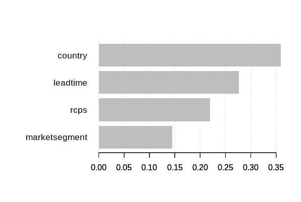

# 在 R 中实现 XGBoost 模型

> 原文：<https://towardsdatascience.com/implementing-an-xgboost-model-in-r-59ee1892be2f?source=collection_archive---------18----------------------->

## 使用 XGBoost 预测酒店取消预订


来源:图片来自 [Pixabay](https://pixabay.com/vectors/interface-internet-program-browser-3614766/)

在这个例子中，在 R 中构建了一个 XGBoost 模型来预测客户取消酒店预订的发生率。该分析基于来自 [Antonio、Almeida 和 Nunes (2019):酒店预订需求数据集](https://www.sciencedirect.com/science/article/pii/S2352340918315191)的数据。

H1 数据集用于训练和验证，而 H2 数据集用于测试目的。

# 背景

为了预测将取消预订的客户(其中变量**is cancelled = 1**表示取消，而**is cancelled = 0**表示客户坚持预订)，在 R 中构建了一个 XGBoost 模型，具有以下特性:

*   研制周期
*   原产国
*   细分市场
*   存款类型
*   客户类型
*   所需的停车位
*   抵达周

# 数据操作

为了使数据适合用 R 中的 XGBoost 模型进行分析，需要一些数据操作过程。

首先，加载 **xgboost** 和**矩阵**库:

```
require(xgboost)
library(Matrix)
```

通过将变量**定义为. numeric** ，并在适当的时候以因子格式定义，形成特征的数据框架。然后数据帧被转换成**矩阵**格式。

```
leadtime<-as.numeric(H1$LeadTime)
country<-as.numeric(factor(H1$Country))
marketsegment<-as.numeric(factor(H1$MarketSegment))
deposittype<-as.numeric(factor(H1$DepositType))
customertype<-as.numeric(factor(H1$CustomerType))
rcps<-as.numeric(H1$RequiredCarParkingSpaces)
week<-as.numeric(H1$ArrivalDateWeekNumber)df<-data.frame(leadtime,country,marketsegment,deposittype,customertype,rcps,week)
attach(df)
df<-as.matrix(df)
```

标签(取消)被定义为一个因素。

```
IsCanceled<-as.numeric(factor(H1$IsCanceled))
```

然而，R 将 **0** 值标记为 **1** ，将 **1** 值标记为 2。

为了使数据与 XGBoost 一起工作，必须定义 0 和 1 标签。

因此，标签值相应地替换如下:

```
IsCanceled[IsCanceled == "1"] <- "0"
IsCanceled[IsCanceled == "2"] <- "1"
```

训练集和验证集是分开的，每个都被定义为一个**dgc matrix**——这是一种特殊类型的矩阵，与 r 中的 XGBoost 模型一起工作。

```
train <- df[1:32000,]
val <- df[32001:40060,]train=as(train, "dgCMatrix")
trainval=as(val, "dgCMatrix")
valIsCanceled_train=IsCanceled[1:32000]
IsCanceled_val=IsCanceled[32001:40060]
```

# 模型预测

定义增压模型并生成预测:

```
bst <- xgboost(data = train, label = IsCanceled_train, max.depth = 2, eta = 1, nthread = 2, nrounds = 2, objective = "binary:logistic")pred <- predict(bst, val)
```

以下是培训和验证错误:

```
> bst <- xgboost(data = train, label = IsCanceled_train, max.depth = 2, eta = 1, nthread = 2, nrounds = 2, objective = "binary:logistic")
[1] train-error:0.252000 
[2] train-error:0.222188> pred <- predict(bst, val)
> print(length(pred))
[1] 8060
> print(head(pred))
[1] 0.31375486 0.31375486 0.31375486 0.31375486 0.01498148
[6] 0.01498148

> prediction <- as.numeric(pred > 0.5)
> print(head(prediction))
[1] 0 0 0 0 0 0

> err <- mean(as.numeric(pred > 0.5) != IsCanceled_val)
> print(paste("val-error=", err))
[1] "val-error= 0.1287841191067"
```

从上面的输出中，我们可以看到 **0.12** 的验证误差明显低于 **0.25** 和 **0.22** 两个报告的训练误差。

还会生成一个重要性矩阵，以确定对酒店取消最重要的影响因素:

```
# Importance Matrix
importance_matrix <- xgb.importance(model = bst)
print(importance_matrix)
xgb.plot.importance(importance_matrix = importance_matrix)
```



资料来源:RStudio

下面是对重要性矩阵的更详细的介绍:

```
> print(importance_matrix)
         Feature      Gain     Cover Frequency
1:       country 0.3589183 0.2266091 0.3333333
2:      leadtime 0.2767732 0.2807021 0.1666667
3:          rcps 0.2198606 0.2967366 0.3333333
4: marketsegment 0.1444479 0.1959522 0.1666667
```

如下文所述[堆叠交换](https://datascience.stackexchange.com/questions/12318/how-to-interpret-the-output-of-xgboost-importance)后——增益、覆盖和频率说明如下:

*   **增益:**说明了模型中每棵树的特征贡献，较高的值说明对预测结果变量更重要。
*   **Cover:** 与所讨论的特征相关的相对观察值的数量。
*   **频率:**一个特征在模型树中出现的次数。

**增益**是评估特性对模型的相对贡献时最重要的特性。由于国家变量的增益为 **0.35** ，这被表示为模型中最重要的特征，即客户的原籍国将对决定他们最终是否取消酒店预订产生重大影响。

## 解释

通过观察训练和验证错误，看起来该模型在预测该特定验证集的取消方面表现得相当好，但是不能保证它在其他数据集上也能如此。

因此，我们使用了一个独立的测试集(H2)来验证 XGBoost 模型是否仍能很好地预测取消发生率。

H2 集合中的变量再次被定义:

```
leadtime<-as.numeric(H2$LeadTime)
country<-as.numeric(factor(H2$Country))
marketsegment<-as.numeric(factor(H2$MarketSegment))
deposittype<-as.numeric(factor(H2$DepositType))
customertype<-as.numeric(factor(H2$CustomerType))
rcps<-as.numeric(H2$RequiredCarParkingSpaces)
week<-as.numeric(H2$ArrivalDateWeekNumber)test<-data.frame(leadtime,country,marketsegment,deposittype,customertype,rcps,week)
attach(test)
test<-as.matrix(test)test=as(test, "dgCMatrix")
testIsCanceled_H2<-as.numeric(factor(H2$IsCanceled))
IsCanceled_H2[IsCanceled_H2 == "1"] <- "0"
IsCanceled_H2[IsCanceled_H2 == "2"] <- "1"
IsCanceled_H2<-as.numeric(IsCanceled_H2)
```

使用 H1 数据集构建的 XGBoost 模型现在用于合并 H2 的要素数据:

```
pred <- predict(bst, test)
```

下面是产生的测试错误:

```
> print(length(pred))
[1] 79330
> print(head(pred))
[1] 0.3137549 0.7707853 0.7707853 0.7707853 0.7707853 0.7707853
> 
> prediction <- as.numeric(pred > 0.5)
> print(head(prediction))
[1] 0 1 1 1 1 1
> 
> err <- mean(as.numeric(pred > 0.5) != IsCanceled_H2)
> print(paste("test-error=", err))
[1] "test-error= 0.274335056094794"
```

**0.27** 的测试误差高于 **0.12** 的验证误差，这是我们在预测新数据时可以合理预期的。

也就是说，0.25 和 0.22 的原始训练误差仅略低于测试误差——这表明该模型没有显示出过度拟合的证据。如果我们遇到训练误差远低于测试误差的情况，那么这显然是一个问题，因为它表明模型在预测用于建立模型的数据而不是新数据方面表现良好。

# 结论

在这个例子中，您已经看到了如何使用 r 运行 XGBoost 模型。

具体来说，您已经看到:

*   如何将数据转换成 **dgCMatrix** 格式，以便与 R 的 XGBoost 模型一起工作
*   如何通过重要性矩阵可视化特征的重要性
*   对测试数据运行 XGBoost 模型，以验证模型的准确性

非常感谢您的阅读，非常感谢您的任何问题或反馈。您可以在下面找到这个例子的相关存储库、R 代码和数据集，以及其他有用的参考资料。

# 参考

*   [安东尼奥、阿尔梅达和努内斯(2019):酒店预订需求数据集](https://www.sciencedirect.com/science/article/pii/S2352340918315191)
*   [数据科学 StackExchange:如何解读 XGBoost 重要性的输出？](https://datascience.stackexchange.com/questions/12318/how-to-interpret-the-output-of-xgboost-importance)
*   [GitHub:MGCodesandStats/酒店建模](https://github.com/MGCodesandStats/hotel-modelling)
*   [XGBoost 文档:XGBoost R 教程](https://xgboost.readthedocs.io/en/latest/R-package/xgboostPresentation.html)