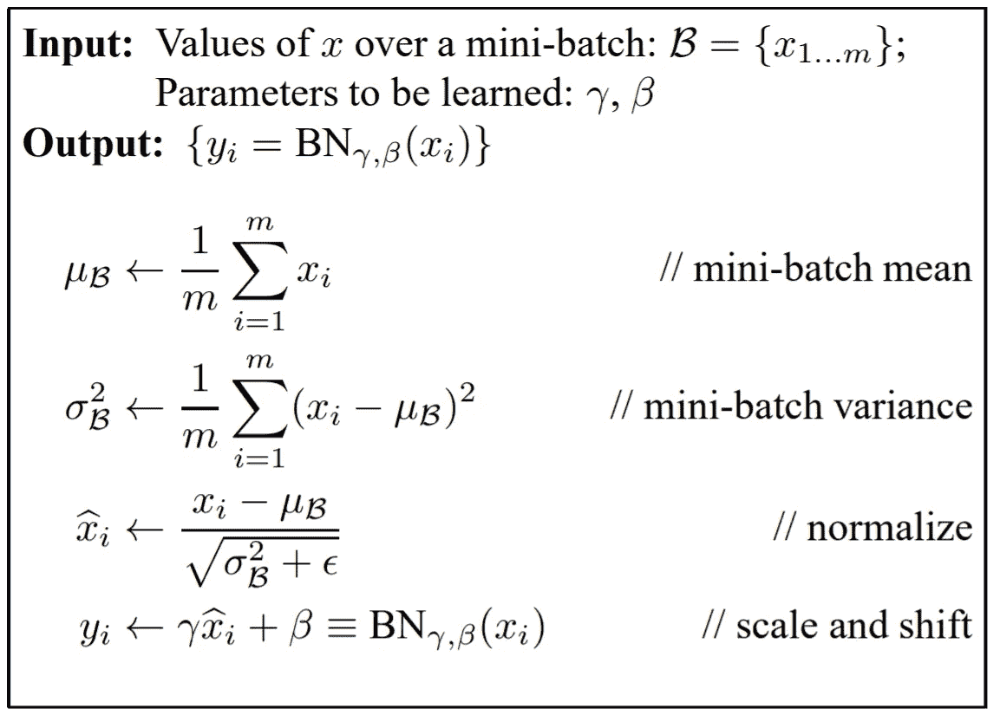

# 在 Python 中实现批处理规范化

> 原文：<https://towardsdatascience.com/implementing-batch-normalization-in-python-a044b0369567?source=collection_archive---------1----------------------->

## 为什么以及如何在神经网络中实现批处理规范化

我最近正在上斯坦福大学在线提供的用于视觉识别的[卷积神经网络](http://cs231n.stanford.edu/index.html)，并且刚刚开始着手这门课程的第二个作业。在这项作业的一部分中，我们被要求在一个完全连接的神经网络中实现批量标准化。

向前传递的实现相对简单，但是处理起来更具挑战性的向后传递，花了我相当长的时间才完成。经过几个小时的工作和斗争，我终于克服了这个挑战。在这里，我想分享一些我对批处理规范化的笔记和想法。

***那么……什么是批量规格化呢？***

批处理规范化处理神经网络初始化不良的问题。可以解释为**在网络**的每一层做预处理。它迫使网络中的激活在训练开始时呈现单位高斯分布。这确保了所有神经元在网络中具有大致相同的输出分布，并提高了收敛速度。

要了解为什么激活在网络中的分布很重要，你可以参考课程提供的[讲座幻灯片](http://cs231n.stanford.edu/slides/2019/cs231n_2019_lecture07.pdf)的第 46-62 页。

假设我们在一个层上有一批激活 ***x*** ，零均值单位方差版本******x***的 x̂*** 为

这实际上是一个可微分的操作，这就是为什么我们可以在训练中应用批量标准化。

在实现中，我们在完全连接层或卷积层之后，非线性层之前插入批量标准化层。

# 批处理规范化的正向传递

从[原稿](https://arxiv.org/abs/1502.03167)批量规格化转换的算法

让我们从最初的[研究论文](http://arxiv.org/abs/1502.03167)来看一下要旨。
正如我前面说过的，批处理规范化的整个概念非常容易理解。在计算了一批激活 ***x*** 的均值和方差后，我们可以通过要点第三行的运算来归一化 ***x*** 。还要注意，在零均值和单位方差约束对于我们的网络太难的情况下，我们引入了可学习的比例和移位参数 ***γ*** 和 ***β*** 。

所以向前传递的代码看起来像这样:

需要注意的一点是，均值和方差的估计取决于我们发送到网络中的小批量，我们不能在测试时这样做。因此，测试时归一化的均值*和方差*实际上是我们在训练期间计算的值的移动平均值。**

**这也是为什么**批量规格化具有规格化效果**。我们在训练时添加了某种随机性，并在测试时平均掉这种随机性，以减少泛化错误(就像[辍学](http://www.cs.toronto.edu/~rsalakhu/papers/srivastava14a.pdf)的效果一样)。**

**这是我对这门课作业 2 中向前传球的完整实现:**

# **反向传播**

**现在我们想推导出一种计算批量标准化梯度的方法。具有挑战性的是，*本身是 ***x*** 和 ***σ*** 是 ***μ*** 和 ***x*** 的函数。因此，当我们对这个归一化函数执行链式法则时，我们需要非常小心和清楚。***

**我发现参加课程时非常有用的一件事是[计算图](http://cs231n.github.io/optimization-2/#sigmoid)的概念。它将一个复杂的函数分解成几个小而简单的操作，并帮助您以一种整洁、有组织的方式执行反向传播(通过推导每个简单操作的局部梯度并将它们相乘以获得结果)。**

**Kratzert 的帖子详细解释了使用计算图计算批量归一化梯度的每个步骤。查看一下，了解更多。**

**在 Python 中，我们可以编写这样的代码:**

**这种分阶段计算的一个缺点是，由于我们计算了大量的“中间值”,这些中间值在相乘时可能会被抵消，因此导出最终梯度需要更长的时间。为了让一切都变得更快，我们需要自己对函数求导来得到一个简单的结果。**

**当我写这篇文章的时候，我从 Kevin 的博客上找到了一篇[的帖子，讲述了通过链式法则获得梯度的每一个步骤。它已经非常清楚地解释了细节，所以如果你对推导感兴趣，请参考它。](https://kevinzakka.github.io/2016/09/14/batch_normalization/)**

**最后，这是我的实现:**

# **摘要**

**在本文中，我们了解了**批处理规范化如何提高收敛**以及为什么**批处理规范化作为一种规范化**。我们还在 python 中实现了**前向传递和反向传播，用于批处理规范化**。**

**虽然你可能不需要担心实现，因为所有的东西都已经在那些流行的深度学习框架中了，但我始终相信，自己做事情可以让我们有更好的理解。希望你看完这篇文章后有所收获！**