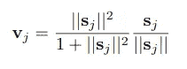
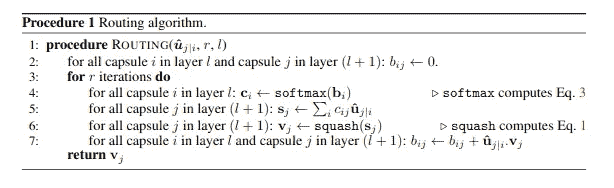
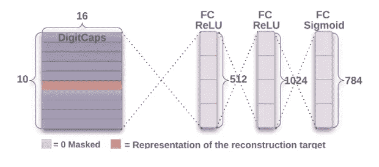
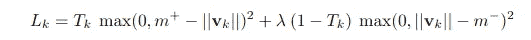
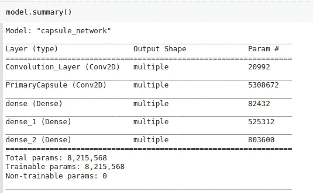

# 在 TensorFlow 中实现胶囊网络

> 原文：<https://towardsdatascience.com/implementing-capsule-network-in-tensorflow-11e4cca5ecae?source=collection_archive---------11----------------------->

## 胶囊网络实现及其特性可视化指南


在 [Unsplash](https://unsplash.com?utm_source=medium&utm_medium=referral) 上[的照片](https://unsplash.com/@ffstop?utm_source=medium&utm_medium=referral)

我们很清楚，卷积神经网络(CNN)在许多计算机视觉任务中已经超过了人类。所有基于 CNN 的模型具有相同的卷积层的基本架构，其后是具有中间批次归一化层的池层，用于在正向传递中归一化批次并控制反向传递中的梯度。

然而，在 CNN 中有几个缺点，主要是最大池层，因为它没有考虑具有最大值的像素与其直接邻居之间的关系。为了解决这个问题，Hinton 提出了胶囊网络的概念和一种叫做“[胶囊间动态路由](https://arxiv.org/pdf/1710.09829.pdf)的算法。许多资源已经解释了模型的直觉和架构。你可以在这里的系列博文[里看看。](https://medium.com/ai%C2%B3-theory-practice-business/understanding-hintons-capsule-networks-part-i-intuition-b4b559d1159b)

在这篇文章中，我解释了模型的实现细节。它假设对 Tensors 和 TensorFlow [自定义层和模型](https://www.tensorflow.org/guide/intro_to_modules)有很好的理解。

这一职位的结构如下:

*   基本张量流运算
*   胶囊层类别
*   杂项详细信息
*   结果和特征可视化

# 张量流运算

在 TensorFlow 2.3 中使用函数式 API 或顺序模型构建模型非常容易，只需几行代码。然而，在这个 capsule 网络实现中，我们利用了函数式 API 以及一些自定义操作，并用`@tf.function`对它们进行了优化。在本节中，我将重点介绍针对更高维度的`tf.matmul` 函数。如果您对此很熟悉，那么您可以跳过这一部分，进入下一部分。

## tf.matmul

对于 2D 矩阵，matmul 运算执行矩阵乘法运算，前提是考虑形状签名。然而，对于秩为(r > 2)的张量，该运算变成 2 个运算的组合，即，元素式乘法和矩阵乘法。

对于一个秩(r = 4)的矩阵，它首先沿轴= [0，1]进行[广播](https://numpy.org/doc/stable/user/basics.broadcasting.html)，并使每个矩阵形状相等。并且当且仅当第一张量的最后一个维度和第二张量的倒数第二个维度应该具有匹配的维度时，最后两个轴([2，3])经历矩阵乘法。下面的例子将解释它，为了简洁起见，我只打印了形状，但是可以在控制台上随意打印和计算数字。

```
>>> w = tf.reshape(tf.range(48), (1,8,3,2))
>>> x = tf.reshape(tf.range(40), (5,1,2,4))
>>> tf.matmul(w, x).shape
TensorShape([5, 8, 3, 4])
```

w 沿轴=0 传播，x 沿轴=1 传播，其余两维矩阵相乘。我们来看看 matmul 的 transpose_a/transpose_b 参数。在张量上调用 tf.transpose 时，所有的维度都是相反的。举个例子，

```
>>> a = tf.reshape(tf.range(48), (1,8,3,2))
>>> tf.transpose(a).shape
TensorShape([2, 3, 8, 1])
```

所以让我们看看它是如何工作的

```
>>> w = tf.ones((1,10,16,1))
>>> x = tf.ones((1152,1,16,1))
>>> tf.matmul(w, x, transpose_a=True).shape
TensorShape([1152, 10, 1, 1])
```

**等等！！！我原以为会有错误，但结果很好。怎么会？？？**

TensorFlow 首先沿着前两个维度广播，然后假设它们是一堆 2D 矩阵。你可以把它想象成只应用于第一个数组的最后两个维度的转置。转置操作后第一个数组的形状是[1152，10，1，16](转置应用于最后一个二维)，现在应用矩阵乘法。顺便说一下，`transpose_a = True`表示上述转置操作将应用于 matmul 中提供的第一个元素。更多[细节](https://www.tensorflow.org/api_docs/python/tf/linalg/matmul)请参考文档。

好吧！！这就足够打通这个帖子了。我们现在可以检查胶囊层的代码。

# 胶囊层类别

让我们看看代码中发生了什么。

> **注:**所有超参数的使用与论文中的相同。

卷积运算

我们已经使用`tf.keras`功能 API 来创建主要的胶囊输出。这些只是在输入图像`input_x`的正向传递中执行简单的卷积运算。到目前为止，我们已经完成了 256 幅(32 * 8)的地图，每幅的尺寸都是 6 x 6。

现在，我们不再将上面的特征图可视化为卷积输出，而是将它们重新想象为沿最后一个轴堆积的 32- 6 x 6 x 8 个向量。因此，我们可以很容易地获得 6 * 6 * 32 = 1152，8D 个向量，只需对它们进行整形。这些向量中的每一个都乘以一个权重矩阵，该权重矩阵封装了这些较低级特征和较高级特征之间的关系。主胶囊层中输出要素的维度为 8D，数字胶囊层的输入维度为 16D。所以基本上我们必须用一个 16×8 的矩阵乘以它们。好吧，那很简单！！但是等等，在主胶囊中有 1152 个向量，这意味着我们将有 1152–16 x 8 个矩阵。

我们现在没事了吗？？不，你忘了胶囊的数字

我们在下一层有 10 个数字胶囊，因此我们将有 10 个这样的 1152–16 x 8 矩阵。所以基本上我们得到一个形状为[1152，10，16，8]的权重张量。主胶囊输出的 1152–8D 向量中的每一个都对 10 个数字胶囊中的每一个有贡献，因此我们可以简单地对数字胶囊层中的每个胶囊使用相同的 8D 向量。更简单地说，我们可以在 1152，8D 向量中添加一个 2 轴，从而将它们转换成[1152，1，8，1]的形状。好吧！我知道你在那里做了什么，你要去你上面描述的`tf.matmul`广播。

太好了！！没错。

准备数字胶囊的输入

> **注意**:变量 W 的形状在第一个轴上有一个额外的维度 1，因此必须为整个批次广播相同的重量。

在`u_hat`中，最后一个维度是无关的，是为了矩阵乘法的正确性而添加的，因此现在可以使用挤压功能将其删除。以上形状中的(无)是针对`batch_size`的，它是在训练时确定的。

删除无关尺寸

让我们进入下一步。

**动态路由——这就是神奇的开始！**



挤压功能- [纸张](https://arxiv.org/pdf/1710.09829.pdf)

在探索算法之前，让我们先创建挤压函数，并保留它以备将来使用。我增加了一个很小的ε值，以避免梯度爆炸，以防分母总和为零。

挤压功能的代码。

在这一步中，数字胶囊的输入是 16D 向量(`u_hat`)，路由迭代的次数(r = 3)按照论文的规定使用。



来自[论文](https://arxiv.org/pdf/1710.09829.pdf)的路由算法

在动态路由算法中没有太多的调整，代码几乎是本文中算法的直接实现。看看下面的片段。

动态路由

应该强调一些关键点。

*   `c`表示`u_hat`值的概率分布，对于主胶囊层中的特定胶囊，其总和为 1。简单地说，`u_hat`的值根据路由算法中训练的变量 c 分布在数字胶囊中。
*   **σcij | j | I**是输入到数字胶囊的所有低级向量的加权和。由于有 1152 个较低级别的向量，所以 reduce_sum 函数应用于该维度。设置`keep_dims=True`，只是使进一步的计算更容易。
*   挤压非线性被应用于数字胶囊的 16D 向量，以归一化这些值。
*   下一步有一个微妙的实现，计算数字胶囊层的输入和输出之间的点积。这个点积决定了较低和较高水平胶囊之间的“协议”。你可以在这里了解这一步[背后的推理和直觉。](https://pechyonkin.me/capsules-3/)

上述循环迭代 3 次，由此获得的 v 值然后用于重构网络中。

哇！！太好了。你刚刚完成了大部分困难的部分。现在，**相对**简单。

## 重建网络

重建网络是一种从数字胶囊层的特征重新生成图像的正则化器。反向传播会对整个网络产生影响，从而使特征有利于预测和再生。在训练过程中，模型使用输入图像的实际标签将数字大写值屏蔽为零，与标签对应的数字大写值除外(如下图所示)。



重构网络来自[论文](https://arxiv.org/pdf/1710.09829.pdf)

来自上述网络的`v`张量的形状为(无，1，10，16)，我们沿着数字帽层的 16D 向量进行广播和标记，并应用遮罩。

> **注**:一个热编码标签用于屏蔽。

这个`v_masked`然后被发送到重建网络，并且用于整个图像的再生。重建网络只是下面要点中所示的 3 个密集层

特征重构

我们将把上面的代码转换成一个继承自`tf.keras.Model`的 CapsuleNetwork 类。您可以将该类直接用于您的自定义训练循环和预测。

胶囊网络类

你可能已经注意到，我添加了两个不同的函数`predict_capsule_output()`和`regenerate_image()`，它们分别预测数字大写向量和重新生成图像。第一个函数将有助于预测测试期间的数字，第二个函数将有助于根据一组给定的输入要素重新生成图像。(将在可视化中使用)

模型使用的参数

最后还有一件事，那就是损失函数。本文使用边际损失进行分类，并使用权重为 0.0005 的平方差进行重建，以重建损失。参数 m+、m-、λ在上面的要点中描述，损失函数在下面的要点中描述。



利润损失来自[的论文](https://arxiv.org/pdf/1710.09829.pdf)

损失函数实现

`v`是未屏蔽的数字大写向量，`y`是标签的 one_hot_encoded 向量，`y_image`是作为输入发送到模型的实际图像。安全范数函数只是一个类似于张量流范数函数的函数，但包含一个ε以避免值变为精确的 0。

安全范数函数

让我们检查一下模型的概要。



模型概述

恭喜你！！！我们已经完成了模型架构。该模型具有 **8215568** 个参数，这证实了论文中他们所说的重建模型具有 8.2M 个参数。不过这个 [*博客*](https://medium.com/ai%C2%B3-theory-practice-business/part-iv-capsnet-architecture-6a64422f7dce) 有 **8238608** 参数。差异的原因是 TensorFlow 仅考虑可训练参数中的`tf.Variable`资源。如果我们认为 1152 * 10 b 和 1152 * 10 c 是可训练的，那么我们得到相同的数字。

`8215568 + 11520 + 11520 = **8238608**`

这是同一个数字。耶！！

# 杂项详细信息

我们将使用`tf.GradientTape`来寻找梯度，我们将使用 Adam 优化器。

训练步骤

因为我们已经用`tf.keras.Model`子类化了类，我们可以简单地调用`model.trainable_variables`并应用渐变。

预测函数

我制作了一个自定义的预测函数，它将输入图像和模型作为参数。将模型作为参数发送的目的是检查点模型可以在以后用于预测。

唷！！！我们完了。恭喜你！

所以，你现在可以试着用这个解释写你的代码，或者在我的[库](https://github.com/dedhiaparth98/capsule-network)上使用它。你可以简单地在本地系统或 google colab 上运行笔记本。为了仅获得预测精度，甚至 10 个时期就足够了。在存储库中，我只添加了一个笔记本来训练 50 个纪元的特性。但是，为了调整和可视化特征，您可能需要训练它们多达 100 个历元。

> **注:**模型的训练即使在 Google Colab 的 GPU 上也需要花费大量的时间。所以让模型接受训练，休息一下。

# 结果和特征可视化

该模型的训练准确率为 99%，测试准确率为 98%。然而，在一些检查站，准确率为 98.4%，而在其他一些检查站，准确率为 97.7%。

在下面的要点中，`index_`表示测试集中的特定样本号，`index`表示样本`y_test[index_]` 所代表的实际数目。

每个提取特征的重建图像

下面的代码调整了每个特性，并在[-0.25，0.25]的范围内以 0.05 的增量调整它们。在每一点，图像被生成并存储在一个数组中。因此，我们可以看到每个特征是如何有助于图像的重建。

调整用于重建的特征

请看下图中的一些重建样本。正如我们所见，一些特征控制亮度、旋转角度、厚度、倾斜等。


通过调整特征重建图像(图片由作者提供)

# 结论

在这篇文章中，我们试图重现的结果，以及可视化的特点，在论文中描述的。训练准确率为 99%，测试准确率接近 98%，这真是太棒了。虽然，模型需要大量的时间来训练，但功能非常直观。

Github 库:[https://github.com/dedhiaparth98/capsule-network](https://github.com/dedhiaparth98/capsule-network)

# 参考

南 Sabour，N. Frost，G. Hinton，[胶囊间动态路由](https://arxiv.org/pdf/1710.09829.pdf) (2017)，arXiv。

[](https://medium.com/ai%C2%B3-theory-practice-business/understanding-hintons-capsule-networks-part-i-intuition-b4b559d1159b) [## 理解辛顿的胶囊网络。第一部分:直觉。

### 理解 Hinton 的胶囊网络系列的一部分:

medium.com](https://medium.com/ai%C2%B3-theory-practice-business/understanding-hintons-capsule-networks-part-i-intuition-b4b559d1159b) [](https://medium.com/ai%C2%B3-theory-practice-business/understanding-hintons-capsule-networks-part-ii-how-capsules-work-153b6ade9f66) [## 理解辛顿的胶囊网络。第二部分:胶囊如何工作。

### 理解 Hinton 的胶囊网络系列的一部分:

medium.com](https://medium.com/ai%C2%B3-theory-practice-business/understanding-hintons-capsule-networks-part-ii-how-capsules-work-153b6ade9f66) [](https://medium.com/ai%C2%B3-theory-practice-business/understanding-hintons-capsule-networks-part-iii-dynamic-routing-between-capsules-349f6d30418) [## 理解辛顿的胶囊网络。第三部分:胶囊之间的动态路由。

### 理解 Hinton 的胶囊网络系列的一部分:

medium.com](https://medium.com/ai%C2%B3-theory-practice-business/understanding-hintons-capsule-networks-part-iii-dynamic-routing-between-capsules-349f6d30418) [](https://medium.com/ai%C2%B3-theory-practice-business/part-iv-capsnet-architecture-6a64422f7dce) [## 理解辛顿的胶囊网络。第四部分:CapsNet 架构

### 理解 Hinton 的胶囊网络系列的一部分:

medium.com](https://medium.com/ai%C2%B3-theory-practice-business/part-iv-capsnet-architecture-6a64422f7dce) [](https://github.com/ageron/handson-ml/blob/master/extra_capsnets.ipynb) [## ageron/handson-ml

### permalink dissolve GitHub 是超过 5000 万开发人员的家园，他们一起工作来托管和审查代码，管理…

github.com](https://github.com/ageron/handson-ml/blob/master/extra_capsnets.ipynb)