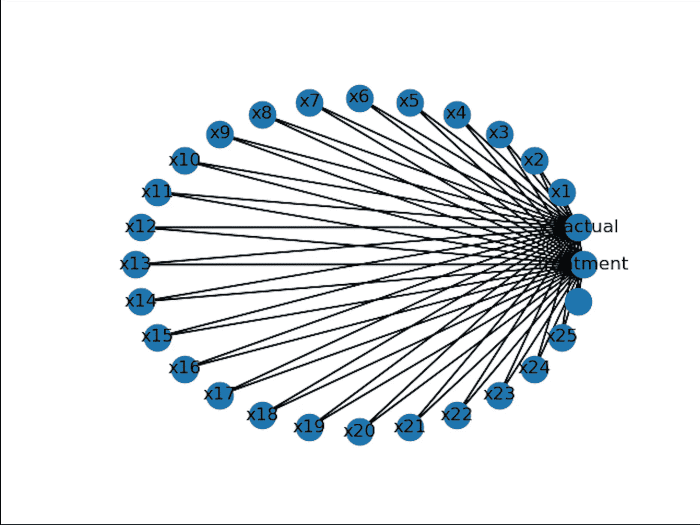

# 因果推理:试图理解为什么的问题

> 原文：<https://towardsdatascience.com/implementing-causal-inference-a-key-step-towards-agi-de2cde8ea599?source=collection_archive---------0----------------------->

你为什么阅读这篇文章？你为什么选择学习因果推理？你为什么认为这是一个非常奇怪的文章开头方式？谁知道呢。一个更有意思的问题是，为什么我们作为人类，首先能够思考和理解“为什么”这个问题！？如果我们曾经想要创造一个具有人工一般智能的系统，或者 AGI，**我们需要回答这个问题。**


理解为什么需要理解什么，在哪里，什么时候。然而,“如何”似乎是“为什么”的一种实现。[图片来源。](https://image.spreadshirtmedia.net/image-server/v1/mp/compositions/T993A1MPA2181PT1X55Y35D155294104FS1531/views/1,width=550,height=550,appearanceId=1,backgroundColor=FFFFFF,noPt=true,version=1569186768/question-mark-why-mouse-pad.jpg)

你和这个星球上的每个人都能够理解因果关系，这种能力在很大程度上仍然是机器所缺乏的。在我们可以考虑创建一个可以普遍理解因果关系的系统之前，我们应该从统计学的角度来看因果关系:因果演算和因果推理。统计学是因果关系诞生的地方，为了创建一个高层次的因果系统，我们必须回到根本。

因果推断是从数据中*推断*原因*的过程。任何种类的数据，只要有足够的数据。(是的，甚至是观测数据)。这听起来很简单，但也可能变得复杂。作为人类，我们每天都在这样做，我们用从因果推理中学到的知识在世界上导航。我们不仅使用因果推理来导航世界，我们还使用因果推理来解决问题。*


每年有 1500 万早产儿出生。[图片来源。](https://dfw.cbslocal.com/wp-content/uploads/sites/15909545/2010/12/premature-baby_51885220.jpg)

**每年有 110 万早产儿死亡**。换句话说，每年有 7.3%的早产儿死亡。成千上万的父母不得不在失去孩子的悲痛、折磨和痛苦中挣扎，因为这是他们无法控制的过程。这是个问题。假设我们想弄清楚早产儿出生后的综合治疗是否会影响其存活机会。**为了解决这个问题，我们需要使用因果推断。**

*我们将用来执行因果推理来解决这个问题的 python 库叫做*[](https://www.microsoft.com/en-us/research/blog/dowhy-a-library-for-causal-inference/)**，这是由微软的研究人员创建的一个记录良好的库。**

**

# *关于因果关系的快速课程*

*首先是因果关系的快速课(如果你已经了解了基础知识，可以跳过这一节；如果你更喜欢看视频，幸运的你，我做了一个，你可以在这里看[](https://youtu.be/OmsTlhH_eUY)**)。***

***因果关系是关于干预，关于**做。**标准统计都是关于相关性的，这很好也很有趣，但是相关性会导致错误的假设，从而导致更糟糕的事情。***

******

***这是一个图表，显示了运动和胆固醇之间的相关关系(这*看起来像是因果关系，但不是)。如果我们只看胆固醇和运动之间的相关关系，这两者之间似乎存在因果关系。但是这种相关性实际上发生了，因为胆固醇和锻炼有一个共同的原因或混杂因素:年龄。[图片来源。](https://thumbor.forbes.com/thumbor/711x325/https://blogs-images.forbes.com/alexanderlavin/files/2019/08/Screen-Shot-2019-08-12-at-11.05.36-AM-1200x550.jpg?width=960)****

***在相关性中，符号是 P(x|y ),即给定 y 时 x 的概率:例如，给定活性基因时疾病的概率。然而，在因果演算中，做了一个非常小但重要的改变。**不是 P(x|y)而是 P(x|do(y))** 即给定 y 的 x 的概率**:**例如，给定我开始节食的疾病概率。“做”是非常重要的:它代表干预，实际做一些会产生效果的事情。***

***如果这个“做”的东西仍然没有太多意义，让我带你看另一个例子:***

***带上气压和气压计。气压计上的读数和气压之间存在相关性，但是，在标准的相关性(P(x|y))中，我们无法判断哪一个导致了哪一个。然而，如果我们把它切换到因果演算，或者称为 do-calculus(是的，do 无处不在)，我们可以问这样一个问题，“给定压力增加，高气压计读数的概率是多少？”**增加压力是做**的行为，通过做和干预，可以看出两个变量之间是否有明确的因果关系。(显然，如果我们增加压力，我们会看到气压计读数增加)。***

***反之亦然。如果我们改变气压计上的读数(通过扭转旋钮或其他什么，这是**做**的一个动作)，我们不会看到气压的变化，因为气压计读数不会引起气压。气压影响气压计的读数。***

***气压->气压计读数。[出处。](https://media.giphy.com/media/xT5LMwSrDtj0qK3T0s/giphy.gif)***

***然而，气压和气压计的例子非常简单；只有两个因素。在现实生活中，有数不清的因素，每个因素都与其他因素有某种因果关系。***

******

***因果图的一个例子。[图片来源。](https://philosophy.hku.hk/think/sci/causal-net.jpg)***

***在图中，“交通堵塞”是“上学迟到”和“排长队”的混杂或常见原因。**混杂因素是指与我们想要测试因果关系的两个变量之间存在因果关系的变量。如果我们想测试“上学迟到”和“排长队”之间的因果关系，我们必须考虑“交通堵塞”，以确保“上学迟到”和“排长队”之间因果关系的有效性，就像上面胆固醇的例子一样。**在因果推断中，我们总是需要考虑混杂因素，因为它们引入了混淆因果图的相关性。*******

## ***IHDP 数据集***

***好了，现在我们对基本的因果关系有了很好的理解，让我们实际上进入代码并测试早产双胞胎的健康和干预之间的因果关系。我们将使用婴儿健康和发展项目(IHDP)的数据集，该数据集收集了 1985 年至 1988 年美国随机试验中早产儿的数据。随机化是关键，因为它提供了对世界的无偏见的描述。因为这些数据是在 RCT 中收集的，所以没有必要进行因果推断，但是我们仍然会进行因果推断来展示它是如何工作的。***

> ***1985 年至 1988 年期间，在八个不同的地点进行了从出院到 36 个月校正年龄的强化干预。婴儿研究样本按出生体重(2000 克或以下，2001-2500 克)分层，并按**随机** **分组至干预组或随访组。**干预组接受家访、特殊儿童发展中心的护理和儿科随访。随访组仅接受该计划的儿科随访部分。**在预定的时间点从两组中收集认知发展、行为状态、健康状态和其他变量的测量值**。数据收集中的许多其他变量和指数包括地点、妊娠并发症、儿童出生体重和妊娠年龄、出生顺序、儿童性别、家庭组成、日托安排、卫生保健来源、家庭环境质量、父母的种族和民族、母亲年龄、教育、智商和就业。——*摘自* [*HMCA 档案*](https://www.icpsr.umich.edu/web/HMCA/studies/9795) *。****

## ***代码***

***首先，让我们导入所需的包并加载数据。***

```
***import dowhy
from dowhy import CausalModel
import pandas as pd
import numpy as npdata= pd.read_csv(“[https://raw.githubusercontent.com/AMLab-Amsterdam/CEVAE/master/datasets/IHDP/csv/ihdp_npci_1.csv](https://raw.githubusercontent.com/AMLab-Amsterdam/CEVAE/master/datasets/IHDP/csv/ihdp_npci_1.csv)", header = None)col = [“treatment”, “y_factual”, “y_cfactual”, “mu0”, “mu1” ,]for i in range(1,26):
 col.append(“x”+str(i))data.columns = col
data = data.astype({“treatment”:’bool’}, copy=False)
print(data.head())
____________________________________________________________________ treatment y_factual y_cfactual mu0      … x22 x23 x24 x250 True      5.599916 4.318780    3.268256 … 0   0   0   01 False     6.875856 7.856495    6.636059 … 0   0   0   02 False     2.996273 6.633952    1.570536 … 0   0   0   03 False     1.366206 5.697239    1.244738 … 0   0   0   04 False     1.963538 6.202582    1.685048 … 0   0   0   0***
```

***这里的治疗就是干预。Y_factual 是通过结合婴儿的精神、行为和健康状况来量化的结果。所有的 x(x1 到 x25)都是结果和干预的混杂因素:如性别、种族、家庭护理质量等变量。我们试图找出治疗和结果之间的因果关系，同时考虑混杂因素。(从技术上来说，我们不必考虑这些混杂因素，因为这些数据是通过随机试验收集的，任何由此产生的偏见都将被消除。然而，考虑它们仍然是一个好主意，并且当数据是观察性的时，考虑它们是绝对必要的)。***

***我们不关心 y_cfactual、mu0 和 mu1(它们被代码中链接的 GitHub 的创建者使用(一个关于因果效应变化自动编码器的超级酷的项目，或 [CEVAE](https://arxiv.org/pdf/1705.08821.pdf) ，你应该完全检查一下))***

## ***如果你对它们感兴趣:***

***y_cfactual 是一个反事实，是一个关于没有发生的事情的问题，比如“*如果我…，会发生什么？*“在这种情况下，这是一个关于如果有或没有干预(取决于上下文)会发生什么的预测。**反事实在因果关系中极其重要，因为大多数时候我们并不总能得到所有的数据。**例如，如果我们想在一个人身上测试两种不同治疗方法的有效性，我们不可能同时测试两种方法。反事实解决了“想象的”治疗，但实际上并没有实施，而我们，作为人类，一直在使用反事实(每当你想象另一种情况时)。如果你对它们更感兴趣，在这里阅读这篇伟大的博文[。](https://www.inference.vc/causal-inference-3-counterfactuals/)***

***Mu0 和 mu1 是条件均值，换句话说，y_factual 在处理和不处理时的期望值或平均值。GitHub 的创建者使用这些变量(y_cfactual、mu0 和 mu1)来测试 CEVAE 的强度。***

***好了，现在我们有了所有的数据设置，以一种便于因果推理的方式组织起来。是时候实际做因果推断了。***

# ***用 DoWhy 进行因果推断！***

***DoWhy 将因果推理分解为四个简单的步骤:*建模、识别、估计和反驳。在进行因果推理时，我们将遵循这些步骤。****

## ***模型***

```
***# Create a causal model from the data and given common causes.
xs = ""
for i in range(1,26):
    xs += ("x"+str(i)+"+")model=CausalModel(
        data = data,
        treatment='treatment',
        outcome='y_factual',
        common_causes=xs.split('+')
        )***
```

***这段代码实际上获取了数据，并利用这些数据建立了一个因果模型或因果图。***

******

***由因果模型的道伊创建的(视觉上令人不快的)图形***

***即使我们没有打印出任何东西，DoWhy 仍然会给我们关于因果推理的警告和信息更新(这对初学者来说非常好)。在这种情况下，它给我们:***

```
***WARNING:dowhy.causal_model:Causal Graph not provided. DoWhy will construct a graph based on data inputs.
INFO:dowhy.causal_model:Model to find the causal effect of treatment ['treatment'] on outcome ['y_factual']***
```

## ***识别***

```
***#Identify the causal effect
identified_estimand = model.identify_effect()
print(identified_estimand)***
```

***识别步骤使用从建模步骤创建的因果图，并识别所有的因果关系。这段代码打印出来:***

```
***INFO:dowhy.causal_identifier:Common causes of treatment and outcome:['', 'x6', 'x3', 'x14', 'x10', 'x16', 'x9', 'x17', 'x13', 'x4', 'x11', 'x1', 'x7', 'x24', 'x25', 'x20', 'x5', 'x21', 'x2', 'x19', 'x23', 'x8', 'x15', 'x18', 'x22', 'x12']WARNING:dowhy.causal_identifier:If this is observed data (not from a randomized experiment), there might always be missing confounders. Causal effect cannot be identified perfectly.WARN: Do you want to continue by ignoring any unobserved confounders? (use proceed_when_unidentifiable=True to disable this prompt) [y/n] yINFO:dowhy.causal_identifier:Instrumental variables for treatment and outcome:[]Estimand type: nonparametric-ate### Estimand : 1Estimand name: backdoorEstimand expression:d(Expectation(y_factual|x6,x3,x14,x10,x16,x9,x17,x13,x4,x11,x1,x7,x24,x25,x20,x5,x21,x2,x19,x23,x8,x15,x18,x22,x12)) / d[treatment]Estimand assumption 1, Unconfoundedness: If U→{treatment} and U→y_factual then P(y_factual|treatment,x6,x3,x14,x10,x16,x9,x17,x13,x4,x11,x1,x7,x24,x25,x20,x5,x21,x2,x19,x23,x8,x15,x18,x22,x12,U) = P(y_factual|treatment,x6,x3,x14,x10,x16,x9,x17,x13,x4,x11,x1,x7,x24,x25,x20,x5,x21,x2,x19,x23,x8,x15,x18,x22,x12)### Estimand : 2Estimand name: ivNo such variable found!***
```

***因为我们没有试图找到 2 个因果关系(只是试图找到干预对结果的影响)，所以没有找到 estimand 2。***

## ***估计***

***使用 estimand(确定的因果关系)，我们现在可以估计这种因果关系的强度。有许多方法可供我们使用([基于倾向的匹配](https://en.wikipedia.org/wiki/Propensity_score_matching)，[加性噪声建模](https://medium.com/the-physics-arxiv-blog/cause-and-effect-the-revolutionary-new-statistical-test-that-can-tease-them-apart-ed84a988e))，但在本教程中，我们将坚持使用传统的线性回归。***

```
***# Estimate the causal effect and compare it with Average Treatment Effectestimate = model.estimate_effect(identified_estimand, method_name="backdoor.linear_regression", test_significance=True)print(estimate)print("Causal Estimate is " + str(estimate.value))data_1 = data[data["treatment"]==1]
data_0 = data[data["treatment"]==0]
print("ATE", np.mean(data_1["y_factual"])- np.mean(data_0["y_factual"]))***
```

***使用线性回归，该模型对原因(干预)和结果(早产儿的健康)进行训练，并确定两者之间关系的强度。我还打印出了 ATE(平均治疗效果(接受治疗的一组与未接受治疗的一组的平均值之间的差异))。在这种情况下，ATE 是一个很好的指标/数字，我们可以用它来检查因果关系，因为数据是在随机试验中检索的，而不是从观察数据中检索的。观察数据会有 ATE 无法解释的未观察到的混杂因素(影响治疗和结果的因素)或工具变量(仅影响治疗并因此与结果相关的因素)。ATE 与通过线性回归发现的因果效应不同，因为它没有考虑混杂因素。***

```
***INFO:dowhy.causal_estimator:INFO: Using Linear Regression EstimatorINFO:dowhy.causal_estimator:b: y_factual~treatment+x6+x3+x14+x10+x16+x9+x17+x13+x4+x11+x1+x7+x24+x25+x20+x5+x21+x2+x19+x23+x8+x15+x18+x22+x12*** Causal Estimate ***--prints out the estimand again––## Realized estimandb:y_factual~treatment+x6+x3+x14+x10+x16+x9+x17+x13+x4+x11+x1+x7+x24+x25+x20+x5+x21+x2+x19+x23+x8+x15+x18+x22+x12## EstimateValue: 3.928671750872714## Statistical Significancep-value: <0.001Causal Estimate is 3.928671750872714ATE 4.021121012430832***
```

***如你所见，ATE 非常接近我们得到的因果估计。大约 4 是接受护理的早产儿与未接受护理的早产儿在健康方面的差异。数字 4 在语义上没有太多意义，因为它是两组之间结果的字面差异，在这种情况下，结果是各种其他因素的组合。如果你回头看一下打印出来的 5 个案例，两者的差异大约是 4。***

## ***驳斥***

***反驳步骤测试由估计步骤发现的因果效应的强度和有效性。有各种不同的反驳方法，例如子集验证(仅使用数据的子集来估计因果关系)或安慰剂治疗(将治疗变成安慰剂并观察其对结果的影响(安慰剂治疗反驳预计因果关系会下降))在这种情况下，我们将添加一个不相关的共同原因来测试治疗和结果之间的因果关系的强度。这是有用的，因为它改变了因果模型，但没有改变 y_factual 和 treatment 之间的关系。***

```
***refute_results=model.refute_estimate(identified_estimand, estimate,
        method_name="random_common_cause")
print(refute_results)
____________________________________________________________________INFO:dowhy.causal_estimator:INFO: Using Linear Regression EstimatorINFO:dowhy.causal_estimator:b: y_factual~treatment+x22+x4+x24+x7+x20+x19+x21+x1+x23+x2+x12+x18+x3+x10+x14+x11+x16+x9+x13+x5+x17+x15+x6+x8+x25+w_randomRefute: Add a Random Common CauseEstimated effect:(3.928671750872715,)New effect:(3.9280606136724203,)***
```

***添加一个随机的共同原因对因果关系没有太大的影响(如预期的那样)，所以我们可以更确定因果关系的强度。***

***好的，我们刚刚发现在干预早产儿和他们的健康之间有明确的因果关系。在未来，我们要的不是像这样在狭窄的例子中进行因果推断，而是一个不需要太多数据就能大致理解因果关系的系统。目前，我们甚至还不明白大脑是如何理解因果关系的，但既然我们已经从统计学的角度理解了如何进行因果推断，我们就能更好地应对这个问题。为了创建人工通用智能，因果关系**需要**被普遍理解和实现，我希望在不久的将来从事这样的项目！***

****我希望你喜欢这篇文章，并理解因果关系的力量以及如何用 DoWhy 进行因果推断！如果你有任何问题或想要交谈，请随时在 kevn.wanf@gmail.com 给我发电子邮件或通过*[*LinkedIn*](https://www.linkedin.com/in/kevin-wang-b2ba29192/)*联系我！****