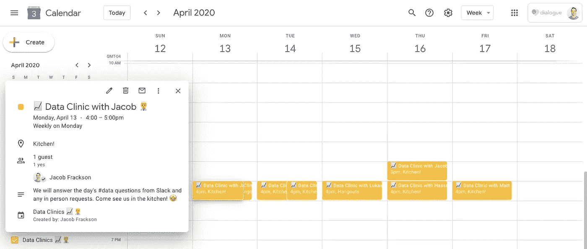

# 实施数据诊所将节省时间并完成更多工作

> 原文：<https://towardsdatascience.com/implementing-data-clinics-will-save-time-and-get-more-done-e1f003e1c5ee?source=collection_archive---------51----------------------->

## 数据团队生产力

## *这个策略将帮助你的团队更好地完成你的临时工作和计划工作*

数据诊所的标准周，内部利益相关者可以提出他们的数据请求。当时，我们实际上是通过视频电话运行所有的数据诊所，但标准是尽可能在厨房运行。

数据诊所是我们团队每天留出的时间，用于与利益相关者就任何预约请求进行合作，为数据团队的时间提供了最佳的投资回报。这是因为，平均而言，这些是我们在一周内完成的复杂度最低但效率最高的任务。

*   通过回答销售团队的关键数据问题，我们可以帮助达成交易。
*   通过将产品经理导航到正确的数据集，我们可以消除功能开发的障碍。
*   通过验证医疗操作实验的效果，我们可以帮助改善我们平台上成千上万患者的结果。

在我们有数据诊所之前，我们的工作到处都是:一天完全专注于临时项目，第二天完全专注于长期项目。我们没有适当的系统来管理小的请求，就我个人而言，当许多天没有按计划进行时，我感到沮丧——即使我完成的工作是有价值的！

我们需要一种方法来区分两方面的优先级:临时的和计划的。

在过去两年半的时间里，随着我们将数据团队成员从 1 人扩大到 4 人，将非医疗团队成员从 50 人扩大到 150 人，并将 5K 扩大到 2M 保险覆盖的加拿大人，数据诊所是我们应对不断增长的临时工作需求的方式。

# 那么，什么是数据诊所呢？

数据诊所——或者对所有非医疗公司来说是办公时间——是一天中你把一周的计划放在一边，欢迎任何类型的数据请求的时候。

数据诊所并不是一个新的想法，这个想法已经被许多公司采用，比如 Ro！ *在 Dialogue，我们花了一些时间来完善*我们*运营这些诊所的方式——这篇文章不是数据诊所的权威指南，而是我们一路走来所学的收集。

当 Dialogue 开始运营数据诊所时，数据团队只有一个人，Matt 每天根据需要运营 30 分钟的诊所。现在数据团队有四个人，每个团队成员每周运行 2 个一小时的数据诊所，总共 8 个小时的数据诊所，将他们分散开来，这样每天至少有一个。

常见数据诊所请求的一些示例包括:

*   **导航至现有指标或数据集**
    *“我们在阿尔伯塔省的患者 NPS 是什么？”*
*   **关于如何最好地使用我们的数据工具的培训**
    *“我如何使用元数据库来了解不同组的等待时间？”*
*   **将业务问题转化为数据问题**
    *“在注册流程中，我们最大的产品机会是什么？”*
*   **对潜在数据项目的战略建议**
    *“我们如何才能更好地了解护理经理团队的人员配备情况？”*

目标并不总是完全回答这些问题，但更多的时候，目标是让球滚动起来。在不到 15 分钟的时间里，我该如何让他们更接近自己的目标？或者，如果这是不可能的，我怎样才能让他们有一个实现目标的计划？

在 Dialogue，我们坚信应该将 Scrum 软件开发原则应用到我们的工作中，并且延伸开来，我们相信 80/20 法则就在我们身边:第一点工作，前 20%，将是项目的最高价值，占收益的 80%。当然，并不是所有事情都这么简单——例如，有些项目只有在完全完成后才能带来收益——我们从事的许多项目都遵循这一原则。在上面所有的问题中，花 15 分钟来分析、训练或头脑风暴会有很多好处。

虽然数据团队的大部分时间都花在了大型项目上——这些项目具有更大的不确定性和复杂性以及更高的战略价值——但这是一个全新的机会，可以让我们专注于那些有助于推动进展的小事。

# 为什么我的公司应该运行数据诊所？

现在介绍完毕，这些是我们经营数据诊所的更具体的原因，也是我们认为你也应该这样做的原因。

## 1.高杠杆、低复杂性的机会

如上所述，数据诊所非常适合在少量时间内获得大回报。即使任务不能完全完成，或者即使只是到了计划任务的时候，你已经从零到有计划了。这是我们运营数据诊所的首要原因。

## 2.时间盒中断

干扰对生产力来说是可怕的，数据诊所是我们对这些干扰进行计时的便捷方式。我们没有处理大量的直接消息，而是将它们全部路由到 Slack 上的一个通道，作为数据诊所请求进行异步处理。

对我来说，我知道我在早上的分析任务中效率最高，所以数据诊所是保存时间的好方法，并给我一个更人际化的任务来打破下午的剩余时间。

## 3.数据需求的反馈回路

当积压的任务被大型项目填满时，它们很容易让人感觉脱节。相比之下，数据诊所让你知道今天的数据需求是什么。我们需要更多的文档吗？我们需要更多的培训吗？某些报道过时了吗？

在某些情况下，数据请求甚至帮助我们理解我们应该如何改变长期计划。数据团队有什么方法可以帮助自动化工作流，从而最大限度地减少这些临时请求？我们需要修改我们的报告来满足新客户的需求吗？

## 4.它们鼓励降低数据管道的复杂性和可维护性

数据诊所的一个不太明显的好处是，它促使我们的数据团队让非作者更容易维护我们的工作。在数据诊所中，请求者可以就业务的任何部分提出问题，因此根据当天的情况，你可能会回答关于你工作过的主题或你几乎没有接触过的主题的问题。

现在，在审查代码时，我们比以往任何时候都要牢记这一点。这种改变有助于自助服务吗？如果这个坏了的时候你在度假，我们就完了吗？

推而广之，这也是吸纳新团队成员的好方法。数据诊所上的配对是一种很好的方式，可以拓宽但不会太深入数据管道，有助于解释一般方法，而不会太纠缠于细节。

## 5.更具包容性的团队服务方式

有时候，我们对于一个给定的 sprint，或者甚至一个季度的优先级，偏向于一个或者几个团队。例如，如果我们正在接纳许多新客户，我们将需要在医疗运营和客户成功方面获得更多支持。即使在这样的时代，像 Talent 这样的小部门仍然可以在数据诊所中提出请求。

# 如何才能有效运行这些？

现在，我们已经运行这些数据诊所两年多了，我们有一些关于什么对我们最有效以及为什么的建议。

## 1.让他们经常出现——如果可能的话，让他们每天都出现

数据诊所应该经常发生。请求可能是及时的，因此不要在一天内加载所有的数据诊所时间是很重要的。此外，这是一个分解更大任务的好工具，因此它们可以用来帮助管理个人生产力。

## 2.让他们对你公司的每个人开放

日历，如果可能的话还有空间，应该是公开的，容易被所有人获取和知晓。我们有一个谷歌数据诊所日历，你可以找到它，它会让你知道谁在做数据诊所，什么时候，在哪里。我们还试图让他们保持大致相同的时间(通常是在一天结束时)，以帮助最大限度地减少沟通失误，并帮助设定一个问题需要多长时间才能得到回答的预期。

## 3.在整个数据团队中分担责任

当每个团队成员都尽到了自己的一份责任时，我们的数据诊所就能发挥最大的作用。这有助于我们工作的交叉可维护性，有助于保持对管道各个部分的熟悉，也有助于保持对特定时间和中断的期望。

不幸的是，一些团队成员总是更频繁地被拉进临时项目，但以这些方式构建数据诊所至少可以帮助最小化这些干扰的总体影响。理想情况下，为了计划和内心的平静，干扰和分心应该在整个团队中共享。

## 4.允许异步和同步请求

我们已经尝试过只面对面做，但没有效果。如果您希望能够处理所有请求，那么您的数据诊所需要足够灵活来处理同步(也就是说，面对面)和异步请求。

为此，我们保持了一个宽松的渠道，任何人都可以给我们留下问题，我们将在我们的数据诊所中做出回应。如果可以，我们有时会在数据诊所期间安排一个时间段来实时处理问题，但有时这是不可能的，我们将在一个线程中处理请求。这有助于确保每个人，不管他们的日程安排如何，都能得到他们需要的帮助。

通过使用公共空间，这也有助于其他团队成员的可见性。你可以标记可能也感兴趣的人，或者你可以标记可能与新问题相关的旧主题。

另一个提示是，为了确保某个问题得到完全解决，一旦请求结束，我们会留下一个✅。扫描频道时，这有助于您识别哪些问题仍未解决。有时我们也会留下👀请求让我们的其他数据团队成员知道，虽然尚未解决，但有人正在研究它。

## 5.遵守时间限制

这是最难的一个。我们尽最大努力遵守每次请求 15 分钟的时间限制，但有时我们会长达 30 分钟。我们这样做是为了能够服务尽可能多的人，同样，也是为了公平对待我们的其他请求者。

如果我们在一个请求上花了太多时间，那就会占用别人的时间。在这些情况下，重点应该是制定计划，而不是制定可交付成果本身。

# 我们下一步计划如何改进我们的数据诊所

数据诊所在对话方面做得很好，但总有改进的空间！我们正在考虑的几项改进是如何:

## 1.根据我们的数据诊所要求收集更多数据

我们希望自动跟踪谁在提出请求，什么类型的请求，以及我们解决这些请求需要多长时间。理想情况下，我们将使用它来改进文档，并在简单的请求被带到数据诊所之前解决它们。

## 2.促进更多的自助服务，以最大限度地减少数据门诊请求的数量

我们将利用这些数据来确定改善自助服务的最佳机会。这方面的简单机会包括更好地记录关键表格和更好地培训常见的自助主题，我们只需要知道从哪里开始才能产生最大的影响。

## 3.鼓励代表性不足的部门更多地使用数据诊所

我们还将使用这些数据来确定谁使用数据诊所最少。我们希望鼓励代表性不足的部门提出更多问题，从而从数据团队中获得更多益处。

之前，我们每月都会收到来自 **3 个部门**的请求——产品、客户成功和医疗运营。现在，随着我们新的规模和改进的数据诊所流程，我们每月都有来自 **12 个部门**的请求——产品、客户成功、医疗运营、设计、技术、财务、营销、销售、合作伙伴、新服务、机器学习和人才——并且**这些部门的每个人都知道他们可以在 24 小时内从数据中获得答案**！

然而，到目前为止，最大的好处是数据诊所在深度和广度上都提高了数据素养。人们更有可能在日常生活中使用数据，更有可能理解数据，也更有可能帮助他们的团队成员理解数据。 ******

如果你最终采用了数据诊所，我希望它们能像帮助我们一样帮助你。当然，如果您有任何改进，请告诉我们！

**早在 2017 年秋天，我的同事 Matt 就想出了将我们的办公时间称为“数据诊所”的主意。从那以后，他们改变了很多，我们也从 Ro 这样的例子中学到了很多，但这还是我们的做法:接受对你有用的，改变无用的！*

***基于轶事证据，但我们实施了一项数据调查，以帮助我们跟踪这些主题的发展！*