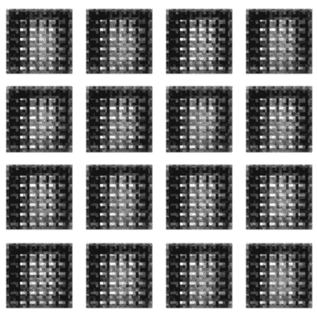
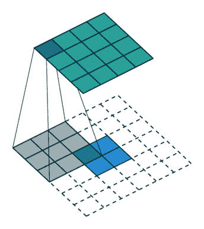
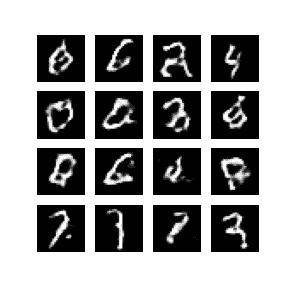
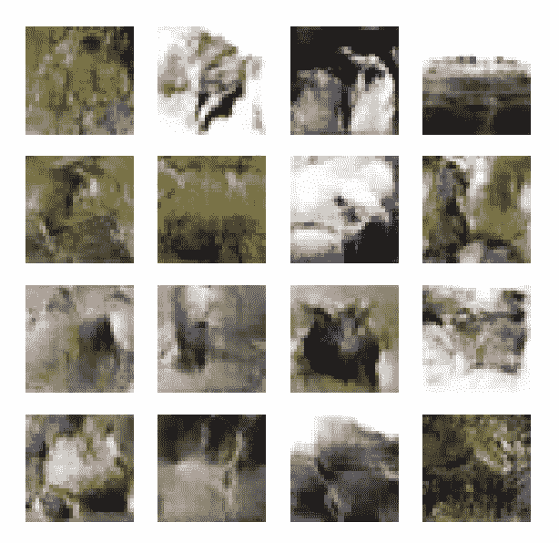

# 实现深度卷积生成对抗网络(DCGAN)

> 原文：<https://towardsdatascience.com/implementing-deep-convolutional-generative-adversarial-networks-dcgan-573df2b63c0d?source=collection_archive---------28----------------------->

## 我如何使用 DCGAN 从随机数据生成新图像



作者在 MNIST 培训 DCGAN

深度卷积生成对抗网络是 GANs 最基本实现的“镜像版本”。这种架构本质上利用深度卷积神经网络，使用生成器-鉴别器框架从噪声数据中生成属于给定分布的图像。

生成式对抗网络使用生成器网络来生成新的数据样本，使用鉴别器网络来评估生成器的性能。因此，从根本上说，GANs 的新颖之处在于评估器而不是生成器。

> 这是 GANs 区别于其他生成模型的地方。将生成模型与鉴别模型结合起来就是甘斯的全部内容
> 
> — [生成性对抗网络(GANs)综合指南](/a-comprehensive-guide-to-generative-adversarial-networks-gans-fcfe65d1cfe4)

我已经在[的另一篇文章](/a-comprehensive-guide-to-generative-adversarial-networks-gans-fcfe65d1cfe4)中讨论了 GANs 背后的理论和数学，如果你有兴趣知道 GANs 是如何工作的，可以考虑读一读！

在本文中，我们将使用 TensorFlow 实现 DCGAN，并观察两个著名数据集的结果:

1.  [MNIST 手写数字数据集](http://yann.lecun.com/exdb/mnist/)和
2.  [CIFAR-10 图像识别数据集](https://www.cs.toronto.edu/~kriz/cifar.html)

## 加载和预处理数据

在本节中，我们为模型加载和准备数据。

我们从 tensorflow.keras datasets 模块加载数据，该模块提供了一个 *load_data* 函数，用于获取一些众所周知的数据集(包括我们需要的数据集)。然后，我们将加载的图像归一化为具有从-1 到 1 的值，因为这些图像具有从 0 到 255 的像素值。

为培训准备数据

## 发电机

发生器模型主要由反卷积层组成，或者更准确地说，由转置卷积层组成，它们基本上执行卷积运算的逆运算。



转置卷积，无填充，无跨越。铝

在相邻的图中，描绘了在 4x4 图像上卷积 3×3 核的转置。

> 该操作相当于在具有 2x2 零边界的 2x2 图像上卷积 3x3 内核。

[深度学习卷积运算指南](https://arxiv.org/abs/1603.07285v1)是目前为止 DL 中涉及卷积运算的最好的论文之一。值得一读！

转到生成器，我们采用一个 128 维向量，并使用一个完全连接的层将其映射到一个 8x8x256 维向量。这个向量被整形为(8，8，256)。这些基本上是 256 个大小为 8×8 的激活图。此外，我们应用几个反卷积层，最终获得一个“大小为 32×32 的 3 通道图像”。这是生成的图像。

发电机模型

## 鉴别器

鉴别器只不过是一个由几个卷积层组成的二元分类器(像任何其他图像分类任务一样)。最后，展平的激活图被映射到概率输出，以预测图像是真的还是假的。

鉴别器模型

## 界定损失

由于这是一个二元分类问题，最终的损失函数将是二元交叉熵。然而，这种损失被调整并分别应用于两个网络，以便优化它们的目标。

```
loss = tf.keras.losses.BinaryCrossentropy(from_logits=True)
```

*   **发电机损耗**

生成器本质上是试图生成鉴别器会认可为真实图像的图像。因此，所有生成的图像必须被预测为“1”(真实的)，并且必须因未能这样做而受到惩罚。

发电机损耗

因此，我们训练生成器预测“1”作为鉴别器的输出。

*   **鉴频器损耗**

与生成器相反，鉴别器希望自己预测生成的输出是假的，同时，它必须预测任何真实的图像是真实的。因此，鉴别器训练这两种损耗的组合。

鉴频器损耗

我们训练鉴别器对生成的图像预测“0”(假的)，对来自数据集的图像预测“1”(真的)。

## 训练 GAN

在训练时期，我们一起处理生成器和鉴别器模型。然而，我们分别应用梯度，因为两种模型的损耗和架构不同。

训练时期

经过训练，我得到了以下结果，

*   关于 MNIST:



作者 50 个时期的结果

*   在 CIFAR-10 上:



作者在 100 个时期的结果

# 结论

我们看到了如何实现生成式对抗网络。我们用 GANs 的深度卷积风格介绍了这个实现。还有其他风格的 gan 产生条件输出，因此可以证明是非常有用的。

[这里的](https://github.com/rojagtap/DCGAN)是指向 GitHub 代码库的链接。放心叉吧！

# 参考

原甘斯论文:[https://arxiv.org/abs/1406.2661](https://arxiv.org/abs/1406.2661)

DCGAN 论文:[https://arxiv.org/abs/1511.06434](https://arxiv.org/abs/1511.06434)

GANs 博客:[https://towards data science . com/a-comprehensive-guide-to-generative-adversarial-networks-GANs-fcfe 65 D1 cfe 4](/a-comprehensive-guide-to-generative-adversarial-networks-gans-fcfe65d1cfe4)

本指南中使用的代码来自官方 TensorFlow 文档:

[](https://www.tensorflow.org/tutorials/generative/dcgan) [## 深度卷积生成对抗网络|张量流核心

### 这个教程演示了如何生成图像的手写数字使用深度卷积生成…

www.tensorflow.org](https://www.tensorflow.org/tutorials/generative/dcgan) 

TensorFlow 官方文档:

[](https://www.tensorflow.org/tutorials) [## 教程| TensorFlow 核心

### 完整的端到端示例，帮助 ML 初学者和专家了解如何使用 TensorFlow。尝试谷歌教程…

www.tensorflow.org](https://www.tensorflow.org/tutorials)