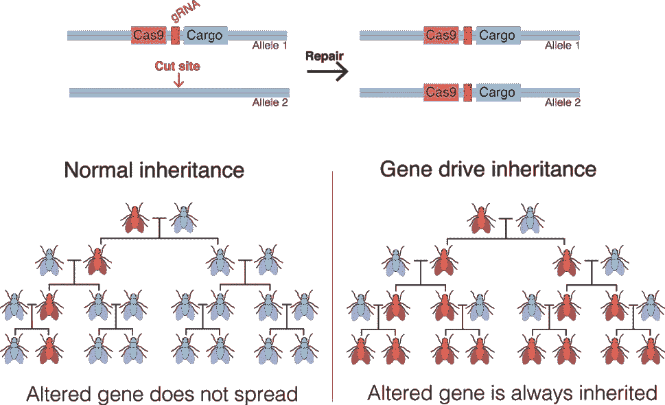

# 在遗传算法中实现基因驱动

> 原文：<https://towardsdatascience.com/implementing-gene-drives-into-genetic-algorithms-d245a5cc989f?source=collection_archive---------46----------------------->

## 探索基因工程的新技术

人类已经转向大自然去寻找优化的系统，去解决复杂的问题。就遗传算法而言，人类已经在一个程序中模拟了进化，以优化神经网络的权重。

随着最近遗传工程的兴起，我相信遗传算法可以通过这些技术得到改进。在这篇文章中，我将介绍一下基因驱动的实现

# 什么是基因驱动？



[图片](https://en.wikipedia.org/wiki/File:Gene_Drive.png)来自[维基百科](https://en.wikipedia.org/wiki/Gene_drive)。[版权所有](https://en.wikipedia.org/wiki/Wikipedia:Ten_things_you_may_not_know_about_images_on_Wikipedia#:~:text=You%20can%20use%20(free)%20images,site%2C%20or%20anywhere%20you%20like.&text=While%20all%20article%20text%20is,licenses%20for%20the%20many%20possibilities.)

基因驱动允许基因以更高的速度传递给下一代生物。看上面的图表:图像的左边代表一个基因从父母传给下一代。由于一半的遗传信息来自父亲，一半来自母亲，所以后代有 50%的机会继承这一基因。

然而，在一种昆虫的情况下，其遗传信息已经被基因驱动改变，该昆虫的所有后代都将获得这种基因，因此允许这种改变影响未来的所有世代。

# 基因驱动是如何工作的？

在正常的 CRISPR-Cas9 基因工程中，CRISPR 蛋白被编程为针对特定基因，该基因被新的序列取代。

对于基因驱动，过程是不同的。CRISPR 蛋白将自身插入到基因序列中，同时插入目标基因的信息。当序列的这一部分被激活时，CRISPR 蛋白将搜索这个基因，并用“正确的”(插入基因驱动的同一基因)替换所有“错误的”(不是插入基因驱动的同一基因)，导致该基因有可能传播。

既然你对基因驱动有了基本的了解，让我们从创建一个简单的遗传算法开始，它能够训练神经网络。

# 遗传算法:

正如我前面提到的，遗传算法模拟进化。生成具有特定遗传信息(在这种情况下，是神经网络的权重)的代理群体(在这种情况下，是神经网络)。一个算法计算每个代理的适应值，并计算适应值(在这种情况下，损失)。损失最低的前 20%的人口然后随机选择一个父母并产生两个后代，每个后代包含每个父母的遗传信息。重复该循环，直到产生具有令人满意的损失值的代理。

让我们试着用 Python 来创建这个:

## 步骤 1|先决条件:

```
import random
import numpy as np
from IPython.display import clear_outputdef sigmoid(x):
    return 1/(1+np.exp(-x))
```

先决条件是程序运行所需的基本依赖关系。Random 用于代理的随机生成，numpy 用于矩阵的初始化和操作，IPython display 用于消除屏幕上的混乱。

为了简单起见，我将在这个项目中使用的唯一激活函数是 sigmoid 函数。

## 步骤 2|代理蓝图:

```
class genetic_algorithm:

    def execute(pop_size,generations,threshold,X,y,network):
        class Agent:
            def __init__(self,network):
                class neural_network:
                    def __init__(self,network):
                        self.weights = []
                        self.activations = []
                        for layer in network:
                            if layer[0] != None:
                                input_size = layer[0]
                            else:
                                input_size = network[network.index(layer)-1][1]
                            output_size = layer[1]
                            activation = layer[2]
                            self.weights.append(np.random.randn(input_size,output_size))
                            self.activations.append(activation)
                    def propagate(self,data):
                        input_data = data
                        for i in range(len(self.weights)):
                            z = np.dot(input_data,self.weights[i])
                            a = self.activations[i](z)
                            input_data = a
                        yhat = a
                        return yhat
                self.neural_network = neural_network(network)
                self.fitness = 0
                self.gene_drive = []
            def __str__(self):
                    return 'Loss: ' + str(self.fitness[0])
```

这是程序的开始，创建了遗传算法类和执行函数。

代理具有包含网络传播指令的蓝图。在代理的 init 中，初始化一个神经网络类，并根据给定的矩阵结构随机生成其权重。

## 步骤 3|创建群体:

```
def generate_agents(population, network):
            return [Agent(network) for _ in range(population)]
```

这个函数，给定群体大小和网络结构作为参数，生成代理群体，具有随机生成权重的神经网络。

## 第 4 步|计算健康度:

```
def fitness(agents,X,y):
            for agent in agents:
                yhat = agent.neural_network.propagate(X)
                cost = (yhat - y)**2
                agent.fitness = sum(cost)
            return agents
```

这是该遗传算法的基本适应度函数。它只是使用 MSE 公式来计算损失。

## 第五步|选择:

```
def selection(agents):
            agents = sorted(agents, key=lambda agent: agent.fitness, reverse=False)
            print('\n'.join(map(str, agents)))
            agents = agents[:int(0.2 * len(agents))]
            return agents
```

程序的这一部分是选择算法，它根据智能体的适应值以相反的顺序对智能体进行排序。然后，它会清除不在此列表前五分之一的所有代理。

## 第六步|交叉:

```
def crossover(agents,network,pop_size):
            offspring = []
            for _ in range((pop_size - len(agents)) // 2):
                parent1 = random.choice(agents)
                parent2 = random.choice(agents)
                child1 = Agent(network)
                child2 = Agent(network)

                shapes = [a.shape for a in parent1.neural_network.weights]

                genes1 = np.concatenate([a.flatten() for a in parent1.neural_network.weights])
                genes2 = np.concatenate([a.flatten() for a in parent2.neural_network.weights])

                split = random.randint(0,len(genes1)-1)child1_genes = np.array(genes1[0:split].tolist() + genes2[split:].tolist())
                child2_genes = np.array(genes1[0:split].tolist() + genes2[split:].tolist())

                for gene in parent1.gene_drive:
                    child1_genes[gene] = genes1[gene]
                    child2_genes[gene] = genes1[gene]

                for gene in parent2.gene_drive:
                    child1_genes[gene] = genes2[gene]
                    child2_genes[gene] = genes2[gene]

                child1.neural_network.weights = unflatten(child1_genes,shapes)
                child2.neural_network.weights = unflatten(child2_genes,shapes)

                offspring.append(child1)
                offspring.append(child2)
            agents.extend(offspring)
            return agents
```

从人口的前 20%中随机选择两个父母。然后它们繁殖。这是如何做到的:

1.  它们的重量变平了
2.  找到一个随机的交点。这个点是一个父母的遗传信息结束的地方，也是一个父母的遗传信息开始的地方。
3.  创建两个子代，然后将它们添加到代理列表中。这些孩子彼此不同，因为他们有不同交叉点。

这有望让好父母的优良品质传递给他们的后代。

## 第七步|突变:

```
def mutation(agents):
            for agent in agents:
                if random.uniform(0.0, 1.0) <= 0.1:
                    weights = agent.neural_network.weights
                    shapes = [a.shape for a in weights]flattened = np.concatenate([a.flatten() for a in weights])
                    randint = random.randint(0,len(flattened)-1)
                    flattened[randint] = np.random.randn()newarray = []
                    indeweights = 0
                    for shape in shapes:
                        size = np.product(shape)
                        newarray.append(flattened[indeweights : indeweights + size].reshape(shape))
                        indeweights += size
                    agent.neural_network.weights = newarray
            return agents
```

每一种药剂都有 10%的几率会发生变异。在这种情况下，突变是指某个权重值被随机的浮点值替换。这是通过展平权重、找到要改变的随机权重，然后最后重新整形要重新插入代理的权重来完成的。

## 第八步|基因驱动:

```
def gene_drive(agents):
            for agent in agents:
                if random.uniform(0.0, 1.0) <= 0.1:
                    weights = agent.neural_network.weights
                    shapes = [a.shape for a in weights]flattened = np.concatenate([a.flatten() for a in weights])
                    target_gene = random.randint(0,len(flattened)-1)
                    if not(target_gene in agent.gene_drive):
                        agent.gene_drive.append(target_gene)newarray = []
                    indeweights = 0
                    for shape in shapes:
                        size = np.product(shape)
                        newarray.append(flattened[indeweights : indeweights + size].reshape(shape))
                        indeweights += size
                    agent.neural_network.weights = newarray
            return agents
```

尽管这个脚本将基因驱动插入到代理中，但是如果您仔细查看代码，您已经可以看到对基因驱动框架的规避，从而影响程序的其他部分。比如在交叉指令中，其实解释了基因驱动是如何实现的。

```
for gene in parent1.gene_drive:
                    child1_genes[gene] = genes1[gene]
                    child2_genes[gene] = genes1[gene]

                for gene in parent2.gene_drive:
                    child1_genes[gene] = genes2[gene]
                    child2_genes[gene] = genes2[gene]
```

就这么简单！如果基因存在于父母的基因驱动中，孩子会将自己的基因改变为父母的基因，即具有基因驱动的基因。

## 第 9 步|执行:

```
for i in range(generations):
            print('Generation',str(i),':')
            agents = generate_agents(pop_size,network)
            agents = fitness(agents,X,y)
            agents = selection(agents)
            agents = gene_drive(agents)
            agents = crossover(agents,network,pop_size)
            agents = mutation(agents)
            agents = fitness(agents,X,y)

            if any(agent.fitness < threshold for agent in agents):
                print('Threshold met at generation '+str(i)+' !')

            if i % 100:
                clear_output()

        return agents[0]
```

将最后一段代码粘贴到函数中，函数应该在被调用时运行。

```
X = np.array([[0,0,1], [1,1,1], [1, 0, 1], [0, 1, 1]])
y = np.array([[0,1,1,0]]).T
network = [[3,20,sigmoid],[None,1,sigmoid]]
ga = genetic_algorithm
agent = ga.execute(10000,1000,0.1,X,y,network)
weights = agent.neural_network.weights
agent.fitness
agent.neural_network.propagate(X)
```

神经网络的任务很简单。结构为(3，20，1)的网络，每层都有 sigmoid 激活函数。对于每一代新的群体，会产生 10000 个新的因子，这样重复 1000 代。

# 结论:

基因驱动遗传算法实际上比普通遗传算法更差。我的假设是，基因驱动将应用于早期的代理人，从定义上来说，没有未来的代理人好。

然后，我决定实现一个阈值，在这个阈值中，只有低丢失值才会有随机归因于其基因组中某个基因的基因驱动。

新代码:

```
def gene_drive(agents):
            for agent in agents:
                if agent.fitness <= 0.1:
                    weights = agent.neural_network.weights
                    shapes = [a.shape for a in weights]flattened = np.concatenate([a.flatten() for a in weights])
                    target_gene = random.randint(0,len(flattened)-1)
                    if not(target_gene in agent.gene_drive):
                        agent.gene_drive.append(target_gene)newarray = []
                    indeweights = 0
                    for shape in shapes:
                        size = np.product(shape)
                        newarray.append(flattened[indeweights : indeweights + size].reshape(shape))
                        indeweights += size
                    agent.neural_network.weights = newarray
                    break
            return agents
```

这比普通的遗传算法工作得更好，产生的结果也更好。

# 我的链接:

如果你想看更多我的内容，点击这个 [**链接**](https://linktr.ee/victorsi) 。