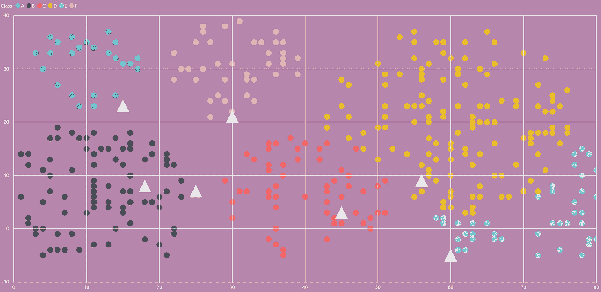
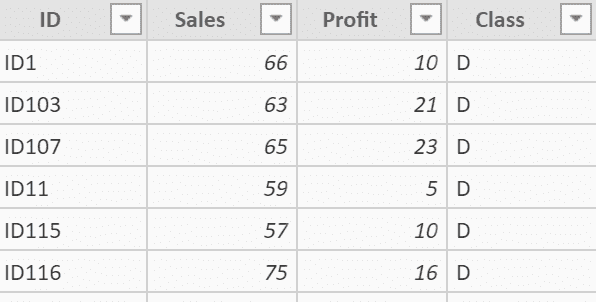
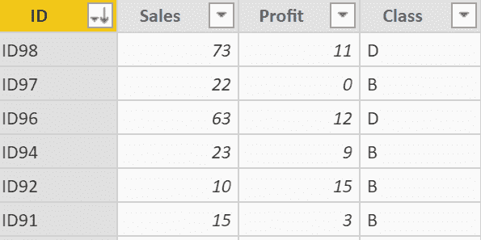
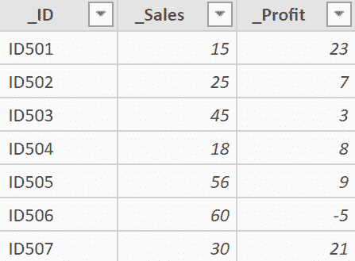
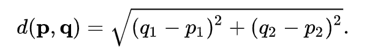
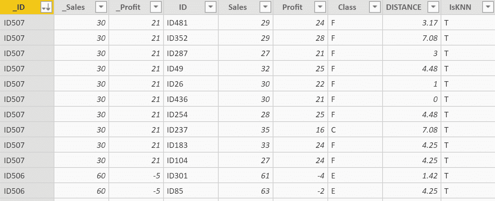
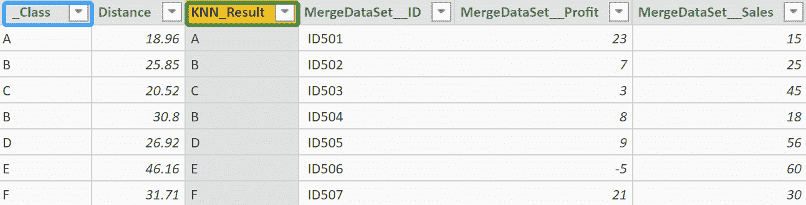
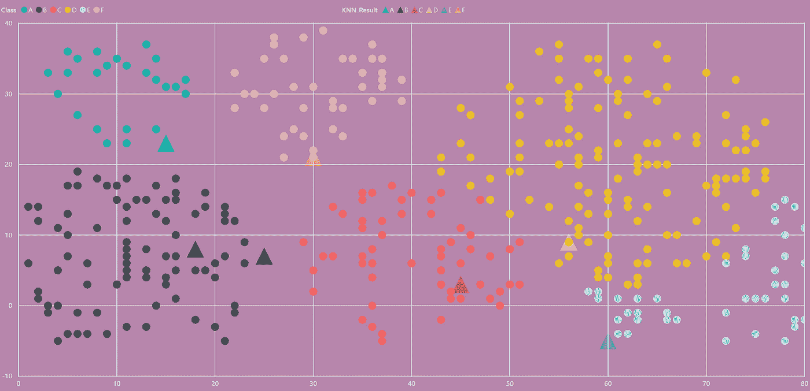

# 使用 DAX 实现 K-最近邻分类算法

> 原文：<https://towardsdatascience.com/implementing-k-nearest-neighbor-classification-algorithms-using-dax-a52607b1a825?source=collection_archive---------44----------------------->

## 带 DAX 的 KNN 算法

本文将介绍如何使用数据分析表达式(DAX)实现 KNN(K 近邻)分类。您可以在下图中看到彩色散点图，其中每个散点图代表一种产品。横轴代表销量，纵轴代表利润，剩下的 7 个白色三角形是待分类的测试数据。接下来，我将使用 KNN 算法对这些测试数据进行分类。



作者图片

# 关于本文的数据集:

训练数据集(部分):



作者图片



作者图片

测试数据集:

```
TestingDataSet = DataTable("_ID", STRING,  
                "_Sales", INTEGER,
                "_Profit",INTEGER  
               ,{  
                        {" ID501",15,23},  
                        {" ID502",25,7},  
                        {" ID503",45,3},  
                        {" ID504",18,8},  
                        {" ID505",56,9},
                        {" ID506",60,-5},
                        {" ID507",30,21}
                }  
           )
```



作者图片

# 让我们开始吧:

首先，我们需要计算每个测试点和训练集的数据点之间的距离。我们可以用欧几里德距离公式计算如下:



图片由[维基百科](https://en.wikipedia.org/wiki/Euclidean_distance)

在此之前，我采用的方法是将测试数据集作为主表，让它与训练数据集生成一个笛卡尔积，这样我们就可以针对每个测试点计算出它与所有训练集数据点之间的距离。另外，我们需要计算所有训练数据中哪些数据点是被划分为测试点的相邻点。这里我取 K 等于 9，将数据集中距离测试点距离最小的前 9 个训练集数据进行标记，然后过滤掉没有标记的数据点。总之，执行以下代码来生成表:“合并数据集”:

```
MergeDataSet = 
VAR VT_1 = 
ADDCOLUMNS(
    GENERATEALL('TestingDataSet','TrainingDataSet'),
"DISTANCE",
CEILING(
    SQRT(('TestingDataSet'[_Sales]-'TrainingDataSet'[Sales])^2+
    ('TestingDataSet'[_Profit]-'TrainingDataSet'[Profit])^2),
0.01)) VAR VT_2 = 
ADDCOLUMNS(VT_1,
    "IsKNN",
    VAR K = 9
    VAR v_id = 'TestingDataSet'[_ID]
    return
    IF(
        rankx(
            filter(VT_1,'TestingDataSet'[_ID] = v_id),
                [DISTANCE],,ASC,Skip)<=K,
    "T","F")) VAR VT_3 = 
FILTER(VT_2,[IsKNN] = "T") RETURN VT_3
```

结果如下所示(部分):



作者图片

现在我们已经确定了所有的邻居，是时候分析它们了。对于每个测试点，找到其所有邻居的类别中最多的，然后将类别分配给该测试点，根据多数投票完成分类，最终结果在名为“结果集”的表中返回:

```
ResultSet = 
VAR VT_4 = 
ADDCOLUMNS('MergeDataSet',
    "_Class",
    VAR CLASSNUM_MAX = 
    CALCULATE(
        MAXX('MergeDataSet',
            CALCULATE(
                COUNT('MergeDataSet'[Class]),
                    ALLEXCEPT('MergeDataSet',
                        'MergeDataSet'[_Profit],
                        'MergeDataSet'[Class]))),
        ALLEXCEPT('MergeDataSet','MergeDataSet'[_ID]))
    RETURN
    IF( CLASSNUM_MAX = CALCULATE( COUNT('MergeDataSet'[Class]),
                ALLEXCEPT('MergeDataSet', 'MergeDataSet'[_Profit], 'MergeDataSet'[Class])),
        CALCULATE( FIRSTNONBLANK('MergeDataSet'[Class],1),
            ALLEXCEPT('MergeDataSet', 'MergeDataSet'[_ID], 'MergeDataSet'[Class])
        ))) VAR VT_5 = 
CALCULATETABLE( 
    GROUPBY(
        FILTER(VT_4,[_Class]<>BLANK()),
        'MergeDataSet'[_ID],
        'MergeDataSet'[_Profit],
        'MergeDataSet'[_Sales],
        [_Class],
        "Distance",
        SUMX(CURRENTGROUP(),'MergeDataSet'[DISTANCE])
)) RETURN VT_5
```

执行的结果如下，“__Class”是 K 个最近邻的分类结果:



作者图片

您可能会发现，结果集中有一列没有出现在最后一个公式中:“KNN _ 结果”(带绿色标记)。这是因为我们还需要考虑一种特殊情况(虽然在这种情况下没有出现):如果测试点有相同数量的 A 类邻居和 B 类邻居，那么测试点应该属于哪个类？这里，通过比较所有 A 类和 B 类点离测试点的实际距离，然后选择距离值较小的类别。因此，使用以下公式创建一个名为“KNN _ 结果”的新计算列，以便我们在遇到这种特殊情况时可以通过筛选空行来实现这一点:

```
KNN_Result = 
VAR Class_ = 
CALCULATE(
    MIN('ResultSet'[Distance]),
    ALLEXCEPT('ResultSet','ResultSet'[MergeDataSet__ID]))
RETURN
IF(
class_ = 'ResultSet'[Distance],
'ResultSet'[_Class],
BLANK())
```

最后，我们使用 DAX 成功完成了 KNN 分类，如下所示:



作者图片

*(我相信 DAX 有能力实现一些简单的机器学习算法，而不是什么都依赖 R 或者 PYTHON。如果你有更好的方法来使用 DAX 或 M 实现 KNN，我希望得到你的反馈。)*

*END~*