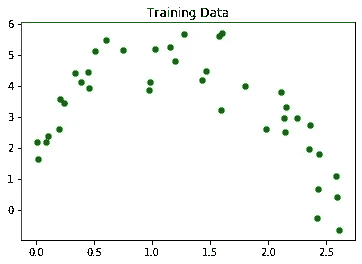
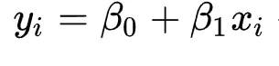
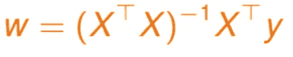
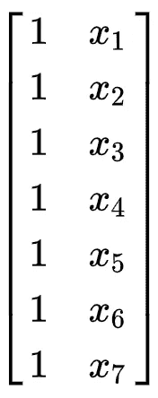
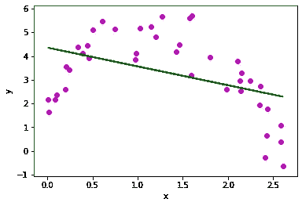
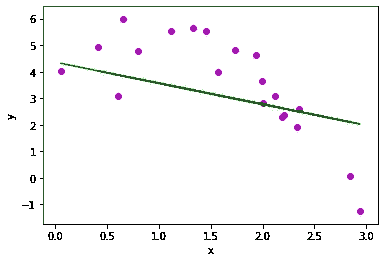
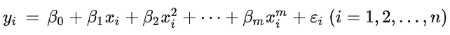
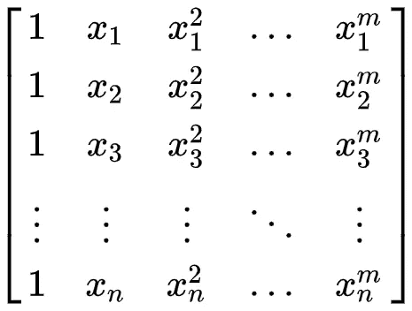
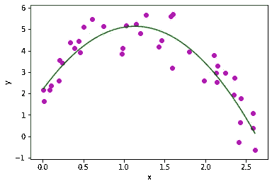
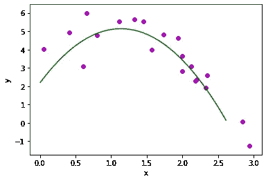

# 从头开始实现线性和多项式回归

> 原文：<https://towardsdatascience.com/implementing-linear-and-polynomial-regression-from-scratch-f1e3d422e6b4?source=collection_archive---------13----------------------->

在本教程中，我们将介绍如何使用最小二乘法拟合数据来实现简单的线性回归模型。之后，我们将模型扩展到多项式回归模型，以便捕捉更复杂的信号。我们将使用均方差来衡量我们生成的每个模型的拟合质量。你可以从我的 [Github repo](https://github.com/christam96/Linear-And-Polynomial-Regression-From-Scratch) 下载我用来写这篇文章的所有资源👍。

## 加载和绘制数据

让我们首先将训练数据加载到内存中，并将其绘制成图表，以了解我们正在处理的内容。将`train_features`视为 x 值，将`train_desired_outputs`视为 y 值。下图是所有值的散点图。



我们训练数据的散点图

现在是时候写一个[简单线性回归](https://en.wikipedia.org/wiki/Simple_linear_regression)模型来尝试拟合数据了。我们的目标是找到一条与图中所示的训练数据的基本模式最相似的线。我们将使用[最小二乘法](https://en.wikipedia.org/wiki/Least_squares)用最能描述训练集的系数来参数化我们的模型，然后再看看该模型对以前从未见过的数据的概括程度。回想一下，简单的线性回归模型是由 y 轴截距和回归线的斜率来参数化的。



简单线性回归模型

## 训练我们的线性回归模型

寻找参数以使我们的模型符合训练数据的过程称为“训练”我们的模型。给定一个设计矩阵 *X* 和一个目标输出的列向量 *y* ，我们可以使用下面的等式通过最小二乘回归找到我们的线性模型的最佳截距和斜率系数(要深入了解该等式背后的线性代数概念，请参见本文):



我们是这样编码的。我们首先创建一个设计矩阵 *X* ，其中包含一列 1(为了估计 y 轴截距)和另一列 1，用于保存我们的解释变量 *x* 的值。然后，我们取 X 与其转置的点积的倒数，并将其与 X 转置和 training _ desired _ outputs 的 y 值)的点积进行点积。



我们的设计矩阵 X

下面是我们的模型如何拟合训练数据。



我们可以通过使用[均方误差](https://en.wikipedia.org/wiki/Mean_squared_error) (MSE)来计算我们的线和训练集中实际数据点之间的平均平方差，从而量化我们的模型与数据的拟合程度。MSE 计算如下:

```
Mean squared error on the training set:  2.1739455790492586
```

还不错！均方误差是对估计量质量的一种度量，在我们的例子中，估计量是我们的线性回归模型。MSE 总是非负的，值越接近零越好。

## 测试我们的线性回归模型

现在让我们看看我们的模型对 T2 以前没有见过的数据预测得有多好。我们称这一步为测试阶段。记住，我们的模型是由返回的系数定义的


因此，上面的函数返回 w，其中包含 y 轴截距和斜率的系数。**我们将使用用于训练模型的相同值来测试我们的模型。**

下面是我们的模型如何拟合测试数据:



同样，我们将使用 MSE 来评估我们的模型与数据的拟合程度(我使用的是前面 MSE.py gist 中提供的相同代码)。

```
Mean squared error on the testing set:  2.3118753456727985
```

我们的测试误差略高于我们的训练误差。这是有意义的，因为训练误差通常应该低于测试误差。**一个模型很少会根据它以前没有见过的数据比它接受训练的数据预测得更准确。**

## 多项式回归

要实现多项式回归，我们需要做的就是采用我们的线性回归模型并添加更多的特性。回想一下线性回归模型的形式，并将其与多项式回归模型的形式进行比较



多项式回归模型的形式

你可以看到，我们需要一个额外的系数为每一个额外的功能，表示为 x …xᵐ.多项式回归模型的阶数取决于模型中包含的特征数量，因此具有 *m* 个特征的模型是一个 *mᵗʰ-* 次或 *mᵗʰ-* 阶多项式回归。我们将从二阶多项式回归开始，您会注意到增加回归模型的复杂性非常容易(增加模型复杂性并不总是一件好事，可能会导致 [*过度拟合*](https://en.wikipedia.org/wiki/Overfitting) *！！！).*

## 二阶多项式回归

因为我们在模型中加入了另一个特性，所以我们必须通过在设计矩阵中加入另一个术语来说明这一点。具有 *m-* 度的设计矩阵的一般形式如下



多项式回归设计矩阵的矩阵形式

让我们继续用代码构建它:

请注意，我们是如何在设计矩阵 *X* 的右侧包含一列 X 特性的。产生的三个系数存储在*系数中。*让我们将模型应用于我们的训练数据，并打印出回归线。

下面是我们的二阶多项式回归模型如何拟合训练数据:



二阶多项式回归拟合散点图。

```
Mean squared error on the training set:  0.4846845031271553
```

现在让我们将我们的模型应用于测试数据。

这是它的合适之处。



```
Mean squared error on the testing set:  0.7573635655518132nd-order polynomial regression is a better fit than linear regression. 
```

当比较我们的线性回归模型和二阶多项式回归模型的 MSE 时，我们看到后者比前者更适合测试集。万岁！我们能够通过增加复杂性来提高模型的准确性。然而，要注意的是，增加模型的复杂性并不总是会带来更好的准确性。

为了进一步扩展该模型，尝试通过在设计矩阵 *X* 中为特征 *x* 添加一个立方项来实现三阶多项式回归，如下所示:

```
X = np.c_[np.ones(N), train_features_vals, np.square(train_features), np.power(train_features, 3)]
```

确保在绘制回归线时，修改 *y_pred* 来考虑这个额外的项。

```
y_pred = b[3]*np.power(x_line, 3) + b[2]*np.square(x_line) + b[1]*x_line + b[0]
```

我希望这篇教程对你有所帮助！我很乐意回答任何问题或评论，所以请在下面留下你的想法或私人笔记。干杯！