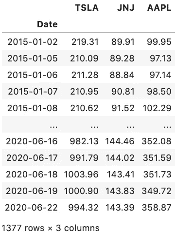
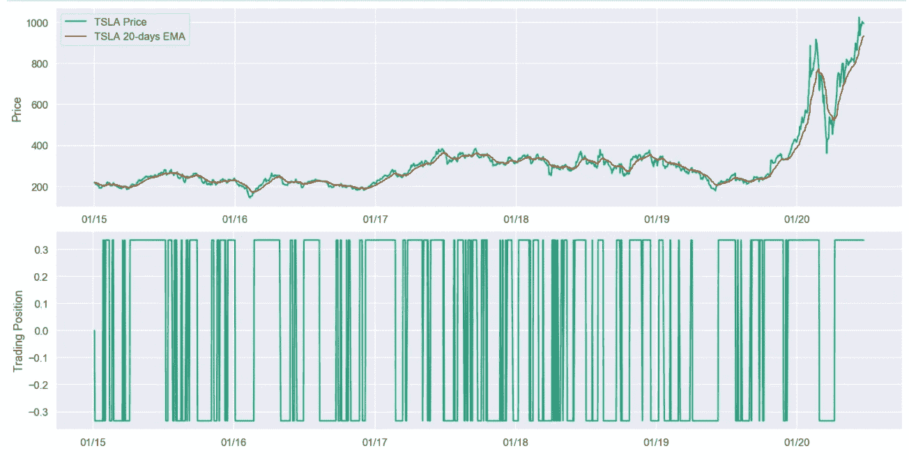
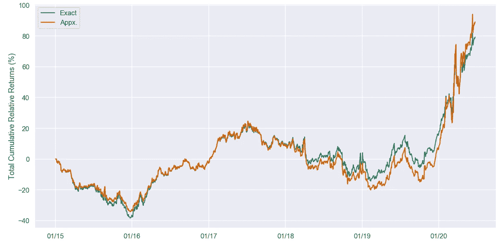

# 交叉:资产价格的有利可图的交叉点

> 原文：<https://towardsdatascience.com/implementing-ma-strategy-a6457f3ebbb9?source=collection_archive---------51----------------------->

## 使用 Python 创建移动平均线交易策略

作为一个经济学出身的人，我不禁从金融的角度来看待这个世界。当我决定转向技术分析时，我仍然希望将我的金融领域知识融入到技术部分。交易中的技术分析对我这个位置的很多人来说是一个非常热门的领域，所以我想建立一个带回溯测试的量化交易策略来结合这两个领域。这个项目的完整存储库可以在这里找到。

由[杰森·布里斯科](https://unsplash.com/@jsnbrsc?utm_source=medium&utm_medium=referral)在 [Unsplash](https://unsplash.com?utm_source=medium&utm_medium=referral) 上拍摄的照片

*   **免责声明:本博客和交易策略用于教育目的，我不建议用于专业投资***

# **建立投资组合**

我们的交易策略将采用各种版本的移动平均线公式，使我们的交易决策适应投资组合中资产价格的行为。我们将从选择多样化的资产组合开始:特斯拉(TSLA)、强生(JNJ)和苹果(AAPL)。这三种资产是蓝筹股，分别是汽车、医疗保健和科技行业的主要驱动力。我们首先使用 *yfinance* 库从一个确定的起点和终点收集历史价格数据。这些作为单独的序列引入，然后合并到一个具有日期时间索引的数据帧中。

我们现在有超过五年的收盘价(1377 个条目)用于我们的策略。

# 简单移动平均线

因为这是我建立的第一个技术交易策略，我想从一个最古老和直接的方法开始，我们将使用价格的移动平均时间序列来对抗实际价格的趋势。通过对一个时间序列进行移动平均，我们能够大大减少序列中的噪声或方差。这将允许我们以更简单的方式理解资产的长期行为。

使用高频算法，交易可以在几分之一秒内发生，或者以长期方式持续多年。我们将采用短期和长期的移动平均线。

让我们来看看，对于我们投资组合中的一种资产:特斯拉，同一时间序列的这些变化是如何随着时间的推移而变化的。注意简单移动平均线(SMA)是如何随着时间的增长而变得平滑的，这表明价格变动的可变性减少了。

重要的是要记住，当我们使用 SMA 时间序列时，我们实际上落后于原始价格序列。注意橙色的 20 天 SMA 是如何在灰色的 TSLA 价格线的 01/15 开始日期之后开始的。蓝绿色 100 天 SMA 开始得更晚。滞后是由于简单移动平均线的数学本质，但我们不能简单地忽略这种滞后的存在，因为当谈到交易时，时间是最敏感的。那么我们如何解释这种滞后呢？指数移动平均线(EMA)。

# 指数移动平均线

EMA 和 SMA 非常相似，除了它有一个额外的衰减参数，α (alpha)。均线有助于限制滞后，因为它更重视最近的观察。SMA 只是对观察值进行平均加权。

我们可以看到，使用均线可以更同步、更精确地捕捉方差减少的时间序列。现在我们有了一个好的数据结构，我们将继续发展我们的交易策略。

# 制定贸易战略

如上所述，均线和均线都滞后于资产的实际价格。换句话说，资产的**实际**价格比移动平均价格变化快得多。因为实际价格更敏感，我们可以用两者的交叉点(实际价格和均线)来表示做空(卖出)或做多(买入)。

*   当原始资产价格从低于的**穿过均线系列时，我们将卖出所有空头头寸，买入一个单位的多头头寸**
*   当原始资产从上方的**穿过均线系列时，我们会平仓，通过卖出一个单位的资产来做空**

**注意:**我们不考虑仓位大小。我们假设我们的可用资本被完全使用，并且在我们投资组合的三种资产中平均分配(1/3)。在多头条件下，每项资产的权重为 1/3，而空头条件下的权重为-1/3。

我们用原始价格和均线序列之间的差异来表示我们所有的资金都被使用了，不管是多头还是空头。

这将为我们提供一个包含价格差异的新数据框架，但我们确实希望将价格差异反映为“买入”或“卖出”的信号。我们可以使用一个 *numpy* 方法来分配这些。

**重要提示:**因为我们使用的是原始时间序列中资产的“收盘”价格，我们实际上并不知道该价格高于均线价格。假设我们有一个多头头寸实际上与我们模型的数学不一致。只能假设收盘时我们**会**做多，也就是说明天的开仓也会做多。明天做多可以通过将我们的头寸向前移动一天来表示。

让我们看看我们的均线和原始资产价格是什么样的。我们还将绘制信号的时间序列，看看我们的头寸在日期窗口的过程中是如何变化的。

记住，我们的多头买入头寸用正的 1/3 (0.333)来表示，而我们的卖出头寸用负的 1/3(0.333)来表示(T2)。我们现在有了整个系列的投资组合交易头寸的可视化表示。

# 回溯测试我们的策略

我们的策略独立对待每项资产，我们对一项资产的头寸不会影响其他资产的头寸。我们将使用这些信息，通过连续对数观测值的差异来获得我们的投资组合回报。

我们在整个时间段的总回报要求我们将持仓数据框架乘以资产的对数回报数据框架。

我们的数据框架现在包含了每个单个条目的回报，但是我们必须使用累计总和来查看总回报。然后，我们使用 *numpy* 将这些回报转换成相对回报。然后，我们将绘制出我们每项资产的累积对数收益以及它们的相对收益。

我们将把所有的对数收益相加，然后把它们转换成相对收益，从而得到一个统计上精确的收益近似值。绘制时，请记住这些值代表百分比，因此不要忘记将系列 y 值乘以 100 以获得准确的数字。

# 决赛成绩

现在我们有了回报，我们现在可以使用复合回报假设来返回我们的终身投资组合回报以及我们的平均年回报。

*   **终身投资组合回报率=** 79.31%
*   **平均。年回报率=** 11.66%

自 1962 年以来，美国股票的平均年回报率约为 11%。这意味着我们的移动平均策略将允许您的投资组合每年获得“平均”回报。现在，这些只是市场上市值最大的三只股票。一个真正的投资组合将更加多样化，并需要尽职调查来保证高回报。我们的交易策略也做了很多假设，可以改进，但希望这是对金融工具进行技术分析的一个强有力的起点。

***来自《走向数据科学》编辑的提示:*** *虽然我们允许独立作者根据我们的* [*规则和指导方针*](/questions-96667b06af5) *发表文章，但我们并不认可每个作者的贡献。你不应该在没有寻求专业建议的情况下依赖一个作者的作品。详见我们的* [*读者术语*](/readers-terms-b5d780a700a4) *。*