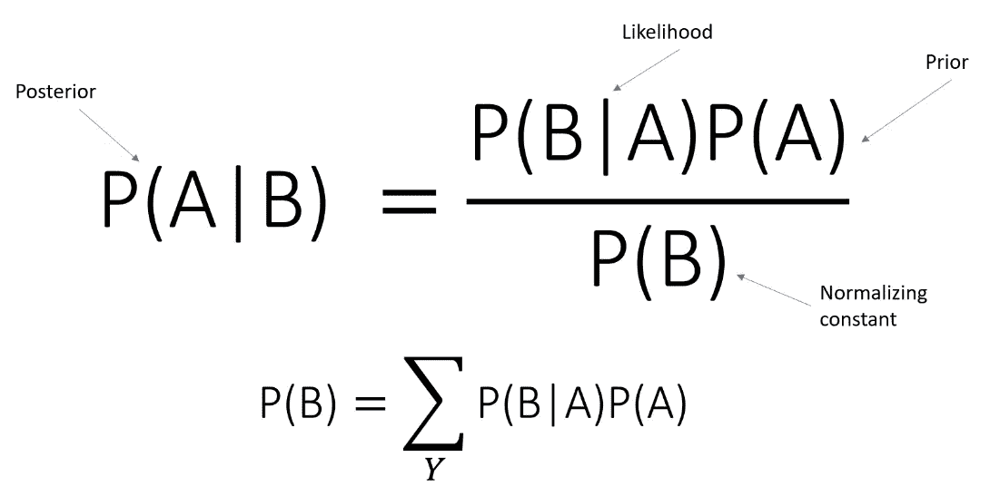
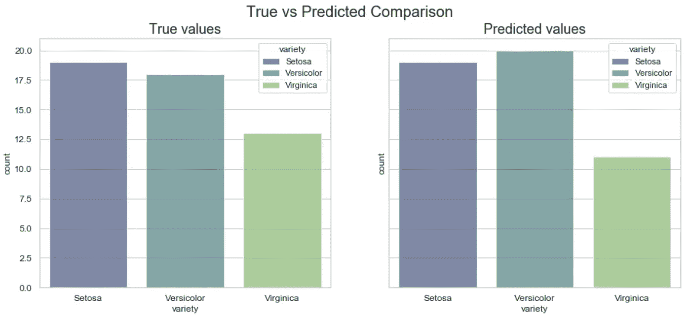
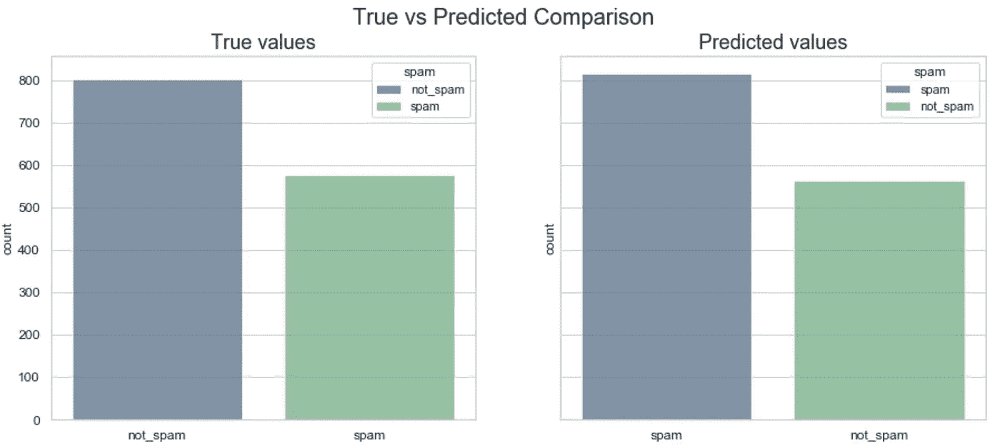

# 从零开始实现朴素贝叶斯算法。

> 原文：<https://towardsdatascience.com/implementing-naive-bayes-algorithm-from-scratch-python-c6880cfc9c41?source=collection_archive---------5----------------------->

## 在本文中，我将展示朴素贝叶斯分类器的一个基本实现，以及它是如何工作的。

图片来自 www.i2tutorials.com

## **简介**

朴素贝叶斯分类器是一种非常流行的基于贝叶斯定理的监督机器学习算法。这是一种简单但非常强大的算法，适用于大型数据集和稀疏矩阵，如预处理的文本数据，它根据字典中的单词数创建了数千个向量。它在文本数据项目(如情感数据分析)中工作得非常好，在文档分类项目中表现良好，并且在预测分类数据(如垃圾邮件分类)中也非常出色。

它用于解决许多不同的问题陈述，并且在训练模型时非常快，因为朴素贝叶斯分类器完全在概率上工作，所以转换发生得很快。

## 理解背后的数学和统计学

贝叶斯定理描述了一个事件发生的概率，基于可能与该事件相关的条件的先验知识。

首先，我们来看一个条件概率的公式，并尝试推导贝叶斯定理:

P(B|A) = P(A∩B)/P(B)，

其中，给定 A 的 B 的概率，即事件 A 已经发生时事件 B 的概率，等于交集 B 的概率(即 A 和 B 事件都发生的概率)除以 B 的概率。

或者 P(A|B) = P(B∩A)/P(A)，

其中，给定 B 的概率，即事件 B 已经发生时事件 A 的概率，等于 B 交集 A 的概率(即 B 和 A 事件都发生的概率)除以 A 的概率。

我们再仔细看看，我们看到 P(A∩B)和 P(B∩A)基本相同，可以写成 P(A∩B) = P(B∩A)。由于它们是相同的，我们可以得到两个公式，并将分母移到等式的左边:

P(A∩B) = P(A|B) * P(B)，P(B∩A) = P(B|A) * P(A)并使它们相等:

P(A|B) * P(B) = P(B|A) * P(A)。

所以，当我们想找到给定 B 的概率时，我们可以这样写方程:

**P(A|B) = P(B|A) * P(A) / P(B)** ，这是贝叶斯定理的方程式。

## 贝叶斯定理方程在算法中的应用

让我们打破我们的等式，了解它是如何工作的:

*   **P(A|B)** 是给定*预测器* ( *属性*)的*类* ( *目标*)的后验概率。
*   **P(B)** 是*类*的先验概率。
*   **P(B|A)** 为似然性，即*预测器*给定*类*的概率。
*   **P(A)** 是*预测器*的先验概率。

为了计算后验概率，首先我们需要计算每个属性相对于目标的频率。然后，将频率转换为似然值，最后使用朴素贝叶斯方程计算每类的后验概率。具有最高后验概率的类是预测的结果。

在我的例子中，我使用了两个数据集:

1.  [Iris](http://archive.ics.uci.edu/ml/datasets/Iris/) 数据集预测花的类型
2.  [垃圾邮件数据库](https://archive.ics.uci.edu/ml/datasets/spambase)用于检测电子邮件是否包含垃圾邮件的数据集

由于两个数据集都有连续的属性，我选择了高斯分布来估计朴素贝叶斯分类器中似然概率的参数。该分布由两个参数表征，均值和方差。高斯密度函数的公式，来源于维基百科，看起来是这样的:**(1/√2pi *σ)* exp((-1/2)*((x-μ))/(2 *σ))**，其中μ是均值，σ是方差，σ是方差的平方根(标准差)。

首先，我们需要计算每一列的平均值和方差，并将其转换为 numPy 数组，以便将来计算:

计算每列的平均值和方差

接下来，让我们将高斯密度函数转换为代码:

从高斯密度函数计算概率

最后一步是计算先验和后验概率:

## 做预测

最后，所有的助手方法现在都可以在 fit 和 predict 方法中使用了:

拟合和预测方法

在对鸢尾花分类数据训练我的模型后，我得到了非常好的 92%的准确率。

鸢尾花分类中的真实与预测

我将它与 scikit-learn 高斯贝叶斯分类器进行了比较，得到了相同的结果，这非常令人印象深刻，因为我的算法只是准系统，需要很多改进。

对于电子邮件垃圾分类问题，我的模型仅执行了 78%的准确率，然而它与 scikit-learn 高斯贝叶斯分类器的准确率 81.8%相差不远。

垃圾邮件分类中的真实值与预测值

## 结论

我的朴素贝叶斯分类器算法实现远非理想，它需要许多改进和修改才能做出更好的预测，尤其是对文本数据，然而，与 sklearn 库的算法相比，它的性能仍然非常好。

注意:

这个项目是为 **Lambda 学校(Bloom Technology now)** 做的，作为**计算机** **科学**课程的一部分。

代码实现的 Github 链接:[从头开始的朴素贝叶斯分类器](https://github.com/tigju/Naive-Bayes-Classifier-from-scratch)