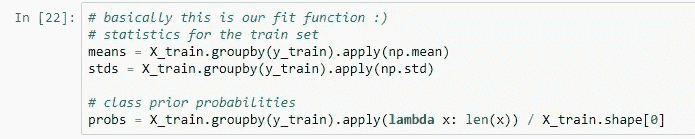

# 用 Python 在 2 分钟内实现朴素贝叶斯

> 原文：<https://towardsdatascience.com/implementing-naive-bayes-in-2-minutes-with-python-3ecd788803fe?source=collection_archive---------6----------------------->

## 我不知道这么容易！

[来源](https://unsplash.com/photos/CYvbt621yLE)

在本文中，我将提供著名的朴素贝叶斯算法的一个非常简短和直观的实现。为了理解这个简单的概念，理解下图的意思就够了:)满足贝叶斯定理！

在实现高斯朴素贝叶斯分类器之前，我们应该写 2 个简单的假设:

1.  我们的数据呈正态分布
2.  我们希望我们的数据列有条件地相互独立

这个模型最好的一点就是朴素贝叶斯效果很好，即使这些条件都不满足！让我们通过 3 个简单的步骤最终实现这个模型！

1.  **准备数据集**

首先，和往常一样，我会准备资料。今天，我将使用一个众所周知的虹膜数据集，我们将使用它进行多类分类。

**2。计算列车组统计数据**

现在，我将按类对我们的训练集进行分组，并计算按类分组的每一列的平均值和标准差。此外，我将计算类先验概率，它简单地是类元素的数量除以训练集中的元素总数。

哇，这似乎是我们的适应功能。

**3。计算验证集的标签**

最后一步是计算贝叶斯定理的概率。对于每个元素，我将计算它属于每个类的概率。注意，这里我没有除以 P(B)，因此，我没有得到真实的概率值。

另外，请注意，我在以下面的方式执行乘法时使用了独立性假设。

现在让我们看看我们的预测的准确性和来自 Sklearn 库的 GaussianNB 分类器的预测的准确性。

哇，看起来完全一样！感谢您的阅读:)

**推荐书籍**

[使用 Scikit-Learn 进行机器实践学习](https://amzn.to/3jF13md)

[用 Python 进行机器学习和深度学习](https://amzn.to/3jIxoIZ)

[Python 机器学习简介:数据科学家指南](https://amzn.to/32NjgqR)

**你可以在我的** [**网站**](http://artkulakov.com) 上查看其他帖子