# 使用 keras 实现神经机器翻译

> 原文：<https://towardsdatascience.com/implementing-neural-machine-translation-using-keras-8312e4844eb8?source=collection_archive---------5----------------------->

## 在 keras 中使用序列到序列算法逐步实现神经机器翻译。

在本文中，您将逐步了解如何使用英语作为源语言，西班牙语作为目标语言来构建神经机器翻译器。我们将在 keras 中使用长短期记忆(LSTM)单位

## 先决条件:

[](/intuitive-explanation-of-neural-machine-translation-129789e3c59f) [## 神经机器翻译的直观解释

### 简单解释用于神经机器翻译的序列到序列模型(NMT)

towardsdatascience.com](/intuitive-explanation-of-neural-machine-translation-129789e3c59f) 

在本文中，我们将使用编码器和解码器框架，以 LSTM 为基本块，创建一个序列到序列模型

序列到序列模型将源序列映射到目标序列。源序列是机器翻译系统的输入语言，目标序列是输出语言。

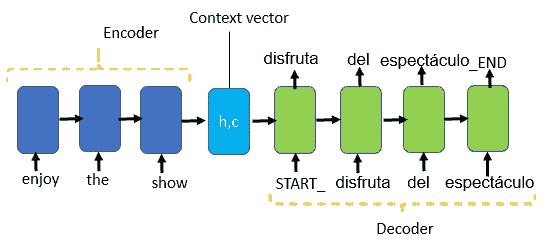

序列对序列模型

使用无注意机制的教师强制逐步实现神经机器翻译(NMT)。实现是使用 keras 库，以 LSTM 为基本块

## 实施 NMT 的高级步骤包括

*   从包含源句子和目标句子的文件中读取数据
*   通过转换为小写、删除空格、特殊字符、数字和引号来清除数据
*   分别使用 START_ 和 _END 标记目标句子的开头和结尾，用于训练和推理
*   创建唯一源词和目标词的字典，以进行向量转换，反之亦然
*   打乱数据以便更好地归纳
*   将数据集拆分为训练和测试数据
*   创建数据；我们将使用 fit_generator()将数据拟合到模型中
*   使用嵌入和 LSTM 图层构建编码器
*   使用嵌入层和 LSTM 层构建解码器，并从嵌入层和编码器状态获取输入。
*   编译模型并训练模型
*   根据模型进行预测

**导入所需的库**

```
**import pandas as pd
import numpy as np
import string
from string import digits
import matplotlib.pyplot as plt
%matplotlib inline
import re
from sklearn.utils import shuffle
from sklearn.model_selection import train_test_split
from keras.layers import Input, LSTM, Embedding, Dense
from keras.models import Model**
```

## 从文件中读取数据

**在这里** 阅读包含我们从 [**下载的英语-西班牙语翻译的文件**](http://www.manythings.org/anki/)

```
# Path to the data txt file on disk.**data_path = "\\NMT\\spa-eng\\spa.txt"**# open the file eng-spa.txt and read
**lines= pd.read_table(data_path,  names =['source', 'target', 'comments'])**#printing sample data from lines
lines.sample(6)
```

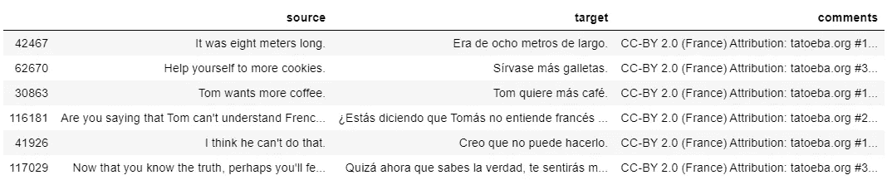

## 清理源句和目标句。

我们应用以下文本清理

*   将文本转换为小写
*   删除引号
*   删除所有特殊字符，如“@，！, *, $, #, ?、%等。”
*   清除源句子和目标句子中的数字。如果源语言或目标语言对数字使用不同的符号，那么删除这些符号
*   删除空格

```
# convert source and target text to Lowercase 
**lines.source=lines.source.apply(lambda x: x.lower())
lines.target=lines.target.apply(lambda x: x.lower())**# Remove quotes from source and target text
**lines.source=lines.source.apply(lambda x: re.sub("'", '', x))
lines.target=lines.target.apply(lambda x: re.sub("'", '', x))**# create a set of all special characters
**special_characters= set(string.punctuation)**# Remove all the special characters
**lines.source = lines.source.apply(lambda x: ''.join(char1 for char1 in x if char1 not in special_characters))
lines.target = lines.target.apply(lambda x: ''.join(char1 for char1 in x if char1 not in special_characters))**# Remove digits from source and target sentences
**num_digits= str.maketrans('','', digits)
lines.source=lines.source.apply(lambda x: x.translate(num_digits))
lines.target= lines.target.apply(lambda x: x.translate(num_digits))**# Remove extra spaces
**lines.source=lines.source.apply(lambda x: x.strip())
lines.target=lines.target.apply(lambda x: x.strip())
lines.source=lines.source.apply(lambda x: re.sub(" +", " ", x))
lines.target=lines.target.apply(lambda x: re.sub(" +", " ", x))**
```

## 给目标句子添加开始和结束标记。

向目标句子添加 START_ 和 _END 标记对于训练和推理非常有用。这些标签有助于知道何时开始翻译，何时结束翻译。

```
# Add start and end tokens to target sequences
**lines.target = lines.target.apply(lambda x : 'START_ '+ x + ' _END')**
lines.sample(6)
```

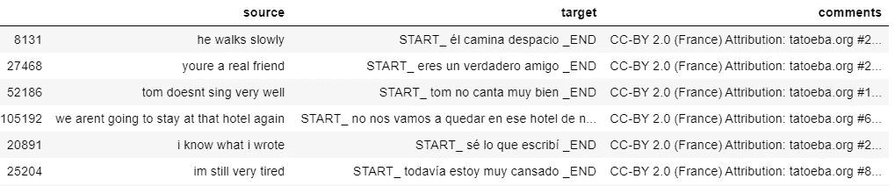

START_ tag 标记目标句子的开始，而 _END 标记标记目标句子的结束。

**从数据集中为源语言和目标语言创建一组独特的单词，并按字母顺序对它们进行排序**

```
# Find all the source and target words and sort them
# Vocabulary of Source language
**all_source_words=set()
for source in lines.source:
    for word in source.split():
        if word not in all_source_words:
            all_source_words.add(word)**# Vocabulary of Target 
**all_target_words=set()
for target in lines.target:
    for word in target.split():
        if word not in all_target_words:
            all_target_words.add(word)**
# sort all unique source and target words
**source_words= sorted(list(all_source_words))
target_words=sorted(list(all_target_words))**
```

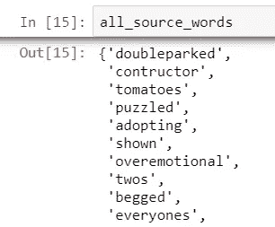

未排序的源词汇集

**找出数据集中源句子和目标句子的最大长度**

```
#Find maximum sentence length in  the source and target data
**source_length_list=[]
for l in lines.source:
    source_length_list.append(len(l.split(' ')))
max_source_length= max(source_length_list)**
**print(" Max length of the source sentence",max_source_length**)**target_length_list=[]
for l in lines.target:
    target_length_list.append(len(l.split(' ')))
max_target_length= max(target_length_list)****print(" Max length of the target sentence",max_target_length**)
```

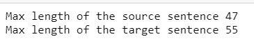

**为数据集中所有唯一的源词和目标词创建词索引词典和词索引词典。**

要向量的单词的大小将基于源和目标词汇的长度

```
# creating a word to index(word2idx) for source and target
**source_word2idx= dict([(word, i+1) for i,word in enumerate(source_words)])
target_word2idx=dict([(word, i+1) for i, word in enumerate(target_words)])**
```

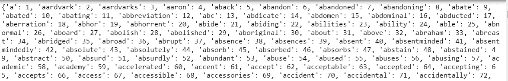

索引词典的源词

```
#creating a dictionary for index to word for source and target vocabulary
**source_idx2word= dict([(i, word) for word, i in  source_word2idx.items()])** print(source_idx2word)**target_idx2word =dict([(i, word) for word, i in target_word2idx.items()])**
```

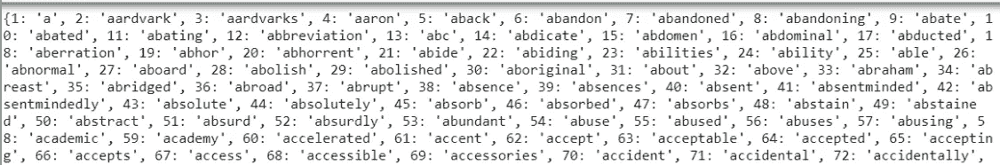

源词汇的词典索引

**混洗数据**

洗牌有助于

*   减少方差
*   确保模型保持通用，减少过度拟合
*   不同时期之间的批次看起来不一样
*   使模型更加健壮

```
#Shuffle the data
**lines = shuffle(lines)**
```

## 创建训练和测试数据集

```
# Train - Test Split
**X, y = lines.source, lines.target**
**X_train, X_test, y_train, y_test = train_test_split(X, y, test_size = 0.1)**
X_train.shape, X_test.shape
```

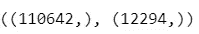

训练和测试数据集中的样本

## 创建用于训练编码器-解码器模型的数据。

我们将使用***fit _ generator()***而不是 ***fit()*** 方法，因为我们的数据太大，无法放入内存。 ***fit_generator()* 需要一个底层函数来生成数据。**

我们创建底层函数***generate _ batch()***用于批量生成数据

***fit _ generator()***将从底层函数 ***接受一批数据，generate_batch()***

为了训练序列到序列模型，我们需要为

*   **编码器输入**:2D 数组的形状为 *(batch_size，最大源语句长度)*。对于 128 的 batch_size 和 47 的最大源句子长度， ***encoder_input 的形状将是(128，47)***
*   **解码器输入**:2D 数组将为 *(batch_size，最大目标句子长度)*的形状。对于 128 的 batch_size 和 55 的最大目标句子长度， ***解码器输入的形状将是(128，55)***
*   **解码器输出**:3D 数组的形状为 **(batch_size，最大目标句子长度，目标句子中唯一单词的数量)**。对于 128 的 batch_size 和 55 的最大目标句子长度， ***解码器输出的形状将是(128，55，*** 27200 ***)。***

target_sentence 中唯一单词的数量是 27199，我们用零填充，因此解码器输出中的第三个参数是 27200

```
# Input tokens for encoder
**num_encoder_tokens=len(source_words)**# Input tokens for decoder zero padded
**num_decoder_tokens=len(target_words) +1**
```

我们现在创建 ***生成器 _ 批处理*** 函数()

```
**def generate_batch(X = X_train, y = y_train, batch_size = 128):**
    ''' Generate a batch of data '''
   ** while True:
        for j in range(0, len(X), batch_size):**
            **encoder_input_data** = np.zeros(**(batch_size, max_source_length)**,dtype='float32')
            **decoder_input_data** = np.zeros((**batch_size, max_target_length**),dtype='float32')
            **decoder_target_data** = np.zeros((**batch_size, max_target_length, num_decoder_tokens**),dtype='float32')
            **for i, (input_text, target_text) in enumerate(zip(X[j:j+batch_size], y[j:j+batch_size])):**
                **for t, word in enumerate(input_text.split()):****encoder_input_data[i, t] = source_word2idx[word]** 
                for t, word in enumerate(target_text.split()):
                    **if t<len(target_text.split())-1:
                        decoder_input_data[i, t] = target_word2idx[word]** # decoder input seq
                    if t>0:
                        # decoder target sequence (one hot encoded)
                        # does not include the START_ token
                        # Offset by one timestep
                        #print(word)
                        **decoder_target_data[i, t - 1, target_word2idx[word]] = 1.**

            **yield([encoder_input_data, decoder_input_data], decoder_target_data)**
```

我们将使用教师强制来训练序列到序列模型，以便更快更有效地训练解码器。

**教师强制**算法通过提供前一个时间戳的实际输出而不是上一个时间步的预测输出作为训练期间的输入来训练解码器。

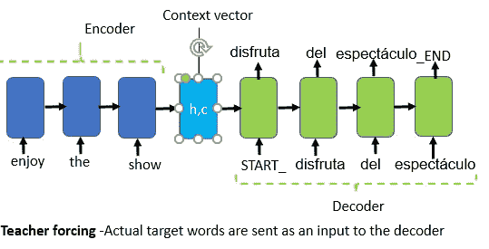

解码器学习在 t+1 时间步长生成一个字，考虑时间步长 t 的实际输出和编码器的内部状态；因此，我们将解码器输出偏移一个时间步长。

## 构建序列对序列模型

**设置基本参数**

我们设置必要的参数，如

*   训练样本数量
*   验证样本的数量
*   用于创建训练数据的 batch_size
*   训练的时代
*   编码空间的潜在维度

```
**train_samples = len(X_train)
val_samples = len(X_test)
batch_size = 128
epochs = 50
latent_dim=256**
```

## 构建模型

使用 LSTM 构建编码器和解码器。编码器将对源语言的输入句子进行编码。编码器的隐藏状态和单元状态将作为输入与实际目标序列一起传递给解码器。

## 构建编码器

编码器将对输入序列进行编码。我们通过输入层传递输入。第一个隐藏层将是嵌入层。**嵌入将大的稀疏向量转换成密集的低维空间，保持语义关系**。

将三个参数传递给**Embedding()**；**第一个参数是词汇量的大小；第二个参数是密集嵌入的维度**。我们将 **mask_zero 设置为 True** ，因为这意味着输入值 0 是一个特殊的“填充”值，应该被屏蔽掉。

**创建 LSTM 层，仅将 return_state 设置为 True** ，因为我们希望保留编码器的隐藏状态和单元状态。我们丢弃 encoder_output，并保留要传递给解码器的 LSTM 的隐藏状态和单元状态

```
# Define an input sequence and process it.
**encoder_inputs = Input(shape=(None,))**
**enc_emb =  Embedding(num_encoder_tokens, latent_dim, mask_zero = True)(encoder_inputs)**
**encoder_lstm = LSTM(latent_dim, return_state=True)****encoder_outputs, state_h, state_c = encoder_lstm(enc_emb)**# We discard `encoder_outputs` and only keep the states.
**encoder_states = [state_h, state_c]**
```

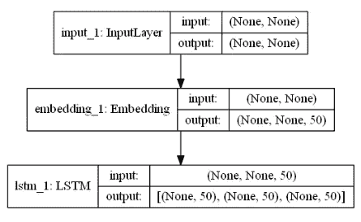

编码器

## 构建解码器

我们为 decoder_inputs 创建输入层；嵌入又是解码器中的第一个隐藏层。

**LSTM 层将返回输出序列以及内部状态**。**内部状态仅在推断阶段使用，在训练阶段不使用。**

解码器中的 LSTM 从嵌入层和编码器状态获取输入。我们将 softmax 激活应用于密集层，然后最终生成解码器输出

```
# Set up the decoder, using `encoder_states` as initial state.
**decoder_inputs = Input(shape=(None,))**
**dec_emb_layer = Embedding(num_decoder_tokens, latent_dim, mask_zero = True)
dec_emb = dec_emb_layer(decoder_inputs)**# We set up our decoder to return full output sequences,
# and to return internal states as well. We don't use the
# return states in the training model, but we will use them in inference.
**decoder_lstm = LSTM(latent_dim, return_sequences=True, return_state=True)**
**decoder_outputs, _, _ = decoder_lstm(dec_emb,
                                     initial_state=encoder_states)**
**decoder_dense = Dense(num_decoder_tokens, activation='softmax')
decoder_outputs = decoder_dense(decoder_outputs)**
```

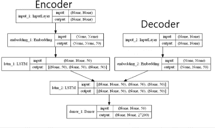

**定义模型**

序列到序列模型将编码器和解码器输入转换为解码器输出

```
# Define the model that takes encoder and decoder input 
# to output decoder_outputs
**model = Model([encoder_inputs, decoder_inputs], decoder_outputs)**
```

## 训练模型

为了训练模型，我们首先编译模型，然后将数据拟合到模型中

我们使用“rmsprop”优化器编译模型；使用 categorical _ crossentropy，就像我们使用 categorial 标签一样，这是一个热编码的向量

```
model.compile(optimizer=’rmsprop’, loss=’categorical_crossentropy’, metrics=[‘acc’])
```

设置参数以适应模型

```
train_samples = len(X_train) # Total Training samples
val_samples = len(X_test)    # Total validation or test samples
batch_size = 128
epochs = 100
```

使用***【fit _ generator()***拟合模型。我们已经创建了用于生成数据的底层函数， ***generate_batch()*** 用于生成训练和测试数据集。

**steps_per_epoch** 通过将训练样本总数除以批量大小来计算。当我们达到步数时，我们开始一个新的纪元

```
**model.fit_generator(generator = generate_batch(X_train, y_train, batch_size = batch_size),
                    steps_per_epoch = train_samples//batch_size,
                    epochs=epochs,
                    validation_data = generate_batch(X_test, y_test, batch_size = batch_size),
                    validation_steps = val_samples//batch_size)**
```

保存权重，以便以后加载它们进行推理

```
model.save_weights(‘nmt_weights_100epochs.h5’)
```

可以从保存的权重文件中加载权重

```
model.load_weights('nmt_weights_100epochs.h5')
```

## 从模型中做出推论

在推理过程中，我们希望解码未知的输入序列来预测输出。

**推理步骤**

*   将输入序列编码成 LSTM 的隐藏状态和单元状态
*   解码器将一次预测一个序列。解码器的第一个输入将是编码器的隐藏状态和单元状态以及 START_ tag
*   如下图所示，解码器的输出将作为下一时间步的输入提供给解码器

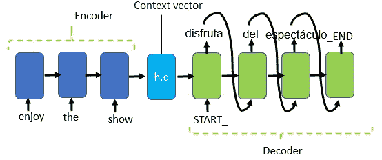

*   在每个时间步，解码器输出一个我们应用 np.argmax 的独热编码向量，并将该向量转换为存储单词索引的字典中的单词
*   不断追加在每个时间步生成的目标词
*   重复这些步骤，直到我们遇到 _END 标签或单词限制

**定义推理模型**

```
# Encode the input sequence to get the "Context vectors"
**encoder_model = Model(encoder_inputs, encoder_states)**# Decoder setup
# Below tensors will hold the states of the previous time step
**decoder_state_input_h = Input(shape=(latent_dim,))
decoder_state_input_c = Input(shape=(latent_dim,))
decoder_state_input = [decoder_state_input_h, decoder_state_input_c]**# Get the embeddings of the decoder sequence
**dec_emb2= dec_emb_layer(decoder_inputs)**# To predict the next word in the sequence, set the initial states to the states from the previous time step
**decoder_outputs2, state_h2, state_c2 = decoder_lstm(dec_emb2, initial_state=decoder_state_input)
decoder_states2 = [state_h2, state_c2]**
# A dense softmax layer to generate prob dist. over the target vocabulary
**decoder_outputs2 = decoder_dense(decoder_outputs2)**# Final decoder model
**decoder_model = Model(
    [decoder_inputs] + decoder_state_input,
    [decoder_outputs2] + decoder_states2)**
```

**创建一个用于推理查找的函数**

```
**def decode_sequence(input_seq):**
    # Encode the input as state vectors.
    **states_value = encoder_model.predict(input_seq)**
    # Generate empty target sequence of length 1.
   ** target_seq = np.zeros((1,1))**
    # Populate the first character of 
    #target sequence with the start character.
   ** target_seq[0, 0] = target_word2idx['START_']**# Sampling loop for a batch of sequences
    # (to simplify, here we assume a batch of size 1).
    **stop_condition = False
    decoded_sentence = ''
    while not stop_condition:
        output_tokens, h, c = decoder_model.predict([target_seq] + states_value)**# Sample a token
        **sampled_token_index = np.argmax(output_tokens[0, -1, :])
        sampled_word =target_idx2word[sampled_token_index]
        decoded_sentence += ' '+ sampled_word**# Exit condition: either hit max length
        # or find stop character.
        **if (sampled_word == '_END' or
           len(decoded_sentence) > 50):
            stop_condition = True**# Update the target sequence (of length 1).
        **target_seq = np.zeros((1,1))
        target_seq[0, 0] = sampled_token_index**# Update states
        **states_value = [h, c]****return decoded_sentence**
```

## 对训练数据集进行预测

```
**train_gen = generate_batch(X_train, y_train, batch_size = 1)
k=-1**
```

传递一个源句子，然后将预测输出与实际输出进行比较

```
**k+=1
(input_seq, actual_output), _ = next(train_gen)
decoded_sentence = decode_sequence(input_seq)
print(‘Input Source sentence:’, X_train[k:k+1].values[0])
print(‘Actual Target Translation:’, y_train[k:k+1].values[0][6:-4])
print(‘Predicted Target Translation:’, decoded_sentence[:-4])**
```

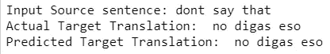

## 对测试数据集进行预测

```
**test_gen = generate_batch(X_test, y_test, batch_size = 1)**
k=10
k+=1
**(input_seq, actual_output), _ = next(test_gen)
decoded_sentence = decode_sequence(input_seq)**
**print('Input Source sentence:', X_test[k:k+1].values[0])
print('Actual Target Translation:', y_test[k:k+1].values[0][6:-4])
print('Predicted Target Translation:', decoded_sentence[:-4])**
```

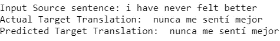

有些预测很好，有些合理，有些不正确。

**模型的其他增强功能**

我们可以替换 LSTM 的威尔·GRU，增加更多的 LSTM/GRU 节点，为更多的纪元训练并使用注意机制

## 参考:

 [## 序列到序列—培训— Keras 文档

### 这个脚本演示了如何实现一个基本的字符级序列到序列模型。我们将它应用于…

keras.io](https://keras.io/examples/lstm_seq2seq/) 

[https://blog . keras . io/a-ten-minute-introduction-to-sequence-to-sequence-learning-in-keras . html](https://blog.keras.io/a-ten-minute-introduction-to-sequence-to-sequence-learning-in-keras.html)