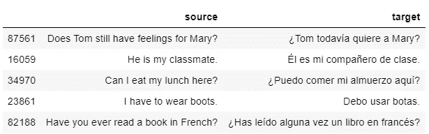
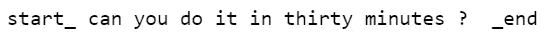
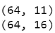
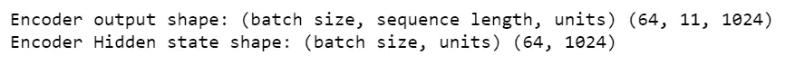
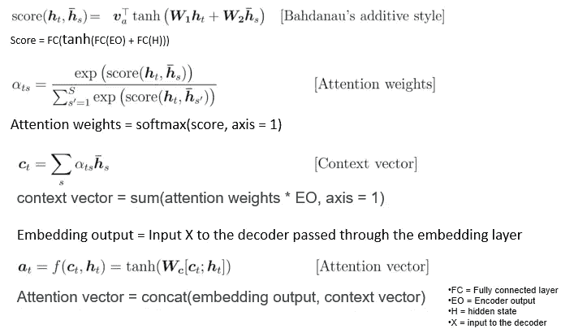
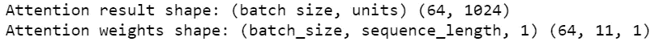
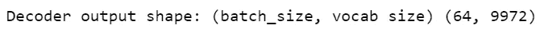
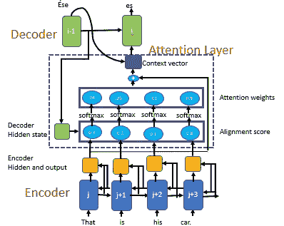
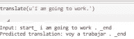
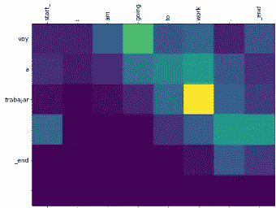

# 用 Tensorflow 实现带注意机制的神经机器翻译

> 原文：<https://towardsdatascience.com/implementing-neural-machine-translation-with-attention-using-tensorflow-fc9c6f26155f?source=collection_archive---------5----------------------->

## 使用 Bahdanau 注意力的神经机器翻译(NMT)的 Tensorflow 实现的逐步解释。

在本文中，您将学习如何使用 Bahdanau 的注意力机制实现序列到序列(seq2seq)神经机器翻译(NMT)。我们将使用门控递归单元(GRU)在 Tensorflow 2.0 中实现代码。


照片由 [Aaron Burden](https://unsplash.com/@aaronburden?utm_source=unsplash&utm_medium=referral&utm_content=creditCopyText) 在 [Unsplash](https://unsplash.com/s/photos/diiferent-language?utm_source=unsplash&utm_medium=referral&utm_content=creditCopyText)

**先决条件**

[使用注意机制的序列对序列模型](/sequence-2-sequence-model-with-attention-mechanism-9e9ca2a613a)

[神经机器翻译的直观解释](/intuitive-explanation-of-neural-machine-translation-129789e3c59f)

**神经机器翻译(NMT)是使用深度神经网络将源语言(如英语)的单词序列转换为目标语言(如印地语或西班牙语)的单词序列的任务。**

使用由编码器和解码器组成的序列到序列(seq2seq)模型来实现 NMT。**编码器将源序列的完整信息编码成单个实值向量，也称为上下文向量，传递给解码器以产生输出序列，该输出序列是类似于印地语或西班牙语的目标语言。**

上下文向量负责将整个输入序列总结成单个向量，这是低效的，所以我们使用注意机制。

**注意机制的基本思想是避免试图学习每个句子的单一向量表示；相反，它基于关注权重关注输入序列的特定输入向量。**

出于实施目的，我们将使用英语作为源语言，西班牙语作为目标语言。代码将使用 TensorFlow 2.0 实现，数据可以从[这里](http://www.manythings.org/anki/.)下载。

**实现具有注意机制的 NMT 的步骤**

*   加载数据并通过删除空格、特殊字符等对其进行预处理。
*   创建数据集
*   创建编码器、注意力层和解码器
*   创建优化器和损失函数
*   训练模型
*   做出推论

## 导入所需的库

```
import pandas as pd
import numpy as np
import string
from string import digits
import matplotlib.pyplot as plt
%matplotlib inline
import tensorflow as tf
import matplotlib.ticker as ticker
from sklearn.model_selection import train_test_split
import re
import os
import io
import time
```

## 从文件中读取数据

阅读可以从[这里](http://www.manythings.org/anki/)下载的英语-西班牙语翻译文件。

我已将文件存储在“spa.txt”中

```
**data_path = "spa.txt"**#Read the data
**lines_raw= pd.read_table(data_path,names=['source', 'target', 'comments'])
lines_raw.sample(5)**
```



## 对源语句和目标语句进行清洗和预处理。

我们应用以下文本清理

*   将文本转换为小写
*   删除引号
*   清除源句子和目标句子中的数字。如果源语言或目标语言对数字使用不同的符号，那么删除这些符号
*   删除空格
*   在单词和标点符号之间加一个空格，比如“？”
*   在句首添加“start_”标记，在句尾添加“_end”标记

```
**def preprocess_sentence(sentence):**

    num_digits= str.maketrans('','', digits)

    **sentence= sentence.lower()
    sentence= re.sub(" +", " ", sentence)
    sentence= re.sub("'", '', sentence)
    sentence= sentence.translate(num_digits)
    sentence= re.sub(r"([?.!,¿])", r" \1 ", sentence)
    sentence = sentence.rstrip().strip()
    sentence=  'start_ ' + sentence + ' _end'**

    **return sentence**
```

让我们选取英语中的一个句子并对其进行预处理

```
print(preprocess_sentence(“Can you do it in thirty minutes?”))
```



预处理源句子和目标句子，使单词对的格式为:[英语，西班牙语]

```
**def create_dataset(path, num_examples):**

  **lines = io.open(path, encoding='UTF-8').read().strip().split('\n')**

 ** word_pairs = [[preprocess_sentence(w) for w in l.split('\t')]  for l in lines[:num_examples]]**

  **return zip(*word_pairs)****sample_size=60000
source, target = create_dataset(data_path, sample_size)**
```

## 标记源句子和目标句子

我们需要对文本语料库进行矢量化，将文本转换成整数序列。

我们首先创建分词器，然后在源句子上应用分词器

```
# create a tokenizer for source sentence
**source_sentence_tokenizer= tf.keras.preprocessing.text.Tokenizer(filters='')**# Fit the source sentences to the source tokenizer
**source_sentence_tokenizer.fit_on_texts(source)**
```

我们现在将源句子中的每个单词转换成一个整数序列，用相应的整数值替换这个单词。

**只有分词器知道的单词才会被考虑**

```
#Transforms each text in texts to a sequence of integers.
**source_tensor = source_sentence_tokenizer.texts_to_sequences(source)**
```

我们需要创建长度相同的序列，所以我们用“0”来填充长度较短的序列

```
#Sequences that are shorter than num_timesteps, padded with 0 at the end.
**source_tensor= tf.keras.preprocessing.sequence.pad_sequences(source_tensor,padding='post' )**
```

以类似的方式标记目标句子

```
# create the target sentence tokenizer **target_sentence_tokenizer= # Fit tf.keras.preprocessing.text.Tokenizer(filters='')**# Fit the tokenizer on target sentences **target_sentence_tokenizer.fit_on_texts(target)**#conver target text to sequnec of integers **target_tensor = target_sentence_tokenizer.texts_to_sequences(target)**# Post pad the shorter sequences with 0 **target_tensor= tf.keras.preprocessing.sequence.pad_sequences(target_tensor,padding='post' )**
```

## 创建训练和测试数据集

将数据集拆分为测试和训练。80%的数据用于训练，20%用于测试模型

```
**source_train_tensor, source_test_tensor, target_train_tensor, target_test_tensor= train_test_split(source_tensor, target_tensor,test_size=0.2)**
```

当数据集很大时，我们希望在内存中创建数据集以提高效率。我们将使用***TF . data . dataset . from _ tensor _ slices()***方法以对象的形式获取数组的切片。

数据集以 64 个为一批创建。

```
#setting the BATCH SIZE
**BATCH_SIZE = 64**#Create data in memeory **dataset=tf.data.Dataset.from_tensor_slices((source_train_tensor, target_train_tensor)).shuffle(BATCH_SIZE)**# shuffles the data in the batch
**dataset = dataset.batch(BATCH_SIZE, drop_remainder=True)**
```

我们遍历数据集中的所有元素。返回的迭代器实现了 Python 迭代器协议，因此**只能在急切模式下使用**

```
#Creates an Iterator for enumerating the elements of this dataset.
#Extract the next element from the dataset
**source_batch, target_batch =next(iter(dataset))
print(source_batch.shape)**
```



每批源数据的大小为 ***(BATCH_SIZE，max_source_length)，*** ，目标数据的批量为 ***(BATCH_SIZE，max_target_length)。*** 在我们的例子中，最大源长度是 11，最大目标长度是 16

# 在 Bahdanau 的关注下，使用门控循环单元(GRU)创建序列对序列模型

有注意的 seq2seq 模型和无注意的 seq2seq 模型的区别

*   编码器和解码器的所有隐藏状态(向前和向后)用于生成上下文向量，不像 eq2seq 没有注意，它使用最后的编码器隐藏状态。
*   注意机制利用由前馈网络参数化的比对分数来比对输入和输出序列。它有助于注意源序列中最相关的信息。
*   Seq2Seq 注意模型基于与源位置相关联的上下文向量来预测目标单词，并且与 seq2seq 不同，先前生成的目标单词在没有注意的情况下将所有源序列编码到单个上下文向量中

**为模型设置一些参数**

```
**BUFFER_SIZE = len(source_train_tensor)
steps_per_epoch= len(source_train_tensor)//BATCH_SIZE
embedding_dim=256
units=1024
source_vocab_size= len(source_sentence_tokenizer.word_index)+1
target_vocab_size= len(target_sentence_tokenizer.word_index)+1**
```

## 创建编码器

编码器将输入作为源令牌，将它们传递给嵌入层以获得矢量的密集表示，然后传递给 GRU。

**为 GRU** 设置返回序列和返回状态为真。默认情况下，return _ sequneces 设置为 False。**当 return_sequences 设置为真时，则返回编码器**中所有单元的整个输出序列。当 return_sequences 设置为 False 时，我们只返回最后一个编码器单元的隐藏状态。

**seq2seq 在没有注意的情况下会将编码器的 return_sequences 设置为 False。Seq2seq 将把编码器的 return_sequences 设置为 True。**

为了**返回 GRU 的内部状态，我们将 retrun_state 设置为 True**

```
**class Encoder(tf.keras.Model):
    def __init__(self, vocab_size, embedding_dim, encoder_units, batch_size):
        super(Encoder, self).__init__()
        self.batch_size= batch_size
        self.encoder_units=encoder_units
        self.embedding=tf.keras.layers.Embedding(vocab_size, embedding_dim)
        self.gru= tf.keras.layers.GRU(encoder_units, 
                                      return_sequences=True,
                                      return_state=True,                                      recurrent_initializer='glorot_uniform'
                                     )**

    **def call(self, x, hidden):**
        #pass the input x to the embedding layer
       ** x= self.embedding(x)**
        # pass the embedding and the hidden state to GRU
        **output, state = self.gru(x, initial_state=hidden)
        return output, state**

    **def initialize_hidden_state(self):
        return tf.zeros((self.batch_size, self.encoder_units))**
```

测试编码器类并打印编码器输出和隐藏状态的尺寸

```
**encoder = Encoder(source_vocab_size, embedding_dim, units, BATCH_SIZE)****sample_hidden = encoder.initialize_hidden_state()****sample_output, sample_hidden= encoder(source_batch, sample_hidden)**print ('Encoder output shape: (batch size, sequence length, units) {}'.format(sample_output.shape))
print ('Encoder Hidden state shape: (batch size, units) {}'.format(sample_hidden.shape))
```



## 创建 Bahdanau 注意力图层

注意力层包括

*   比对分数
*   注意力权重
*   上下文向量

我们将在注意力层实现这些简化的等式



巴赫达瑙注意方程式

```
**class BahdanauAttention(tf.keras.layers.Layer):
    def __init__(self, units):
        super( BahdanauAttention, self).__init__()
        self.W1= tf.keras.layers.Dense(units)  # encoder output
        self.W2= tf.keras.layers.Dense(units)  # Decoder hidden
        self.V= tf.keras.layers.Dense(1)**

    **def call(self, query, values):**
        #calculate the Attention score

        **score= self.V(tf.nn.tanh(self.W1(values) + self.W2(hidden_with_time_axis)))**

        # attention_weights shape == (batch_size, max_length, 1)
       ** attention_weights= tf.nn.softmax(score, axis=1)**

         #context_vector 
        **context_vector= attention_weights * values**

        #Computes the sum of elements across dimensions of a tensor
       ** context_vector = tf.reduce_sum(context_vector, axis=1)
        return context_vector, attention_weights**
```

用十个单位测试 Bahdanau 注意层

```
a**ttention_layer= BahdanauAttention(10)**
**attention_result, attention_weights = attention_layer(sample_hidden, sample_output)**print("Attention result shape: (batch size, units) {}".format(attention_result.shape))
print("Attention weights shape: (batch_size, sequence_length, 1) {}".format(attention_weights.shape))
```



## 创建解码器

解码器具有嵌入层、GRU 层和全连接层。

来预测解码器使用的目标字

*   上下文向量:注意力权重和编码器输出的总和
*   前一时间步的解码器输出和
*   前一个解码器的隐藏状态

```
**class Decoder(tf.keras.Model):
    def __init__(self, vocab_size, embedding_dim, decoder_units, batch_sz):
        super (Decoder,self).__init__()
        self.batch_sz= batch_sz
        self.decoder_units = decoder_units
        self.embedding = tf.keras.layers.Embedding(vocab_size, 
                                                   embedding_dim)
        self.gru= tf.keras.layers.GRU(decoder_units, 
                                      return_sequences= True,
                                      return_state=True,
                          recurrent_initializer='glorot_uniform')**
        # Fully connected layer
        **self.fc= tf.keras.layers.Dense(vocab_size)**

        # attention
        **self.attention = BahdanauAttention(self.decoder_units)**

   ** def call(self, x, hidden, encoder_output):**

        **context_vector, attention_weights = self.attention(hidden,      
                                                    encoder_output)**

        # pass output sequnece thru the input layers
        **x= self.embedding(x)**

        # concatenate context vector and embedding for output sequence
        **x= tf.concat([tf.expand_dims( context_vector, 1), x], 
                                      axis=-1)**

        # passing the concatenated vector to the GRU
       ** output, state = self.gru(x)**

        # output shape == (batch_size * 1, hidden_size)
       ** output= tf.reshape(output, (-1, output.shape[2]))**

        # pass the output thru Fc layers
               **x= self.fc(output)
        return x, state, attention_weights**
```

测试解码器

```
**decoder= Decoder(target_vocab_size, embedding_dim, units, BATCH_SIZE)
sample_decoder_output, _, _= decoder(tf.random.uniform((BATCH_SIZE,1)), sample_hidden, sample_output)**
print ('Decoder output shape: (batch_size, vocab size) {}'.format(sample_decoder_output.shape))
```



## 定义优化器

我们在这里使用 Adam 优化器；你也可以试试 Rmsprop

```
#Define the optimizer and the loss function
optimizer = tf.keras.optimizers.Adam()
```

## 定义损失函数

使用**SparseCategoricalCrossentropy**计算实际和预测输出之间的损失。

如果输出是一次性编码的向量，那么使用 categorical _ crossentropy。对包含整数的 word2index 向量使用**SparseCategoricalCrossentropy**loss。

**稀疏分类交叉熵在计算和内存上是高效的，因为它使用单个整数，而不是整个向量[0 0 1]**

```
**loss_object = tf.keras.losses.SparseCategoricalCrossentropy(
    from_logits=True, reduction='none')****def loss_function(real, pred):
  mask = tf.math.logical_not(tf.math.equal(real, 0))
  loss_ = loss_object(real, pred)****mask = tf.cast(mask, dtype=loss_.dtype)
  loss_ *= mask****return tf.reduce_mean(loss_)**
```

## 训练数据集

使用编码器-解码器模型训练数据集

1.  将编码后的源句子通过编码器，并返回编码器输出序列和隐藏状态
2.  编码器输出、编码器隐藏状态和解码器输入被传递给解码器。在时间步长=0 时，解码器将“start_”作为输入。
3.  解码器返回预测字和解码器隐藏状态
4.  解码器隐藏状态被传递回模型，并且预测的字被用于计算损失
5.  为了训练，我们使用教师强制，在每个时间步将实际单词传递给解码器。
6.  **在推断过程中，我们将前一时间步的预测单词作为输入传递给解码器**
7.  计算梯度下降，将其应用于优化器并反向传播



注意机制

Tensorflow 跟踪每个 tf.Variable 上每个计算的每个梯度。**为了训练，我们使用梯度带**，因为我们需要控制需要梯度信息的代码区域。对于具有注意机制的 seq2seq，我们仅计算解码器输出的梯度。

```
**def train_step(inp, targ, enc_hidden):
    loss = 0
    with tf.GradientTape() as tape:**
        #create encoder
       ** enc_output, enc_hidden = encoder(inp, enc_hidden)
        dec_hidden = enc_hidden**
        #first input to decode is start_
        **dec_input = tf.expand_dims(
            [target_sentence_tokenizer.word_index['start_']] * BATCH_SIZE, 1)**
        # Teacher forcing - feeding the target as the next input
        **for t in range(1, targ.shape[1]):**
          # passing enc_output to the decoder
          **predictions, dec_hidden, _ = decoder(dec_input, dec_hidden, enc_output)**
          # calculate loss based on predictions  
          **loss += tf.keras.losses.sparse_categorical_crossentropy(targ[:, t], predictions)**
          # using teacher forcing
          **dec_input = tf.expand_dims(targ[:, t], 1)
    batch_loss = (loss / int(targ.shape[1]))
    variables = encoder.trainable_variables + decoder.trainable_variables
    gradients = tape.gradient(loss, variables)
    optimizer.apply_gradients(zip(gradients, variables))
    return batch_loss**
```

使用多个历元集中训练编码器-解码器模型

```
**EPOCHS=20
for epoch in range(EPOCHS):
  start = time.time()****enc_hidden = encoder.initialize_hidden_state()
  total_loss = 0**
  # train the model using data in bataches 
  f**or (batch, (inp, targ)) in enumerate(dataset.take(steps_per_epoch)):
    batch_loss = train_step(inp, targ, enc_hidden)
    total_loss += batch_loss****if batch % 100 == 0:
      print('Epoch {} Batch {} Loss {}'.format(epoch + 1,
                                                   batch,                                                   
                                         batch_loss.numpy()))
  print('Epoch {} Loss {}'.format(epoch + 1,
                                      total_loss / steps_per_epoch))
  print('Time taken for 1 epoch {} sec\n'.format(time.time() - start))**
```

## 对测试数据进行推断

**进行推理类似于训练，只是我们不知道教师强制中使用的实际单词，所以我们将来自前一时间步的预测单词作为输入传递给解码器。**

我们计算每个时间步的注意力权重，因为它有助于关注用于进行预测的源序列中最相关的信息。

**当我们达到最大目标句子长度时，或者当我们遇到“stop_”标签时，我们停止预测单词。**

```
#Calculating the max length of the source and target sentences
**max_target_length= max(len(t) for t in  target_tensor)
max_source_length= max(len(t) for t in source_tensor)**
```

做出这样的推断

*   传源句，
*   预处理句子以转换成小写，删除空格，特殊字符，在单词和标点符号之间加一个空格，等等。
*   对句子进行标记以创建 word2index 词典
*   Post 用 0 填充源序列，使其长度与最大源句子的长度相同
*   创建输入张量
*   创建编码器并传递输入向量和隐藏状态。初始隐藏状态被设置为零
*   解码器的第一个输入将是“start_”标签。解码器的初始隐藏状态是编码器隐藏状态
*   创建解码器，向其传递解码器输入、解码器隐藏状态和编码器输出
*   存储注意力权重，并使用解码器输入、隐藏和上下文向量，找到具有最大概率的单词的整数。
*   将整数转换为单词，并不断追加预测的单词以形成目标句子，直到我们遇到“end_”标签或达到最大目标序列长度

```
**def evaluate(sentence):**
    **attention_plot= np.zeros((max_target_length, max_source_length))**
    #preprocess the sentnece
    **sentence = preprocess_sentence(sentence)**

    #convert the sentence to index based on word2index dictionary
    **inputs= [source_sentence_tokenizer.word_index[i] for i in sentence.split(' ')]**

    # pad the sequence 
    **inputs = tf.keras.preprocessing.sequence.pad_sequences([inputs], maxlen=max_source_length, padding='post')**

    #conver to tensors
    **inputs = tf.convert_to_tensor(inputs)**

    **result= ''**

    # creating encoder
    **hidden = [tf.zeros((1, units))]**
    **encoder_output, encoder_hidden= encoder(inputs, hidden)**

    # creating decoder
    **decoder_hidden = encoder_hidden**
    **decoder_input = tf.expand_dims([target_sentence_tokenizer.word_index['start_']], 0)**

    **for t in range(max_target_length):**
        **predictions, decoder_hidden, attention_weights= decoder(decoder_input, decoder_hidden, encoder_output)**

        # storing attention weight for plotting it
       ** attention_weights = tf.reshape(attention_weights, (-1,))
        attention_plot[t] = attention_weights.numpy()

        prediction_id= tf.argmax(predictions[0]).numpy()**
        **result += target_sentence_tokenizer.index_word[prediction_id] + ' '

        if target_sentence_tokenizer.index_word[prediction_id] == '_end':
            return result,sentence, attention_plot**

        # predicted id is fed back to as input to the decoder
       ** decoder_input = tf.expand_dims([prediction_id], 0)**

    **return result,sentence, attention_plot**
```

函数来绘制源单词和目标单词之间的注意力权重。该图将帮助我们理解哪个源词在预测目标词时被给予了更多的关注

```
**def plot_attention(attention, sentence, predicted_sentence):
    fig = plt.figure(figsize=(10,10))
    ax= fig.add_subplot(1,1,1)
    ax.matshow(attention, cmap='Greens')
    fontdict={'fontsize':10}

    ax.set_xticklabels([''] + sentence, fontdict=fontdict, rotation=90)
    ax.set_yticklabels([''] + predicted_sentence, fontdict=fontdict)****ax.xaxis.set_major_locator(ticker.MultipleLocator(1))
    ax.yaxis.set_major_locator(ticker.MultipleLocator(1))****plt.show()**
```

## 将源句翻译成目标句

为了将源句子翻译成目标语言，我们调用 ***evaluate*** 函数来创建编码器、解码器和关注层

```
**def translate(sentence):
    result, sentence, attention_plot = evaluate(sentence)

    print('Input : %s' % (sentence))
    print('predicted sentence :{}'.format(result))

    attention_plot= attention_plot[:len(result.split(' ')), :len(sentence.split(' '))]
    plot_attention(attention_plot, sentence.split(' '), result.split(' '))**
```

最后的预测

```
**translate(u'I am going to work.')**
```



翻译句子的注意情节



注意力图

在翻译过程中，我们发现“去”比“去”更能预测“去”，同样，“工作”比“工作”更能预测“去”

可从 [Github](https://github.com/arshren/NMT-with-Attention/blob/master/NMT%20with%20Attention%20trained%20with%2020%20epochs.ipynb) 获得的代码

## 参考

巴丹瑙注意了-【https://arxiv.org/pdf/1409.0473.pdf 

[https://www . tensor flow . org/tutorials/text/NMT _ with _ attention](https://www.tensorflow.org/tutorials/text/nmt_with_attention)

[https://www.tensorflow.org/guide/keras/rnn](https://www.tensorflow.org/guide/keras/rnn)