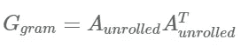
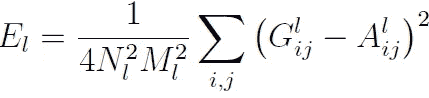

# 使用 PyTorch 的神经类型转移

> 原文：<https://towardsdatascience.com/implementing-neural-style-transfer-using-pytorch-fd8d43fb7bfa?source=collection_archive---------14----------------------->

# **简介**

神经风格转移是基于深层神经网络生成艺术图像的人工系统。这种方法使用两个随机图像，内容和样式图像。它从内容图像中提取结构特征，而从风格图像中提取风格特征。

神经风格转移(作者 GIF)

# **内容和风格表现**

## 内容表示

卷积神经网络沿着处理层次开发图像的表示。随着我们向网络的更深处移动，表示将更关心结构特征或实际内容，而不是详细的像素数据。为了获得这些表示，我们可以使用该层的特征图来重建图像。从较低层的重建将再现精确的图像。相反，较高层的重建将捕获高级内容，因此我们将来自较高层的特征响应称为**内容表示。**

ConvNet 不同层次的内容重构(图片来自[艺术风格的神经算法(2015)](https://arxiv.org/abs/1508.06576) )

上图显示了从层“conv1_1”、“conv2_1”、“conv3_1”、“conv4_1”和“conv5_1”重建输入图像。我们发现，从较低层重建的图像几乎与输入图像相同，但随着我们深入网络，详细的像素信息会丢失。相比之下，图像的高级内容被保留。

## 风格表现

为了提取样式内容的表示，我们在每个网络层的过滤器响应的顶部构建了一个特征空间。它包括在特征图的空间范围内不同滤波器响应之间的相关性。不同层的滤波器相关性捕获输入图像的纹理信息。这在丢弃全局排列的信息的同时，创建了与给定图像的风格越来越匹配的图像。这种多尺度表示被称为**风格表示。**

ConvNet 不同层次的风格重构(图片来自[艺术风格的神经算法(2015)](https://arxiv.org/abs/1508.06576) )

上图显示了代表 CNN 不同层中不同特征之间相关性的每个卷积层上方的特征空间。随着我们深入到网络中，我们可以看到全局排列或结构特征被丢弃了。

# **模型架构**

论文《艺术风格的神经算法》中提出的模型的体系结构是

模型架构(图片来自[艺术风格的神经算法(2015)](https://arxiv.org/abs/1508.06576) )

这里，我们使用预训练的 VGG19 网络的卷积神经网络，并执行内容和风格重建。通过将来自内容表示的结构信息和来自风格表示的纹理/风格信息纠缠在一起，我们生成了艺术图像。我们可以强调重建风格或内容。对风格的强烈强调将导致图像与艺术品的外观相匹配，有效地给出了它的纹理版本，但几乎没有显示照片的任何内容。当把重点放在内容上时，人们可以识别照片，但绘画风格并不匹配。我们对生成的图像执行梯度下降，以找到与原始图像的特征响应相匹配的另一个图像。

# **实施**

## **导入库**

我们将从导入所需的库开始。我们将进口火炬，火炬视觉和 PIL，以实现使用 PyTorch 的风格转移。

## **加载模型**

在这种情况下，我们将从 *torchvision.models()加载预训练的 [VGG19](https://arxiv.org/pdf/1409.1556.pdf) 模型。*vgg 19 模型有三个组件特性，avgpool 和分类器。

*   该功能包含所有卷积层、最大池层和 ReLu 层
*   avgpool 保存平均池层。
*   分类器保存密集层。

我们将只使用卷积神经网络来实现风格转换，因此导入 vgg19 特性。如果可能的话，不要忘记使用 GPU。这会节省训练时间。

## **图像预处理**

为了使图像与模型兼容，必须对图像进行预处理。使用 *torch.transforms()* 我们将执行一些基本的预处理，包括以下步骤:

*   调整大小:将所有图像的大小调整为 512 x 512
*   将图像转换成张量

对于预训练的 vgg19 模型，还可以使用平均值(0.485，0.456，0.406)和标准差(0.229，0.224，0.225)对张量进行归一化。但是别忘了把它转换回原来的比例。因此，定义一个使用 PIL 库加载图像并对其进行预处理的函数。在第 0 个索引处添加一个额外的维度，使用 *unsqueeze()* 表示批量大小，然后将其加载到设备并返回。

现在，使用 image_loader 函数从本地磁盘加载样式和内容图像。通常的做法是使用内容映像克隆作为输入基础映像或生成的映像。由于梯度下降会改变生成图像的像素值，我们将为 *require_grads()传递参数 true。*

## **获取特征表示**

让我们定义一个类，它将提供中间层的特征表示。使用中间层是因为这些层充当复杂的特征提取器。因此，这些可以描述输入图像的风格和内容。在本课程中，我们将通过删除 vgg19 模型中未使用的层(conv5_1 以外的层)来初始化模型，并提取“conv1_1”、“conv2_1”、“conv3_1”、“conv4_1”和“conv5_1”层的激活或特征表示(索引值[0，5，10，19，28])。将 5 个卷积层的激活存储在一个数组中，并返回该数组。

## **定义损失**

风格转移的净损失定义为:

全损(图片来自[一种艺术风格的神经算法(2015)](https://arxiv.org/abs/1508.06576) )

在上面的等式中，L *ₜₒₜₐₗ* 是总损失，l𝒸ₒₙₜₑₙₜ**是所有中间层的内容损失，lₛₜᵧ*ₗ*ₑ**t13】是所有中间层的风格损失。这里，α和β分别是内容和风格损失的加权系数。p、a 和 x 是内容图像、风格图像和生成图像或基本输入图像。我们对损失函数执行梯度下降，并且代替模型参数，我们更新输入图像 x 的像素值以最小化损失。这将使输入图像与内容和样式图像相似。我们可以通过改变α和β的值来强调风格或内容的损失。对风格的强烈强调将导致图像与艺术品的外观相匹配，有效地给出了它的纹理版本，但几乎没有显示照片的任何内容。当把重点放在内容上时，人们可以识别照片，但绘画风格并不匹配。****

## **内容丢失**

内容图像和输入基本图像被传递到我们的模型，中间层的输出(上面列为“conv1_1”、“conv2_1”、“conv3_1”、“conv4_1”和“conv5_1”)使用上面定义的类提取。然后，我们计算内容图像的中间表示和输入基础图像之间的欧几里德距离。因此，层 l 的内容损失由下式定义:

内容丢失(图片来自[艺术风格的神经算法(2015)](https://arxiv.org/abs/1508.06576) )

在上面的等式中，我们计算内容图像(p)的特征表示和层(l)的输入基础图像(x)之间的平方误差。这里，nˡₕ、nˡ𝓌、nˡ𝒸是层 l 的高度、宽度和通道。为了计算内容损失，维度 nˡₕ x nˡ𝓌 x nˡ𝒸的中间表示被展开成维度 nˡ𝒸 x nˡₕ ***** n 的向量。展开要素制图表达不是强制步骤，但这是一个很好的做法。下图将有助于我们将这种转变形象化。

向 2D 展开 3D 特征地图(图片由作者提供)

Fˡᵢⱼ 和 Pˡᵢⱼ是代表输入基础图像和内容图像的中间表示的 nˡ𝒸×nˡₕ*****nˡ𝓌维度向量。

## **风格丧失**

我们在网络的每一层上构建一个特征空间，表示不同滤波器响应之间的相关性。Gram matrix 计算这些特征相关性**。**

gram 矩阵表示中间表示中每个过滤器之间的相关性。通过取展开的中间表示及其转置的点积来计算格拉姆矩阵。格拉姆矩阵 g 的维数是 nˡ𝒸×nˡ𝒸，其中 nˡ𝒸是层 l 的中间表示中的通道数

Gram Matrix(图片来自[一种艺术风格的神经算法(2015)](https://arxiv.org/abs/1508.06576) )

上式中，Gˡᵢⱼ 是 l 层的矢量化特征图 I 和 j 的内积，一个 gram 矩阵的矢量化方程如下图所示，其中 g 是中间表示 a 的 gram 矩阵

Gram 矩阵计算(图片由作者提供)

Gram 矩阵矢量化方程(图片来自[一种艺术风格的神经算法(2015)](https://arxiv.org/abs/1508.06576) )

层 l 的风格损失是风格图像的中间表示和输入基础图像的 gram 矩阵之间的平方误差。

l 层的风格损失(图片来自[艺术风格的神经算法(2015)](https://arxiv.org/abs/1508.06576) )

其中 Eₗ 是层 l 的风格损失，Nₗ和 Mₗ分别是层 l 的特征表示中的通道数和高度乘以宽度。Gˡᵢⱼ和 Aˡᵢⱼ 分别是风格图像(a)和输入基础图像(x)的中间表示的克矩阵。

总风格损失为:

总体风格损失(图片来自[艺术风格的神经算法(2015)](https://arxiv.org/abs/1508.06576) )

其中 wˡ是每层对总风格损失的贡献的权重因子。

这里，我们没有将样式损失乘以常数，因为它使损失非常小。合计所有中间层的内容和样式损失，并计算总损失。

现在让我们继续训练模型。

## **训练**

初始化我们训练模型所需的变量。因此，在继续训练之前，我们需要设置超参数。

在这里，为类 *VGG 创建一个对象。*初始化对象将调用构造函数，它将返回前 29 层的模型并将其加载到设备。Epoch 为 1000，学习率为 0.01，alpha(内容损失加权系数)为 1，beta(风格损失加权系数)为 0.01。

Adam 被用作优化器。生成的图像的像素数据将被优化，以将生成的图像作为优化器参数传递。

使用 for 循环迭代历元数。使用模型提取内容、风格和生成的图像的中间层的特征表示。在向模型传递图像时，它将返回一个长度为 5 的数组。每个元素对应于每个中间层的特征表示。

使用上面定义的函数计算总损耗。用 *optimizer.zero_grads()，*将渐变设置为零，用 *total_loss.backward()* 反向传播总损失，然后用 *optimizer.step()更新生成图像的像素值。*我们将在每 100 个历元后保存生成的图像，并打印总损失。

经过训练，你可以在你当前的工作目录中找到艺术形象。你的图像会像这样。

内容图片(左:图片来自[维基百科](https://simple.wikipedia.org/wiki/Nikola_Tesla) ) +风格图片(中:图片来自[USGS](https://unsplash.com/@usgs)on U[NSP lash](https://unsplash.com/?utm_source=medium&utm_medium=referral))=生成的图片(右:图片来自作者)

请随意使用超参数。有时你可能会得到预期的结果，但有时你可能会努力实现预期的结果。玩得开心！！！

# 结论

在本教程中，您已经学习了神经类型转移的基础知识，并建立了一些直觉。您已经加载了一个预训练的 vgg19 模型，冻结了它的重量并定制了模型层。加载图像并执行一些基本的预处理。然后定义了内容损失和风格损失，两者结合起来计算总损失。最后你跑了模型，做了一个艺术形象，是内容和风格形象的交融。

你可以在这里找到完整的代码。

# 参考

1.  莱昂·A·加蒂丝，亚历山大·s·埃克，马蒂亚斯·贝奇，[一种艺术风格的神经算法](https://arxiv.org/pdf/1508.06576.pdf) (2015)，arXiv