# 在 TensorFlow 中实现点柱

> 原文：<https://towardsdatascience.com/implementing-point-pillars-in-tensorflow-c38d10e9286?source=collection_archive---------13----------------------->

## 点柱是一个非常著名的三维物体检测算法，由于其快速的推理速度，在激光雷达上生成点云。在本文中，我们将在 TensorFlow 中浏览它的实现代码。

如果你想开始 3D 物体检测，更具体地说是点柱，我有一系列的帖子专门为此写的。下面是[环节](https://medium.com/@a_tyagi/3d-point-clouds-bounding-box-detection-and-tracking-pointnet-pointnet-lasernet-point-pillars-9439af14dfba)。此外，直接阅读[的要点文章](https://arxiv.org/pdf/1812.05784.pdf)会对更好地理解这篇文章很有帮助，然而，这不是先决条件。

> 本教程 github Repo:【https://github.com/tyagi-iiitv/PointPillars】T4。感谢弗朗西斯科·费乐理提供的初始代码。

# 内容

*   定义初始配置
*   建筑点柱网络
*   损失函数
*   Kitti 数据集的数据读取器
*   培养
*   推理

# 定义初始配置(config.py)

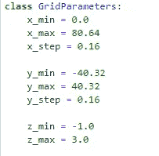

在 config.py 文件中定义配置

我们定义初始配置，包括 x，y，z 维度的限制。这些限制定义了我们将要预测边界框的感兴趣区域。由于激光雷达的范围通常很大，我们将重点放在这个空间中由这些限制定义的较小区域。其他配置包括支柱的最大数量、每个支柱的最大点数等。

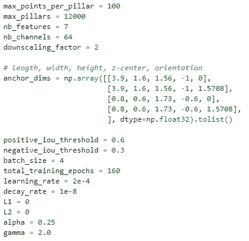

关于点柱网络的配置。

这些配置通常用于将点云从 3D 坐标转换为点柱检测管道中的点柱坐标，如下一节所述。现在，只要记住所有的配置都是在这个文件中定义的。

# 构建点柱网络(network.py)

点柱的整体架构包含三个组件:一个柱特征网、一个主干 2D CNN 和一个探测头。我们将分别讨论这三个组件。

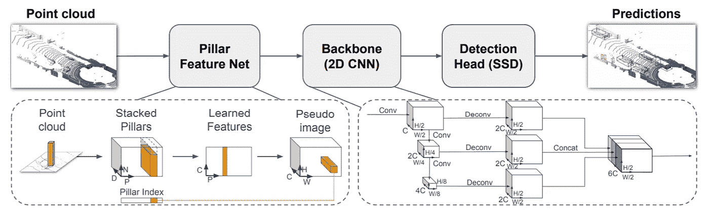

点柱式建筑。它由三部分组成:一个支柱特征网，一个骨干 2D CNN 和一个探测头。([来源](https://arxiv.org/pdf/1812.05784.pdf))

## 支柱特征网

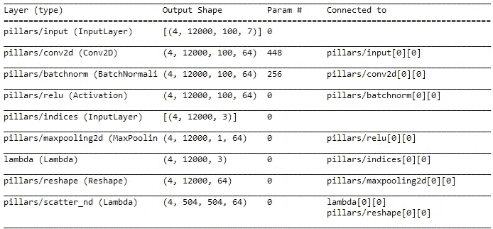

支柱特征网络架构。

*   柱子/输入(输入层)(4，12000，100，7)指——**批量大小(4)，最大柱子数(12000)，每个柱子最大点数(100)，7 dim 向量:[x，y，z，intensity，Xc，Yc，Zc]。** X、y、z 是点云中某个点的 3D 坐标，激光雷达设备测得的该点的强度存储在“强度”中，Xc、Yc、Zc 存储该点在每个维度上与柱子中心的距离。
*   这个输入现在从 7 维转换到 64 维向量，使用 CNN 提取特征。
*   柱子/索引(InputLayer) (4，12000，3)指的是— **批量大小，最大柱子数，以及每个柱子的中心，即 x，y 和 z 坐标。**该层包含每个支柱的中心，用于将每个支柱的学习特征映射回*支柱/散射 _ nd(λ)*层中的 x-y 网格。
*   pillars/scatter _ nd(Lambda)-使用上述图层中的 X，y 坐标，将点云空间划分为(504 X 504) x-y 格网，每个格网单元包含相应支柱的 64 个要素。

## 骨干 2D 有线电视新闻网

这是一个非常简单的图层，输入是编码在 x-y 格网中的支柱要素，如前一节所述。该网格被视为一幅图像，并被转换成不同的尺度，在这些尺度上提取特征并最终连接起来。我们试图从不同尺度的点云中捕捉特征，并将它们连接成一个单一的张量。

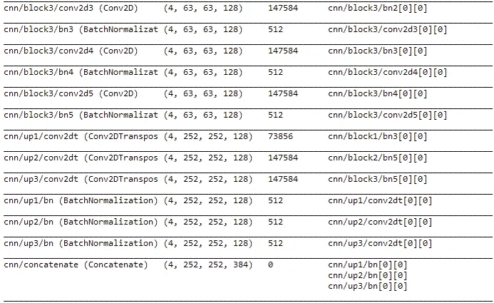

骨干 2D CNN。具有编码的柱子特征的 x-y 网格被变换成不同的尺度，其特征被提取和连接。

## 探测头

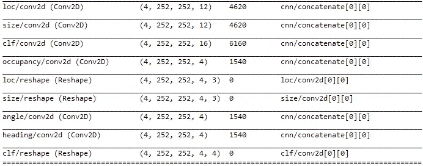

探测头网络结构。

在这一部分中，我们预测锚盒的回归目标，如下所述。所有这些预测都是针对 x-y 坐标(252 X 252)中的每个网格单元的。在这种情况下，边界框不是直接预测的，而是调整初始锚框的大小以生成预测的边界框。初始定位框在 config.py 文件中提供。

*   占用-预测标注是否包含元素。1 —是或否。因此，我们只需要在占用率为 1 时检查其他预测(位置、大小、角度、航向和 clf)。
*   Loc 包含相应锚定框的 x，y，z 增量。
*   大小—包含相应锚定框的长度、宽度和高度的增量。
*   角度-包含偏航差值。
*   航向—如果角度> 90 度，则包含此选项，以检查对象的航向角度。
*   Clf 包含每个预测的分类 id 和置信度得分。

注意，检测头预测每个网格单元 4 个边界框，并且每个边界框具有上面列出的属性。

## 损失函数(loss.py)

一旦我们决定了网络体系结构，我们就创建损失函数来完成训练过程定义。正如您在 loss.py 文件中看到的，我们正在计算每个回归目标的损失值，并将它们与分配给每个误差的权重相加。因此，最终损失值将是每个损失值的加权和。

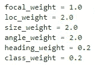

分配给每个损失值的权重。(Config.py 文件)

```
focal_weight*focal_loss + loc_weight*loc_loss + size_weight*size_loss + angle_weight*angle_loss + 
...
```

## Kitti 数据集的数据读取器(readers.py)

我们设计了一个类来读取 Kitti 数据集中的文件，并从标签(txt)文件中提取 3D 边界框尺寸。标签文件中的每一行都包含以下信息:

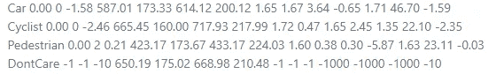

Kitti 数据集中的标签文件

1.  物体的类型(汽车、卡车等。)
2.  截断浮点数，0 表示截断，1 表示未截断
3.  遮挡状态，0 =完全可见，1 =部分遮挡，2 =大部分遮挡，3 =未知
4.  阿尔法观察角
5.  4 2D 边界框参数(中心、长度、宽度)
6.  3D 对象尺寸(高度、宽度、长度)
7.  相机坐标中的 3D 对象位置(x，y，z)
8.  偏航角

## 培训(point_pillars_training_run.py，processors.py，src/point_pillars.cpp)

在为 Kitti 数据集中的每个数据点定义损失函数、配置和数据生成器之后， *processor.py* 文件中的 *SimpleDataGenerator* 生成训练示例。这一过程的主要步骤是:

*   生成立柱和立柱 id(*data processor . make _ point _ Pillars*在 *processor.py* 文件中)
*   从标签文件和 config.py 文件中给定的锚定框生成回归目标(如上所述)。(*data processor . make _ ground _ truth*inside processor . py 文件)

这两个任务的助手函数在 src/ *point_pillars.cpp* 文件中提供，该文件包含在使用 Pybind 的当前 python 代码中。

*   create pillars(src/point _ pillars . CPP)-生成最大数量的支柱，并为每个支柱指定支柱中心。如果柱内的点数小于最大点数，则使用零填充，否则使用随机采样。每个支柱将有 100 个点，每个点有 7 个值(x，y，z，强度，Xc，Yc，Zc)。我们从(0，0)激光雷达坐标开始，并在视野中径向扩展，直到我们达到最大数量的柱子。

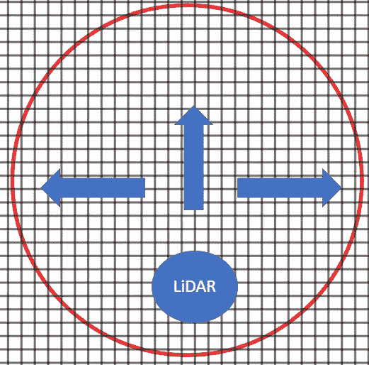

我们从视野中的起点开始扩展，为每个网格单元生成支柱。重复这个过程，直到我们编码了最大数量的柱子。

*   createPillarsTarget(src/point _ pillars . CPP)-生成可用于稍后计算损失值的回归目标。对于标签文件中给定的每个 3D 边界框，它将与锚框进行比较。首先，基于对象尺寸(下面网格上的红色圆圈)在原始边界框周围创建一个搜索半径。然后，对于该半径内的每个网格单元，放置锚框，并在每个锚框和原始边界框之间计算 IoU。

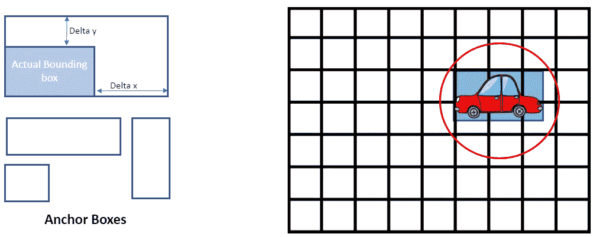

给定实际边界框，生成回归目标的过程。

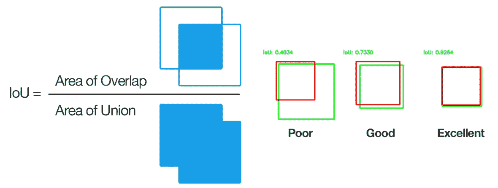

计算并集上的交集。这是通过在训练期间比较锚框和实际边界框来生成回归目标的关键步骤。(来源:pyimagesearch.com)

如果 IoU 值高于某个阈值，则目标(x、y、z、长度、宽度、高度、偏航等。)被存储用于该边界框。否则，如果没有锚超过阈值，则为该网格单元选择并存储基于 IoU 分数的最佳锚。如上所述，这些值随后用于计算损失值。

# 推论(point_pillars_prediction.py)

这个代码库的最后一部分是用于推理的*point _ pillars _ prediction . py*文件。在我们已经基于前面描述的损失函数训练了网络之后，在推断阶段，网络的输出是每个预测的**回归目标、占用指数和分类置信度值**。您可以验证对于每个格网像元，网络输出 4 个边界框及其各自的参数。

我们可以基于占用率指数移除大多数预测的框，因为我们只想要占用率为 1 的框，这意味着网络实际上已经预测了该网格单元上的边界框。尽管如此，对于相同的对象，可能有许多由网络预测的边界框。为了过滤这些，我们可以使用非最大值抑制，并得出最终的边界框预测。非最大值抑制基于 IoU 及其分类置信度值对边界框进行排序，并选择具有最佳值的边界框作为最终边界框。参考这个[帖子](/non-maximum-suppression-nms-93ce178e177c)阅读更多关于非最大抑制。

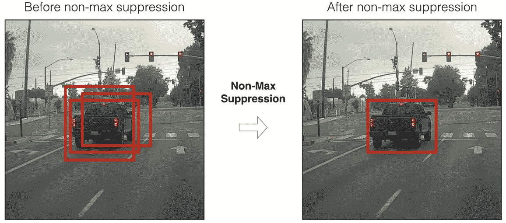

当多个边界框被对象检测算法预测时，非最大值抑制收敛到最终的边界框。(来源:towardsdatascience.com)

# 结论

这篇文章详细介绍了 Tensorflow 上点支柱的实现。包括配置文件、模型实现、数据生成器、训练和推理在内的所有代码细节都用代码示例进行了解释。代码可以在这个 [Github repo](https://github.com/tyagi-iiitv/PointPillars) 中找到，可以用来试验本文中给出的细节。作为下一步，我们正致力于在 Kitti 数据上生成推理结果，这些结果将发布在 Github repo 上。

如果你有兴趣参与这个项目，请查看 GitHub repo 上的问题。