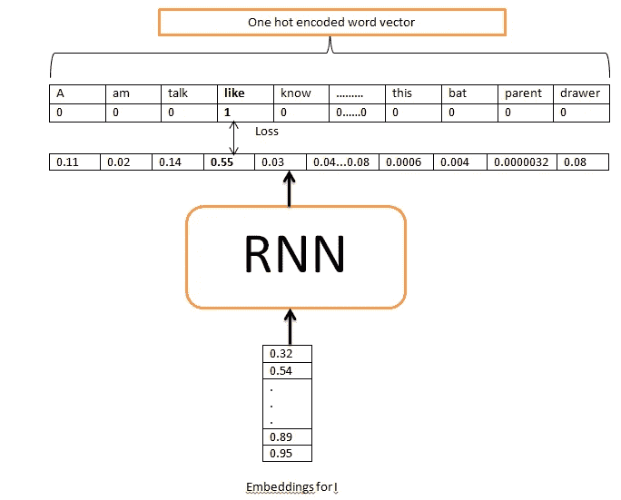
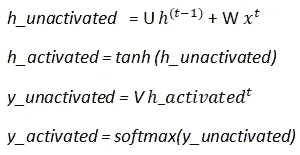
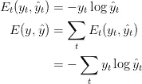
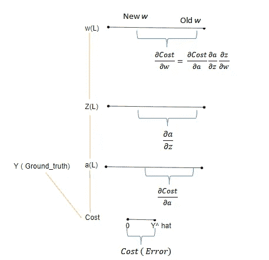
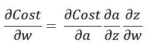
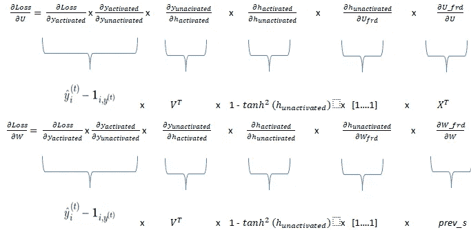
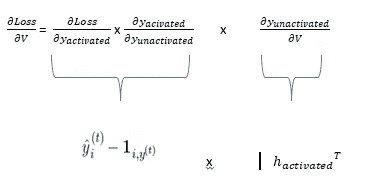
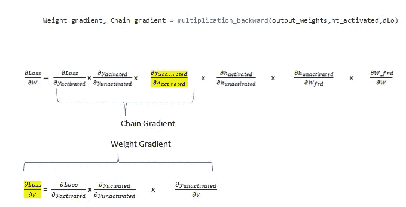
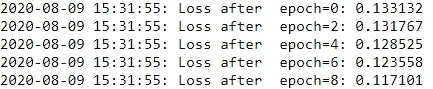

# 用 Numpy 实现递归神经网络

> 原文：<https://towardsdatascience.com/implementing-recurrent-neural-network-using-numpy-c359a0a68a67?source=collection_archive---------21----------------------->

## [入门](https://towardsdatascience.com/tagged/getting-started)

## 关于如何使用 Numpy 实现递归神经网络的综合教程


[程峰](https://unsplash.com/@chengfengrecord?utm_source=unsplash&utm_medium=referral&utm_content=creditCopyText)在 [Unsplash](https://unsplash.com/s/photos/spiral?utm_source=unsplash&utm_medium=referral&utm_content=creditCopyText) 上拍照

# 介绍

递归神经网络(RNN)是最早能够在自然语言处理领域提供突破的神经网络之一。这个网络的美妙之处在于它能够存储以前序列的记忆，因此它们也被广泛用于时间序列任务。像 Tensorflow 和 PyTorch 这样的高级框架抽象了这些神经网络背后的数学，使得任何人工智能爱好者都难以用正确的参数和层知识来编码深度学习架构。为了解决这些类型的低效率，这些网络背后的数学知识是必要的。通过帮助人工智能爱好者理解研究论文中的不同符号并在实践中实现它们，从头开始编写这些算法具有额外的优势。

如果你对 RNN 的概念不熟悉，请参考 [MIT 6。S191](https://youtu.be/SEnXr6v2ifU) 课程，这是最好的讲座之一，让你直观地了解 RNN 是如何运作的。这些知识将帮助您理解本教程中解释的不同符号和概念实现。

# 最终目标

这个博客的最终目标是让 AI 爱好者对他们从深度学习领域的研究论文中获得的理论知识进行编码。

# 参数初始化

与传统的神经网络不同，RNN 拥有 3 个权参数，即输入权、内部状态权(用于存储记忆)和输出权。我们首先用随机值初始化这些参数。我们将 word_embedding 维数和 output 维数分别初始化为 100 和 80。输出维度是词汇表中出现的唯一单词的总数。

权重初始化器

变量 ***prev_memory*** 指的是 internal_state(这些是前面序列的内存)。用于更新权重的梯度等其他参数也已初始化。输入 _ 权重梯度、内部 _ 状态 _ 权重梯度和输出 _ 权重梯度分别被命名为***杜*** *、* ***dW*** *和* ***dV*** 。变量***bptt _ truncate***指的是网络在反向传播时必须回顾的时间戳的数量，这样做是为了克服[消失梯度](https://www.superdatascience.com/blogs/recurrent-neural-networks-rnn-the-vanishing-gradient-problem)问题。

# 正向传播直觉:

**输入和输出向量:**

考虑到我们有一句话 ***“我喜欢玩。”。词汇表中的*** 假设 ***I*** 映射到索引 2， ***像*** 映射到索引 **45** ， ***到*** 在索引 **10** 和 ***在索引 **64** 和标点符号***在索引 **1** 处。为了获得从输入到输出的真实场景，让我们为每个单词随机初始化 word_embedding。

***注意* :** 你也可以尝试对每个单词使用一个 hot 编码向量，并将其作为输入传递。

现在我们已经完成了输入，我们需要考虑每个单词输入的输出。RNN 单元应该输出当前输入的下一个最可能的单词。为了训练 RNN，我们提供了第 ***t+1 个*** 字作为第 ***个*** 输入值的输出，例如:RNN 单元格应该输出字 ***，就像给定的输入字*一样****

***既然输入是以嵌入向量的形式，那么计算损失所需的输出格式应该是**一次性编码的**向量。对于输入字符串中除第一个单词之外的每个单词都要这样做，因为我们只考虑这个神经网络要学习的一个例句，而初始输入是句子的第一个单词。***

******我们为什么要对输出的字进行一次性编码？******

***原因是，原始输出只是每个单词的分数，它们对我们来说并不重要。相反，我们需要每个单词相对于前一个单词的 ***概率*** 。***

***我们如何从原始输出值中找到概率？***

***为了解决这个问题，在得分向量上使用了一个 ***softmax*** 激活函数，使得所有这些概率加起来等于 1。 **Img 1** 显示单个时间戳的输入输出管道。顶行是 ground _truth 输出，第二行表示预测输出。***

******

***img 1:RNN 的输入和输出管道，图片由作者提供***

******注意:*** *在实现过程中我们需要注意 output_mapper 的键值。我们需要用其时间戳值重置键值，以便算法知道在特定时间戳需要使用哪个基本事实字来计算损失。****

```
***Before reset:
45: array([0., 0., 0., 0., 0., 0., 0., 0., 0., 0., 0., 0., 0., 0., 0., 0., 0.,
        0., 0., 0., 0., 0., 0., 0., 0., 0., 0., 0., 0., 0., 0., 0., 0., 0.,
        0., 0., 0., 0., 0., 0., 0., 0., 0., 0., 0., 1., 0., 0., 0., 0., 0.,
        0., 0., 0., 0., 0., 0., 0., 0., 0., 0., 0., 0., 0., 0., 0., 0., 0.,
        0., 0., 0., 0., 0., 0., 0., 0., 0., 0., 0., 0.])After reset:
{0: array([0., 0., 0., 0., 0., 0., 0., 0., 0., 0., 0., 0., 0., 0., 0., 0., 0.,
        0., 0., 0., 0., 0., 0., 0., 0., 0., 0., 0., 0., 0., 0., 0., 0., 0.,
        0., 0., 0., 0., 0., 0., 0., 0., 0., 0., 0., 1., 0., 0., 0., 0., 0.,
        0., 0., 0., 0., 0., 0., 0., 0., 0., 0., 0., 0., 0., 0., 0., 0., 0.,
        0., 0., 0., 0., 0., 0., 0., 0., 0., 0., 0., 0.])***
```

## ***RNN 盒子计算:***

***现在我们有了权重，也知道了如何传递输入，也知道了预期的输出，我们将从正向传播计算开始。训练神经网络需要以下计算。***

******

***Img 2:作者图片***

***这里的 ***U*** 表示输入 _ 权重， ***W*** 表示内部 _ 状态 _ 权重， ***V*** 表示输出权重。输入权重乘以输入( ***x*** )，内部 _ 状态 _ 权重乘以之前的激活，在我们的符号中是 ***prev_memory*** 。层间使用的激活函数是 **Tanh。**它提供非线性，最终有助于学习。***

******注意:*** *在本教程中，不使用 RNN 计算的偏差术语，因为它会导致更复杂的理解。****

***由于上面的代码只计算一个特定时间戳的输出，我们现在必须对整个单词序列的前向传播进行编码。***

***在下面的代码中， ***输出字符串*** 包含每个时间戳的输出向量列表。 ***内存*** 是一个字典，其中包含每个时间戳的参数，这些参数在反向传播期间是必不可少的。***

*****损失计算:*****

***我们还将损失或误差定义为**交叉熵损失**，由下式给出:***

******

***Img 3:作者图片***

***最重要的是，我们需要在上面的代码中查看第 ***行和第*** 行。众所周知，地面真实输出( ***y*** )的形式为[0，0，…。,1,..0]和 predicted _ output(*)的形式是[0.34，0.03，…，0.45]，我们需要损失是一个单一的值来从中推断总损失。为此，我们使用 ***求和函数*** 来获得该特定时间戳的 y 和 y^hat 向量中每个值的差值/误差之和。total_loss 是包括所有时间戳在内的整个模型的损失。****

# ****反向传播****

****如果你听说过反向传播，那么你一定听说过链式法则，它是计算[梯度](https://machinelearningmastery.com/gradient-descent-for-machine-learning/)的重要方面。****

********

****Img 4:作者图片****

********

****Img 5:作者图片****

****根据上面的 **Img 4** ，成本 **C** 表示误差，这是 y^hat 达到 y 所需的变化。由于成本是激活 ***a、*** 的函数输出，激活反映的变化由 ***dCost/da 表示。*** 实际上是指从激活节点 ***的角度看的变化(误差)值。*** 类似地，激活相对于*的变化由 ***da/dz*** 和 ***z*** 相对于*w***dw/dz 给出。我们关心的是重量的变化(误差)有多大。由于重量和成本之间没有直接关系，所以从成本到重量的中间变化值会相乘(如上述等式所示)。*********

## ******RNN 反向传播:******

****因为 RNN 有三个重量，我们需要三个梯度。input _ weights(***dLoss/dU***)、internal _ state _ weights(***dLoss/dW***)和 output _ weights(***dLoss/dV***)的渐变。****

****这三个梯度的链可以表示如下:****

********

****:****

********

****img 6:RNN 使用的权重梯度方程，图片由作者提供****

*******注意*** *:这里的 T 代表转置。*****

*******dLoss/dy _ unactivated***编码如下:****

****为了了解更多关于损失衍生品的信息，请参考这篇[博客](https://deepnotes.io/softmax-crossentropy#derivative-of-cross-entropy-loss-with-softmax)。我们将计算两个梯度函数，一个是**乘法 _ 后退**，另一个是**加法 _ 后退**。在**乘法 _ 反向**的情况下，我们返回 2 个参数，一个是关于权重的梯度( ***dLoss/dV*** ),另一个是链梯度，其将是链的一部分以计算另一个权重梯度。在**加法向后**的情况下，在计算导数时，我们发现加法函数(***ht _ unactivated***)中单个分量的导数为 1。例如:***DH _ unactivated/dU _ frd***= 1 as(***h _ unactivated***=***U _ frd+W _ frd _***)以及***dU _ frd/dU _ frd***= 1。但是 1 的个数是相对于 U_frd 的维数而言的。要了解更多关于渐变的信息，你可以参考这个[源](https://cedar.buffalo.edu/~srihari/CSE676/10.2.2%20RNN-Gradients.pdf)。就是这样，计算梯度只需要这两个函数。 ***乘法 _ 后退*** 函数用于包含矢量点积的方程，而 ***加法 _ 后退*** 函数用于包含两个矢量相加的方程。****

********

****Img 7:下面编码的梯度函数背后的数学直觉，图片由作者提供****

****现在，您已经分析并理解了 RNN 的反向传播，是时候为单个时间戳实现它了，这将在以后用于计算所有时间戳的梯度。如下面的代码所示， ***forward_params_t*** 是一个包含网络在特定时间步长的前向参数的列表。变量 ***ds*** 是一个至关重要的部分，因为这行代码考虑了先前时间戳的隐藏状态，这将有助于提取反向传播时所需的足够有用的信息。****

****对于 RNN，由于消失梯度问题，我们将使用截断反向传播，而不是使用普通反向传播。在这种技术中，当前单元将向后看 k 个时间戳，而不是只向后看一个时间戳，其中 k 表示要向后看的先前单元的数量，以便检索更多的知识。****

# ****更新权重:****

****一旦我们使用反向传播计算了梯度，我们必须更新权重，这是使用批量梯度下降方法完成的。****

# ****训练序列:****

****一旦我们把所有的功能都准备好了，我们就可以进入高潮了，也就是训练神经网络。考虑用于训练的学习率是静态的，您甚至可以使用基于使用[步长衰减](https://cs231n.github.io/neural-networks-3/#anneal)的动态方法来改变学习率。****

********

****Img 7:损失-产出，按作者分类的图像****

# ****结论:****

****现在你已经实现了一个递归神经网络，是时候向前迈出一步，使用像 LSTM 和 GRU 这样的高级架构，以更有效的方式利用隐藏状态来保留更长序列的含义。还有很长的路要走。随着 NLP 领域的大量进步，出现了高度复杂的算法，如 Elmo 和 Bert。理解它们，并尝试自己实现。它遵循同样的记忆概念，但引入了加权单词的元素。由于这些模型高度复杂，使用 Numpy 是不够的，而是灌输 PyTorch 或 TensorFlow 的技能来实现它们，并构建可以服务于社区的惊人的 AI 系统。****

****创建本教程的灵感来自这个 github [博客](https://github.com/pangolulu/rnn-from-scratch)。****

****你可以在这里访问本教程[的笔记本。](https://github.com/rishit13/Recurrent-Neural-Network-from-scratch-using-numpy)****

****希望你们都喜欢这个教程！****

# ******参考文献:******

****[1]萨古尔·斯里哈里，RNN-Gradients，[https://cedar . buffalo . edu/~斯里哈里/CSE 676/10 . 2 . 2% 20 rnn-Gradients . pdf](https://cedar.buffalo.edu/~srihari/CSE676/10.2.2%20RNN-Gradients.pdf)****

****[2]https://github.com/pangolulu/rnn-from-scratch 龚玉【RNN】从无到有****