# 从头开始实施 SGD

> 原文：<https://towardsdatascience.com/implementing-sgd-from-scratch-d425db18a72c?source=collection_archive---------5----------------------->

## 无 SKlearn 的随机梯度下降的自定义实现

在实现随机梯度下降之前，让我们来谈谈什么是梯度下降。

梯度下降算法是一种用于求解优化问题的迭代算法。在几乎每个机器学习和深度学习模型中，梯度下降都被积极地用于改善我们算法的学习。

读完这篇博客后，你会知道梯度下降算法实际上是如何工作的。在这篇博客的最后，我们将比较我们的自定义 SGD 实现和 SKlearn 的 SGD 实现。

# 梯度下降算法是如何工作的？

1.  选取一个初始随机点 ***x0。***
2.  x1 = x0 - r [(df/dx) of x0]
3.  x2 = x1- r [(df/dx) of x1]
4.  类似地，我们发现对于 x0，x1，x2 ……。x[k-1]

这里 r 是学习率，df/dx 是最小化我们损失的梯度函数。

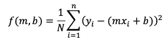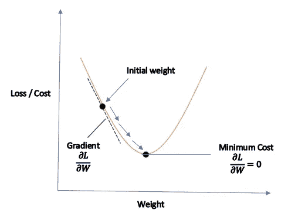

# 用小批量实现线性 SGD

在小批量 SGD 中，在计算关于训练集子集的误差梯度之后，更新参数。

> 让我们以 Kaggle 的波士顿住房数据集为例。

首先，我们将导入所有必需的库。

```
**import** **warnings**
warnings.filterwarnings("ignore")
**from** **sklearn.datasets** **import** load_boston
**from** **random** **import** seed
**from** **random** **import** randrange
**from** **csv** **import** reader
**from** **math** **import** sqrt
**from** **sklearn** **import** preprocessing
**import** **pandas** **as** **pd**
**import** **numpy** **as** **np**
**import** **matplotlib.pyplot** **as** **plt**
**from** **prettytable** **import** PrettyTable
**from** **sklearn.linear_model** **import** SGDRegressor
**from** **sklearn** **import** preprocessing
**from** **sklearn.metrics** **import** mean_squared_error
**from** **sklearn.model_selection** **import** train_test_split
```

现在，我们将加载数据集。这里，X 包含我们拥有的数据集，Y 包含我们需要预测的标签。

```
X = load_boston().data
Y = load_boston().target
```

记得在缩放之前拆分数据，以避免数据泄漏问题。

```
*# split the data set into train and test*
X_train, X_test, y_train, y_test = train_test_split(X, Y, test_size=0.3, random_state=0)
```

使用标准标量函数来标准化数据集。在这里，我们只拟合训练数据，因为我们不希望我们的模型在此之前看到这些数据，以避免过度拟合。

```
scaler = preprocessing.StandardScaler()
X_train = scaler.fit_transform(X_train)
X_test = scaler.transform(X_test)
```

使用 pandas 创建数据框架。

```
X_train = pd.DataFrame(data = X_train, columns=load_boston().feature_names)
X_train['Price'] = list(y_train)  
X_test = pd.DataFrame(data = X_test, columns=load_boston().feature_names)
X_test['Price'] = list(y_test)
```

让我们看看我们的 X_train 是什么样子的。

```
X_train.head()
```

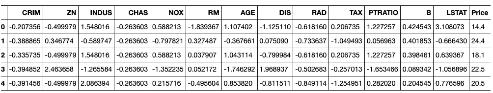

下面是我们需要最小化的线性模型的损失函数。

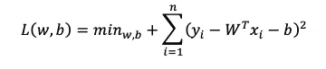

现在，我们计算损失函数 L w.r.t 权重(W)和截距(b)的梯度。以下是计算梯度的方程式，

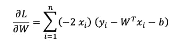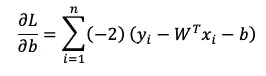

在计算梯度后，我们不断改变我们的权重和截距值。

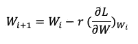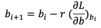

最后，我们将实现 SGD 函数。

```
**def** sgd_regressor(X, y, learning_rate=0.2, n_epochs=1000, k=40):

    w = np.random.randn(1,13)  *# Randomly initializing weights*
    b = np.random.randn(1,1)   *# Random intercept value*

    epoch=1

    **while** epoch <= n_epochs:

        temp = X.sample(k)

        X_tr = temp.iloc[:,0:13].values
        y_tr = temp.iloc[:,-1].values

        Lw = w
        Lb = b

        loss = 0
        y_pred = []
        sq_loss = []

        **for** i **in** range(k):

            Lw = (-2/k * X_tr[i]) * (y_tr[i] - np.dot(X_tr[i],w.T) - b)
            Lb = (-2/k) * (y_tr[i] - np.dot(X_tr[i],w.T) - b)

            w = w - learning_rate * Lw
            b = b - learning_rate * Lb

            y_predicted = np.dot(X_tr[i],w.T)
            y_pred.append(y_predicted)

        loss = mean_squared_error(y_pred, y_tr)

        print("Epoch: **%d**, Loss: **%.3f**" %(epoch, loss))
        epoch+=1
        learning_rate = learning_rate/1.02

    **return** w,b
```

我们保持学习率= 0.2，次数= 1000，批量= 40。我们可以相应地改变参数来最小化我们的 MSE。

我们通过除以 1.02 来不断降低我们的学习率，你可以选择任何你想要的值。

我选择了 MSE 作为我的误差度量，我们也可以选择 RMSE。

现在，我们创建一个预测函数并计算我们的预测值。

```
**def** predict(x,w,b):
    y_pred=[]
    **for** i **in** range(len(x)):
        temp_ = x
        X_test = temp_.iloc[:,0:13].values
        y = np.asscalar(np.dot(w,X_test[i])+b)
        y_pred.append(y)
    **return** np.array(y_pred)w,b = sgd_regressor(X_train,y_train)
y_pred_customsgd = predict(X_test,w,b)
```

## 比较我们的预测值和实际值

```
**from** **matplotlib.pyplot** **import** figure
plt.figure(figsize=(25,6))
plt.plot(y_test, label='Actual')
plt.plot(y_pred_customsgd, label='Predicted')
plt.legend(prop={'size': 16})
plt.show()
print('Mean Squared Error :',mean_squared_error(y_test, y_pred_customsgd))
```

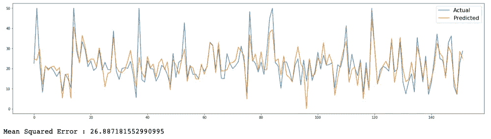

正如我们看到的，我们得到了 26.8 的 MSE，这是相当不错的。

## 实施 SKlearn 的 SGD 回归器

```
**from** **sklearn.linear_model** **import** SGDRegressor
clf = SGDRegressor(max_iter=1000, tol=1e-3)
clf.fit(X_train, y_train)
y_pred = clf.predict(X_test)
```

## 比较我们的预测值和实际值

```
**import** **matplotlib.pyplot** **as** **plt**
**from** **matplotlib.pyplot** **import** figure
plt.figure(figsize=(25,6))
plt.plot(y_test, label='Actual')
plt.plot(y_pred, label='Predicted')
plt.legend(prop={'size': 16})
plt.show()
print('Mean Squared Error :',mean_squared_error(y_test, y_pred))
```

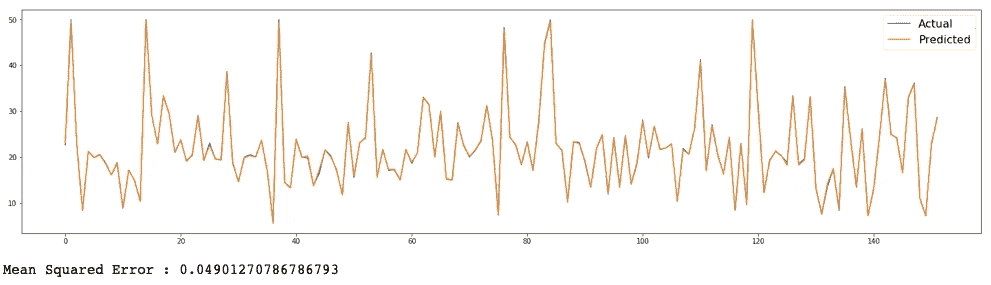

SKlearn 的 SGD 实现比我们的自定义实现要好得多。

# 比较两个 SGD 分类器的预测值

```
**import** **matplotlib.pyplot** **as** **plt**
**from** **matplotlib.pyplot** **import** figure
plt.figure(figsize=(25,6))
plt.plot(y_pred, label='SGD')
plt.plot(y_pred_customsgd, label='Custom SGD')
plt.legend(prop={'size': 16})
plt.show()
print('Mean Squared Error of Custom SGD :',mean_squared_error(y_test, y_pred_customsgd))
print("Mean Squared Error of SKlearn's SGD :",mean_squared_error(y_test, y_pred))
```

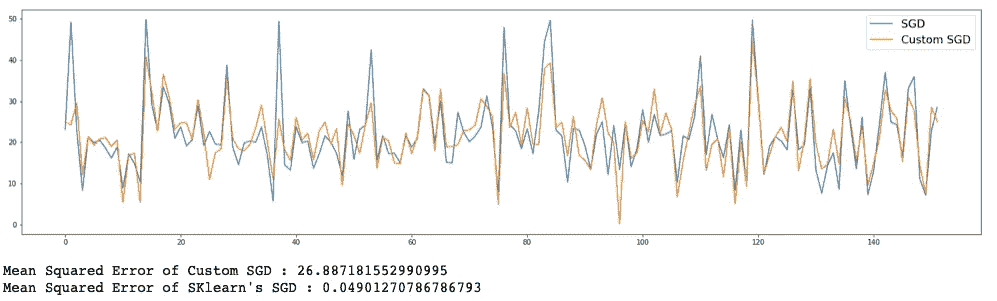

嗯，我们的自定义 SGD 做了一个相当不错的工作相比，SKlearn 的，我们总是可以做一些超参数调整，以改善我们的自定义模型。

从头开始实现算法需要很多时间，但是如果我们使用库，那么它对我们来说仍然是黑箱。请在评论区告诉我你对此的看法。

感谢你阅读这篇博客，希望你对 SGD 的实际运作有所了解。