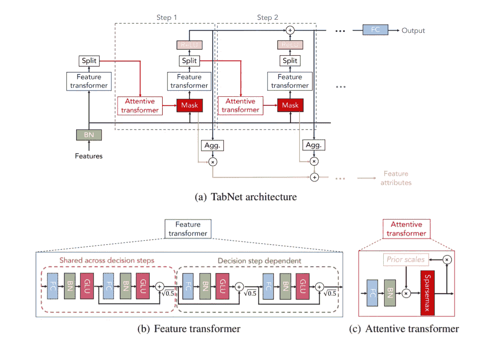

# 在 PyTorch 中实现 TabNet

> 原文：<https://towardsdatascience.com/implementing-tabnet-in-pytorch-fc977c383279?source=collection_archive---------19----------------------->


[https://unsplash.com/photos/Wpnoqo2plFA](https://unsplash.com/photos/Wpnoqo2plFA)

深度学习已经接管了视觉、自然语言处理、语音识别和许多其他领域，取得了惊人的成果，甚至在某些领域取得了超人的表现。然而，使用深度学习对表格数据进行建模相对有限。

对于表格数据，最常见的方法是使用基于树的模型及其集成。基于树的模型全局选择减少熵最多的特征。像 bagging、boosting 这样的集成方法通过减少模型方差来进一步改进这些基于树的方法。最近基于树的组合，如 XGBoost 和 LightGBM，已经主导了 Kaggle 竞赛。

TabNet 是谷歌云 AI 研究团队开发的神经架构。它能够在回归和分类问题中的几个数据集上实现最先进的结果。它结合了神经网络的特性以适应非常复杂的函数和基于树的算法的**特性选择**属性。换句话说，模型在训练过程中学习只选择相关的特征。此外，与只能进行全局特征选择的基于树的模型相反，TabNet 中的特征选择过程是基于实例的。TabNet 的另一个令人满意的特性是**可解释性**。与大多数深度学习相反，在深度学习中，神经网络的行为就像黑盒一样，我们可以解释模型在 TabNet 的情况下选择了哪些特征。

在这篇博客中，我将带您一步一步地体验 PyTorch 中对初学者友好的 TabNet 实现。我们开始吧！！

**TabNet 架构。**



1)资料来源:[https://arxiv.org/pdf/1908.07442v1.pdf](https://arxiv.org/pdf/1908.07442v1.pdf)

图(1)取自最初的 TabNet 论文。我们将单独构建图像的每个组件，并在最后将它们组装起来。首先，让我们来看一下这个模型中使用的两个基本概念- [Ghost 批处理规范化(GBN)](https://arxiv.org/pdf/1705.08741.pdf) 和 [Sparsemax](https://arxiv.org/pdf/1602.02068.pdf) 。

**Ghost 批量标准化(GBN):**
GBN 让我们可以训练大批量的数据，同时也可以更好地进行归纳。简而言之，我们将输入批次分成大小相等的子批次(虚拟批次大小),并对它们应用**相同的**批次规范化层。除了应用于输入要素的第一个批处理规范化图层之外，模型中使用的所有批处理规范化图层都是 GBN 图层。它可以在 PyTorch 中实现，如下所示:

```
class **GBN**(nn.Module):
    def __init__(self,inp,vbs=128,momentum=0.01):
        super().__init__()
        self.bn = nn.BatchNorm1d(inp,momentum=momentum)
        self.vbs = vbs
    def forward(self,x):
        chunk = torch.chunk(x,x.size(0)//self.vbs,0)
        res = [self.bn(y) for y **in** chunk]
        return torch.cat(res,0)
```

**稀疏最大值:**

就像 softmax 一样，Sparsemax 是一个非线性归一化函数，但是顾名思义，分布是“更稀疏”的。也就是说，与 softmax 相比，输出概率分布中的一些数字更接近 1，而其他数字更接近 0。这使得模型能够在每个决策步骤中更有效地选择相关特征。我们将使用 sparsemax 将特征选择步骤的掩码投影到一个更稀疏的空间。sparsemax 的实现可以在 https://github.com/gokceneraslan/SparseMax.torch[的](https://github.com/gokceneraslan/SparseMax.torch)找到

为了进一步增加遮罩中的稀疏性，我们还将添加稀疏性正则化技术来惩罚不太稀疏的遮罩。这可以在每个决策步骤中实现，如下所示:

```
(mask*torch.log(mask+1e-10)).mean() #F(**x**)= -**∑x**log(**x+eps**)
```

所有决策步骤上的该值的总和可以被添加到总损失中(在乘以正则化常数λ之后)。

**注意力转换器:**
这是模型学习相关特征之间的关系并决定将哪些特征传递给当前决策步骤的特征转换器的地方。每个注意力转换器由一个全连接层、一个 Ghost 批处理规范化层和一个 Sparsemax 层组成。每个决策步骤中的注意力转换器接收输入特征、来自前一步骤的已处理特征以及关于已用特征的先验信息。先验信息由大小为 batch_size x input_features 的矩阵表示。它被初始化为 1，并在每个决策步骤的注意力转换器处被传递和更新。还有一个松弛参数，用于限制某个特性在向前传递中可以使用的次数。较大的值意味着模型可以多次重复使用同一要素。我认为守则把一切都讲清楚了。

```
class **AttentionTransformer**(nn.Module):
    def __init__(self,d_a,inp_dim,relax,vbs=128):
        super().__init__()
        self.fc = nn.Linear(d_a,inp_dim)
        self.bn = GBN(out_dim,vbs=vbs)
        self.smax = Sparsemax()
        self.r = relax #a:feature from previous decision step
    def forward(self,a,priors): 
        a = self.bn(self.fc(a)) 
        mask = self.smax(a*priors) 
        priors =priors*(self.r-mask)  #updating the prior
        return mask
```

然后将该掩膜乘以(按元素)归一化的输入要素。

**特征转换器:**

要素转换器是处理所有选定要素以生成最终输出的地方。每个特征变换器由多个门控线性单元块组成。GLU 控制哪些信息必须被允许在网络中进一步流动。为了实现一个 GLU 模块，首先我们使用一个完全连接的层将 GLU 的输入特征的尺寸加倍。我们使用一个 GBN 层来标准化结果矩阵。然后，我们将一个 **sigmoid 应用于结果特征的第二部分**，并将结果乘以第一部分。结果乘以一个比例因子(本例中为 sqrt(0.5))并添加到输入中。该求和结果是序列中下一个 GLU 模块的输入。

在所有决策步骤中共享一定数量的 GLU 块，以提高模型容量和效率(**可选**)。第一共享 GLU 块(或者第一独立块，如果没有块被共享的话)是唯一的，因为它将输入特征的维数减少到等于 n_a+n_d 的维数。n_a 是输入到下一步骤的注意力转换器的特征的维数，n_d 是用于计算最终结果的特征的维数。这些特征被一起处理，直到它们到达分割器。ReLU 激活应用于 n_d 维向量。所有决策步骤的输出相加在一起，并通过完全连接的层将它们映射到输出维度。

```
class **GLU**(nn.Module):
    def __init__(self,inp_dim,out_dim,fc=None,vbs=128):
        super().__init__()
        if fc:
            self.fc = fc
        else:
            self.fc = nn.Linear(inp_dim,out_dim*2)
        self.bn = GBN(out_dim*2,vbs=vbs) 
        self.od = out_dim
    def forward(self,x):
        x = self.bn(self.fc(x))
        return x[:,:self.od]*torch.sigmoid(x[:,self.od:])class **FeatureTransformer**(nn.Module):
    def __init__(self,inp_dim,out_dim,shared,n_ind,vbs=128):
        super().__init__()
        first = True
        self.shared = nn.ModuleList()
        if shared:
            self.shared.append(GLU(inp_dim,out_dim,shared[0],vbs=vbs))
            first= False    
            for fc **in** shared[1:]:
                self.shared.append(GLU(out_dim,out_dim,fc,vbs=vbs))
        else:
            self.shared = None
        self.independ = nn.ModuleList()
        if first:
            self.independ.append(GLU(inp,out_dim,vbs=vbs))
        for x **in** range(first, n_ind):
            self.independ.append(GLU(out_dim,out_dim,vbs=vbs))
        self.scale = torch.sqrt(torch.tensor([.5],device=device))
    def forward(self,x):
        if self.shared:
            x = self.shared[0](x)
            for glu **in** self.shared[1:]:
                x = torch.add(x, glu(x))
                x = x*self.scale
        for glu **in** self.independ:
            x = torch.add(x, glu(x))
            x = x*self.scale
        return x
```

接下来，让我们将注意力转换器和特征转换器结合成一个决策步骤:

```
class **DecisionStep**(nn.Module):
    def __init__(self,inp_dim,n_d,n_a,shared,n_ind,relax,vbs=128):
        super().__init__()
        self.fea_tran = FeatureTransformer(inp_dim,n_d+n_a,shared,n_ind,vbs)
        self.atten_tran =  AttentionTransformer(n_a,inp_dim,relax,vbs)
    def forward(self,x,a,priors):
        mask = self.atten_tran(a,priors)
        sparse_loss = ((-1)*mask*torch.log(mask+1e-10)).mean()
        x = self.fea_tran(x*mask)
        return x,sparse_loss
```

最后，我们可以通过将几个决策步骤结合在一起来完成模型:

```
class **TabNet**(nn.Module):
    def __init__(self,inp_dim,final_out_dim,n_d=64,n_a=64,
n_shared=2,n_ind=2,n_steps=5,relax=1.2,vbs=128):
        super().__init__()
        if n_shared>0:
            self.shared = nn.ModuleList()
            self.shared.append(nn.Linear(inp_dim,2*(n_d+n_a)))
            for x **in** range(n_shared-1):
                self.shared.append(nn.Linear(n_d+n_a,2*(n_d+n_a)))
        else:
            self.shared=None
        self.first_step = FeatureTransformer(inp_dim,n_d+n_a,self.shared,n_ind) 
        self.steps = nn.ModuleList()
        for x **in** range(n_steps-1):
            self.steps.append(DecisionStep(inp_dim,n_d,n_a,self.shared,n_ind,relax,vbs))
        self.fc = nn.Linear(n_d,final_out_dim)
        self.bn = nn.BatchNorm1d(inp_dim)
        self.n_d = n_d
    def forward(self,x):
        x = self.bn(x)
        x_a = self.first_step(x)[:,self.n_d:]
        sparse_loss = torch.zeros(1).to(x.device)
        out = torch.zeros(x.size(0),self.n_d).to(x.device)
        priors = torch.ones(x.shape).to(x.device)
        for step **in** self.steps:
            x_te,l = step(x,x_a,priors)
            out += F.relu(x_te[:,:self.n_d])
            x_a = x_te[:,self.n_d:]
            sparse_loss += l
        return self.fc(out),sparse_loss
```

**模型超参数的近似范围:** n_d，n_a: 8 到 512
批量:256 到 32768
虚拟批量:128 到 2048
稀疏正则化常数:0 到 0.00001
共享 GLU 块数:2 到 10
独立判决块数:2 到 10
松弛常数:1 到 2.5
判决步数)

这个 TabNet 模块可以扩展用于分类和回归任务。您可以为分类变量添加嵌入，将 Sigmoid 或 Softmax 函数应用于输出，等等。尝试一下，看看什么最适合你。在示例笔记本中，我尝试用 Sigmoid 替换 Sparsemax，并能够获得稍好的精度。

关于[行动机制(MoA)预测](https://www.kaggle.com/c/lish-moa/data)数据集的用例示例，你可以在这里找到我的笔记本:[https://www.kaggle.com/samratthapa/drug-prediction](https://www.kaggle.com/samratthapa/drug-prediction)。这是目前正在 Kaggle 上举行的一场比赛的数据集。

我对 TabNet 的实现是对 DreamQuark 慷慨的人们的工作的一个简短的改编。他们对 TabNet 的完整实现可以在:
[https://github . com/dream quark-ai/TabNet/tree/develop/py torch _ TabNet](https://github.com/dreamquark-ai/tabnet/tree/develop/pytorch_tabnet)找到。
你应该考虑阅读[论文](https://arxiv.org/abs/1908.07442v4)以获得对 TabNet 更详细的描述。

感谢您的阅读。我希望我能帮上忙。

**参考文献:**
1)塞尔詹·奥鲁克，托马斯·菲斯特。2020.TabNet:专注的可解释表格学习[https://arxiv.org/abs/1908.07442v4](https://arxiv.org/abs/1908.07442v4)
2)扬·n·多芬、安吉拉·范、迈克尔·奥利和大卫·格兰吉尔。2016.用门控卷积网络进行语言建模。https://arxiv.org/pdf/1612.08083.pdf、埃拉德·霍弗、伊泰·胡巴拉和丹尼尔·苏德里。2017.训练时间越长，推广效果越好:缩小神经网络大批量训练中的推广差距。
[https://arxiv.org/pdf/1705.08741.pdf](https://arxiv.org/pdf/1705.08741.pdf)
4)安德烈·马丁斯和拉蒙·费尔南德斯·阿斯图迪略。2016.从 Softmax 到 Sparsemax:注意力和多标签分类的稀疏模型。
[https://arxiv.org/abs/1602.02068](https://arxiv.org/abs/1602.02068)
5)Sparsemax 实现[https://github.com/gokceneraslan/SparseMax.torch](https://github.com/gokceneraslan/SparseMax.torch)
6)完成 PyTorch TabNet 实现
[https://github . com/dream quark-ai/TabNet/tree/develop/py torch _ TabNet](https://github.com/dreamquark-ai/tabnet/tree/develop/pytorch_tabnet)