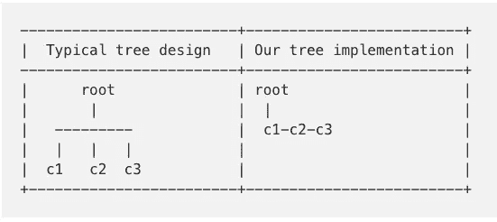

# 在 python 中实现通用树和深度优先搜索(DFS )!(从头开始)

> 原文：<https://towardsdatascience.com/implementing-the-general-tree-and-depth-first-search-dfs-in-python-from-scratch-b3187e9e117d?source=collection_archive---------8----------------------->


信用:Pixabay

最近，我在《走向数据科学》上发表了一篇关于从零开始实现链表的文章。阅读之前的故事对于理解这里的核心概念是不必要的，但是之前使用的代码将被引用；因此，我将把 GitHub Gists 链接到链表和一般的树实现。

作为一名数据科学领域的研究生，我经常发现统计概念得到了大量的课程介绍，但基本的 CS 概念往往被抽象掉了。也许有充分的理由；知道如何实现一棵树对于训练一个随机的森林来说是不必要的。更高级的 API 允许我们利用基本概念，而不会被细节所困扰。

# 那么什么是一般的树——你为什么要关心呢？

到目前为止，二叉树在 CS 基础中更常见。每棵树都有三个强制元素:一个值、一个左子引用和一个右子引用。实现的任何其他东西都是为了满足程序员预见的独特目的。

另一方面，一般的树不限于有*确切地说是*两个孩子。这尤其有用，因为分层数据在 web 上非常普遍。**例如，考虑探索 API 查询结果的任务。XML 和 JSON 数据都是树状数据。**通用树会给你工具来快速搜索特定字符串、数值等的查询结果。

我们的数据结构不局限于两个或零个孩子，将比二叉树灵活得多，但它也将迫使我们做出重要的设计决策。其中最重要的是——树节点必须有有限数量的属性。如果任何节点都可以有任意数量的子节点，我们该如何解决这个难题呢？列表、元组和字典是自然的选择；单个通用树节点可以将其`children`属性设置为单个变量，该变量可以引用可变数量的通用树节点。

但是我承诺从头实现它，因为我最近从头实现了链表，我们将继续以同样的势头向前冲。简单回顾一下——链表是由节点组成的。每个节点引用序列中的下一个节点(也可以是前一个节点——也就是双向链表)。)第一个节点是头，因此，必须从头遍历到序列中的任何其他节点。在头部位置的插入是微不足道的(与动态数组相比)，您只需实例化一个引用头部的新节点，并将 head 属性设置为链表的新头部。

我们将以两种方式构建链表:我们将直接使用链表来跟踪我们已经访问过的树节点；我们将借用链表*的精神来*指导我们的设计选择。

考虑下图。典型的通用树将允许任何子节点被给定的父节点访问。因为我们的数据结构将建立在一个链表上，一个给定的父节点将只引用一个子节点，*，特别是最左边的子节点*。要访问它的其他子节点，我们必须遍历兄弟节点。只要我们意识到这一点，并且我们的设计选择考虑到这一点，这就不是问题。另外，我们没有借用 python 的内置数据类型，这意味着我们最大化了我们的学习体验。



让我们从一般的树节点开始，它将有以下参数:*值、父节点、左兄弟节点、右兄弟节点和子节点*。这本质上是一个双向链表，因为它在水平和垂直方向上都是双向链接的。很像链表，我们需要定义*getter*和*setter*。这些函数将设置一个节点对另一个节点的引用属性，或者获取这个值的值(如果存在的话)。

到目前为止，我们已经讨论了体系结构，但是通用树的真正用途来自于搜索它的能力。有多种策略来遍历一般的树；最常见的两种是广度优先搜索(BFS)和深度优先搜索(DFS)。我们今天将只实现后者。在高层次上，策略是尽可能深入第一个分支；当我们不能再往下走时，我们退回到前面的父节点，并遍历它的第一个兄弟节点。我们能下去吗？如果是这样，我们探索这个分支的深度。如果不能，我们探索下一个兄弟姐妹。这听起来极其复杂，但是当我们从基于条件的策略的角度来考虑时，就容易多了。

DFS 的五个场景:

1.  如果一个子节点存在并且还没有被浏览，那么*遍历到这个子节点。*
2.  如果*右*兄弟存在且尚未被浏览，则*向右遍历。*
3.  如果我们在最右边的孩子，我们*可以*退回到左边，那么*遍历到左边。* **【撤退】**
4.  如果我们不在最左边的子节点*上，但是我们已经在右边的*和*上找到了*的兄弟节点，那么*遍历到左边。* **(撤退)**
5.  否则，*遍历父项。* **【撤退】**

这里真正的技巧是使用递归，这是每个程序员都应该努力掌握的技能。递归函数有两个元素:终止条件和其他一切。如果终止条件被触发，函数将存在并返回一些期望的输出。如果终止条件不满足，**该函数将采取措施向终止条件推进，然后调用自身。**

出于我们的目的，我们需要对*和*有一些概念，为此我们将定义`current_node`和`current_value`变量。每当我们遍历到另一个节点时，我们就更新这些值。我们的终止条件是这样的:*如果当前值是* ***根节点值*** *或* ***搜索值*** *，我们退出* **。**(显然，每个节点有一个唯一的名称很重要，让我们过早退出。)如果不满足这个条件，我们观察上面的五个条件规则，根据当前节点执行任何合适的规则/策略，并重复直到满足终止条件。这就是全部了。

我们将在下面定义三种截然不同但非常相似的方法。第一个是`depth_first_traversal`。这里，我们将根据 DFS 协议研究整个树。没有搜索值，因此我们仅在到达根节点时终止(即，我们已经探索了所有子节点的所有子节点。)其次我们来定义`depth_first_search`。这里，我们*将*提供一个搜索值。如果达到这个值，我们将退出循环。如果我们一直追溯到根节点，这个值在树中就不存在了。值得注意的是，这两个函数将通知程序员节点*实际被遍历的顺序。*换句话说，**兄弟遍历将被考虑。**

我们需要定义第三个函数，它对真实的层次数据有用。例如，在文件存储系统中。一旦您将目录更改为给定的文件夹，您就不需要遍历所有文件和文件夹，直到您到达所需的文件夹后再打开它。相反，您只需遍历`parent -> child`并重复，直到您到达所需的子目录。对我们的影响:*使用我们的架构，我们需要清除兄弟遍历，这样我们的输出就和任何其他通用树的输出一样。*

这种改变没有你想象的那么困难。但是在我们讨论它之前，我们需要谈谈上面讨论的所有三种方法的共性。需要创建一个`visited` 类属性。正如前面所讨论的，这将是一个链表，其中一旦一个树节点被访问，它的值将被追加到链表的末尾。这使得这三种方法避免了从父到子到父的无限遍历…一次又一次。

后两种方法使用了 path 类属性的变体，这是——您猜对了——另一个链表(持续给予的礼物！)这里的想法是*只维护不涉及撤退的*节点，不像被访问的属性。`path`和`child_path`最大的区别在于，前者包括对兄弟姐妹的遍历，而后者不包括。子路径是最令人感兴趣的，因为它在真实世界的数据中很有用，而 path 属性只在我们程序的上下文中有用。在任一情况下，使用我们上面的五个 DFS 条件规则/策略，条件 3、4、& 5 都是撤退，这意味着当撤退时我们从我们的路径/子路径中清除这些节点值。(如果推理还不明显，当我们回顾代码时，它会更有意义。简单地说，这些分支是死胡同，我们从路径/子路径变量中剪除。)

重新考虑终止条件，我们做的最后一件事是为将来的迭代重置。这是通过将我们的路径复制到一个临时变量，将所有其他变量重新定义到它们的起始条件，然后返回临时变量来实现的。过一会儿这就更有意义了——我保证！(如果我们不重置，我们将需要重新实例化我们的通用树类，以便搜索不同的值，因为我们的变量将存在于非启动条件下，从而触发错误。)

现在——代码！让我们回顾一下链表。

并在一般的树(最后！！)

考虑下面的树:

```
a1
|
b1 - b2 - b3 
|         |
d1        c1
```

如果我们运行下面的单元格，我们将把这个树实例化到通用树类对象中，然后找到从根到节点 c1 的最短路径(有和没有兄弟)。

```
a1 = GeneralTreeNode(value='a1')
b1 = GeneralTreeNode(value='b1')
b2 = GeneralTreeNode(value='b2')
b3 = GeneralTreeNode(value='b3')
a1.set_child(b1)
b1.set_parent(a1)
b1.set_right(b2)
b2.set_left(b1)
b2.set_right(b3)
b3.set_left(b2)c1 = GeneralTreeNode(value='c1')
c1.set_parent(b3)
b3.set_child(c1)d1 = GeneralTreeNode(value='d1')
d1.set_parent(b1)
b1.set_child(d1)r = GeneralTree(root=a1)r.depth_first_search(search_val='c1')
>>>>
Node:  a1
Node:  b1
Node:  b2
Node:  b3
Node:  c1r.child_depth_first_search(search_val='c1')
>>>>
Node:  a1
Node:  b3
Node:  c1
```

看到`depth_first_search`和`child_depth_first_search`的区别了吗？在后者中，节点 b1 和 b2 被省略，因为它们在一般树的传统定义中不是必需的遍历。*后一种方法是您想要在现实世界问题中使用的方法*(就像我们之前的文件系统导航示例一样。)

如果你对本教程如何更有帮助有想法，对扩展有想法，请求合作等，请联系我。名义上，我计划要么创建一个 XML 解析器、JSON 解析器，要么使用树来搜索嵌套字典，等等。

我希望你喜欢今天和我一起深入研究基本面！