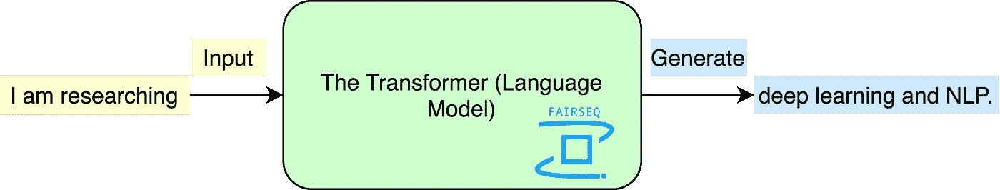
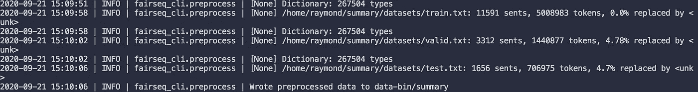
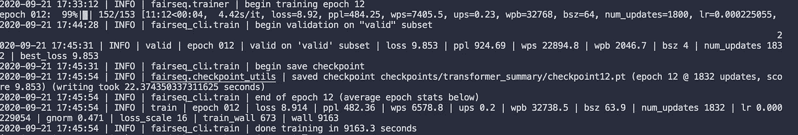

# 为语言建模实现转换器

> 原文：<https://towardsdatascience.com/implementing-transformer-for-language-modeling-ba5dd60389a2?source=collection_archive---------24----------------------->

## 使用 Fairseq 训练变压器模型



图片由作者提供(Fairseq logo: [来源](https://github.com/pytorch/fairseq/)

# 介绍

**自然语言处理**的最新趋势是建立在该领域历史上最大的突破之一之上的: [**转换器**](https://arxiv.org/abs/1706.03762) 。Transformer 是主要由 [Google Brain](https://research.google/teams/brain/) 和 [Google Research](https://research.google/) 研究的模型架构。它最初被证明在翻译任务中达到了最先进的水平，但后来当它被大规模采用时，被证明在几乎任何 NLP 任务中都是有效的。transformer 架构由一系列编码器和解码器组成，具有自我关注层，有助于模型关注各自的输入。你可以在原文[这里](https://arxiv.org/abs/1706.03762)了解更多关于变形金刚的知识。

在这篇文章中，我们将向您展示如何实现语言建模任务的转换器。**语言建模**是给语言中的句子分配概率的任务。语言建模的目标是让模型将高概率分配给我们数据集中的真实句子，以便它能够通过解码器方案生成接近人类水平的流畅句子。我们将使用 [**Fairseq**](https://github.com/pytorch/fairseq/) 库来实现转换器。

# 第一步:准备数据集(来自我之前的博文)

[](/fine-tuning-gpt2-for-text-generation-using-pytorch-2ee61a4f1ba7) [## 使用 Pytorch 微调用于文本生成的 GPT2

### 使用 Pytorch 和 Huggingface 微调用于文本生成的 GPT2。我们在 CMU 图书摘要数据集上进行训练，以生成…

towardsdatascience.com](/fine-tuning-gpt2-for-text-generation-using-pytorch-2ee61a4f1ba7) 

在本文中，我们将再次使用 [CMU 图书摘要数据集](http://www.cs.cmu.edu/~dbamman/booksummaries.html#:~:text=This%20dataset%20contains%20plot%20summaries,author%2C%20title%2C%20and%20genre.)来训练 Transformer 模型。可以参考博文的步骤 1 来获取和准备数据集。准备好数据集后，您应该准备好与数据集的三个分区相对应的 *train.txt* 、 *valid.txt 和 test.txt* 文件。

# 步骤 2:下载并安装 Fairseq

如果你没有听说过 [Fairseq](https://github.com/pytorch/fairseq) ，它是一个流行的 NLP 库，由[脸书 AI](https://ai.facebook.com/) 开发，用于实现翻译、摘要、语言建模和其他生成任务的定制模型。你可以在这里查看我对 Fairseq [的评论。](/top-nlp-libraries-to-use-2020-4f700cdb841f)

现在，为了下载并安装 Fairseq，运行以下命令:

```
git clone https://github.com/pytorch/fairseq
cd fairseq
pip install --editable ./
```

如果您的 GPU 允许，您还可以选择安装 NVIDIA 的 apex 库来加快训练速度:

```
git clone https://github.com/NVIDIA/apex
cd apex
pip install -v --no-cache-dir --global-option="--cpp_ext" --global-option="--cuda_ext" \
  --global-option="--deprecated_fused_adam" --global-option="--xentropy" \
  --global-option="--fast_multihead_attn" ./
```

现在，您已经成功安装了 Fairseq，我们终于可以开始了！

# 步骤 3:预处理数据集

为了预处理数据集，我们可以使用 [fairseq 命令行工具](https://fairseq.readthedocs.io/en/latest/command_line_tools.html#)，这使得开发人员和研究人员可以很容易地从终端直接运行操作。为了预处理我们的数据，我们可以使用`fairseq-preprocess`来构建我们的词汇表，并对训练数据进行二进制化。

```
cd fairseq/
DATASET=/path/to/dataset
fairseq-preprocess \
--only-source \
--trainpref $DATASET/train.txt \
--validpref $DATASET/valid.txt \
--testpref $DATASET/test.txt \
--destdir data-bin/summary \
--workers 20
```



预处理的命令输出

执行上述命令后，预处理后的数据将保存在`--destdir`指定的目录下。

# 步骤 4:训练变压器

终于可以开始训练变形金刚了！要训练一个模型，我们可以使用`fairseq-train`命令:

```
CUDA_VISIBLE_DEVICES=0 fairseq-train --task language_modeling \
data-bin/summary \
--save-dir checkpoints/transformer_summary \
--arch transformer_lm --share-decoder-input-output-embed \
--dropout 0.1 \
--optimizer adam --adam-betas '(0.9, 0.98)' --weight-decay 0.01 --clip-norm 0.0 \
--lr 0.0005 --lr-scheduler inverse_sqrt --warmup-updates 4000 --warmup-init-lr 1e-07 \
--tokens-per-sample 512 --sample-break-mode none \
--max-tokens 2048 --update-freq 16 \
--fp16 \
--max-update 50000 \
--max-epoch 12
```

在我们的例子中，我们将 GPU 指定为第 0 个(`CUDA_VISIBLE_DEVICES`)，将任务指定为语言建模(`--task`)，将数据指定为`data-bin/summary`，将架构指定为转换器语言模型(`--arch`)，将历元数指定为 12 ( `--max-epoch`，以及其他超参数。训练完成后，模型的最佳检查点将保存在`--save-dir`指定的目录下。

12 个纪元需要一段时间，所以当你的模型训练时请坐好！当然，你也可以根据自己的需要减少历元数来训练。训练完成后，将显示以下输出:



训练结束时的命令输出

请注意，在每个历元中，会显示相关的数字，例如丢失和困惑。这些可能有助于在训练过程中评估模型。

# 步骤 5:评估语言模型

在您的模型完成训练之后，您可以使用`fairseq-eval-lm`评估生成的语言模型:

```
fairseq-eval-lm data-bin/summary \
--path checkpoints/transformer_summary/checkpoint_best.pt \
--max-sentences 2 \
--tokens-per-sample 512 \
--context-window 400
```

在这里，将评估测试数据以对语言模型进行评分(在训练阶段使用训练和验证数据来寻找模型的优化超参数)。下面显示了评估后的命令输出:


用于评估的命令输出

如你所见，我们模型的损失是 9.8415，困惑度是 917.48(以 2 为基数)。

# 第六步:终于！让我们生成一些文本:D

在训练模型之后，我们可以尝试使用我们的语言模型生成一些样本。要生成，我们可以使用`fairseq-interactive`命令创建一个交互会话来生成:

```
fairseq-interactive data-bin/summary \
--task language_modeling \
--path checkpoints/transformer_summary/checkpoint_best.pt \
--beam 5
```

在交互式会话期间，程序将提示您输入文本。输入文本后，模型将在输入后生成标记。一个代样给定*书发生地*作为输入*T7 是这样的:*

> 这本书发生在故事的故事，故事的故事，故事的故事，故事的人物…

生成是重复的，这意味着模型需要用更好的参数来训练。上述命令使用光束尺寸为 5 的[光束搜索](https://arxiv.org/abs/1701.03185)。我们还可以使用采样技术，如 [top-k 采样](https://arxiv.org/abs/1805.04833):

```
fairseq-interactive data-bin/summary \
--task language_modeling \
--path checkpoints/transformer_summary/checkpoint_best.pt \
--sampling --beam 1 --sampling-topk 10
```

以及 [top-p 采样](https://arxiv.org/abs/1904.09751):

```
fairseq-interactive data-bin/summary \
--task language_modeling \
--path checkpoints/transformer_summary/checkpoint_best.pt \
--sampling --beam 1 --sampling-topp 0.8
```

注意，当使用 top-k 或 top-sampling 时，我们必须添加`beam=1`来抑制当`--beam`不等于`--nbest`时产生的误差。这好像是个 bug。

# 结论

在这篇博文中，我们使用流行的 Fairseq 库在书籍摘要上训练了一个经典的 transformer 模型！虽然生成示例是重复的，但是本文可以作为一个指南，带您在语言建模上运行一个转换器。如果:D 感兴趣，看看我的其他帖子

[](/top-nlp-libraries-to-use-2020-4f700cdb841f) [## 2020 年将使用的顶级 NLP 库

### AllenNLP，Fast.ai，Spacy，NLTK，TorchText，Huggingface，Gensim，OpenNMT，ParlAI，DeepPavlov

towardsdatascience.com](/top-nlp-libraries-to-use-2020-4f700cdb841f) [](/fine-tuning-gpt2-for-text-generation-using-pytorch-2ee61a4f1ba7) [## 使用 Pytorch 微调用于文本生成的 GPT2

### 使用 Pytorch 和 Huggingface 微调用于文本生成的 GPT2。我们在 CMU 图书摘要数据集上进行训练，以生成…

towardsdatascience.com](/fine-tuning-gpt2-for-text-generation-using-pytorch-2ee61a4f1ba7) [](/controlling-text-generation-from-language-models-6334935e80cf) [## 控制语言模型的文本生成

### 控制机器生成文本的样式和内容的实际操作方法

towardsdatascience.com](/controlling-text-generation-from-language-models-6334935e80cf) [](/bert-text-classification-using-pytorch-723dfb8b6b5b) [## 使用 Pytorch 的 BERT 文本分类

### 文本分类是自然语言处理中的一项常见任务。我们应用 BERT，一个流行的变压器模型，对假新闻检测使用…

towardsdatascience.com](/bert-text-classification-using-pytorch-723dfb8b6b5b) 

# 参考

[1] A .瓦斯瓦尼，n .沙泽尔，n .帕尔马等。，[注意力是你需要的全部](https://papers.nips.cc/paper/7181-attention-is-all-you-need.pdf) (2017)，第 31 届神经信息处理系统会议

[2] L .邵、s .古乌斯、d .布里兹等。，[用序列对序列模型生成高质量、信息量大的会话响应](https://arxiv.org/abs/1701.03185) (2017)，自然语言处理中的经验方法

[3] A. Fan，M. Lewis，Y. Dauphin，【分层神经故事生成】 (2018)，计算语言学协会

[4] A .霍尔茨曼、j .买斯、l .杜等。，[神经文本退化的好奇案例](https://arxiv.org/abs/1904.09751) (2019)，国际学习表征会议

[5] [Fairseq Github](https://github.com/pytorch/fairseq/) ，脸书艾研究

[6] [Fairseq 文档](https://fairseq.readthedocs.io/)，脸书艾研究