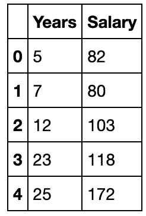
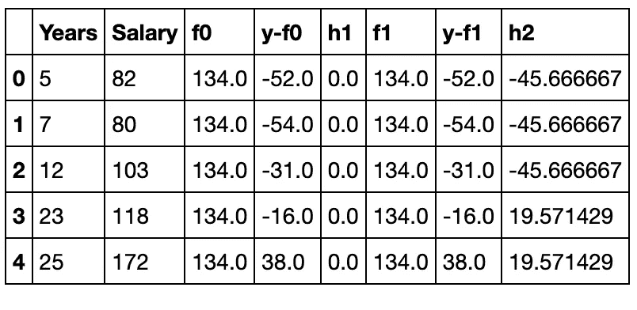
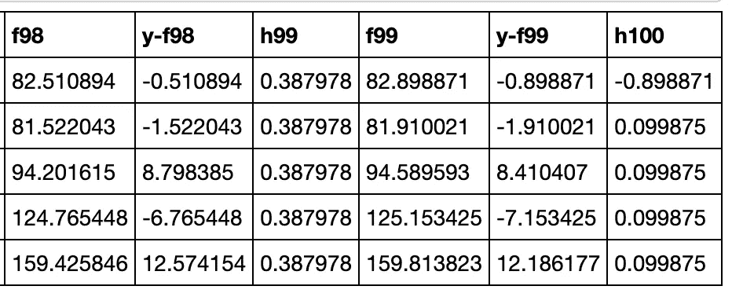
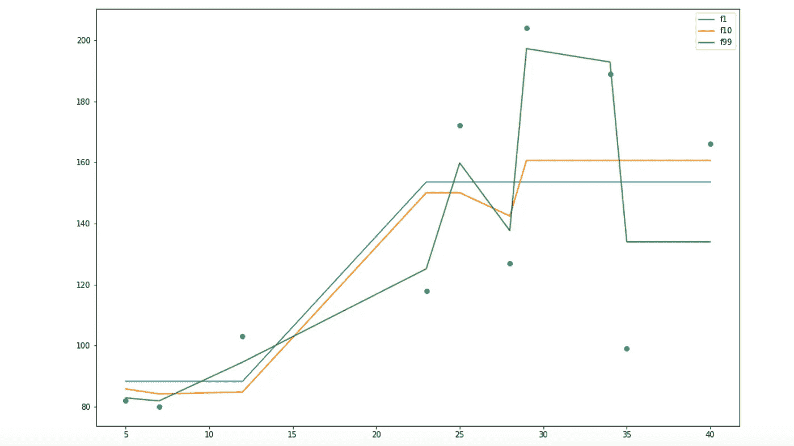

# 从头开始实现 XGBoost

> 原文：<https://towardsdatascience.com/implementing-xgboost-from-scratch-6b7f2eb593c?source=collection_archive---------18----------------------->

## 使用 numpy 实现一个最流行的机器学习模型的逐步指南


安妮·斯普拉特在 [Unsplash](https://unsplash.com?utm_source=medium&utm_medium=referral) 上的照片

> XGBoost 是一个优化的分布式梯度增强库，旨在高效、灵活和可移植。

它已经被用于几乎每一个机器学习黑客马拉松，并且通常是选择模型时的首选。

但是理解它实际上是如何工作的总是困难的部分。起初，复杂的数学很难理解，所以我决定使用 Numpy 编写 XGBoost 的代码。这将有助于以简单的方式理解它。


照片由[布鲁斯·马尔斯](https://unsplash.com/@brucemars?utm_source=medium&utm_medium=referral)在 [Unsplash](https://unsplash.com?utm_source=medium&utm_medium=referral) 拍摄

这是通过临时代码理解 XGBoost 的另一种方法。下面的代码是一个使用 numpy 开发的简单 XGBoost 模型。这段代码的主要目的是揭示 XGBoost 背后的数学原理。

## 导入基本库:

```
import numpy as np
import pandas as pd
import matplotlib.pyplot as plt
%matplotlib inline
```

numpy——实现 xgboost
Pandas 背后的数学运算——将列表值转换为 data frame
Matplotlib——绘制最终输出以可视化结果

**样本数据:**

考虑以下数据，其中工作年限是预测变量，工资是目标。

```
year = [5,7,12,23,25,28,29,34,35,40]
salary = [82,80,103,118,172,127,204,189,99,166]
```

## 需要记住的几件重要事情:

使用**回归树作为基础学习器**，我们可以创建一个模型来预测工资。

为了简单起见，我们可以选择平方损失作为损失函数，我们的目标是最小化平方误差。

作为第一步，模型应该用函数 F0(x)初始化。F0(x)应该是使函数 F 在平均值处最小化的损失函数或 MSE(均方误差)最小化的函数

如果我们取 MAE，函数会在中间值最小化

**数据构建**

```
df = pd.DataFrame(columns=['Years','Salary'])
df.Years = year
df.Salary = salary
df.head()
```



上述代码片段的输出

## 几件更重要的事情:

> 残差是 y 和 f0 之差，即(y-f0)

我们可以使用 F0(x)的残差来创建 h1(x)。h1(x)将是一棵回归树，它将尝试减少上一步的残差。h1(x)的输出不会是 y 的预测；相反，它将有助于预测将降低残差的连续函数 F1(x)。

加法模型 h1(x)计算树的每个叶子处的残差(y-F0)的平均值。

分割完成后，计算上半部分和下半部分的平均值，我选择了一个随机分割点。

**模型构建:**

```
for i in range(2):
    f = df.Salary.mean()
    if(i>0):
        df['f'+str(i)] = df['f'+str(i-1)] + df['h'+str(i)]
    else:
        df['f'+str(i)] = f
    df['y-f'+str(i)] = df.Salary - df['f'+str(i)]
    splitIndex = np.random.randint(0,df.shape[0]-1)
    a= []
    h_upper = df['y-f'+str(i)][0:splitIndex].mean()
    h_bottom = df['y-f'+str(i)][splitIndex:].mean()
    for j in range(splitIndex):
        a.append(h_upper)
    for j in range(df.shape[0]-splitIndex):
        a.append(h_bottom)
    df['h'+str(i+1)] = a

df.head()
```



2 次迭代后的输出

如果我们继续迭代 100 次，我们可以看到 MSE(Fi)的损失大幅下降

```
for i in range(100):
    f = df.Salary.mean()
    if(i>0):
        df['f'+str(i)] = df['f'+str(i-1)] + df['h'+str(i)]
    else:
        df['f'+str(i)] = f
    df['y-f'+str(i)] = df.Salary - df['f'+str(i)]
    splitIndex = np.random.randint(0,df.shape[0]-1)
    a= []
    h_upper = df['y-f'+str(i)][0:splitIndex].mean()
    h_bottom = df['y-f'+str(i)][splitIndex:].mean()
    for j in range(splitIndex):
        a.append(h_upper)
    for j in range(df.shape[0]-splitIndex):
        a.append(h_bottom)
    df['h'+str(i+1)] = a

df.head()
```



100 次迭代后的输出

我们可以看到，随着迭代次数的增加，损失在减少，模型在适应数据集

## 可视化结果:

```
plt.figure(figsize=(15,10))
plt.scatter(df.Years,df.Salary)
plt.plot(df.Years,df.f1,label = 'f1')
plt.plot(df.Years,df.f10,label = 'f10')
plt.plot(df.Years,df.f99,label = 'f99')
plt.legend()
```



上述代码片段的绘图

蓝线表示 1 次迭代后的输出，可以理解为随机。当我们到达第 100 次迭代时，模型适应数据，损失减少，从而使输出接近实际点。

代码可以在我的 github 回购上找到:【https://github.com/Sid11/XGBoost-Using-Numpy/】T2

希望你喜欢！