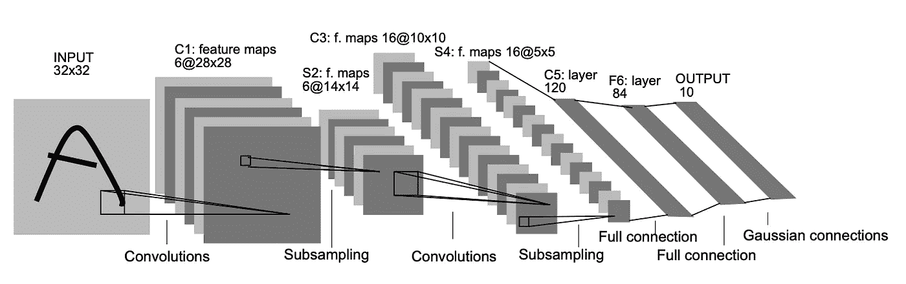
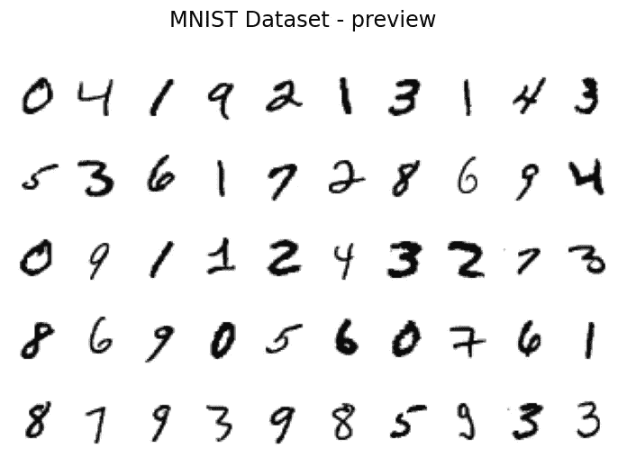
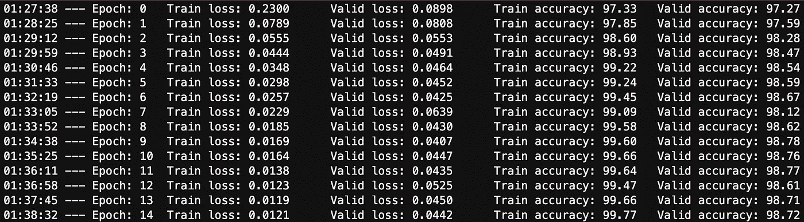
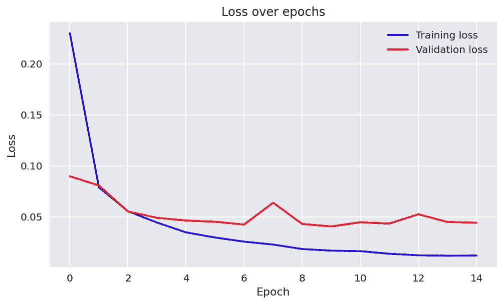
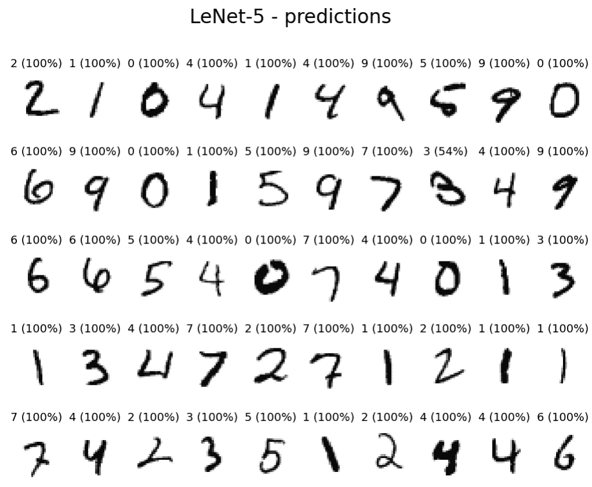

# 在 PyTorch 中实现 Yann LeCun 的 LeNet-5

> 原文：<https://towardsdatascience.com/implementing-yann-lecuns-lenet-5-in-pytorch-5e05a0911320?source=collection_archive---------3----------------------->


安妮·尼加德在 [Unsplash](https://unsplash.com/?utm_source=unsplash&utm_medium=referral&utm_content=creditCopyText) 上拍摄的照片

最近，我看了由 Dataiku 制作的[数据科学先锋](https://www.datascience.movie/)电影，其中几位数据科学家讲述了他们的工作以及他们如何在日常工作中应用数据科学。在其中一次会谈中，他们提到了 Yann LeCun 的卷积神经网络架构(也称为 [LeNet-5)](https://en.wikipedia.org/wiki/LeNet) 如何被美国邮政局用于自动识别手写的邮政编码。该架构的另一个现实应用是识别银行系统写在支票上的数字。指出 LeNet-5 论文发表于 1998 年是有意义的。这就是为什么在转向更复杂、更现代的架构之前，理解 CNN 如何工作是一个很好的起点的原因之一。

在本文中，我简要描述了该架构，并展示了如何在 PyTorch 中实现 LeNet-5。本文假设对卷积神经网络的基础有一个大致的了解，包括卷积层、池层、全连接层等概念。

# 理论介绍

LeNet-5 是一个 7 层卷积神经网络，针对大小为 32 x 32 像素的灰度图像进行训练。



来源:[基于梯度的学习应用于文档识别](http://yann.lecun.com/exdb/publis/pdf/lecun-01a.pdf)

为了解码上面的图像，我给出了作者使用的命名约定:

*   Cx —卷积层，
*   Sx —子采样(池化)层，
*   Fx —全连接层，
*   x-层的索引。

鉴于现代标准，LeNet-5 相对简单，因此我们可以分别研究每一层，以便更好地理解该架构。然而，在继续之前，提醒一下计算卷积层输出大小的公式也是有意义的。

公式如下所示:

，其中 *W* 是输入的高度/宽度(正常情况下图像是正方形，所以不需要区分两者)， *F* 是滤镜/内核大小， *P* 是填充， *S* 是步幅。

看到上面的架构模式和公式后，我们可以检查 LeNet-5 的每一层。

1.  **第 1 层(C1)** :第一个卷积层，有 6 个大小为 5×5 的核，步长为 1。给定输入大小(32×32×1)，该层的输出大小为 28×28×6。
2.  **第 2 层(S2)** :具有 6 个大小为 2×2 的内核和步长为 2 的子采样/池层。原始架构中的子采样层比传统使用的最大/平均池层要复杂一些。我将引用[1]:“S2 单位的四个输入相加，然后乘以一个可训练的系数，并加到一个可训练的偏差。结果通过一个 s 形函数传递。。作为非重叠感受野的结果，该层的输入大小减半(14×14×6)。
3.  **第三层(C3):** 第二个卷积层，配置与第一个相同，不过这次有 16 个滤波器。该层的输出为 10×10×16。
4.  **第四层(S4):** 第二个汇集层。逻辑与前一个相同，但这一次该层有 16 个过滤器。该层的输出大小为 5×5×16。
5.  **第 5 层(C5):** 最后一个卷积层，120 个 5×5 核。假设该层的输入大小为 5×5×16，内核大小为 5×5，则输出为 1×1×120。因此，层 S4 和 C5 是完全连接的。这也是为什么在 LeNet-5 的一些实现中，实际上使用全连接层而不是卷积层作为第五层。将这一层保持为卷积层的原因是，如果网络的输入大于[1]中使用的输入(初始输入，在这种情况下为 32×32)，这一层将不是全连接层，因为每个内核的输出将不是 1×1。
6.  **第 6 层(F6):** 第一个全连接层，接受 120 个单元的输入并返回 84 个单元。在最初的论文中，作者使用了一个定制的激活函数——tanh 激活函数的变体。关于详细的解释，请参考[1]中的附录 A。
7.  **第 7 层(F7):** 最后一个密集层，输出 10 个单位。在[1]中，作者使用欧几里德径向基函数神经元作为该层的激活函数。

有关架构背后的推理和一些选择(如非标准激活函数)的更多详细信息，请参考[1]。

# PyTorch 实现

我现在将展示如何在 PyTorch 中实现 LeNet-5(做了一些小的简化)。为了保持 LeNet-5 最初应用的精神，我们将在 MNIST 数据集上训练网络。我们从导入所有需要的库开始。

此外，我们检查 GPU 是否可用，并相应地设置`DEVICE`变量。在下一步中，我们设置一些参数(如随机种子、学习速率、批量大小、时期数等。)，我们将在稍后设置神经网络时使用它。

下一步，我们在 PyTorch 中定义一些用于训练神经网络的辅助函数。由于在大多数情况下，总体思想非常相似，因此您可以根据自己的需要稍微修改这些函数，并将其用于训练各种网络。我们从负责培训部分的功能开始:

我将快速描述一下在`train`函数中发生了什么。对于每批观察，我们执行以下步骤:

1.  执行正向传递-使用当前权重获取批次的预测
2.  计算损失函数的值
3.  执行反向传递，其中权重根据损失进行调整。这是“学习”的一步。

请注意，在训练阶段，模型处于训练模式(`model.train()`)，我们还需要将每批的梯度归零。此外，我们计算训练步骤中的跑步损失。

然后，我们定义负责验证的函数。

验证功能与训练功能非常相似，不同之处在于缺少实际的学习步骤(反向传递)。请注意，我们需要说明我们仅使用模型进行评估— `model.eval()`。我们不需要担心梯度，因为在下一个函数中，您将看到我们在验证步骤中禁用了它们。最后，我们在训练循环中将它们结合在一起:

在训练循环中，对于每个时期，我们运行`train`和`validate`函数，后者与`torch.no_grad()`一起运行，以便不更新权重并节省一些计算时间。除了用于训练的损失函数之外，我们还使用定制的`get_accuracy`函数计算训练和验证步骤的模型精度。我们将使用的数据集是平衡的，因此使用准确性作为衡量标准没有问题。为了简洁起见，我在这里没有包括所有的助手函数，你可以在 [GitHub](https://github.com/erykml/medium_articles/blob/master/Computer%20Vision/lenet5_pytorch.ipynb) 上找到`get_accuracy`和`plot_losses`的定义。

定义了助手函数之后，是时候准备数据了。由于 MNIST 数据集的普及(如果你不熟悉它，你可以在这里阅读一些背景[)，它很容易作为`torchvision`内的数据集之一。](https://en.wikipedia.org/wiki/MNIST_database)

在上面的代码片段中，我们首先定义了一组要应用于源图像的变换。我们首先将图像的大小调整为 32×32(LeNet-5 的输入大小),然后将它们转换为张量。`transforms.ToTensor()`自动将图像缩放至[0，1]范围。我们也可以对图像应用某种填充，而不是调整图像的大小。在最简单的情况下，我们只需在原始图像的两边添加两个零。

第二步是定义数据集。对于训练对象，我们指定了`download=True`，以便下载数据集。在定义数据集时，我们还指出了先前定义的转换以及特定对象是否将用于训练。

最后，我们通过提供数据集、批量大小和在每个时期混洗数据集的愿望来实例化`DataLoaders`。为了验证，这没有区别，所以我们把它设置为`False`。

下面你可以看到来自训练集的 50 张图片的预览。



最后，是时候定义 LeNet-5 架构了。

从上面的类定义中，您可以看到与原始网络相比的一些简化:

*   使用常规 *tanh* 激活功能，而不是[1]中描述的自定义功能。
*   使用普通的池层而不是原始架构中使用的更复杂的对等层，
*   用 softmax 函数替换输出图层中的欧氏径向基函数激活。

定义了类之后，我们需要实例化模型(并将其发送到正确的设备)、优化器(本例中为 ADAM)和损失函数(交叉熵)。最后两个不同于最初在[1]中使用的方法。

一切就绪后，我们可以通过运行以下命令来训练网络:

```
model, optimizer, _ = training_loop(model, criterion, optimizer, train_loader, valid_loader, N_EPOCHS, DEVICE)
```

什么会产生以下输出:



训练损失趋于平稳，而验证损失有时表现出小的起伏(增加的值)。总的来说，我相信表现可以用中规中矩来形容。最好的结果(在验证集上)是在第 11 个时期获得的。

为了评估我们模型的预测，我们可以运行下面的代码，该代码显示一组来自验证集的数字，以及预测的标签和网络分配给该标签的概率(换句话说，网络在预测中的可信度)。



从上面的图片中我们可以看到，网络几乎总是确定这个标签，唯一的疑问出现在数字 3(第二行，右起第三个)中，而它只有 54%的把握是 3。这很可能是因为这个数字确实类似于 8。

作为最后一步，我们运行以下命令来删除下载的数据集:

```
!rm -r mnist_data
```

# 结论

在本文中，我描述了 LeNet-5 的架构，并展示了如何实现它，以及如何使用著名的 MNIST 数据集对它进行训练。由于这是最早的 CNN 架构之一，它相对简单易懂，这使得它成为学习卷积神经网络的良好开端。

为了进一步提高网络的性能，尝试一些数据扩充可能是值得的。为此，我们可以对图像应用旋转或剪切(使用`torchvision.transforms`)等变换，以创建更加多样化的数据集。我们还应该注意，并不是所有的变换都适用于数字识别的情况。这种不正确变换的一个例子是翻转图像以创建镜像反射。

你可以在我的 [GitHub](https://github.com/erykml/medium_articles/blob/master/Computer%20Vision/lenet5_pytorch.ipynb) 上找到本文使用的代码。一如既往，我们欢迎任何建设性的反馈。你可以在推特或评论中联系我。

# **参考文献**

[1] Y. LeCun、L. Bottou、Y. Bengio 和 P. Haffner。基于梯度的学习在文档识别中的应用。IEEE 会议录，1998 年 11 月。—此处[可用](http://yann.lecun.com/exdb/publis/pdf/lecun-01a.pdf)