# R 中的隐含波动率—正确评估期权风险

> 原文：<https://towardsdatascience.com/implied-volatility-in-r-assess-options-risk-correctly-70fe36843474?source=collection_archive---------4----------------------->

## 使用免费提供的数据和 R 来计算和可视化隐含波动率表面，以提高您对期权的风险评估

在 [Unsplash](https://unsplash.com?utm_source=medium&utm_medium=referral) 上由 [Ishant Mishra](https://unsplash.com/@ishant_mishra54?utm_source=medium&utm_medium=referral) 拍摄的照片

***来自《走向数据科学》编辑的提示:*** *虽然我们允许独立作者根据我们的* [*规则和指导方针*](/questions-96667b06af5) *发表文章，但我们并不认可每个作者的贡献。你不应该在没有寻求专业建议的情况下依赖一个作者的作品。详见我们的* [*读者术语*](/readers-terms-b5d780a700a4) *。*

## 放弃

*本文不提供投资建议，其中的任何内容都不应被理解为投资建议。它为那些不需要建议就能做出投资决定的个人提供信息和教育。*

*本文包含的信息不是也不应被解读为购买或出售任何证券的要约或建议，或征求购买或出售任何证券的要约或建议。它不是，也不应该被视为使用任何特定投资策略的建议。*

最近像 Robinhood 这样的低收费或免费经纪公司的兴起，导致交易期权合约的散户投资者大幅增加。这些金融工具本身比它们的基础股票风险更高，并且这种风险不能通过仅仅使用期权的价格直接测量。因此，必须使用不同的方法来充分评估风险。一个这样的措施是隐含波动率表面。

在本文中，我将描述使用免费提供的数据和 r 获得股票期权的当前隐含波动率表面的过程。结果可用于比较不同股票的风险，并为期权合约定价。我还将演示我们如何创建一个交互式的波动率表面图表，用于即时分析或在仪表板中显示它。

# 1.介绍

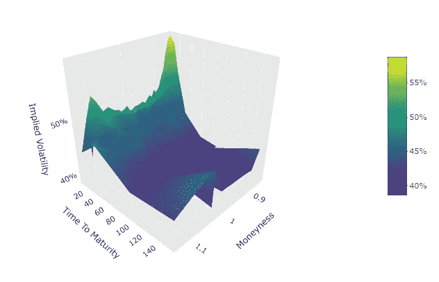

苹果股票的隐含波动率表面(图片由作者提供)

在我们经历必要的步骤来获得和绘制如上图所示的隐含波动率表面之前，我们需要先回答几个问题:

*   什么是隐含波动率，为什么它很重要？
*   隐含波动率是如何计算的？
*   什么是波动表面？

***注:*** *如果你已经熟悉隐含波动率曲面和期权定价的概念，可以跳到第 2 节。下一节将介绍一些关键概念、符号和代码片段，它们将贯穿本文的其余部分。然而，完整的代码可以在文章的结尾找到。*

## 什么是隐含波动率，为什么它很重要？

根据[维基百科](https://en.wikipedia.org/wiki/Implied_volatility)，隐含波动率定义如下:

> 期权合约的**隐含波动率** ( **IV** )是基础工具的波动率的值，当输入期权定价模型时，将返回等于所述期权的当前市场价格的理论值。

简单来说，IV 是基于股票当前交易期权价格的股票价格预期未来波动的度量。通常用百分比值来表示股票的预期年标准差范围。

例如，如果苹果(AAPL)目前的交易价格为 119.02，IV 为 25%，这将意味着，预计从现在起一年内，其股价以 68%的概率(对应于正态分布的 1 个标准差)介于 89.27(119.02 *(1-0.25))和 148.78 (119.02 * (1 + 0.25))之间。

那么为什么隐含波动率很重要呢？IV 让我们了解市场参与者如何评估股票价格的不确定性。因此，它是一只股票总体潜在风险的良好指标，也是预期交易范围的预测指标。此外，股票的 IV 允许我们用目前在市场上看不到的参数化期权定价。最后，IV 可用于评估不同股票期权之间的相对价值。由于期权的价格取决于标的的价格，因此不适合比较不同股票的期权。这就是为什么期权价格也经常以波动性而不是价格来报价。

## 隐含波动率是如何计算的？

隐含波动率一般是通过求解期权定价模型的逆定价公式来计算的。这意味着，不是使用定价模型来计算期权的价格，而是在市场上观察到的价格被用作输入，输出是波动率。

最著名的期权定价模型是[广义布莱克-斯科尔斯-默顿模型](https://en.wikipedia.org/wiki/Black%E2%80%93Scholes_model)。虽然这一模型多年来受到了相当多的批评，但由于其简单性和封闭形式的解决方案，它在实践中被广泛使用，我们将在本文中通篇使用它。

欧式看涨期权和看跌期权的封闭解是:

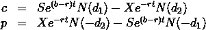

欧式看涨和看跌期权的封闭解

在哪里

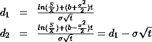

d1 和 d2 的公式(图片由作者提供)

*   s 是当前的股票价格
*   x 是期权执行价格
*   σ是隐含波动率
*   b 是广义持有成本参数(包括例如无风险利率、股息收益率，如果适用)
*   t 是以年为单位的成熟时间
*   N(x)是累积正态分布函数

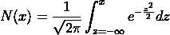

累积正态分布函数(图片由作者提供)

这在 r 中很容易实现。

虽然定价模型为我们提供了一个封闭形式的解决方案，但用于获得 IV 的反向定价模型没有这样的解决方案。因此，我们需要使用优化器来计算 IV。为此，我们在 R 中实现一个目标函数，然后使用*优化*函数来获得 IV。

让我们通过使用一些真实世界的数据来检查我们的实现是否有效。我们将以苹果公司(AAPL)为例。我们可以从雅虎财经获得我们需要的所有数据，股票数据在这里是，最新的期权价格在这里可以找到。下面是我们将在示例中使用的数据截图。

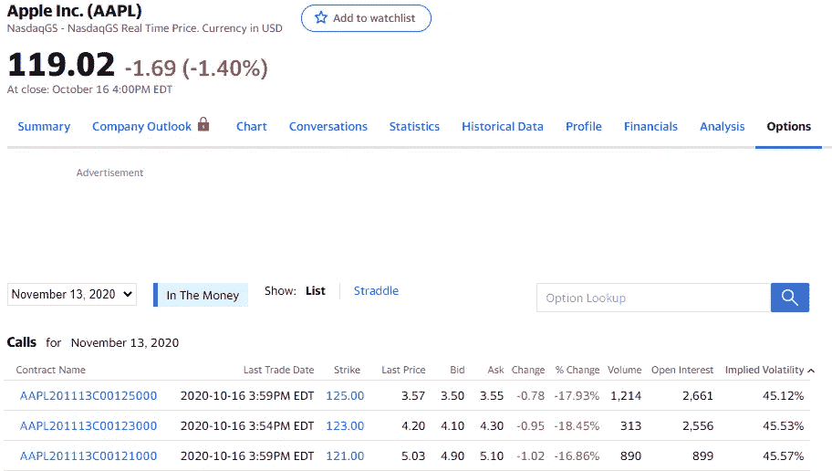

AAPL 股票的样本数据(截图来自雅虎财经)

从截图中我们可以看到，目前的股价(10 月 16 日)是 119.02，列表中的第一个执行价格是 125，期权价格(我们用的是要价)是 3.55，到期时间是 28 天，显示的 IV 是 45.12%。我们自己计算 IV 所缺少的就是无风险利率。作为近似值，我们将采用 3 个月美国国债利率，目前为 0.11%(你可以在这里找到数据)。

将这些值代入我们的优化函数会产生以下结果:

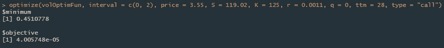

隐含波动率计算的样本结果(图片由作者提供)

我们的优化产生了 45.11%的 IV，而雅虎财经显示的 IV 为 45.12%。相当不错的搭配(而且好像雅虎财经也在用广义布莱克·斯科尔斯模型)。

***注:*** *你大概已经意识到我们在优化中把股息率 q 设为 0，得到了和雅虎财经一样的结果。当检查苹果的股息率时，可以看到它不是 0。这表明雅虎财经提供的数据可能不完全准确。因此，我们将坚持我们自己的计算。*

看着上面的样本数据，你可能已经观察到隐含波动率随着执行价格以及选择不同的到期日而变化。这一观察最终将我们引向隐含波动率表面。

## 什么是波动表面？

Black Scholes Merton 原始模型的一个主要缺点是，它假设执行价格的波动是恒定的。然而，在实践中，可以观察到不同履约价格的不同波动性。这就是所谓的[波动微笑](https://en.wikipedia.org/wiki/Volatility_smile)。不同到期日的期权也是如此。因此，隐含波动率沿两个维度变化，即执行价格和到期时间。由于行权价格取决于标的股价，因此不适合跨不同股票进行比较。使用期权货币来代替执行价格。这就是买入期权的股价/执行价和卖出期权的执行价/股价的比值。

这就产生了波动率表面，这是准确定价期权和评估股票价格的潜在不确定性所必需的。

在这个相当长的介绍之后，我们将最后看看如何从实际市场数据中获得隐含波动率表面，并在不同股票之间进行比较。

# 2.数据

与历史股票数据不同，历史期权链不是那么容易得到的(尤其不是免费的)。然而，由于我们最关心的是用于定价和风险评估的隐含波动率表面的当前状态，所以当前数据也可以。

如简介部分所示，雅虎财经涵盖了我们，例如，你可以在这里找到苹果[目前的期权链。为了加载 R 中的数据，我们可以使用 **quantmod** 包中的 *getOptionChain* 函数，或者自己抓取。我决定采用后者，因为 getOptionChain 函数没有返回 yahoo finance 提供的 IV 列，我想将这些值与我自己计算的值进行比较。此外，练习网络抓取总是好的！](https://finance.yahoo.com/quote/AAPL/options)

下面的代码使用 **quantmod** 包来获取一般的股票信息，使用 **rvest** 包来抓取期权链。为了避免不可靠的数据点，我们删除了股票上个交易日的最后 5 分钟内没有交易的期权(因为我们将使用股票收盘价来计算 IV ),并设定了资金边界(在 0.85 和 1.15 之间)和到期时间(在 7 天和 6 个月之间)。

这给了我们两个数据框架，一个是看涨期权，一个是看跌期权。

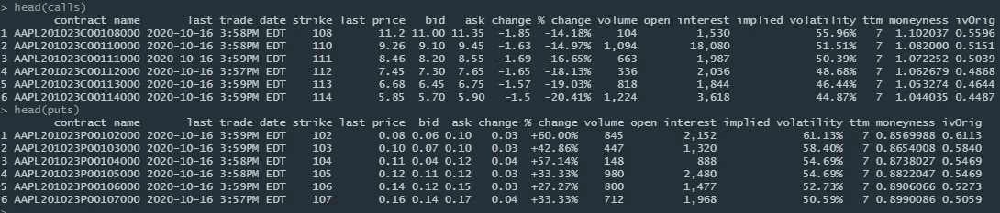

AAPL 看涨和看跌期权的数据框(图片由作者提供)

# 3.隐含波动率计算

接下来我们自己根据给定的数据计算隐含波动率。你可能会问自己，如果我们可以从雅虎财经获得数据，我们为什么要这样做。我们这样做的原因如下:

*   我们希望能够自己进行这种计算，这样我们就可以在没有 IV 可用的情况下对选项使用相同的方法
*   如介绍中所述，数据计算似乎没有使用股息率

我们将继续以苹果为例，使用引言中描述的方法计算 IV，而不使用股息率。提醒一下，这是我们将要使用的代码。

作为检查，我们可以绘制通过我们的计算获得的 IV 和来自 yahoo finance 的数据之间的差异。

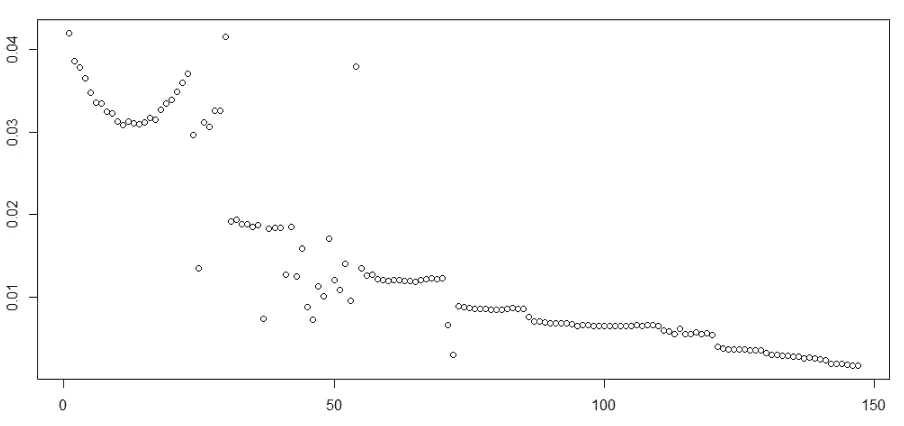

AAPL 电话的计算 IV 与雅虎财经的价值的比较(图片由作者提供)

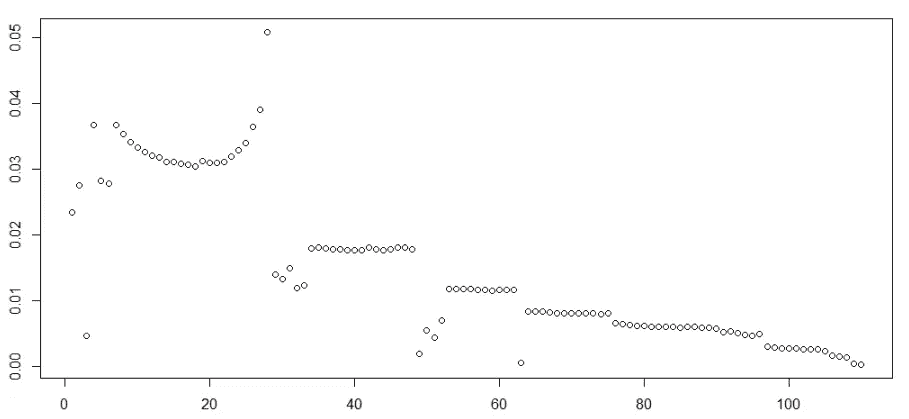

AAPL 看跌期权的计算 IV 与雅虎财经的价值比较(图片由作者提供)

我们可以观察到隐含波动率之间的绝对差异很小，并且随着到期时间的推移而减小。这是由于前面提到的事实，即我们基于收盘价计算 IV，而最后交易的期权价格基于略有不同的股票价格。这种效应在成熟前的时间越短越强。

在这个例子中，我们没有包括股息收益率。但是，展望未来，我们将包括它。幸运的是，可以使用 **quantmod** 包中的 *getQuote* 函数轻松获得数据。我们现在可以重新运行 IV 计算，并使用 **reshape2** 包中的 *acast* 函数来创建买入和卖出的 IV 网格。

检查生成的网格会发现，由于没有针对所有履约/到期日的期权价格，我们有相当多的 NAs:

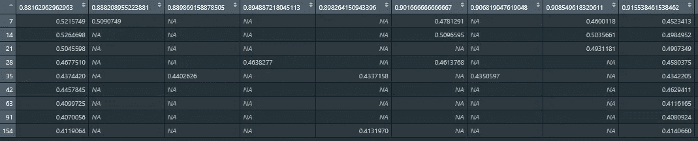

AAPL 看涨期权的波动率网格(图片由作者提供)

为了填补缺失值，我们需要对曲面进行插值。

# 4.曲面插值

为了执行插值，我们将使用 **akima** 包中的 *interp* 函数。它实现了不规则数据的网格二元插值，基本上正是我们需要的。

为了获得完整的表面，我们需要采取的步骤如下:

1.  获取每个缺失值的坐标
2.  在缺失值周围获取一个最大尺寸为 11x11 的网格
3.  使用此格网通过线性或样条插值对缺失值进行插值
4.  用插值替换缺失的值

下面是一个代码示例，对缺失的调用值做了进一步的解释。

现在我们有了苹果股票看涨期权的完整隐含波动率表面！我们可以使用 **plotly** 包在一个漂亮的交互式图表中绘制我们的结果。

苹果股票的隐含波动率表面(图片由作者提供)

我们可以使用相同的代码来获得其他股票的表面，例如特斯拉。

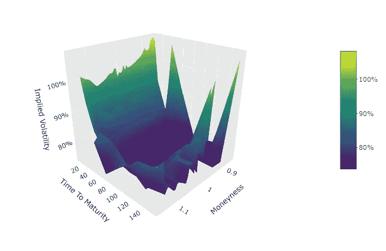

特斯拉股票的隐含波动率表面(图片由作者提供)

我们可以立即看到这两只股票之间的差异，特斯拉本来就比苹果更不稳定，这表现在波动性表面。简单地看期权价格不会显示这一点，因为它们取决于基础股票价格，并且不可能在不同股票之间进行比较。

# 5.结论

在本文中，我详细介绍了使用免费提供的数据和 r 来获得股票期权的当前隐含波动率表面的过程。这可以用来比较不同股票和定价期权合约的风险。使用 **plotly** ，我们可以创建一个交互式的波动率表面图表，用于即时分析或在仪表板中显示。

请务必让我知道，如果你有任何反馈或建议，以改善我在这篇文章中所描述的！

## 完整代码