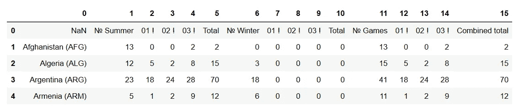
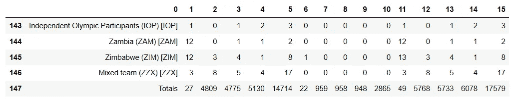
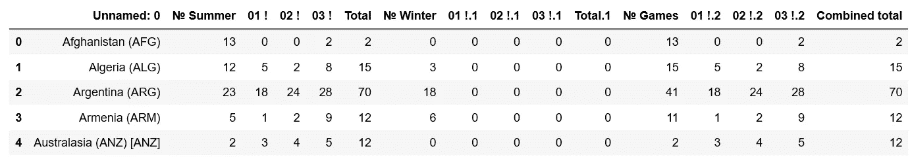
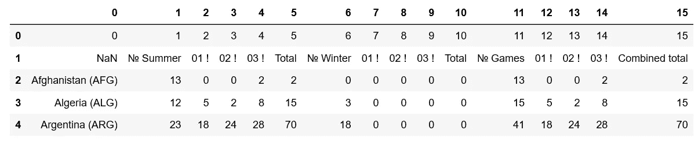
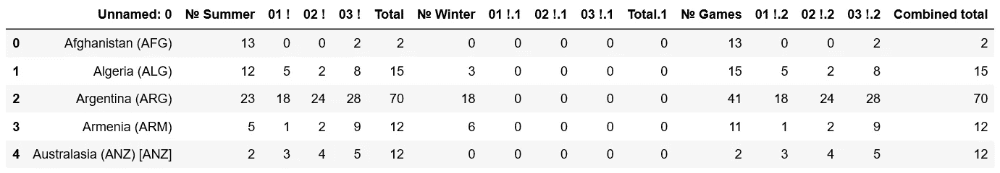
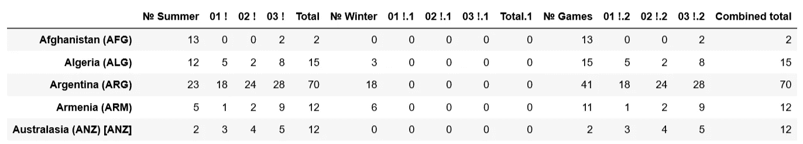
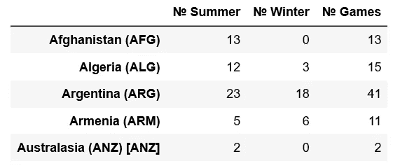
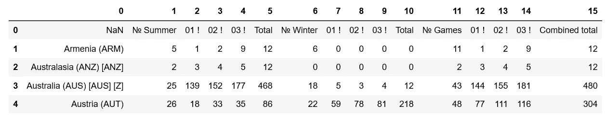

# 使用 skiprows、skipfooter、usecols、index_col 和 header 选项将 CSV 文件导入为 Pandas DataFrame

> 原文：<https://towardsdatascience.com/import-csv-files-as-pandas-dataframe-with-skiprows-skipfooter-usecols-index-col-and-header-fbf67a2f92a?source=collection_archive---------18----------------------->

## 学习使用 read_csv 函数及其提供的一些非常有用的参数

来源:作者

CSV 文件是一种非常常见和流行的数据存储格式。数据科学家几乎定期处理 CSV 文件。Pandas 不仅可以选择将数据集导入为常规的 Pandas 数据帧，还可以选择在导入时清理和调整数据帧。在这里，我想讨论其中的几个选项:

使用 read_csv 方法将 pandas 和数据集作为数据帧导入:

```
import pandas as pddf = pd.read_csv(‘olympics.csv’)
df.head()
```



来源:作者

在本教程中，我使用了数据集“olympics.csv”。请 **c** [***点击此处***](https://github.com/rashida048/Datasets) 为数据集。

df.head()只给出数据帧的前五行，因此我们可以看到数据帧的一些属性。df.tail()返回数据帧的最后五行。也可以指定行数。像 df.head(8)将返回前 8 行。您可以使用数据帧长度范围内的任何数字。可以用同样的方式在 df.tail()中指定行数。

```
df.tail()
```



来源:作者，数据框的最后五行

看数据集。在顶部，有一个不必要的行。这不是标题。有一个名为 skiprows 的选项可以去掉不必要的行。

```
df1 = pd.read_csv(‘olympics.csv’, skiprows = 1)
df1.head()
```



来源:作者，在 skiprows 中使用 read_csv

这里 skiprows = 1，意味着删除一行。默认情况下，它将从顶部删除一行。您可以使用 skiprows 删除 2、3、4 或任意数量的行。但是您可能不想从顶部删除所有行。比如你可能想删除第一行，第三行，第四行。在这种情况下，您可以在列表中指定行。

```
df2 = pd.read_csv(‘olympics.csv’, skiprows = [0, 2, 3])
```

有时在 CSV 文件中，没有标题，只有值。但默认情况下，熊猫以第一行为表头。为了避免这种情况，我们可以使用“header = None”。在这个数据集中，有一个头。但是为了这个例子，让我们假设没有标题。

```
df3 = pd.read_csv(‘olympics.csv’, header = None)df3.head()
```



来源:作者，使用 read_csv，标题=无

看，熊猫在顶部多加了一行标签来增加标题。它没有将原始数据集中的任何一行作为标题。但是，在这个数据集中，有一个标题。第二行，这意味着行索引 1 是一个标题。让我们通过添加 header = 1 将第二行的第一行指定为标题。

```
df4 = pd.read_csv(‘olympics.csv’, header = 1)df4.head()
```



来源:作者，使用 header=1 的 read_csv

在此数据框架中，默认索引列是一个通用序列。有一个有意义的索引是有用的。导入时，您可以将索引设置为您想要的任何列。我选择第一列的国名。所以列索引为零。请记住，索引列被视为一个列。

```
df5 = pd.read_csv(‘olympics.csv’, index_col = 0, skiprows = 1)df5.head()
```



来源:作者，将 read_csv 与 skiprows 和 index_col 一起使用

有时数据集的所有列对于分析来说可能不是必需的。尤其是当数据集太大时，呈现一部分总是有意义的。不然就变得太难理解了。这里有一种导入几列的方法。

```
df6 = pd.read_csv(‘olympics.csv’, skiprows = 1, usecols = [‘Unnamed: 0′,’№ Summer’, ‘№ Winter’, ‘№ Games’], index_col = 0)df6.head()
```



来源:作者、使用 skiprows 的 read_csv、使用列和 index_col

让我们再次回到 skiprows。使用“for 循环”可以跳过任何范围的行。这个选项有时非常有用。我在这里使用了一个简单的 for 循环。

```
df7 = pd.read_csv(‘olympics.csv’, skip_blank_lines = False, skiprows = [i for i in range(2, 5)] )df7.head()
```



来源:作者，read_csv 的使用，其中 skiprows 采用 for 循环

另一个非常动态的想法是定义一个函数，并使用该函数跳过或保留您需要的行。对于这个例子，我在这里定义了一个简单的函数。仅返回偶数索引行的函数。然后，在 skiprows 中使用它来跳过偶数索引行。

```
def even_rows(index):
    if index%2 == 0:
        return True
    return Falsedf8 = pd.read_csv(‘olympics.csv’, skiprows = lambda x: even_rows(x) )df8.head()
```

最后，我应该谈谈 skipfooter。Skipfooter 从数据帧的底部跳过行。在这里，我对 skipfooter 使用值 3。因此，它将从页脚跳过三行。

```
df10 = pd.read_csv(‘olympics.csv’, header = 1, skipfooter = 3)df10.tail()
```

这就是我想分享的关于使用熊猫图书馆在笔记本中导入 CSV 文件的全部内容。我希望它有帮助。