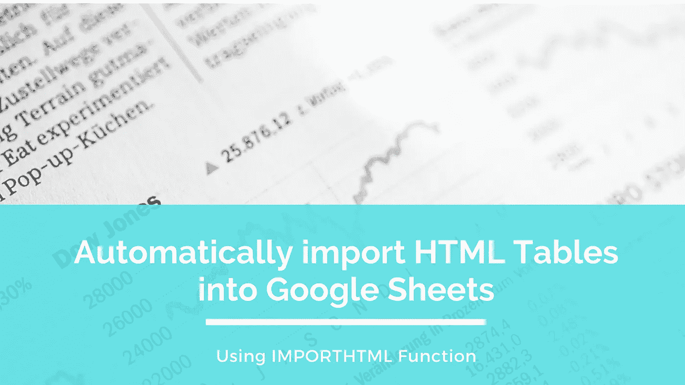
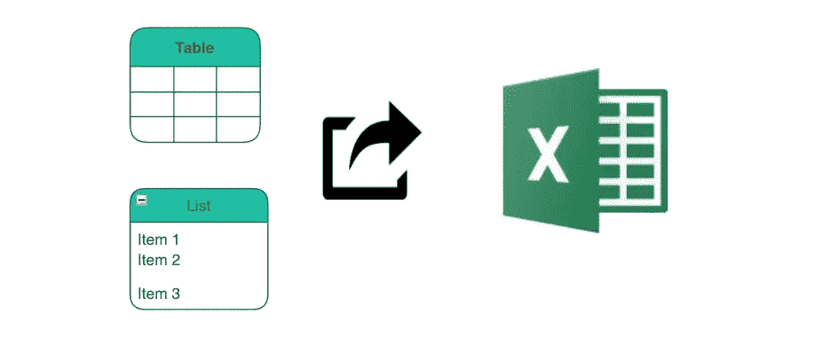
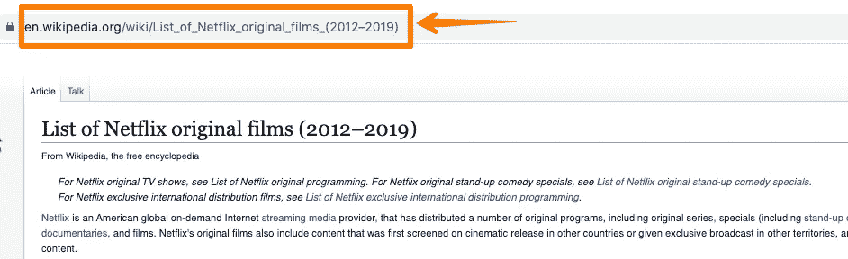
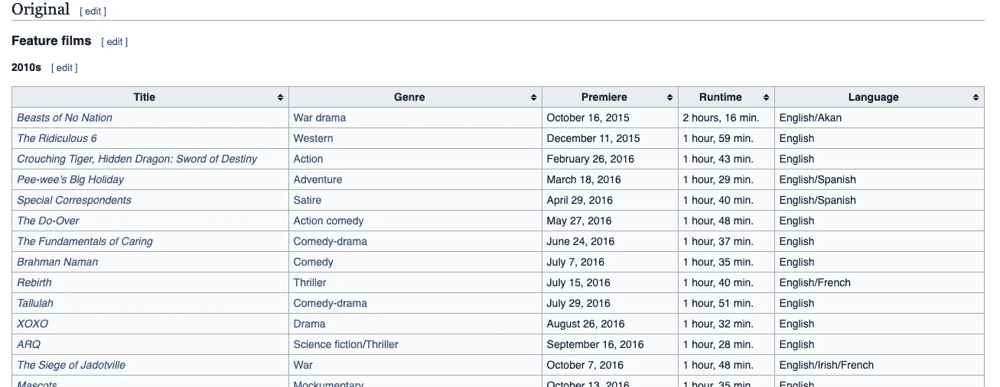
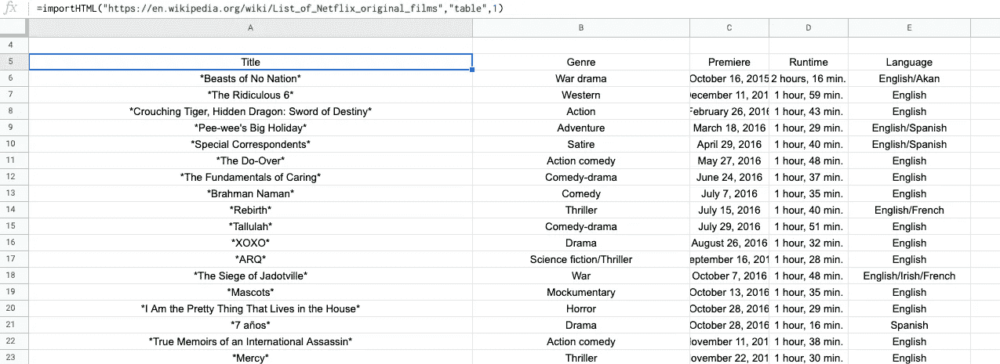
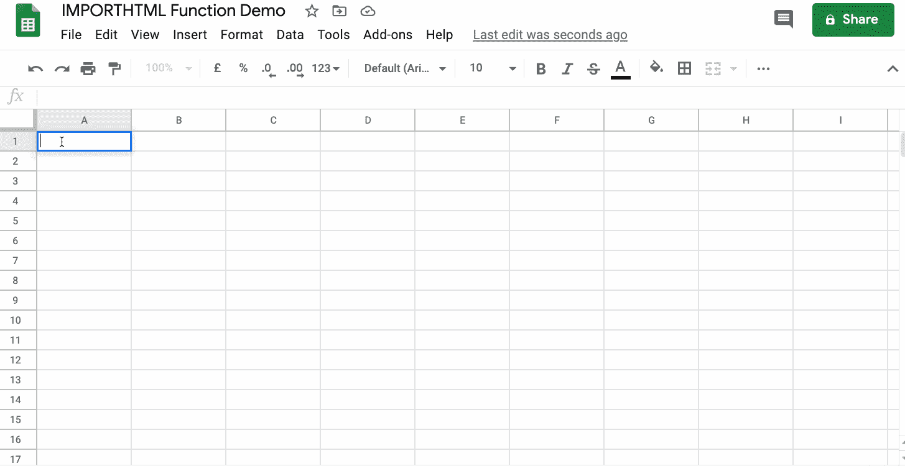
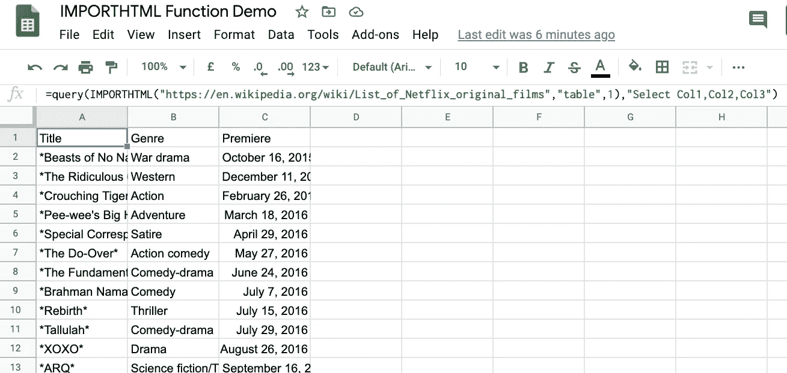
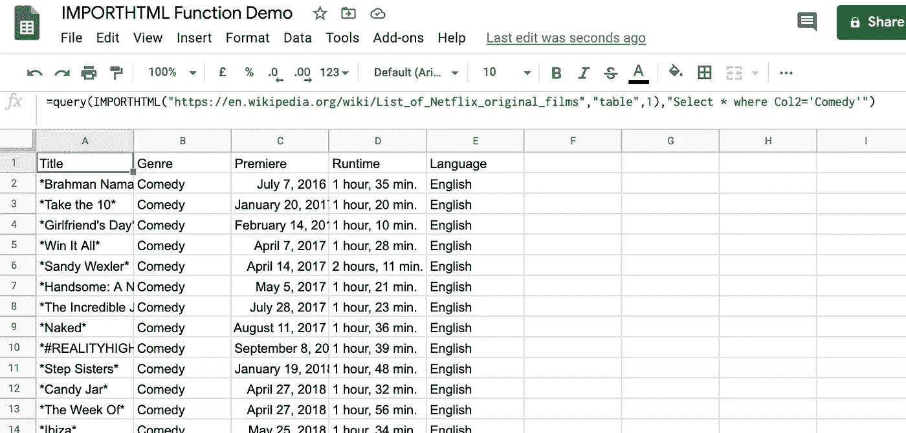

# 将 HTML 表格轻松导入 Google Sheets。

> 原文：<https://towardsdatascience.com/import-html-tables-into-google-sheets-effortlessly-f471eae58ac9?source=collection_archive---------1----------------------->

## 了解如何使用 Google Sheets 中的`IMPORTHTML`功能，从网站导入表格和列表。



由[马库斯·斯皮斯克](https://unsplash.com/@markusspiske?utm_source=unsplash&utm_medium=referral&utm_content=creditCopyText)在 [Unsplash](https://unsplash.com/s/photos/spreadsheet?utm_source=unsplash&utm_medium=referral&utm_content=creditCopyText) 上拍摄的原始照片

> "从互联网上获取信息就像从消防水管里喝水一样."— [*米切尔·卡普尔*](https://www.computerhope.com/people/mitchell_kapor.htm)

互联网上充斥着大量数据。然而，以正确的格式获取数据才是真正的大事。将数据转换成适合分析的格式需要一定的清理和过滤。上周，我在维基百科上偶然发现了一些非常好的表格数据集。和往常一样，我把数据复制粘贴到 excel 表格上。在大多数情况下，它工作得很好，但是典型的复制-粘贴方法很少失败:

*   当表格通常很长并且遍布整个网页时
*   当数据不是静态的，也就是说，它定期更新。因此，每次原始数据集发生变化时，我都必须再次获取数据集。

对于这种情况，简单的复制粘贴是不够的。抓取是另一个选择，但是我在寻找一个快速简单并且不需要太多代码的东西。就在那时，我在 Google Sheets 中发现了一个叫做`**IMPORTHTML**,` 的便利功能，它非常适合从 HTML 页面的表格或列表中导入数据。在本文中，我将描述将表格(和列表)提取到 google sheets 的端到端过程。

> 在提取或导入尚未由您管理的数据之前，请确保您拥有必要的权限。此外，这种方法只有在数据公开的情况下才有效，这意味着不应该有授权等要求。

这篇文章是寻找好数据集的完整系列文章的一部分。以下是该系列中包含的所有文章:

**第 1 部分** : [为数据分析任务获取数据集—高级谷歌搜索](/getting-datasets-for-data-analysis-tasks-advanced-google-search-b1c01f9cc324)

**第二部分** : [为数据分析任务寻找数据集的有用站点](/useful-sites-for-finding-datasets-for-data-analysis-tasks-1edb8f26c34d)

**第 3 部分** : [为深度学习项目创建定制图像数据集](/creating-custom-image-datasets-for-deep-learning-projects-6e5db76158d4)

**第 4 部分** : [毫不费力地将 HTML 表格导入 Google Sheets](/import-html-tables-into-google-sheets-effortlessly-f471eae58ac9)

**第 5 部分** : [使用 Camelot，从 pdf 中提取表格数据变得很容易。](/extracting-tabular-data-from-pdfs-made-easy-with-camelot-80c13967cc88)

**第六部分** : [从 XML 文件中提取信息到熊猫数据框架](/extracting-information-from-xml-files-into-a-pandas-dataframe-11f32883ce45)

**第 7 部分** : [5 个真实世界数据集，用于磨练您的探索性数据分析技能](/5-real-world-datasets-for-exploratory-data-analysis-21b7cc5afe7e)

# 句法



作者图片

在使用函数之前，我们先快速了解一下`IMPORTHTML`函数的语法。`IMPORTHTML`函数接受三个不同的参数，编写如下:

```
IMPORTHTML(**URL**, query, index)
```

## 因素

*   **URL** :指表格所在页面的 URL。不要忘记添加协议(例如 [http://)](/).) ，并确保 URL 在引号内。
*   **查询**:查询可以是表格，也可以是项目列表。例如，如果您想要导入一个表，请在引号中提到**表**，否则请提到一个**列表**。
*   **索引:**指表格在网页上的位置，从 1 开始。

# 用法:导入表格

现在让我们看看如何快速无缝地将维基百科文章中引用的 HTML 表格导入到 Google sheet 中。页面标题为: [**网飞原创电影列表**](https://en.wikipedia.org/wiki/List_of_Netflix_original_films) ，包含美国全球点播互联网流媒体提供商**发行的各类电影和节目信息。**

## **第一步:复制网址**

****

**图片来源:[维基百科](https://en.wikipedia.org/wiki/List_of_Netflix_original_films)**

## **第 2 步:选择要导入的表**

**假设我们想要导入所有的故事片，这是页面上的第一个表。**

****

**图片来源:[维基百科](https://en.wikipedia.org/wiki/List_of_Netflix_original_films)**

## **第三步:在谷歌表单中添加公式**

**创建一个新的 Google 工作表，或者在现有的工作表中创建一个新的标签。在指定 URL、查询和索引号的单元格中输入以下公式。**

```
*=IMPORTHTML("https://en.wikipedia.org/wiki/List_of_Netflix_original_films_(2012%E2%80%932019)","table",1)*
```

**瞧啊。整个表格被提取并填充到电子表格中。以下是你在谷歌表单中看到的内容:**

****

**作者图片**

**让我们结合以上三个步骤，看看下面的端到端演示:**

****

**作者图片**

**您可以用同样的方式导入列表。唯一的变化是用函数参数中的列表替换单词 table。**

# **定制输出:使用查询功能**

**您可以做很多事情来定制导入的数据。这可以通过结合使用`[**Query**](https://support.google.com/docs/answer/3093343?hl=en-GB)` 函数和`IMPORTHTML.`函数来实现。`**Query**`函数跨数据运行谷歌可视化 API 查询。让我们来看看实现这一点的一些方法:**

## **限制导入列的数量**

**假设您不想导入所有的列，而是选择几列。您可以传递所需列的索引。例如，如果我们只需要前三列，我们的函数如下:**

```
=query(IMPORTHTML("https://en.wikipedia.org/wiki/List_of_Netflix_original_films","table",1),"Select Col1,Col2,Col3")
```

****

**作者图片**

**看看我们是如何用`query`函数包围`IMPORTHTML`函数并指定列索引的。**

## **基于列筛选数据**

**另一种情况是当我们想要一些特定的数据时，即只关于喜剧类型的数据。这可以很容易地做到，如下所示:**

```
=query(IMPORTHTML("https://en.wikipedia.org/wiki/List_of_Netflix_original_films","table",1),"Select * where Col2='Comedy'")
```

****

**作者图片**

**查看`QUERY`功能的官方文档，了解使用它的其他方法。**

# **结论**

**在本文中，我们看到了`IMPORTHTML`函数的强大功能，以及如何使用它将来自网站、博客和其他 HTML 源的表格和列表直接导入 google 电子表格。从那里，您可以对数据集执行几个分析任务，并从中获取有意义的信息。您还可以提取数据并与他人共享，这样他们也可以利用这些数据。**