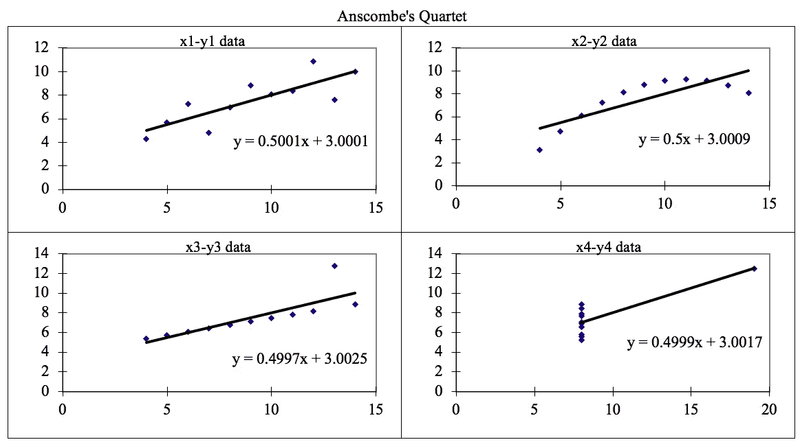
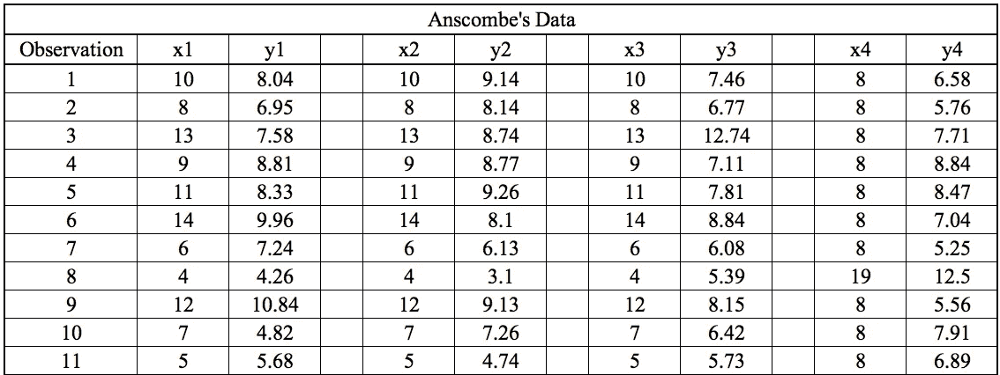
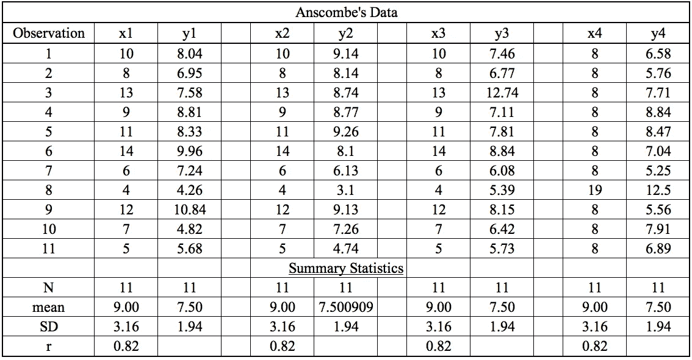
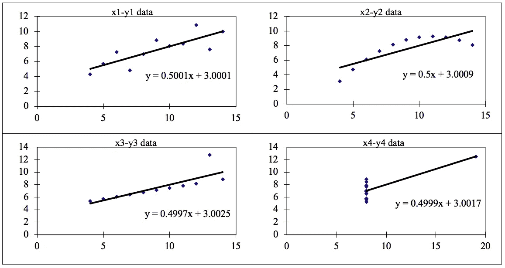

# 数据可视化的重要性——Anscombe 的四重奏。

> 原文：<https://towardsdatascience.com/importance-of-data-visualization-anscombes-quartet-way-a325148b9fd2?source=collection_archive---------15----------------------->

## 进入现实世界

## 四个数据集欺骗了线性回归模型。

作者图片

> 安斯科姆的四重奏由四个[数据集](https://en.wikipedia.org/wiki/Data_set)组成，它们具有几乎相同的简单[描述性统计](https://en.wikipedia.org/wiki/Descriptive_statistics)，然而具有非常不同的分布，并且在绘制时显得非常不同。
> —维基百科

**Anscombe 的四重奏**可以定义为一组四个数据集，它们在简单的描述统计学中**几乎相同，但是数据集中有一些特性，如果建立的话**会欺骗回归模型**。它们具有非常不同的分布，并且在散点图上绘制时**呈现不同的**。**

它是由统计学家 **Francis Anscombe** 在 1973 年构建的，用以说明在分析和建模之前**绘制图表**的**重要性**，以及其他**观测对统计特性**的影响。这四个数据集图具有几乎**相同的统计观察值**，提供相同的统计信息，包括所有四个数据集中所有 x，y 点的**方差**和**均值**。

这告诉我们，在应用各种算法来构建模型之前，可视化数据的重要性，这表明必须绘制数据特征，以便查看样本的分布，这可以帮助您识别数据中存在的各种异常，如异常值、数据的多样性、数据的线性可分性等。此外，线性回归只能被视为适合具有线性关系的**数据，不能处理任何其他类型的数据集。这四个图可以定义如下:**

作者图片

所有这四个数据集的统计信息大致相似，可以计算如下:

作者图片

当这些模型绘制在散点图上时，所有数据集都会生成不同类型的图，任何回归算法都无法对其进行解释，这些算法会被这些特性所迷惑，如下所示:

作者图片

这四个数据集可以描述为:

1.  **数据集 1:** 这个**非常符合**线性回归模型。
2.  **数据集 2:** 该**无法很好地拟合**数据的线性回归模型，因为数据是非线性的。
3.  **数据集 3:** 显示了数据集中涉及的**异常值**，这些异常值**不能用线性回归模型**处理
4.  **数据集 4:** 显示数据集中涉及的**异常值**，这些异常值**不能用线性回归模型**处理

# 结论:

*我们已经描述了四个数据集，这四个数据集旨在描述数据可视化的重要性，以及任何回归算法如何被数据可视化所欺骗。因此，在对数据集中的所有重要特征实施任何机器学习算法之前，必须将其可视化，这将有助于建立良好的拟合模型。*

感谢阅读。你可以在这里找到我的其他[机器学习相关的帖子](https://towardsdatascience.com/@imsparsh)。

希望这篇帖子有用。我感谢反馈和建设性的批评。如果你想谈论这篇文章或其他相关话题，你可以在这里或在 [LinkedIn](https://www.linkedin.com/in/imsparsh/) 给我发短信。

 [## 线性回归中的假设你可能不知道。

### 模型应该符合这些假设，以产生与数据的最佳线性回归拟合。

towardsdatascience.com](/assumptions-in-linear-regression-528bb7b0495d)  [## 机器学习中最常见的损失函数

### 每个机器学习工程师都应该了解机器学习中这些常见的损失函数，以及何时使用…

towardsdatascience.com](/most-common-loss-functions-in-machine-learning-c7212a99dae0)