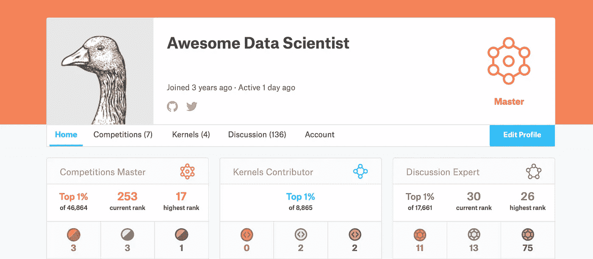

# 使用表格数据进行预测建模时的重要考虑事项

> 原文：<https://towardsdatascience.com/important-considerations-to-make-while-predictive-modeling-17aac6b188d9?source=collection_archive---------36----------------------->

## 我对 Coursera.org“如何赢得顶级 Kagglers 的数据科学竞赛”的笔记

[https://www.kaggle.com/progression](https://www.kaggle.com/progression)

总的来说，我觉得这门课很有帮助，也很有见地，4.79/5。有许多我以前没有考虑过的想法，所以我在这里贴了一些我的笔记。很有可能，你已经看到了这些想法的大部分，所以我将试着把重点放在最有趣的。这是课程的[链接](https://www.coursera.org/learn/competitive-data-science/home/welcome)。

## 火车运行公司

1.  **数据探索清单**
2.  **验证**
3.  **目标泄漏**
4.  **度量和损失函数**
5.  **指标优化**
6.  **表示编码**
7.  **编码提示**
8.  **高级特征工程**
9.  **群策群力**
10.  **堆叠网**
11.  **创建一套多样化的模型**
12.  **元学习和堆叠技巧**
13.  **XG boost 中基于文本的功能**
14.  **序列特征提取(XGBoost)**
15.  **半监督&伪标签**
16.  **我的看法**

## 数据探索清单

1.  检查缺失值和异常值
2.  检查分类变量的唯一计数
3.  分割出数据类型，即数值型、分类型
4.  创建“大于”列级比较矩阵
5.  寻找相关变量的聚类
6.  创建图以找到强大的功能交互

步骤 1、2、3 是几乎每个数据探索管道的一部分。步骤 4、5、6 涉及绘制和比较特征，即，使用 pd.crosstab、相关矩阵或聚合数据。

## 确认

K-Fold 验证可以说是建模过程中最重要的步骤。出折叠(OOF)样本的预测用于评估模型的平均性能。这也用于超参数调整和模型性能比较。有趣的是，跨 K 个折叠的性能变化也可用于诊断目的，即检查每个折叠中预测的波动性。

## 目标泄漏

目标泄漏是一个负载话题。基本上，我们不希望模型从生产环境中不可用的信息中学习。索引功能或索引功能的组合可能会导致目标泄漏。更一般地说，目标漏损可以是导致良好模型性能和低附加值的任何东西。

## 度量和损失函数

这里总结了常见的损失函数和指标。

1.  MAE——平均绝对误差——当数据集包含大多数数据集不常见的异常值时，优于 MSE
2.  RMSLE——均方根对数误差——倾向于过度预测，而不是不足预测
3.  MAPE-平均绝对百分比误差-对较大目标值的误差惩罚较少
4.  MSPE —均方百分比误差
5.  AUC——曲线下面积——估计高于随机的模型准确度百分比
6.  混淆矩阵-分类器如何在类之间分配预测
7.  Weight Cohen's Kappa —使用误差矩阵和混淆矩阵来估计(加权误差)除以加权基线，以估计分类器性能。评分者同意系数。

## 度量优化

1.  MAPE 和 MSPE 可通过样本权重或重采样进行优化，即 MAPE 的 1/y_i/sum(1/y_i)
2.  在分类模型中，模型的输出概率可能与目标变量的分布不匹配。概率可以用模型叠加来校准。校准可以用目标的分类概率和滚动平均值的 CDF 来可视化。
3.  当期望的度量在验证数据集上变得更差时，可以利用早期停止来停止训练。

## 平均编码

均值编码是一个潜在的强大工具，但它也很有可能增加偏差。可以通过使用 K 倍插补、留一插补、平滑平均编码和扩展平均编码来减轻偏倚。这些策略的一些示例代码可以在我的 GitHub [这里](https://github.com/freedomtowin/data-eng-util/blob/master/machine-learning/mean-encoding-regularization.py)找到。

K 倍 CV 均值编码策略可总结如下:

1.  分离训练和测试装置
2.  分裂训练→ K 折叠训练和 OOF 验证，
3.  对 K-fold 训练进行均值编码，然后将值映射到 OOF 验证
4.  组合来自 OOF 数据集的均值编码，然后追加到训练数据集
5.  估计整个训练的编码，然后映射到测试集

分类变量之间的相互作用也可以进行均值编码。显然，从 XGBoost 中挖掘特性交互是可能的，这里是[链接](https://github.com/Far0n/xgbfi)。通过计算两个要素在随机森林中同时出现的次数，您可以创建自己的函数来实现这一点。

## 编码技巧

1.  使用宏加速编码和编辑
2.  尝试各种理论，并试图理解为什么一个理论行得通/行不通
3.  建立一个快速基线模型，并专注于功能开发
4.  修复模型的随机种子
5.  将验证训练/测试分割保存在单独的文件中
6.  把预测建模想象成一个难题
7.  寻找团队成员，整合结果并分享见解
8.  将所有不同的模型保存在不同的文件中

## 高级特征工程

1.  计算分类组中的最小值、最大值、平均值和标准值(类似于平均值编码)
2.  最近邻统计，N 个最近邻的平均值:平均目标变量，聚类中的平均距离，到分类值的平均距离
3.  矩阵分解/降维/t-SNE

## 整体策略

集成策略使用几个模型的输出到单个预测模型中，通常可以改善结果。

*   加权平均
*   制袋材料
*   加权推进
*   梯度推进
*   堆垛

将模型输出一起平均可以降低任何一个模型中的噪声。可以使用 K 倍 CV 来调整集合权重。权重也可以针对特定类别或目标类进行调整。

**Bagging:** 创建同一模型的不同版本，并将结果平均在一起。通过改变随机种子、模型参数、行选择和/或列选择来创建不同的模型。

**Boosting:** 通过一个接一个地顺序训练 ML 模型，将许多弱学习器转换为强估计器，其中每个模型被建立以校正前一个模型的错误。在梯度增强决策树(即 XGBoost)中，梯度和 Hessian 矩阵用于确定哪些特征值得分裂。下面是一些关于 XGBoost 如何工作的有用链接:[简明解释](/how-does-xgboost-work-748bc75c58aa)，[文档](https://xgboost.readthedocs.io/en/latest/tutorials/model.html)，[原始论文](https://arxiv.org/pdf/1603.02754.pdf)。

下面是 boosting 算法的简短总结:第一次迭代根据目标的平均值计算误差，其中平均值是预测堆栈中的第一个模型。所有后续模型通过学习速率η*来缩放。模型估计器的数量应该与学习率成反比。

Scikit-learn 有一个为定制模型 sk learn . ensemble . adaboostclassifier 创建增强解决方案的实现。

**堆叠:**将一组不同的模型组合到另一个模型中，即随机森林、线性模型等。这个过程需要减少目标泄漏。第一组模型的输出不应用于训练第二层第一层以前已经“看到”的数据。对于各种情况，有各种不同的堆叠策略。

以下是本课程第四周的摘录:

**a)简单维持方案**

1.  将列车数据分为三部分:partA、partB 和 partC。
2.  在 partA 上拟合 N 个不同的**模型**，分别为 partB、partC、test_data 获得*元特征* partB_meta、partC_meta 和 test_meta。
3.  将**元模型**拟合到零件 B_meta，同时在零件 C_meta 上验证其超参数。
4.  当**元模型**被验证后，将其拟合到[零件 b _ 元，零件 c _ 元]并预测测试 _ 元。

**b)具有 OOF 元功能的元维持方案**

1.  将训练数据分成 K 份。遍历每个褶皱:在除当前褶皱之外的所有褶皱上重新训练 N 个不同的**模型**，预测当前褶皱。在这个步骤之后，对于 train_data 中的每个对象，我们将有 N 个*元特征*(也称为*非折叠预测，OOF* )。让我们称它们为 train_meta。
2.  将**模型**拟合到全列车数据，并对测试数据进行预测。我们姑且称这些特性为test_meta。
3.  将 train_meta 拆分成两部分:train_metaA 和 train_metaB。将**元模型**拟合到 train_metaA，同时在 train_metaB 上验证其超参数。
4.  当**元模型**被验证后，将其拟合到 train_meta 并预测 test_meta。

具有 OOF 元特征的元文件夹方案

1.  使用 **b.1** 和 **b.2\.** 获取 *OOF 预测* train_meta 并测试元特性 test_meta
2.  使用 train_meta 上的 KFold 方案来验证**元模型**的超参数。一种常见的做法是将此 KFold 的种子固定为与用于获得 *OOF 预测*的 KFold 的种子相同。
3.  当**元模型**被验证后，将其拟合到 train_meta 并预测 test_meta。

**d)具有 OOF 元功能的维持方案**

1.  将训练数据分成两部分:部分 a 和部分 b。
2.  将 partA 拆分成 K 个折叠。遍历每个折叠:在除当前折叠之外的所有折叠上重新训练 N 个不同的**模型**，预测当前折叠。在这个步骤之后，对于 partA 中的每个对象，我们将有 N 个*元特征*(也称为*折叠外预测，OOF* )。让我们称它们为 partA_meta。
3.  将**模型**拟合到整个 partA，并预测 partB 和 test_data，分别得到 partB_meta 和 test_meta。
4.  将**元模型**拟合到零件 A_meta，使用零件 B_meta 验证其超参数。
5.  当**元模型**通过验证后，基本上执行 2。第三。而不用把 train_data 分成几个部分，然后训练一个**元模型**。也就是说，首先使用**模型获得 train_data 的*出叠预测* train_meta 。**然后在 train_data 上训练**模型**，预测 test_data，得到 test_meta。在 train_meta 上训练**元模型**并预测 test_meta。

**e)具有 OOF 元特征的 k 文件夹方案**

1.  为了验证模型，我们基本上做 **d.1 — d.4** ，但是我们使用具有 M 个折叠的 k 折叠策略将**训练数据分成部分 partA 和 partB M 次。**
2.  元模型通过验证后，执行 **d.5\.**

**f)时间序列中的 k 折叠方案**

在时间序列任务中，我们通常需要预测一段固定的时间。如日、周、月或持续时间为 **T** 的任意时段。

1.  将列车数据分割成持续时间为 **T** 的数据块。选择第一个 **M** 块。
2.  在这些 **M** 个块上拟合 N 个不同的模型，并对块 **M+1** 进行预测。然后将这些模型拟合到第一个 **M+1** 组块上，并预测组块 **M+2** 等等，直到你到达终点。之后，使用所有训练数据来拟合模型并获得测试预测。现在，我们将拥有从编号 **M+1** 开始的组块的*元特征*，以及用于测试的*元特征*。
3.  现在我们可以从第一个 **K 个**组块[ **M+1 个**， **M+2 个**，..， **M+K** 来拟合 2 级模型，并在组块 **M+K+1** 上验证它们。本质上，我们又回到了第一步。用较少的块和*元特征*代替特征。

**g)数据量有限的时间序列中的 k 折叠方案**

我们可能经常遇到这样的情况，方案 **f)** 不适用，尤其是在数据量有限的情况下。例如，当我们只有 2014 年、2015 年、2016 年的数据，而我们需要预测 2017 年全年的数据。在这种情况下，scheme **c)** 可能会有所帮助，但是有一个限制:KFold 拆分应该在时间部分完成。例如，对于有几年数据的情况，我们将每年视为一个文件夹。

1.  将训练数据集分成两部分 A & B，测试数据 C
2.  在 A 上训练多个学习者，输出对 B 和 C 预测
3.  使用先前模型的堆叠预测，在 B 上定型新模型
4.  时间元素应该在 A B 和 C 上单调增加

## StackNet

1.  多层元学习者可以堆叠在一起
2.  K-fold 训练，生成每个 K-Fold 的预测，以便创建数据集 B，可以以这种方式创建多个层
3.  每个图层都可以使用任何先前图层/模型的输出，甚至可以使用输入数据集
4.  创建数据集 C 有两个选项 1)模型可以使用整个训练数据进行训练，然后创建测试集的预测 2)每个 k-fold 模型的每个模型将在测试数据集上进行预测，将对这些模型取平均值

## 创建一套多样化的模型

1.  创建一组多样化的模型
2.  2-3 个梯度提升树(在不同深度调整)
3.  2–3 个神经网络(不同的架构)
4.  1 棵额外的树/随机森林
5.  1–2k 邻居模型
6.  1 因式分解机(所有成对交互)
7.  用于回归的 RBF SVM
8.  创建一组多样化的数据管道
9.  使用不同的样本
10.  使用不同的编码
11.  对数值变量使用不同的预处理
12.  使用不同的交互变量

## 元学习和堆叠技巧

1.  具有较低深度/较高正则化约束元模型
2.  使用具有布雷柯蒂斯距离的 KNN
3.  考虑通过交叉验证强力寻找线性权重
4.  第二级特征应包括新信息，即元模型输出之间的成对差异、平均编码特征的 KNN 平均距离、分类组内的平均模型预测
5.  交叉验证中的高 K 值可能导致目标泄漏，请检查测试性能
6.  最终层可以用线性模型来训练，而不用 CV，因为它不会引入太多偏差

## XGBoost 中基于文本的功能

1.  XGBoost 可用于大型 N 元语法特征的特征选择
2.  可以在多个文本字段之间创建文本相似性特征，即搜索查询、标题、描述:比较(查询、标题)(查询、描述)、查找匹配单词的数量、TFIDF 表示之间的余弦距离、平均单词之间的距离 2vec、Levenstien 距离

## 序列特征提取

1.  滑动窗口上熵的分布统计
2.  具有特征选择的 n 元文法
3.  特定关键字功能
4.  总序列长度、子序列长度
5.  树模型特征选择和转换
6.  非负矩阵分解(用于计数数据)
7.  移除罕见的一次性编码功能
8.  L1 正则化的线性/SVM 模型
9.  基于 OOF 中最容易出错的数据点创建新要素
10.  对目标变量分布使用替换抽样
11.  多个(20)样本横截面的平均模型结果

## 半监督和伪标记

可以使用伪标记方法将测试集包含到训练中(数据越多越好)。使用预测类别(半监督)或从类别分布中随机分配类别。测试集预测也是通过交叉验证计算的。

## 我的看法

对这些概念进行编码是相当容易的，但是对它们进行灵活编码以测试多个假设是困难的。在 2020 年，在表格数据竞赛中获得大师级地位是非常困难的。获得金牌需要达到排行榜上的前 0.2%。我目前在所有 Kaggle 竞争者中排名 4400，仅获得 2 枚铜牌。通常，有成千上万的竞争者可以使用相似的方法或策略。对于前 10%的人来说，总体策略可能是相似的，但分数可能会随着功能开发、强力超参数调整和随机种子的微小变化而大幅变化。拥有灵活的工作流程非常重要。这些竞赛的最低计算门槛在过去几年里已经大大提高了。为了具有竞争力，您需要高端规格，即 32GB+ RAM、6 核+和 2080 TI GPU+。我认为做一些表格数据竞赛来提高你的预测建模技能是值得的。