# 数据科学家的重要 GIT 命令

> 原文：<https://towardsdatascience.com/important-git-commands-for-data-scientist-fb4e79041d18?source=collection_archive---------29----------------------->

## 了解数据科学家的重要版本控制基础知识

照片由[扬西·敏](https://unsplash.com/@yancymin?utm_source=medium&utm_medium=referral)在 [Unsplash](https://unsplash.com?utm_source=medium&utm_medium=referral) 上拍摄

作为一家商业公司的数据科学家，我们可以独立工作，也可以与团队合作。这是不可避免的，因为很多作品有团队在后面解决会更好。

数据科学团队合作通常会出现问题，主要是历史工作流和编程代码冲突。这就是为什么我们需要一个**版本控制**来让团队之间有更好的协作。

现在，什么是版本控制？版本控制是一个管理源代码、文件和目录变更的概念。一个流行的版本控制系统是 [**GIT**](https://git-scm.com/) 。

虽然软件工程师经常使用版本控制，但数据科学家需要在某种程度上了解版本控制。事实上，协作是数据科学家使用版本控制的主要卖点。没有它，我们的工作就会一团糟。

出于上述原因，我想展示 Git 中的几个重要术语和命令，每个人都应该知道。

# **Git**

就像我上面提到的，Git 是一个[免费和开源的](https://git-scm.com/about/free-and-open-source)分布式版本控制系统。Git 被世界上许多公司使用，并被认为是日常编程生活中的一个主要部分。

为了准备这篇文章，我们需要两件东西:

*   Git 安装在你本地的[这里](https://git-scm.com/)。
*   在 [Github](https://github.com/) 中创建账户

你可能想知道为什么我们会使用 GitHub 这是因为我们需要 workplace 来展示 Git 在协作环境中是如何工作的，GitHub 为我们提供了这一点。

现在，让我们尝试几个可以用 Git 执行的命令。

# **储存库**

在你的 GitHub 账户中，你会发现一个按钮来创建一个新的存储库，它会显示一些类似下图的表单。

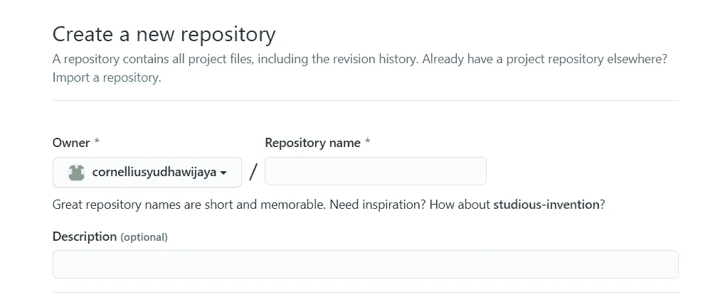

虽然，什么是**储存库**？

当我们使用 Git 管理我们的项目时，Git 会管理两件事情:

*   您的文件(脚本、模型等。)和目录，以及
*   Git 信息来维护您的项目随时间的历史变化。

当我们把上面的两部分结合起来，我们就有了我们所说的存储库或回购。

现在，让我们尝试在 GitHub 中创建自己的存储库，看起来应该是这样的。

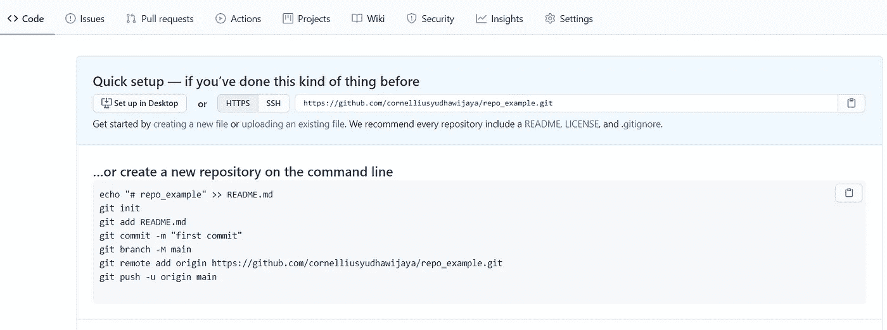

在一个新的回购之后，我们将尝试利用 Git 命令让您尝试这一次。

# **GIT 命令**

在开始之前，让我们尝试在您的本地驱动器上创建一个新文件夹。你想去哪里都可以。然后在新文件夹里面，尽量有你想要的任何文件；对我来说，这是一个 jupyter 笔记本。

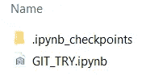

之后，尝试右键单击新文件夹并选择“Git Bash Here”

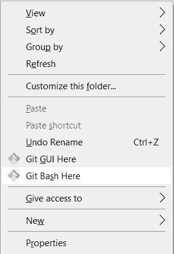

会出现一个命令提示符，这是您第一次使用，可能需要您输入凭证信息。只要按照步骤，我们就可以开始了。

## 1.Git 初始化

每个英雄都有开始，Git 也是。当您在本地使用 Git 进行版本控制时，您需要首先设置环境。

Git init 就是用来做这个的。尝试在您的命令提示符下运行`git init`,其中的目录位于您想要的文件夹中。应该有一个类似这样的消息。

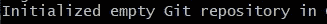

现在，我们已经在本地文件夹中设置了环境或 repo，准备接受任何 git 命令。

## 2.Git 状态

我们要做的下一步是检查我们的 git 环境状态。这里的状态是指检查**暂存区**中是否有文件。

那么，什么是集结地呢？这基本上是一个区域，在对文件进行任何更改之前，您可以在这里放置或跟踪文件。如果您要发送、删除或添加任何新文件，这是文件排序的位置。这被称为集结地，因为过了这个区域，它将是永久的。

要尝试这个命令，我们可以在命令提示符下运行`git status`。它应该显示类似这样的内容。

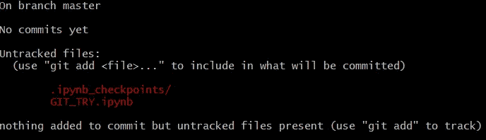

使用这个命令，可以显示我们文件的状态。我们只有未跟踪的文件，这意味着该文件尚未添加到临时区域。那么，下一步该怎么办呢？我们需要将这些文件添加到暂存区。

## **3。Git 添加**

正如您在上面看到的，我们通过运行`git add`命令将文件添加到暂存区。具体来说，我们需要键入`git add <filename>`，其中`<filename>`是您想要添加到暂存区的文件的名称。

手动添加每个文件名会很麻烦。想象一下，如果本地文件夹中有一千个文件，输入每个文件需要多长时间。在这种情况下，我们可以通过在命令提示符下运行`git add .`将文件夹中的所有文件添加到暂存区。

当您将每个文件添加到暂存区时，尝试再次运行`git status`。应该是这样的。

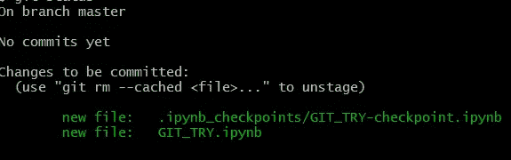

文件夹中的每个文件现在都在临时区域中。

## 4.Git 提交

当我们已经将所有文件放在临时区域中时，如果我们想要临时区域文件是我们想要的，我们需要提交。

如果您确定，那么我们需要运行`git commit`命令。完整的命令是`git commit -m "<your comment>"`，其中<您的注释>是您的日志消息或一些让您记住的简单注释。

让我们试着跑一下`git commit`。完成后，它应该是这样的。

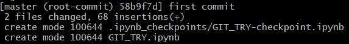

在我的文件夹中，有两个文件，所以这就是为什么有两个文件提交。

## **5。Git 日志**

如果您需要查看您在回购中所做的每一次提交，我们可以运行`git log`。它可以显示您的存储库的提交历史。作为作者，应该有重要的信息，提交键、提交日期和日志消息。

## **6。Git 推送**

当您在 GitHub 中创建一个新的 repo 时，您会看到一系列类似这样的消息。

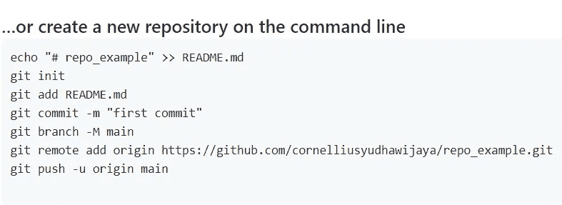

您可以从头到尾运行这个命令，但是现在唯一重要的部分是了解什么是`git push`。

这个`git push`命令将您的回购从本地放到 Git Hub 的在线回购中。它就是喜欢这个名字，推回购。

在这一步，我将跳过运行`git branch -M main`命令，因为我们现在不需要它。

你需要首先运行的是`git remote add origin <your git domain>`，其中<你的 git 域名>是你的 git 回购的地址。

因此，我们在上面的命令中使用变量 object are <your git="" domain="">创建了一个名为“origin”的变量。</your>

当您创建了‘origin’变量后，我们需要将本地回购推送到‘origin’回购。我们接下来需要做的是运行`git push -u origin master`。这个命令会将我们的本地 repo(称为 master)推到“原点”完成后，它应该是这样的。

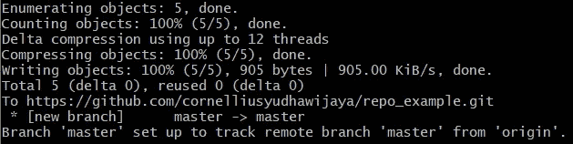

你的 GitHub repo 应该是这样的。

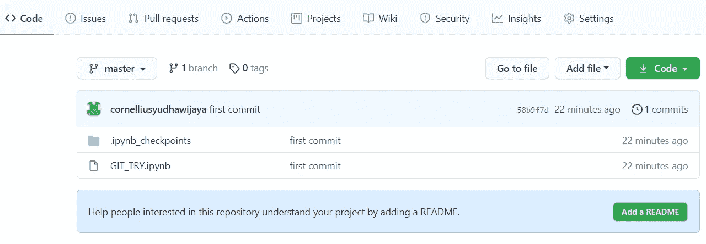

我们知道已经使用 Git 跟踪了我们文件和数据的历史版本，并且历史也存储在 GitHub 的本地 repo 中。

# **结论**

Git 对数据科学家很重要，因为数据科学团队合作通常会出现问题；主要是历史工作流程和编程代码冲突。Git 可以帮助我们解决这些问题。

在本文中，我向您介绍了基本的 Git 命令，它们是:

1.  Git 初始化
2.  Git 状态
3.  Git 添加
4.  Git 提交
5.  Git 日志
6.  Git 推送

希望有帮助！

# 如果您喜欢我的内容，并希望获得更多关于数据或数据科学家日常生活的深入知识，请考虑在此订阅我的[简讯。](https://cornellius.substack.com/welcome)

> 如果您没有订阅为中等会员，请考虑通过[我的推荐](https://cornelliusyudhawijaya.medium.com/membership)订阅。