# 重要信息熊猫系列和数据框架方法

> 原文：<https://towardsdatascience.com/important-information-pandas-series-and-data-frame-methods-41bb6687d91d?source=collection_archive---------42----------------------->

## 你需要知道的一些最有用的方法


尼克·希利尔在 [Unsplash](https://unsplash.com?utm_source=medium&utm_medium=referral) 上的照片

无论您是刚刚学习数据科学，还是拥有多年使用 Python 作为主要编程语言经验的专业人士，Pandas 模块都将是您的主要武器。我们使用 Pandas 的主要原因之一是因为这个库拥有称为系列和数据框的对象。我将使用 seaborn 模块中的 mpg 数据集示例来解释整篇文章。

```
import pandas as pd
import seaborn as sns
import numpy as np#Load the mpg dataset
mpg = sns.load_dataset('mpg')
```

这就是系列的样子，一个很好的变量/列/特征；取决于你喜欢怎么称呼他们。

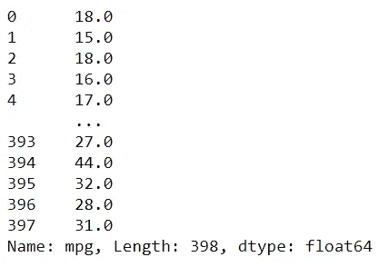

系列对象的示例

这是一个数据框，一个由许多系列组合成一个对象的数据集。

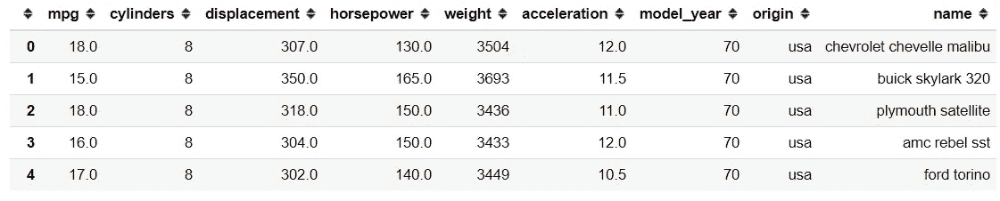

数据框对象的示例

只要看一下对象，我们就知道系列和数据框是我们分析数据的地方。这就是这两个对象对数据科学家的重要性。因此，我想介绍这些对象的一些重要方法，以获得在您的数据科学日常工作中肯定会有帮助的信息。

我喜欢数列和数据框方法的原因是我能多快地获得我需要的信息。这里有几个我觉得知道很重要的方法。

# 1.DataFrame.info

**。info** 方法是针对数据框对象的方法。它会给你下图所示的所有重要信息。

```
mpg.info()
```

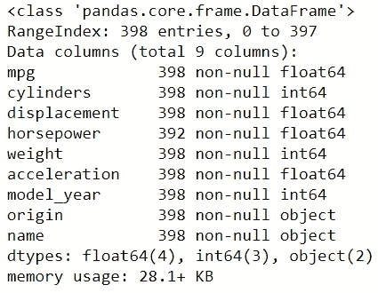

只用一行字，我就能一次获得大量信息。这些信息是**数据的总数**，**有多少列**，**列名**与**有多少数据不为空**，**数据类型**，以及**内存使用量**。

# 2.Series.describe 或 DataFrame.describe

**。描述**方法既可以在序列对象中实现，也可以在数据框对象中实现。让我们看看通过使用。描述方法。

```
mpg.describe()
```

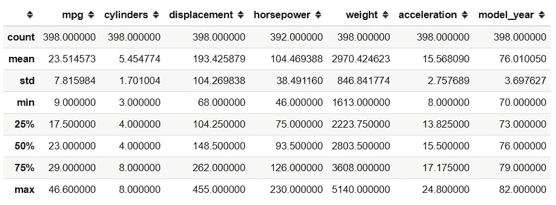

从上图中，我们可以看到我们得到的所有数值数据的基本统计；也就是**计数**，**均值**，**标准差**，**最小值**， **25%分位数**， **50%分位数(中位数)**， **75%分位数**，以及**最大值**。

如果我们想得到非数值型数据的基本统计数据呢？我们也可以这样做。

```
#Input exclude parameter as 'number' to exclude all the numerical columnsmpg.describe(exclude = 'number')
```

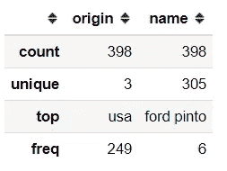

在这种情况下，我们排除所有的数字列(数字包括布尔列),并以非数字列结束。我们可以看到，这些信息包括 **Count** 、 **Unique** (唯一值的个数)、 **Top** (最频繁的值)、以及 **Freq** (最频繁的值)。

的。描述方法也存在于系列对象中；更具体地说。描述方法输出的数据框对象是系列对象的统称。

```
mpg['mpg'].describe()
```

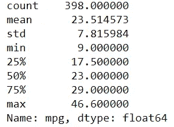

这是我们使用。通过列基本统计的系列对象描述方法。

# 3.Series.agg 或 DataFrame.agg

如果我们只需要一个特定的统计数据，并希望将它包含在一个地方，该怎么办？这是我们使用。agg 方法。此方法用于将许多统计数据聚合到一个系列或数据框对象中。我们就举个例子试试吧。

```
mpg.agg('mean')#we could also use function here, e.g. Numpy
#mpg.agg(np.mean)
```


**。agg** 方法接受函数和/或字符串作为参数输入。在上面的图片中，我们从所有的数字列中得到一系列的平均值。

现在，如果我们想要不止一种类型的信息，我们可以做到这一点。我在下面的例子中展示了它。

```
mpg.agg(['mean', 'std'])
```

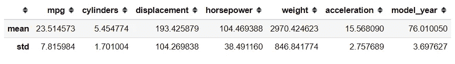

代替字符串或函数，我们用一个包含所有我们想要的信息的列表对象来输入参数。这一次，我们得到了一个数据框对象，其中包含了我们需要的所有信息。

系列也有。我们可以使用的 agg 方法。

```
mpg['mpg'].agg(['mean', 'std'])
```

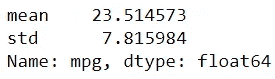

结果将是我们在列表对象中包含的基本统计数据的一个数字或一系列对象。

# 4.数据框架

该方法用于获得数值列之间的相关性矩阵。如果你想了解更多，你可以在这里阅读我关于相关性的文章[。](/what-it-takes-to-be-correlated-ce41ad0d8d7f?source=friends_link&sk=be21b7c8b11dc13048ad454aab9129f4)

[](/what-it-takes-to-be-correlated-ce41ad0d8d7f) [## 关联需要什么

### 以及在我们的分析中如何解释它

towardsdatascience.com](/what-it-takes-to-be-correlated-ce41ad0d8d7f) 

让我们用一个例子来试试这个方法。

```
mpg.corr()
```

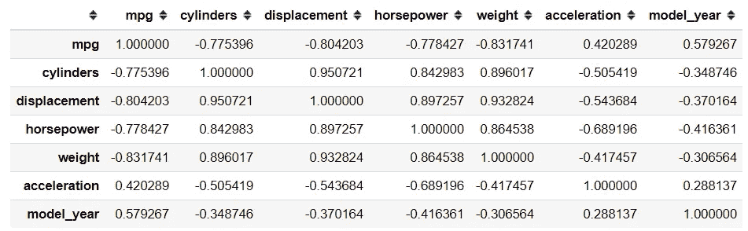

默认情况下，相关性方法会计算数值列之间的**皮尔逊相关性**。我们可以将参数更改为我们自己定义的 **Spearman 相关性**、 **Kendall 相关性**或**可调用函数**。

# 5.DataFrame.groupby

该方法根据分类列的类别对所有数字列进行分组。输出是一个 groupby 对象。下面我们通过一个例子来试试。例如，我想按来源对 mpg 数据进行分组。

```
mpg_groupby_origin = mpg.groupby('origin')#Groupby object have many method similar to the series or dataframe; for example .meanmpg_groupby_origin.mean()
```

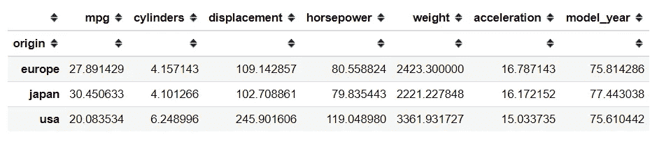

从上面的代码中，我们得到了所有数字列的平均值，但是是按照原点的类别分组的。我们也可以使用。groupby 对象的 agg 方法。

```
# .T is a method to transpose the DataFrame
mpg_groupby_origin.agg(['mean', 'std']).T
```

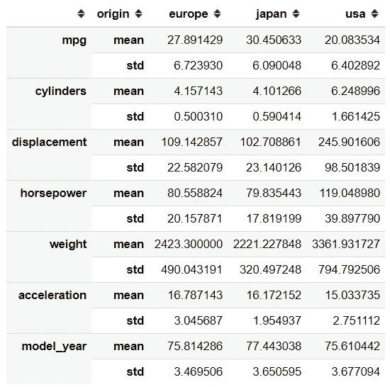

的。agg 方法类似于我们上面使用的方法。我们输入参数或者是一个字符串/函数，或者是以字符串/函数为值的列表对象。

# 结论

我试图解释熊猫系列和 DataFrame 对象的一些信息方法。这些包括:

*   。信息
*   。形容
*   。集料
*   。corr
*   。分组依据

希望有帮助！

# 如果您喜欢我的内容，并希望获得更多关于数据或数据科学家日常生活的深入知识，请考虑在此订阅我的[简讯。](https://cornellius.substack.com/welcome)

> 如果您没有订阅为中等会员，请考虑通过[我的介绍](https://cornelliusyudhawijaya.medium.com/membership)订阅。