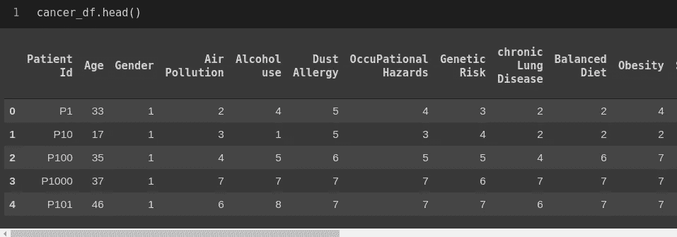
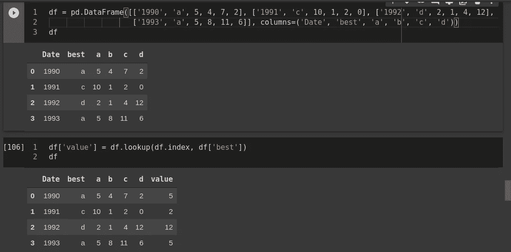
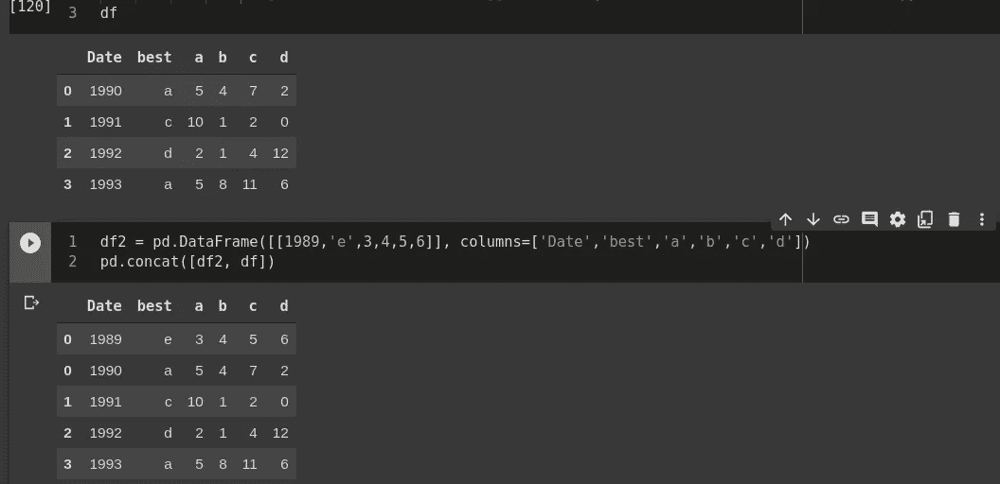
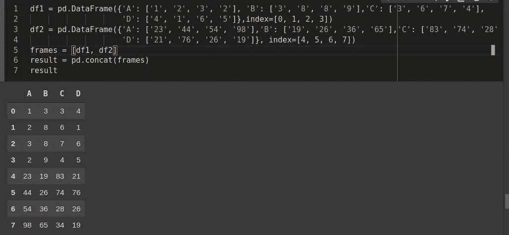
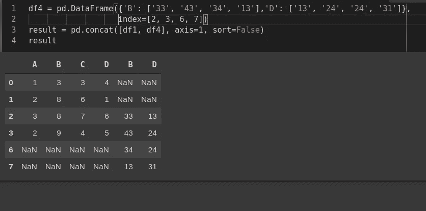

# 数据工程熊猫简明指南—第 1 部分

> 原文：<https://towardsdatascience.com/important-pandas-libraries-for-data-engineering-684cef05e5c?source=collection_archive---------32----------------------->

**数据工程**是**数据**科学的一个方面，侧重于**数据采集**和**分析**[来源](https://www.datasciencegraduateprograms.com/data-engineering/#:~:text=Data%20engineering%20is%20the%20aspect,collecting%20and%20validating%20that%20information.)的实际应用。他们建立的管道对数据科学家转换数据非常有用。他们需要了解无数的技术，并为这项工作选择合适的工具。



癌症患者的数据图表

## **内容**:

1.  进口
2.  出口
3.  看法
4.  索引
5.  子集化
6.  提取行和列
7.  取代
8.  添加/删除
9.  排序和重命名
10.  结合
11.  聚集

# **导入:**

导入 pandas 库以将 CSV 文件或 XLSX 格式的文件转换为 dataframe。

```
import pandas as pd
import numy as npcancer_df = pd.read_excel("cancer_patient_data_sets.xlsx")
cancer_df = pd.read_csv("cancer_patient_data_sets.csv")
```

要成功运行以上代码行，请确保将文件上传到 Google Colab 的`content`文件夹中，或者当您在 Jupyter Notebook 中工作时上传到您的本地文件夹中。你也可以从 S3 或谷歌硬盘上读取文件。

**谷歌驱动:**

I)将您的 google drive 安装到 colab

```
from google.colab import drive 
drive.mount('/content/gdrive')
```

ii)现在，您将在左侧窗格(文件浏览器)中看到您的 Google Drive 文件。右键单击需要导入的文件，选择复制路径。然后在 pandas 中照常导入，使用这个复制的路径。

```
import pandas as pd 
cancer_df = pd.read_csv('gdrive/My Drive/cancer_patient_data_sets.csv')
```

AWS S3:现在熊猫可以处理 AWS S3 网址了。简单地做

```
import pandas as pd
import s3fs

cancer_df = pd.read_csv('s3://bucket-name/file_name.csv')
```

**构建数据框架:**如果你有数据，想构建一个数据框架，你可以这么做。

```
sample_df = pd.DataFrame([[1,'Bob','M','31','Builder'],
                  [2,'Sally','F','29','Baker'],
                  [3,'Scott','M','28','Candle Stick Maker']], 
columns=['id','name','gender','age','occupation'])
```

# **导出:**

您可以通过以下代码行将最终输出保存为 CSV 或 EXCEL 格式

```
output_df.to_csv('saved_patients.csv', index=False)
output_df.to_excel('saved_patients.xlsx', index=False)
```

# 查看:

**显示数据帧顶部或底部的几条记录**

```
sample_df.head(5)
sample_df.tail(5)
```

# **索引:**

**索引您的数据帧:**

*   仅索引数据帧中的一个列:

```
sample_df = sample_df.set_index('id')
sample_df
```

*   对数据帧中的多列**进行索引:**

```
sample_df = sample_df.set_index(['id','age'])
sample_df
```

*   要重置数据帧中的索引:

```
sample_df.reset_index(inplace = True)
sample_df
```

# **子集化:**

*   要从现有数据框架中选择有限数量的列并将其存储在新数据框架中:

```
df = sample_df[['age', 'name', 'occupation']]
df
```

*   要对行进行子集划分并考虑所有列:

```
#Select first 3 rows :
df[0:3]*# Select first 5 rows (rows 0, 1, 2, 3, 4)* df[:5]*# Select the last element in the list
# (the slice starts at the last element, and ends at the end of the list)* df[-1:]
```

*   使用`loc`方法从我们的数据帧中选择行和列:这个命令通过行和列的标签选择数据。

```
*# Select all columns for specific rows of index values 0 and 2 where no specific column in the dataframe has any index*data = pd.read_csv("nba.csv")
df = data.loc[[0, 2], :]*# Select all columns for a specific row or multiple rows where a column is set as an index* data = pd.read_csv("nba.csv", index="name")
df **=** data.loc[["Avery Bradley"]] 
OR 
df **=** data.loc[["Avery Bradley", "R.J. Hunter"]]# *Select specific rows and specific columns*data = pd.read_csv("nba.csv", index="name")
df = [["Avery Bradley", "R.J. Hunter"],["Team", "Number", "Position"]]*# Select only one or multiple specific row/rows and multiple columns after resetting index*data.reset_index(inplace = True)
df = data.loc[0, ['Name', 'Number', 'Age', 'Position']] 
OR
df = data.loc[[0,5], ['Name', 'Number', 'Age', 'Position']]
```

*   使用`iloc`方法从我们的数据帧中提取行和列的子集:这个命令允许我们按位置检索行和列。

```
# *Slice certain number of rows and columns*
df = sample_df.iloc[0:3, 1:4]

*# Select the value of second row and third column* df = sample_df.iloc[2, 3]*# Select all rows and selected columns* df = sample_df.iloc [:, [1, 2]]# *Select certain range of rows and all columns*
df = sample_df.iloc[[0, 2]]
```

*   要根据标准选择数据帧:

```
# Select dataframe where the value of a column is given
df[df.year == 2002]# Select dataframe on multiple conditions
df[(df.year >= 1980) & (df.year <= 1985)]ORdf = df[(df.year >= 2000) & (df.gender == 'M')]
```

*   使用`isin`命令:Pandas `isin()` 方法有助于选择特定列中具有特定值或多个值的行。

```
new = sample_df["gender"].isin(["M"])
sample_df[new]ORfilter1 **=** sample_df["gender"].isin(["M"])
filter2 **=** sample_df["occupation"].isin(["Baker", "Builder"])# displaying data with both filter applied and mandatory
sample_df[filter1 & filter2]
```

*   要选择数据帧中包含空值的行:

```
*# To select just the rows with NaN values, we can use the 'any()' method* sample_df[pd.isnull(sample_df).any(axis=1)]
```

*   使用 lookup()函数:lookup()函数为 DataFrame 返回基于标签的“花式索引”函数:



# **更换:**

**替换数据帧中的值:**

*   函数`mask()`用于替换标准数据框中的所有值

```
# replace all the values greater than 10 with -25
df.mask(df > 10, **-**25)# replace the Na values with 1000
df.mask(df.isna(), 1000))
```

*   使用`where()`函数根据一个或多个特定标准过滤数据集

```
filter **=** sample_df["gender"]**==**"M"
data.where(filter, inplace **=** True)ORfilter1 **=** sample_df["gender"]**==**"M"
filter2 **=** sample_df["age"]>24
sample_df.where(filter1 & filter2, inplace **=** True)
```

# **提取行或列:**

*   使用`get()`函数从数据帧中提取一列或多列

```
sample_df.get("occupation")ORsample_df.get(["name", "age", "occupation"])
```

*   使用`pop()`功能删除一列或多列

```
# Remove one column from the original dataframe
popped_col **=** sample_df.pop("occupation")
sample_df# make a copy of the data frame and insert the popped column at the end of the other data frame
new **=** sample_df.copy()
popped_col **=** new.pop("name")
# creating new col and passing popped col
new["New Col"]**=** popped_col
new
```

# **添加/删除:**

**删除列:**

```
del sample_df['column_name']
```

*   使用`drop()`功能删除一行或多行或多列

```
df = data.drop('column_1', axis=1)# Delete multiple columns from the dataframe
df = data.drop(["column_1", "column_2", "column_3"], axis=1)# Delete multiple rows from the dataframe
data = df.drop([0,1], axis=0)
data# drop rows where age is less than 25
df_filtered **=** df[df['Age'] >**=** 25]# drop rows with null values
df **=** df.dropna(how **=** 'all')
```

*   向现有数据框架添加新列或新行

```
# Add a new column in the existing dataframe by providing the values manually in a list format
sample_df['salary'] = [250000, 150000, 100000]
sample_df# Add a new column by performing simple calculation on any other existing column
sample_df['new_col'] = sample_df['salary']*2
sample_df# Add a new column having same constant values
sample_df['new'] = 'y'
sample_df
OR
sample_df['new'] = sample_df.apply(lambda x: 'y', axis=1)# Insert a new row in an existing dataframe:
sample_df.loc[3] = [4, 'Mike', 26, 'Delivery boy']
sample_dfOR
```



在现有数据框架中插入新行

# **排序和重命名:**

按行和列对数据帧进行排序:

```
# use sort_index() to sort by row index or names
sample_df = sample_df.set_index('name')
sample_df.sort_index(inplace**=**True)# sort on multiple columns by descending order
sort_by_age_occ **=** sample_df.sort_values(by = ['age','occupation'], ascending = False)# sort a column in ascending order
a **=** sample_df.sort_values(by **=**'age', ascending **=** True)
```

重命名数据帧中的列:

```
sample_df.rename(columns **=** {'occupation':'Occupation', 'age':'Age', 'name':'Name'}, inplace **=** True)
```

# **结合:**

有各种类型的连接:

*   **一对一**连接:例如当连接索引上的两个对象时(必须包含唯一值)。
*   **多对一**连接:例如，将一个索引(唯一的)连接到不同数据框架中的一个或多个列。
*   **多对多**联接:联接列上的列。
*   使用 merge()连接两个数据帧

```
'''
 There are 3 dataframes (df1, df2, df3) having similar column names - 'id', 'Feature1', 'Feature2'. You can merge 2 dataframes on a specific column.
'''
df_merge = pd.merge(df1, df2, on='id') # Combine two dataframes which will contain all the records
df_outer = pd.merge(df1, df2, on='id', how='outer')# Combine two dataframes which will contain only the common records between the them
df_inner = pd.merge(df1, df2, on='id', how='inner')# Combine two dataframes which will contain the common records between the them along with all the records of first dataframe
df_left = pd.merge(df1, df2, on='id', how='left')# Combine two dataframes which will contain the common records between the them along with all the records of second dataframe
df_right = pd.merge(df1, df2, on='id', how='right')#Combine two dataframes on the records present in the index column
df_index = pd.merge(df1, df2, right_index=True, left_index=True)  df_index
```

*   使用 concat()连接相似列名的两个数据帧



我们也可以使用`append()`通过使用`result = df1.append(df2)`得到上面的结果

*   使用 concat()连接不同列名和不同行的两个数据帧



# **聚合:**

可以将 max()、min()、mean()、first()、last()等函数快速应用于 GroupBy 对象，以获得数据帧中每个组的汇总统计信息。

如果你喜欢这篇文章，你可能也会喜欢下一篇[文章](https://medium.com/@pb.careofpriyanka/important-pandas-libraries-for-data-engineering-part-2-434dd2005c39)，它将更加关注一些重要的函数以及它们在数据工程中的用途。

感谢阅读。😃希望你能像我准备这篇文章时一样喜欢它..