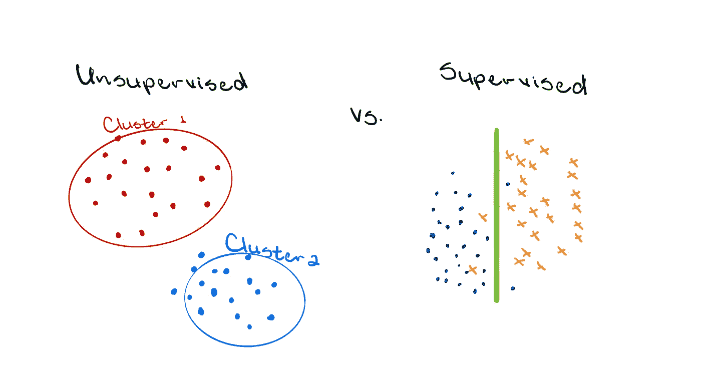
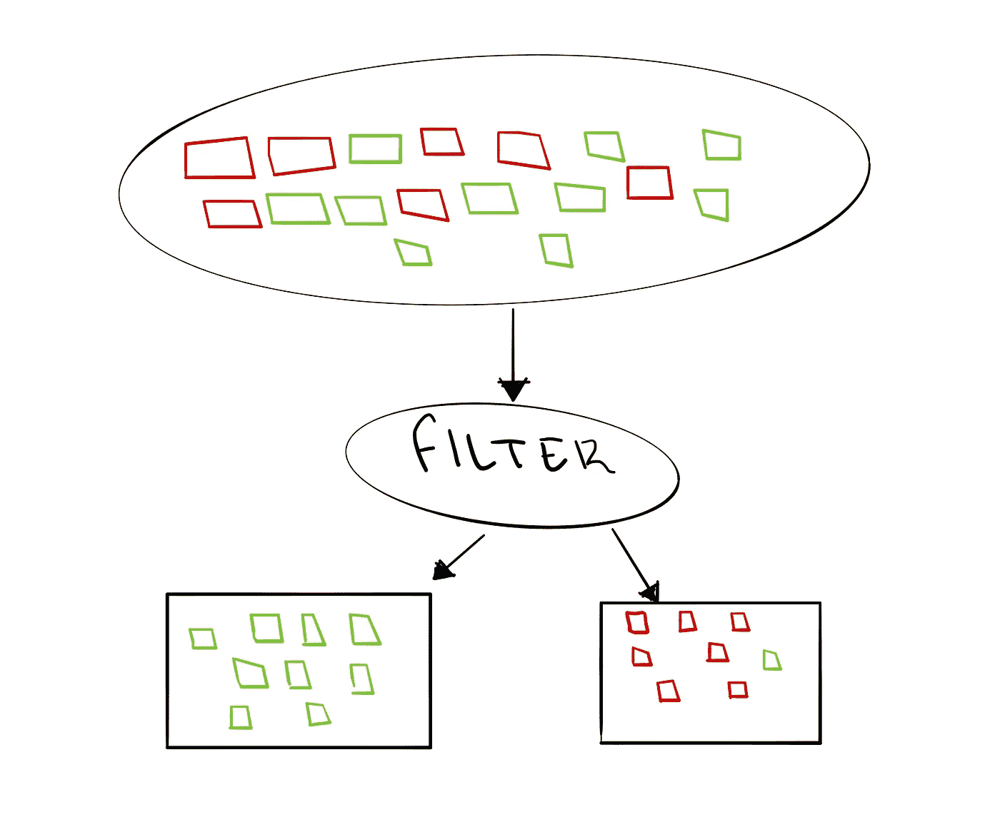
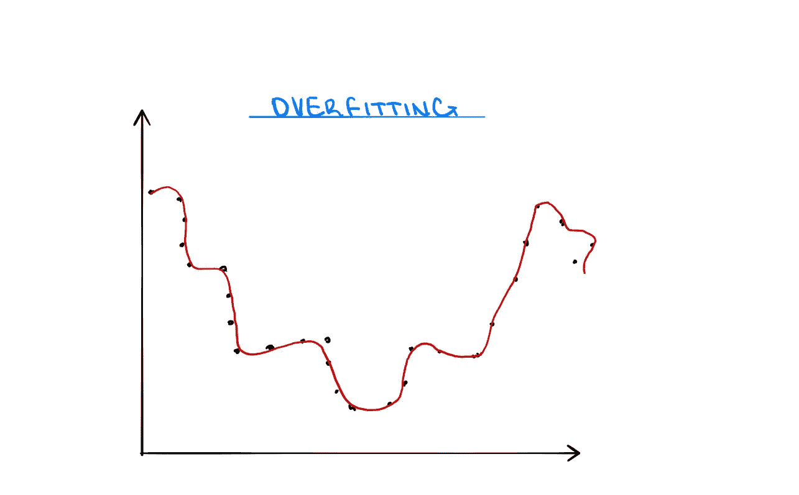
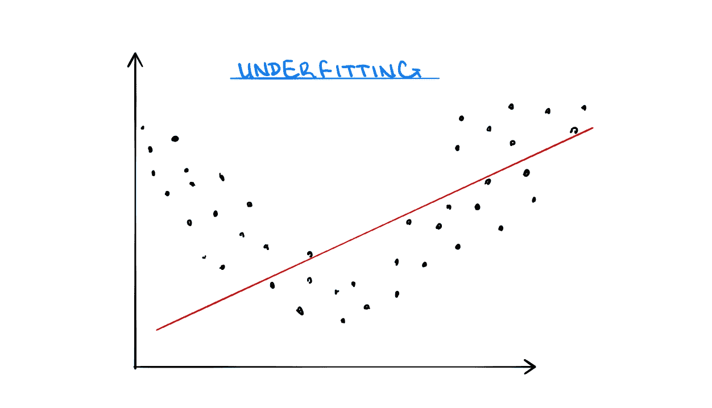

# 每个数据科学家都必须知道的机器学习的重要主题

> 原文：<https://towardsdatascience.com/important-topics-in-machine-learning-that-every-data-scientist-must-know-9e387d880b3a?source=collection_archive---------61----------------------->

## 评估机器学习的基础

图片作者:特里斯特·约瑟夫

机器学习(ML)是“人工智能的一种应用，它为系统提供了自动学习和根据经验改进的能力，而无需显式编程。”ML 算法用于在数据中寻找产生洞察力的模式，并帮助做出数据驱动的决策和预测。这些类型的算法每天都在医疗诊断、股票交易、交通运输、法律事务等领域被用来做出关键决策。所以可以看出数据科学家为什么把 ML 放在这么高的基座上；它为高优先级决策提供了一个媒介，可以在没有人工干预的情况下实时指导更好的业务和智能行动。

现在，人工智能模型不一定像人类那样“学习”。相反，这些算法使用计算方法来直接从数据中理解信息，而不依赖于预先确定的方程作为模型。为此，使算法确定数据中的模式并开发目标函数，该目标函数最佳地将输入变量 *x* 映射到目标变量 *y* 。这里必须注意，目标函数的真实形式通常是未知的。如果函数是已知的，那么就不需要 ML。

因此，其思想是通过对样本数据进行合理的推断来确定该目标函数的最佳估计，然后针对当前情况应用和优化适当的 ML 技术。不同的情况要求对被估计函数的形式作出不同的假设。此外，不同的最大似然算法对函数的形状做出不同的假设，因此，它应该如何被优化。可以理解的是，人们很容易被 ML 的学习内容所淹没。因此，在这篇文章中，我讨论了每个数据科学家都应该知道的两个重要的 ML 主题。

图片作者:特里斯特·约瑟夫

1.  ***学习的类型***

最大似然算法通常分为**监督的**或**非监督的**，这广义上指的是数据集是否被标记。监督 ML 算法通过使用标签化的例子来预测未来的结果，将过去学到的知识应用到新的数据中。本质上，对于这些类型的问题，正确的答案是已知的，并且基于预测的输出是否正确来判断估计模型的性能。相比之下，无监督 ML 算法指的是当用于训练模型的信息既没有被分类也没有被标记时开发的算法。这些算法试图通过提取样本中的特征和模式来理解数据。

现在半监督学习确实存在，它采取了监督和非监督学习之间的中间地带。也就是说，数据的一小部分可能被标记，而其余部分没有被标记。

图片作者:特里斯特·约瑟夫

当给定的任务是分类或回归问题时，监督学习是有用的。分类问题指的是根据模型开发的特定标准将观察结果或输入数据分组到离散的“类”中。一个典型的例子是预测一封电子邮件是垃圾邮件还是非垃圾邮件。该模型将在包含垃圾邮件和非垃圾邮件的数据集上开发和训练，其中每个观察都被适当地标记。

另一方面，回归问题是指接受一组输入数据并确定一个连续量作为输出的过程。一个常见的例子是根据个人的教育水平、性别和总工作时间来预测个人的收入。

图片作者:特里斯特·约瑟夫

当特定问题的答案或多或少未知时，无监督学习是最合适的。这些算法主要用于**聚类**和**异常检测**，因为有可能在不确切知道观察指的是什么的情况下检测整个观察的相似性。例如，人们可以观察各种花的颜色、大小和形状，然后粗略地将它们分成几组，而不必真正知道每种花的种类。此外，假设一家信用卡公司正在监控消费者行为。通过监控交易发生的地点，有可能发现欺诈性交易。例如，假设在纽约经常使用信用卡。如果在某一天，该卡在纽约、洛杉矶和香港使用，那么它可能被认为是一种异常，系统应该向相关方发出警报。

图片作者:特里斯特·约瑟夫

2. ***模型拟合***

拟合模型是指让算法确定预测值和结果之间的关系，以便可以预测未来值。回想一下，模型是使用训练数据开发的，训练数据是精确反映总体的理想的大型随机样本。这一必要的行动伴随着一些非常不可取的风险。完全精确的模型很难估计，因为样本数据会受到随机噪声的影响。这种随机噪声，以及研究人员做出的大量假设，有可能导致 ML 模型学习数据中的虚假模式。如果试图通过做很少的假设来应对这种风险，就会导致模型无法从数据中获取足够的信息。这些问题被称为过拟合和欠拟合，目标是确定简单性和复杂性之间的适当组合。

图片作者:特里斯特·约瑟夫

**过度拟合**发生在模型从训练数据中学习“太多”时，包括随机噪声。然后，模型能够确定数据中非常复杂的模式，但这会对新数据的性能产生负面影响。训练数据中拾取的噪声不适用于新的或看不见的数据，并且该模型不能概括所发现的模式。某些最大似然模型比其他模型更容易过度拟合，这些模型包括非线性和非参数模型。对于这些类型的模型，可以通过改变模型本身来克服过度拟合。考虑一个非线性方程的 4 次幂。一旦仍然产生可接受的结果，可以通过将模型的幂降低到可能的 3 次方来降低过拟合。或者，可以通过对模型参数应用交叉验证或正则化来限制过拟合。

图片作者:特里斯特·约瑟夫

**另一方面，欠拟合**发生在模型无法从训练数据中学习到足够多的信息时。然后，模型就无法确定数据中合适的模式，这会对新数据的性能产生负面影响。由于所知甚少，该模型无法对看不见的数据应用太多，也无法对手头的研究问题进行概括观察。通常，欠拟合是由于模型设定错误造成的，可以通过使用更合适的 ML 算法来解决。例如，如果用一个线性方程来估计一个非线性问题，就会出现欠拟合。虽然这是真的，但欠拟合也可以通过交叉验证和参数正则化来纠正。

**交叉验证**是一种用于评估模型拟合度的技术，通过在样本数据集的不同子集上训练几个模型，然后在训练集的互补子集上评估它们。

**规则化**指的是向模型参数添加信息的过程，以应对模型性能不佳的问题。这可以通过指定参数遵循特定分布来实现，例如正态分布对均匀分布；或者通过给出参数必须落入的值的范围。

图片作者:特里斯特·约瑟夫

机器学习模型非常强大，但强大的能力也意味着巨大的责任。开发最合适的 ML 模型要求研究者充分理解手头的问题以及在给定的情况下什么技术是合适的。理解一个问题是被监督的还是未被监督的将提供一些关于将使用什么类型的 ML 算法的洞察力；而了解模型拟合度可以防止部署时模型性能不佳。快乐造型！

**参考文献:**

[expert system . com/Machine-learning-definition/#:~:text = Machine % 20 learning % 20 is % 20 an % 20 application，use % 20it % 20 learn % 20 for % 20 them self。](https://expertsystem.com/machine-learning-definition/#:~:text=Machine%20learning%20is%20an%20application,use%20it%20learn%20for%20themselves.)

[mathworks . com/discovery/Machine-learning . html #:~:text = Machine % 20 learning % 20 algorithms % 20 use % 20 computational，specialized % 20 form % 20 of % 20 Machine % 20 learning。](https://www.mathworks.com/discovery/machine-learning.html#:~:text=Machine%20learning%20algorithms%20use%20computational,specialized%20form%20of%20machine%20learning.)

[NVIDIA . com/blog/2018/08/02/supervised-unsupervised-learning/#:~:text = In % 20a % 20 supervised % 20 learning % 20 model，and % 20 patterns % 20 on % 20 its % 20 own。](https://blogs.nvidia.com/blog/2018/08/02/supervised-unsupervised-learning/#:~:text=In%20a%20supervised%20learning%20model,and%20patterns%20on%20its%20own.)

[machine learning mastery . com/how-machine-learning-algorithms-work/](https://machinelearningmastery.com/how-machine-learning-algorithms-work/)

**其他有用的素材:**

[simpli learn . com/机器学习对数据科学家的重要性-文章](https://www.simplilearn.com/importance-of-machine-learning-for-data-scientists-article)

[towards data science . com/important-topics-in-machine-learning-you-need-to-know-21 ad 02 cc 6 be 5](/important-topics-in-machine-learning-you-need-to-know-21ad02cc6be5)

[machine learning mastery . com/class ification-vs-regression-in-machine-learning/#:~:text = A % 20 regression % 20 problem % 20 requires % 20 the，called % 20a % 20 multi variable % 20 regression % 20 problem。](https://machinelearningmastery.com/classification-versus-regression-in-machine-learning/#:~:text=A%20regression%20problem%20requires%20the,called%20a%20multivariate%20regression%20problem.)

[scikit-learn.org/stable/modules/cross_validation.html](https://scikit-learn.org/stable/modules/cross_validation.html)

[nintyzeros.com/2020/03/regularization-machine-learning.html](https://www.nintyzeros.com/2020/03/regularization-machine-learning.html)