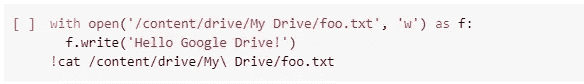
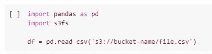

# 将数据导入 Google Colab——干净利落的方式

> 原文：<https://towardsdatascience.com/importing-data-to-google-colab-the-clean-way-5ceef9e9e3c8?source=collection_archive---------0----------------------->

## 因为干净的代码很重要！

**在这篇文章中，我将介绍:**

*   **Google Colab 简介**
*   **2 种常用的“快速而肮脏”的方法将数据上传到 Colab**
*   **2 种自动化的“干净”方法将数据上传到 Colab**

# Google Colab 是什么？

现在还很难相信，但这是真的。我们可以在 Google Colab 上免费运行重型数据科学笔记本**。**

****

**Google Colabs**

**Colab 是一项云服务，这意味着谷歌的服务器将运行笔记本电脑，而不是你自己的本地电脑。**

**也许更令人惊讶的是，****它背后的硬件**相当不错！****

# ****Colab 是完美的新笔记本解决方案吗？****

****Google Colab 有一个大问题，以前经常讨论，那就是你数据的存储。笔记本电脑，例如 Jupyter 笔记本电脑，通常使用存储在本地计算机上的数据文件。这通常使用简单的 read_csv 语句或类似语句来完成。****

> ****云的本地不是你的本地。****

****但是谷歌合作实验室正在云中运行。云的本地不是你的本地。因此 read_csv 语句将在 Google 端搜索文件，而不是在您端。然后它就找不到了。****

# ****如何将您的数据输入 Colab——手动方式？****

********

****乌云因为手动上传不是最好的做法！由 [LoboStudio Hamburg](https://unsplash.com/@lobostudiohamburg?utm_source=unsplash&utm_medium=referral&utm_content=creditCopyText) 在 [Unsplash](https://unsplash.com/s/photos/dark-cloud?utm_source=unsplash&utm_medium=referral&utm_content=creditCopyText) 上拍摄的照片****

****为了将您的数据输入到您的 Colab 笔记本中，我首先讨论两种最常见的方法，以及它们的优缺点。之后，我讨论了两个备选解决方案，它们可能更合适，尤其是当您的代码必须易于工业化时。****

## ****手动方法 1 —使用 files.upload()将数据上传到 Colab****

1.  ****直接在 Colab 笔记本中使用 **files.upload()** 会给你一个传统的上传按钮，允许你将文件从你的计算机移动到 Colab 环境中。****

********

****直接在 Colab 笔记本中使用 files.upload()会给您一个传统的上传按钮，允许您将文件移动到 Colab 环境中****

****2.然后你用木卫一。StringIO()和 pd.read_csv 一起将上传的文件读入数据帧****

********

****然后你用木卫一。StringIO 与 pd.read_csv 一起将上传的文件读入数据帧****

******使用 files.upload()将数据上传到 Colab 的优势:** 这是所有方法中最简单的方法，尽管它需要几行代码。****

******使用 files.upload()上传数据到 Colab 的缺点:** 对于大文件，上传可能需要一段时间。然后每当笔记本电脑重新启动时(例如，如果它失败或其他原因…)，必须手动**重新上传。**这不是最好的解决方案，因为首先我们的代码在重启时不会自动重新执行，其次在笔记本出现故障的情况下**需要繁琐的手动操作**。****

## ****手动方法 2——将 Google Drive 安装到 Colab 上****

****在开始使用笔记本电脑之前，请将您的数据上传到 Google Drive。然后将 Google Drive 安装到 Colab 环境中:这意味着 Colab 笔记本现在可以访问 Google Drive 中的文件。****

1.  ****使用 drive.mount()挂载您的驱动器****

********

****2.直接访问 Google Drive 中的任何内容****

********

******把你的 Google Drive 挂载到 Colab 上的优势:** 这也是相当容易的。Google Drive 非常用户友好，对大多数人来说，将你的数据上传到 Google Drive 没有问题。此外，上传完成后，重启笔记本时不需要手动重新加载。所以比方法 1 好。****

******将你的 Google Drive 挂载到 Colab 上的缺点:** 我从这种方法中看到的主要缺点主要是公司/工业使用。只要您在从事相对较小的项目，这种方法就很棒。但是如果**访问管理和安全**处于危险之中，你会发现这种方法**很难产业化。******

****此外，您可能不希望处于 100%谷歌的环境中，因为多云解决方案让您更加独立于不同的云供应商。****

# ****干净利落的方式—使用外部数据存储****

********

****干净的数据存储是最佳实践！Em bé khóc nhè 在 [Unsplash](https://unsplash.com/s/photos/light--cloud?utm_source=unsplash&utm_medium=referral&utm_content=creditCopyText) 上拍摄的照片****

****如果您的项目很小，并且您知道它将永远只是一个笔记本，那么以前的方法是可以接受的。但是对于任何未来可能会变得更大的项目，将数据存储从您的笔记本电脑中分离出来是朝着更好的架构迈出的良好一步。****

****如果你想在你的 Google Colab 笔记本上建立一个更干净的数据存储架构，尝试一个合适的数据存储解决方案。****

****Python 中有许多与数据存储连接的可能性。我在这里提出两个解决方案: **AWS S3 用于文件存储**和 **SQL 用于关系数据库存储**:****

## ****清洁方法 1 —连接一个 AWS S3 桶****

****S3 是 AWS 的文件存储，其优势在于与之前描述的向 Google Colab 输入数据的方式非常相似。如果你不熟悉 AWS S3，[不要犹豫，看看这里](/how-to-publish-a-jupyter-notebook-online-using-aws-in-10-minutes-7f87f2b0cc50)。****

********

****亚马逊 S3 是 AWS 简单存储服务——一种易于使用的云中文件存储****

****从 Python 访问 S3 文件存储是非常干净的代码，并且非常高效。添加认证是可能的。****

********

****Pandas 允许使用 s3fs 直接从 s3 读取数据****

******配合 Colab 使用 S3 的优势:**
S3 作为一种数据存储解决方案受到软件社区的重视，而 Google Drive 虽然更受个人用户的青睐，但被许多开发者青睐只是为了与其他 Google 服务的集成。****

******因此，这种方法改善了你的代码和架构！******

******将 S3 与 Colab 一起使用的缺点:** 要应用这种方法，您将需要使用 AWS。这很容易，但在某些情况下(如公司政策)，这可能仍然是一个缺点。此外，每次加载数据都需要时间。这可能比从 Google Drive 加载要长，因为数据源是独立的。****

## ****清理方法 2 —将 SQL 数据库连接到 Colab****

****如果您的数据已经存在于 MySQL 或其他关系数据库中，那么将您的 Colab 笔记本直接插入数据库也是一个不错的解决方案。****

********

****SQLAlchemy 是一个包，它允许您将 SQL 查询发送到您的关系数据库，这将允许在这个单独的 SQL 环境中拥有组织良好的数据，同时仅将您的 Python 操作保存在您的 Colab 笔记本中。****

********

******将 SQL 数据库连接到 Colab 的优点:** 当您开始使用更重要的应用程序，并且希望在开发过程中已经有了良好的数据存储时，这是一个好主意。****

******将 SQL 数据库连接到 Colab 的缺点:**
将关系型数据存储用于非结构化数据是不可能的，但是非关系型数据库可能是这种情况下的答案。在数据量非常大的情况下，更严重的问题可能是查询执行时间。管理数据库也是一种负担(如果您没有数据库或者如果您不能轻松地共享访问权限)。****

# ****结论****

****谷歌 Colab 笔记本电脑很棒，但要将数据输入和输出可能是一场真正的斗争。****

> ****谷歌 Colab 笔记本电脑很棒，但要将数据输入和输出可能是一场真正的斗争。****

****手动上传导入数据或者挂载 Google Drive 都是**好用但是产业化难度大**。像 AWS S3 或关系数据库这样的选择会让你的系统更少手工操作，因此更好。****

****2 个**手动方法非常适合小型短期项目**，当项目需要一个干净的数据存储时，应该使用带有**外部存储的两个方法。******

> ******在为时已晚之前，仔细考虑你的架构！******

****每种方法都有其优点和缺点，只有您才能决定哪种方法适合您的使用情况。无论您使用何种存储，但**请务必在为时已晚之前全面考虑您的架构！******

*****我希望这篇文章能帮助你构建你的项目。敬请期待更多内容，感谢您的阅读！*****