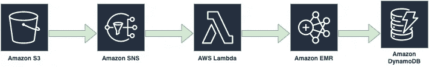
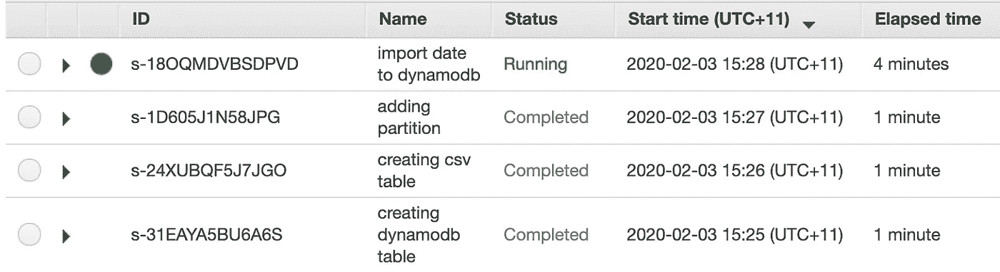
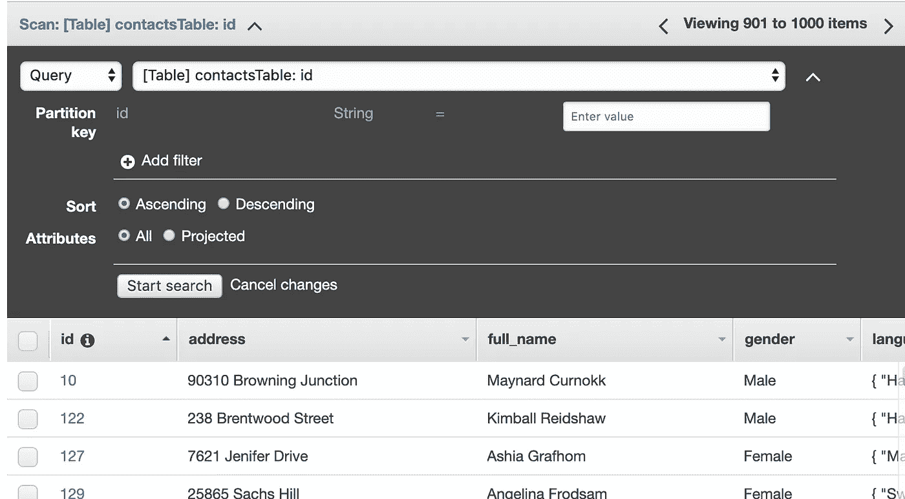

# 使用 Amazon EMR 上的 Apache Hive 导入 DynamoDB 数据

> 原文：<https://towardsdatascience.com/importing-dynamodb-data-using-apache-hive-on-amazon-emr-651d468898c6?source=collection_archive---------28----------------------->

## 使用 Amazon EMR 和 Hive，您可以快速高效地处理大量数据


照片由[科林斯·莱苏里](https://unsplash.com/@clesulie)在 [Unsplash](https://unsplash.com/photos/-OZcGk5lD7U) 拍摄

本文描述了将数据导入 AWS DynamoDB 数据库的多种方法之一。这里解释的选项使用 Amazon EMR 和 Hive。使用 Amazon EMR 和 Hive，您可以快速有效地处理大量数据，例如将数据从 Amazon S3 导入 DynamoDB 表。

# 这个例子实现了什么？

1.  每天，一个外部数据源都会向 S3·巴特发送一个包含大约 1000 条记录的 csv 文件。
2.  将 csv 对象放入 S3 存储桶时将被触发的 lambda 函数。
3.  Lambda 函数将启动 EMR 作业，步骤包括:

*   创建一个引用 DynamoDB 中存储的数据的配置单元表。
*   创建一个引用亚马逊 S3 的位置的配置单元表。
*   将数据从 S3 表加载到 DynamoDB 表。

下图显示了该流程的架构。



# 先决条件

*   对云形成的基本了解。
*   对电子病历的基本理解。
*   设置 AWS 帐户。
*   安装[无服务器框架](https://serverless.com/)。

# 现在，我们开始吧

在开始之前，安装 [**无服务器框架**](https://serverless.com/) 。打开一个终端，输入`npm install -g serverless`。

项目目录下有一个`yml`文件(`serverless.yml)`)。让我们开始在模板文件中定义一组对象，如下所示:

## S3 水桶

有两个 S3 桶， **LogBucket** 用于 EMR 日志， **S3BucketCsvimport** 用于存储 csv 文件。

## DynamoDB 表

从 S3 加载 csv 数据的 DynamoDB 表。

## λ函数配置

向`serverless.yml`添加 lambda 功能配置。它将由 S3 新创建的对象事件触发，lambda 函数将启动一个 EMR 作业流来处理数据导入。

## IAM 角色

我们还需要为 lambda 函数创建 IAM 角色，这样我们的 lambda 函数就有权限启动 EMR 作业流。

## 添加 lambda 函数

让我们添加一个 lambda 函数来创建一个 AWS EMR 集群，并添加步骤细节，如配置单元脚本的位置、参数等。我们可以为 EMR 使用 boto3 库，以便创建一个集群，并从 lambda 函数动态提交作业。

# 配置单元脚本

Ad 最后…让我们添加 Hive 脚本。

## 第一步。创建配置单元和 S3 之间的映射

我们将创建一个映射到 csv 数据文件的外部配置单元表。

## 第二步。正在创建配置单元和 DynamoDB 之间的映射

在配置单元和 DynamoDB 中的 Features 表之间建立映射。

## 第三步。用 S3 的数据加载表

将当前日期添加为分区，并在 S3 加载包含 csv 数据的表。

## 第四步。**从亚马逊 S3 导入一个表格到 DynamoDB**

使用下面的配置单元脚本将数据从亚马逊 S3 写到 DynamoDB。

请注意，DynamoDB 表上的 Amazon EMR 操作算作读/写操作，并且受表的调配吞吐量设置的限制。更多详情请访问[电子病历文件](https://docs.aws.amazon.com/emr/latest/ReleaseGuide/EMR_Hive_Optimizing.html)。

# 现在让我们部署服务并进行测试！

```
$sls deploy --stage dev
```

在脚本部署后，将一个 csv 文件复制到带有`created_date={CURRENT_DATE}`前缀的 S3 存储桶，例如

```
$aws s3 cp csv/contacts.csv s3://myemr.csv.import.dev/uploads/created_date=2020-02-03/contacts.csv
```

然后，我们可以转到 AWS EMR 控制台，检查 EMR 步骤的进度。



完成所有步骤需要几分钟时间，运行上述步骤后，群集将自动终止。

接下来，我们可以转到 AWS DynamoDB 控制台，验证数据是否已经加载到 DynamoDB 中:



最终，导入过程花费了大约 6 分钟的时间，将 1000 条总共 76kb 的记录加载到 DynamoDB 表中，写入容量单位为 10，没有启用自动缩放。

大概就这些，感谢阅读！

希望你觉得这篇文章有用，你可以在我的 [**GitHub repo**](https://github.com/yai333/emr-dynamodb-import) 中找到完整的项目。