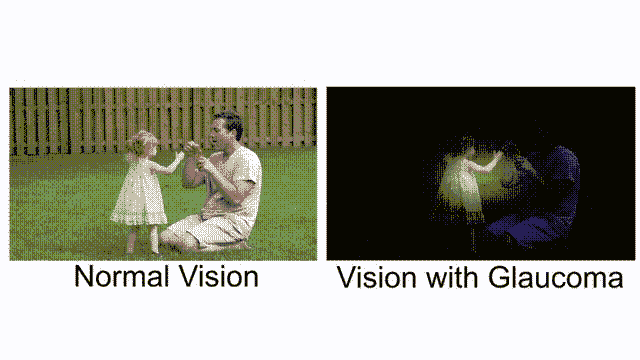
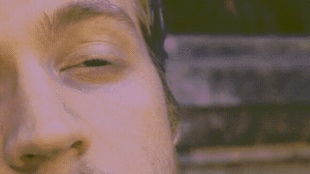
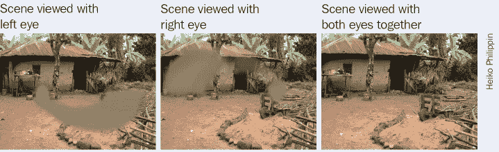
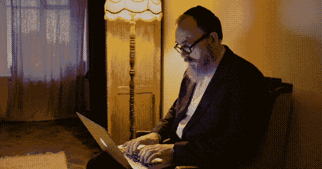
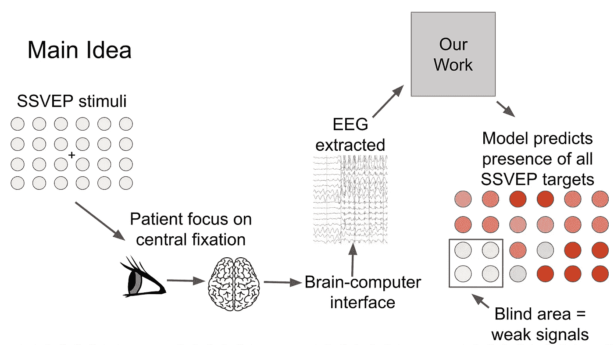
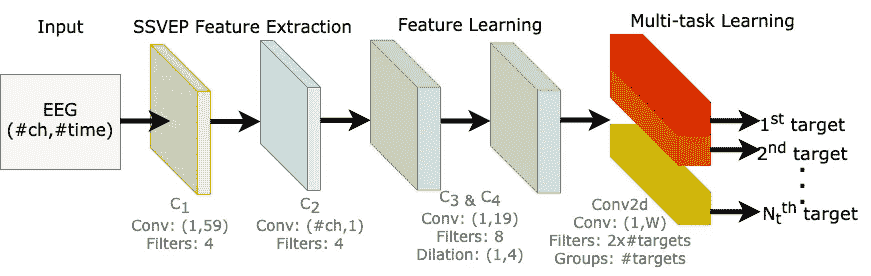
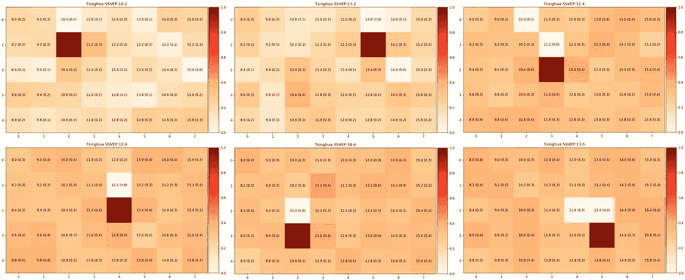
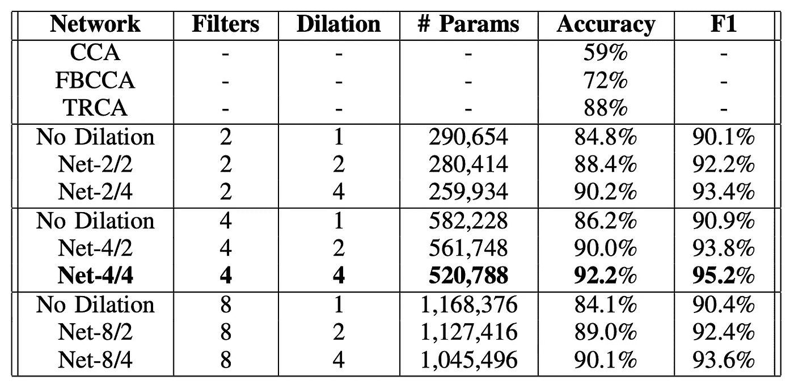

# 利用脑-机接口和机器学习改进青光眼评估

> 原文：<https://towardsdatascience.com/improve-glaucoma-assessment-with-brain-computer-interface-and-machine-learning-6c3b774494f8?source=collection_archive---------50----------------------->

## [理解大数据](https://towardsdatascience.com/tagged/making-sense-of-big-data)

## 我的研究使用多任务学习来提供快速的护理点诊断，以检测周边视觉损失

图片由[免费提供-照片](https://pixabay.com/photos/?utm_source=link-attribution&utm_medium=referral&utm_campaign=image&utm_content=1031000)来自 [Pixabay](https://pixabay.com/?utm_source=link-attribution&utm_medium=referral&utm_campaign=image&utm_content=1031000)

人类擅长捕捉引起剧烈变化或疼痛的感官线索。但是，当变化如此轻微和缓慢，以至于人们无法注意到它时，像视力退化这样的逐渐变化又如何呢？

在许多国家，医疗保健的基础是患者在出现症状时寻求医疗护理。使用这种方法，个人需要知道他们的症状是什么。但是无症状的疾病呢？直到晚期，人们才能注意到，那时他们的生活质量由于视力丧失而受到严重影响。

这是青光眼。

正常视力与青光眼视力的比较。[按作者、原始剪辑的[来源](https://www.pexels.com/video/father-blowing-bubbles-for-her-daughter-3738655/)组合]

随着老龄化人口的增加，我们面临着寻找解决方案来满足老年人医疗保健需求的挑战。随着年龄的增长，失明的几率也越来越高，世界上 80%以上的盲人年龄都在 50 岁以上。总体而言，75%的各种原因导致的失明是可以预防、治疗或治愈的。

我的研究工作通过在临床筛选和诊断程序中应用脑-机接口方法来解决这个问题。这可能为无症状病例的视觉功能检测提供更准确的诊断。

随着年龄的增长，失明的几率会越来越高。[ [来源](https://www.pexels.com/video/close-up-video-of-eye-856002/) ]

# 关于青光眼及其影响

[青光眼](https://en.wikipedia.org/wiki/Glaucoma)被誉为“沉默的视力窃贼”。这是一种随着时间的推移逐渐发展的眼病，会夺走视力。一点一点，你在慢慢变瞎，等你意识到的时候已经太晚了。青光眼导致的视力丧失一旦发生，将是永久性的。

它没有警告标志；从这个例子中可以看出，当两只眼睛有不同的受影响区域时，患者直到晚期才会注意到。

青光眼中的不对称视野丧失可导致迟发，因为患者双眼睁开时看不到缺损。[ [来源](https://www.ncbi.nlm.nih.gov/pmc/articles/PMC3588129/)

世界卫生组织(World Health Organization)的一份[报告称，预计 2020 年(7600 万)至 2030 年(9540 万)间，青光眼患者数量将增加 1.3 倍。随着老龄化人口的增长，患有这种疾病的人数也将大幅增加。](https://www.who.int/docs/default-source/documents/publications/world-vision-report-accessible.pdf)

沉默的小偷没有任何警告信号。研究表明，50%未确诊的青光眼患者在诊断时已经有明显的视野缺损。由于患者通常不会注意到视觉功能的任何变化，他们不会寻求医疗护理。

青光眼对视神经的损害是不可逆的，在大多数情况下，如果没有适当的治疗，它会发展。因此，在初始阶段进行抢先筛查以发现患者至关重要。唯一的解决办法是早期治疗。

随着老龄化人口的增长，患有这种疾病的人数也将大幅增加。【[来源](https://www.pexels.com/video/an-elderly-man-writing-by-typing-on-a-laptop-keyboard-4034125/)

# 现有筛选方法的局限性

青光眼的诊断包括由医生通过视野测试来评估患者的视觉功能。[视野测试](https://www.glaucoma.org/treatment/what-is-a-visual-field-test.php)是一种测量个人视力的方法——中央和周边视力。视野测试可单独绘制每只眼睛的视野图，并可检测盲点([暗点](https://en.wikipedia.org/wiki/Scotoma))，以及视力模糊的更细微区域。该测试将检查患者视野和功能的任何缺陷，如丧失周边视觉。

青光眼筛查测试的目的是检测早期疾病，以便对这些患者进行治疗，降低失明的风险。

怎样才能测量视野？

[标准自动视野检查](https://eyewiki.aao.org/Standard_Automated_Perimetry)，简而言之，我们称之为 SAP。这是目前医生用来评估视野中的盲区、监测青光眼患者视觉功能的方法。

考官会一次用一只眼睛进行测试。它将提供一系列的刺激(闪烁的光点)，一次一个，同时患者必须在整个过程中保持注视中心目标。如果病人看到了光，他们就按下按钮。这些反应将被记录下来，并形成患者的视野图。

SAP 的视野测试是一项主观测试。

它要求患者理解测试说明，充分合作，并完成整个视觉测试，以提供有用的测试结果。

每只眼睛的测试过程大约需要 10 分钟。10 分钟绝对集中注意力在一个中心点上。10 分钟记住当刺激物出现时按下一个按钮。

因此，当患者按下按钮时，即使没有刺激存在，也经常会遇到假阳性结果。

当患者对本应检测到的光刺激没有反应时，假阴性率也很高。当患者在测试过程中注意力不集中时尤其如此。

由于疲劳和注意力分散，患者可能会失去对中心目标的固定，从而影响测试结果的可靠性。

所有这些相互矛盾的结果阻碍了医生做出诊断的决定。单次测量的可靠性可能很低；需要几次一致的测量来确定缺陷的存在。因此，需要更多的多重测试，这反过来会导致诊断延迟。

这些因素突出了对提供客观评估以改善视野检查的技术解决方案的需求。

我们如何从当前的视野检查程序中去除主观性？

我们可以用什么来更精确地测量视野，而不是依赖患者按下按钮？

能不能缩短视野评估的时间？

我们需要一种能够提供客观评估的解决方案来改善视野检查。[ [来源](https://www.pexels.com/video/mom-and-daughter-leaning-to-each-other-5493998/)

# 结合脑机接口和机器学习

这张图说明了我们研究的主要观点。

患者将聚焦在一个中心点上几秒钟，我们将捕捉来自视网膜中央凹和周围邻近目标的信号。我们的模型预测了整个视野中所有 SSVEP 频率的存在。也就是说，如果患者在某个区域有盲区，那么从这些刺激中提取的信号是微弱的，它会反映在视觉反应图上。[ [作者图片](https://jinglescode.github.io/ssvep-multi-task-learning/)

我们的目标是实现一个系统，该系统产生的视野测试结果更加可靠，因为我们消除了现有视野评估中的认知方面。通过这样做，患者不必学习使用该系统，并且测试结果不会受到患者分心或感觉不舒服的影响。

当我们看到闪烁的东西时，稳态视觉诱发电位(SSVEP)会产生大脑信号，频率通常在 1 到 100 赫兹之间。在这个实验中，这些闪烁的灯在屏幕上闪烁。这些闪烁的光被称为刺激。

患者将集中注意力在一个中心点上几秒钟，我们将通过[脑电图](/decoding-brain-signals-with-machine-learning-and-neuroscience-bee288c1d585) (EEG)捕捉他们的大脑信号。脑电图是一种记录大脑电活动的电生理监测方法。

 [## 用机器学习和神经科学解码大脑信号

### 成为 X 教授，解开我们心灵的秘密

towardsdatascience.com](/decoding-brain-signals-with-machine-learning-and-neuroscience-bee288c1d585) 

我们的重点是从整个视野中检测多个信号来诊断青光眼患者。在我们的工作中，我们从 EEG 信号中提取特征。通过我们的方法，我们能够生成显示患者视野中可见部分的视觉反应图。

我们的模型预测了整个视野中所有 SSVEP 频率的存在。也就是说，如果患者在某个区域有盲区，那么从这些刺激中提取的信号就很弱，并且会在视觉反应图上反映出来。

由于我们的模型可以检测多种刺激的存在，我们可以减少视野评估时间，并产生可靠的测试结果。这可能潜在地适合于为青光眼患者提供快速的即时诊断。

 [## 人工智能和神经科学之间的迷人关系

### 他们如何相互激励、共同进步、相互受益

towardsdatascience.com](/the-fascinating-relationship-between-ai-and-neuroscience-89189218bb05) 

# 模型架构

我们的模型由 3 部分组成，1) SSVEP 特征提取，2)特征学习，3)多任务学习模块。提议的网络图示如下。

我们的神经网络由四个卷积块组成，负责学习所有目标频率的 EEG 表示。第五卷积层是一个多任务学习模块，它学习区分多个 SSVEP 目标频率。[ [作者图片](https://jinglescode.github.io/ssvep-multi-task-learning/)

## SSVEP 特征提取

该组件的目的是将原始 EEG 信号解码为我们模型的输入特征。有两个卷积块(C1 和 C2)；每个卷积块由一个卷积图层、一个批量归一化和一个指数线性单元组成。

C1 块设计用于提取 EEG 输入的频谱表示，因为它在时间维度上执行卷积，从每个 EEG 通道独立于其他通道捕获特征。

C2 块被设计用于进行空间滤波，因为它在信道维度上执行卷积。这一层的目标是学习每个时间样本的所有通道的权重。

## 特征学习

这里，有两个卷积块(C3 和 C4)，这些块的目的是捕获每个提取的特征图中的时间模式。

我们还研究了 C3 和 C4 地块上不同的膨胀构型。由于信号所需的核大小比图像大得多，膨胀卷积允许我们扩展感受野，用较小的核大小执行特征学习，产生较小的模型，并潜在地提高性能。

## 多任务学习模块

第五个也是最后一个卷积模块学习区分多个 SSVEP 目标频率。我们利用多任务学习的方法，设计这个模块来产生多种输出。

在经典的[多任务学习](https://en.wikipedia.org/wiki/Multi-task_learning)架构中，每个任务被分成特定于任务的层，每层负责学习识别每个任务。但我们不是为每个输出复制一个卷积层，而是按组执行卷积。我们实际上是在单个卷积层中执行单独的卷积。这使我们能够在单个 GPU 上高效地并行训练多个任务，并且我们可以有效地动态调整我们的模型规模以适应任意数量的任务，这可能适用于其他多任务学习应用。

我们的实现建立在 PyTorch 框架之上，并在我们的伙伴网站[上公开发布。](https://jinglescode.github.io/ssvep-multi-task-learning/)

 [## 用于 SSVEP 检测和视觉反应映射的深度多任务学习

### 使用多任务学习有效地同时捕获来自视网膜中央凹和邻近目标的信号。

jinglescode.github.io](https://jinglescode.github.io/ssvep-multi-task-learning/) 

# 结果(多标签)—视觉反应图

我们的模型是一个统一的系统，通过学习区分 40 种频率来生成视觉反应图。我们预测所有目标频率同时出现。因此，这使我们能够用视觉响应图来可视化用户所看到的内容。

一些视觉图的例子，其中较暗的阴影表示来自 SSVEP 刺激的较强信号。[ [作者图片](https://jinglescode.github.io/ssvep-multi-task-learning/)

这是一些视觉地图的例子，其中较暗的阴影象征着来自 SSVEP 刺激的较强信号。我们选择了位于屏幕中心周围的 6 个目标，因为这是我们未来工作中视野评估的感兴趣区域。我们已经用留一个受试者的方法评估了我们的模型，以展示我们方法的通用性，并且我们的方法需要很少或不需要对新用户进行校准。

# 结果(多类)—分类

我们也可以使用我们的网络作为分类器。因此，我们可以将我们的模型与 SSVEP 分类准确性的现有技术方法进行比较。

将我们的模型与其他基于 CCA 的方法以及各种模型配置进行比较。[ [作者图片](https://jinglescode.github.io/ssvep-multi-task-learning/)

对于每次试验 1 秒钟的信号，[典型相关分析](https://en.wikipedia.org/wiki/Canonical_correlation) (CCA)、[滤波器组典型相关分析](https://pubmed.ncbi.nlm.nih.gov/26035476/) (FBCCA)和[任务相关成分分析](https://www.jaist.ac.jp/~hirokazu/Site/Publicatons_files/TanakaKaturaSatoNeuroImage2013.pdf) (TRCA)分别产生大约 59%、72%和 88%的准确度。使用我们提出的方法，我们可以有效地识别视网膜中央凹的目标频率，在遗漏一个受试者的情况下达到 92%的准确率。

显然，这一结果表明，我们的方法可以作为识别单个闪烁目标的替代方法，其中重点是提供在视网膜中央凹视觉上检测到的可靠的 SSVEP 响应。

# 结论

这项研究提出了一种深度学习方法，该方法可能使我们能够同时检测多种 SSVEP 刺激，从而绘制青光眼患者的视觉地图，减少视野评估时间，并产生可靠的测试结果。

鉴于最近在疾病爆发和大流行期间发生的事件，建议将非必要的医院预约保持在最低限度，这种评估方法可以减少所需的测试次数，从而最大限度地减少任何不必要或额外的测试。本质上，这项研究使我们未来的工作能够潜在地评估青光眼患者的视野，以检测周边视力丧失。为了提高评估结果的可靠性，利用 SSVEP 可以消除患者执行程序的能力和患者精神状态的可变性。通过同时检测多个 SSVEP 目标并生成视觉反应图，可以缩短评估时间。

我们的方法可能适用于为青光眼患者提供快速的即时诊断。

 [## 用于 SSVEP 检测和视觉反应映射的深度多任务学习

### 使用多任务学习有效地同时捕获来自视网膜中央凹和邻近目标的信号。

jinglescode.github.io](https://jinglescode.github.io/ssvep-multi-task-learning/) 