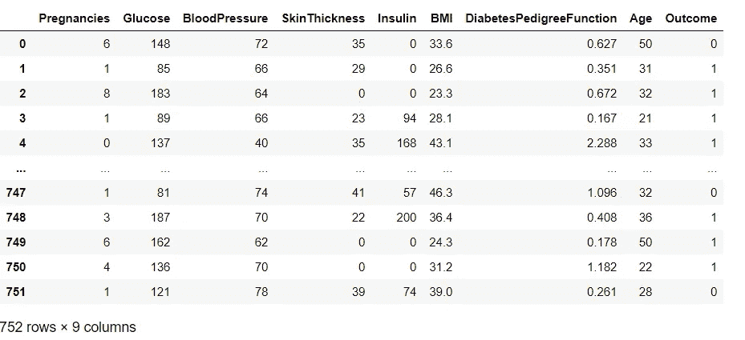
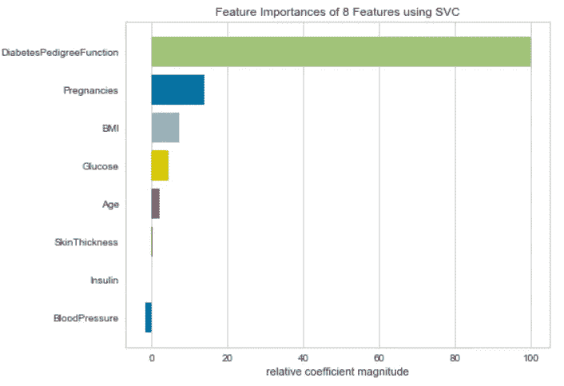
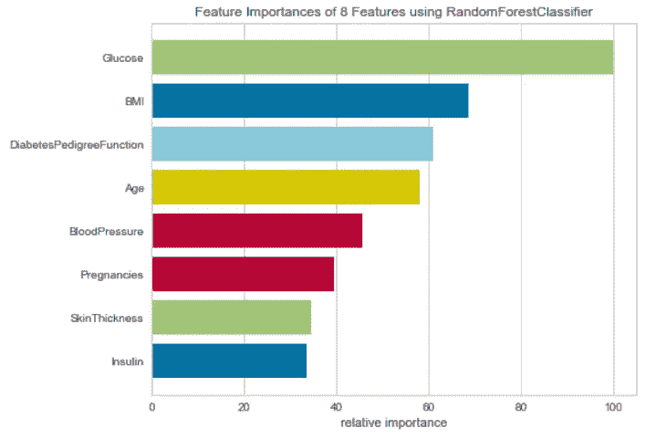
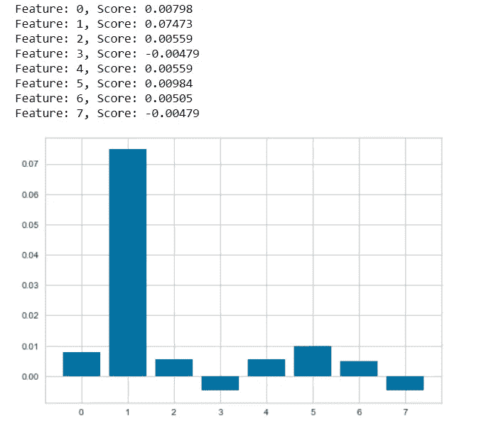
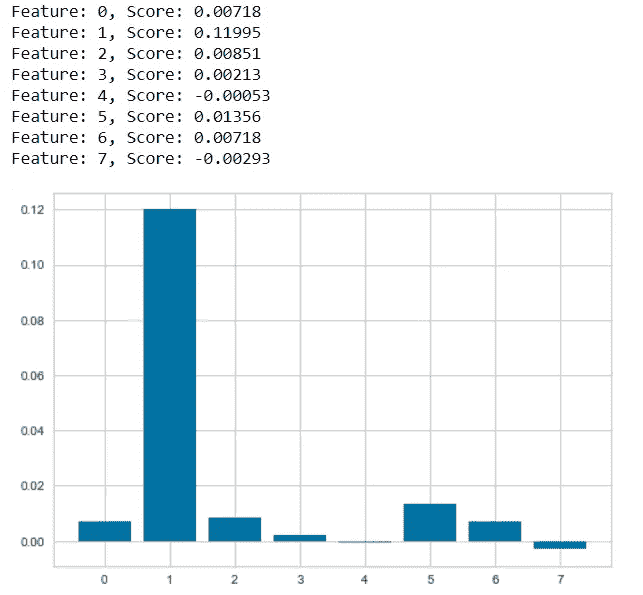

# 使用特征重要性提高模型性能

> 原文：<https://towardsdatascience.com/improve-model-performance-using-feature-importance-55742402fadc?source=collection_archive---------35----------------------->

## 理解寻找特征重要性的不同方法


弗兰基·查马基在 [Unsplash](https://unsplash.com?utm_source=medium&utm_medium=referral) 上拍摄的照片

机器学习模型性能是选择特定模型的最重要因素。为了选择机器学习模型，我们可以查看某些指标，这些指标可以帮助我们选择具有最高准确性和最小误差的最佳模型。

无论是回归模型还是分类模型，特征变量在建立预测模型中起着重要的作用。拥有大量的特征并不好，因为这可能会导致过度拟合，这将使我们的模型特别适合它所训练的数据。此外，具有大量特征将导致维数灾难，即特征将增加问题的搜索空间的维数。

我们可以使用不同的技术和方法进行降维和特征选择，并且为了使这些步骤更加有效，我们可以使用特征重要性，这为我们提供了在预测目标变量时哪些特征最重要的洞察力。

特征重要性是一种为我们提供每个特征变量的相关分数的技术，我们可以用它来决定哪些特征最重要，哪些特征对预测目标变量最不重要。

在本文中，我们将探索不同的技术，我们可以使用的功能的重要性，并找出他们的相对重要性分数。

# 加载数据集

我们将使用包含目标变量为 0(非糖尿病)或 1(糖尿病)的糖尿病数据集进行分类问题，并使用不同的机器学习模型找出最重要的特征变量。

```
import pandas as pd
df = pd.read_csv('DIABETES.csv')
```



糖尿病数据集(来源:作者)

在找出重要的特性之前，我们需要定义特性和目标变量。

```
X = df[['Pregnancies', 'Glucose', 'BloodPressure', 'SkinThickness', 'Insulin', 'BMI','DiabetesPedigreeFunction','Age']]
y = df['Outcome']
```

# 特征重要性技术:

## 1.使用黄砖要素重要性

Yellowbrick 是一个可视化库，主要用于模型选择和模型性能可视化。它是使用 sklearn 构建的，基于 matplotlib 构建，用于可视化。

我们将使用 yellowbrick 的要素重要性可视化工具，它返回所有要素及其相对重要性分数。我们可以使用不同的模型来寻找特征的重要性。

```
#Creating SVM Model
from sklearn import svm
model = svm.SVC(kernel='linear')
#Importing Yellowbrick Feature Imporance and using it
from yellowbrick.model_selection import FeatureImportances
viz = FeatureImportances(model)
viz.fit(X, y)
viz.show()
```



SVM 特色重要性(来源:作者)

类似地，我们可以使用不同的模型，并找出该模型的特征重要性。让我们再看一个使用随机森林分类器的例子。

```
from sklearn.ensemble import RandomForestClassifier
model = RandomForestClassifier()
#Visualizing Feature Importance
viz = FeatureImportances(model)
viz.fit(X, y)
viz.show()
```



随机森林特征重要性(来源:作者)

2.排列重要性

置换重要性在 Sklearn 模型检验方法下定义。当数据是表格形式时，它可用于任何拟合的估计量。该函数计算给定数据集的估计量的特征重要性。n_repeats 参数设置随机洗牌的次数，并返回特征重要性的样本。

```
from sklearn.inspection import permutation_importance
from sklearn.naive_bayes import GaussianNB
import matplotlib.pyplot as plt#Defining the model
model = GaussianNB()
model.fit(X, y)# perform permutation importance
results = permutation_importance(model, X, y, scoring='accuracy')# get importance
importance = results.importances_mean# summarize feature importance
for i,v in enumerate(importance):
    print('Feature: %0d, Score: %.5f' % (i,v))# plot feature importance
plt.bar([x for x in range(len(importance))], importance)
plt.xlabel=df.columns[:-1]
plt.show()
```



排列的重要性(来源:作者)

同样，我们可以使用不同的模型来找出该模型的特征的重要性。让我们使用不同的模型来找出特性的重要性。

```
from sklearn.linear_model import LogisticRegression#Defining the model
model = LogisticRegression()
model.fit(X, y)# perform permutation importance
results = permutation_importance(model, X, y, scoring='accuracy')# get importance
importance = results.importances_mean# summarize feature importance
for i,v in enumerate(importance):
    print('Feature: %0d, Score: %.5f' % (i,v))# plot feature importance
plt.bar([x for x in range(len(importance))], importance)
plt.xlabel=df.columns[:-1]
plt.show()
```



物流特征的重要性(来源:作者)

我们在这篇文章中讨论的方法易于使用，因为你不必考虑不同的参数，应该有如果通过传统的。在某种程度上，这些技术自动化了特性的重要性，因此节省了时间和精力。

同样，您可以在具有不同模型的不同数据集上尝试这些技术。继续探索这些技术，并在这篇文章的回复中分享你的经验。

# 在你走之前

***感谢*** *的阅读！如果你想与我取得联系，请随时通过 hmix13@gmail.com 联系我或我的* [***LinkedIn 个人资料***](http://www.linkedin.com/in/himanshusharmads) *。可以查看我的*[***Github***](https://github.com/hmix13)**简介针对不同的数据科学项目和包教程。还有，随意探索* [***我的简介***](https://medium.com/@hmix13) *，阅读我写过的与数据科学相关的不同文章。**