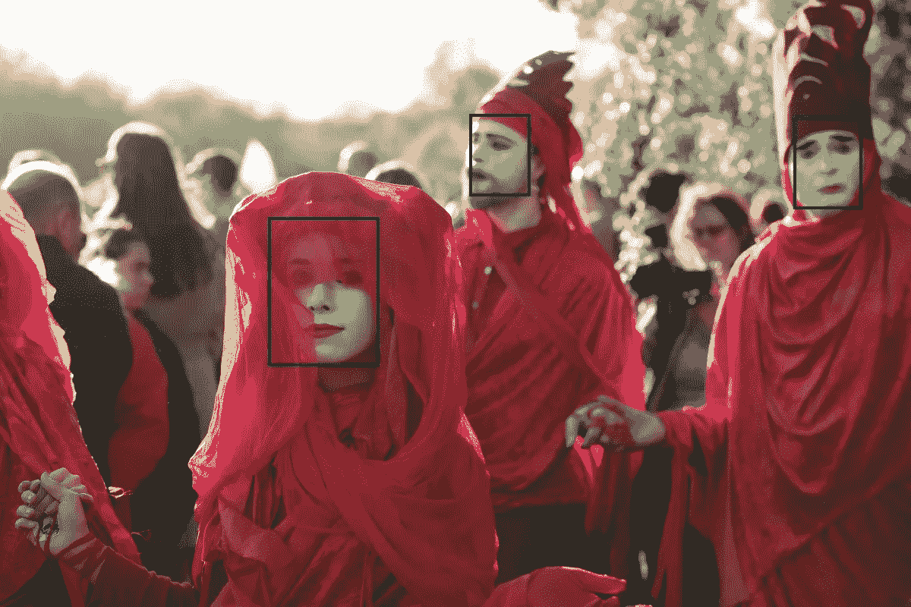
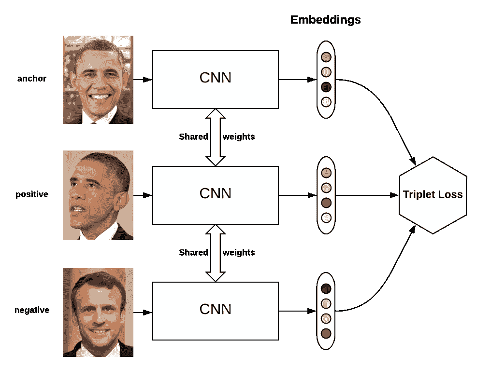
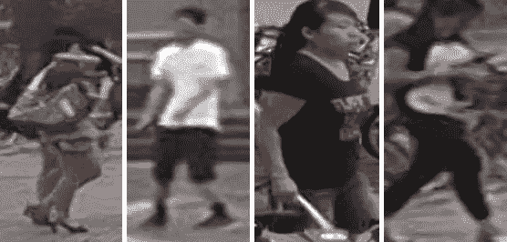
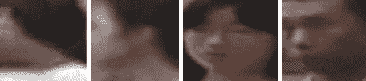
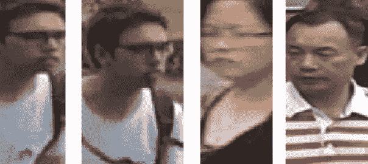

# 通过人脸检测(人脸盒)改进人员重新识别

> 原文：<https://towardsdatascience.com/improve-person-re-identification-with-face-detection-faceboxes-4450a93e50c7?source=collection_archive---------53----------------------->

## 减少视点数量和创建高质量嵌入的简单方法



图片来自[乔尔·沃格特](https://unsplash.com/@bullfishfighter)的 [Unsplash](https://unsplash.com)

人的重新识别是一个有趣的并且没有完全解决的任务。它包括在图像中找到(定位)一个人，并为特定人的照片创建数字描述(矢量或嵌入),其方式是特定人的其他照片的矢量的[距离](https://en.wikipedia.org/wiki/Euclidean_distance)比为其他人的照片生成的矢量的距离更近。



图片来自[https://github.com/omoindrot/tensorflow-triplet-loss](https://github.com/omoindrot/tensorflow-triplet-loss)

人的再识别被用在许多任务中，包括购物中心的游客流分析、跨摄像机跟踪人、在大量照片中找到某个人。

近来，许多有效的模型和方法被创建来解决重新识别任务。这些型号的完整列表可以在[这里](https://paperswithcode.com/task/person-re-identification)找到。但是，即使是最好的模型也仍然面临许多问题，例如人的姿势和视点的变化，由于这些变化，从不同角度对一个人的照片的嵌入将彼此相距太远，并且系统可以判定这是不同人的照片。

最新的最先进的模型，如[用于人员重新识别的视角感知损失和角度正则化](https://paperswithcode.com/paper/viewpoint-aware-loss-with-angular)，旨在处理上述问题，但我们在[ai-labs.org](http://ai-labs.org/)提出了一种简单的方法，在某些情况下极大地简化了重新识别的任务。我将更详细地讨论这种方法。

让我们从解释大多数 re-id 框架如何检测图像中特定人的照片开始。最常用的物体检测模型，如[更快的 R-CNN](https://arxiv.org/pdf/1506.01497.pdf) 或 [EfficientDet](https://arxiv.org/abs/1911.09070) ，用于创建整个人体的边界框。提取整个人体的照片后，将创建该照片的嵌入。



来自[火星的图像:运动分析和重新识别装置](https://www.kaggle.com/twoboysandhats/mars-motion-analysis-and-reidentification-set)

问题是，对象检测模型往往工作得太好了，它们从各种角度找到人们的照片，但并不总是最好的质量。基于这些照片的嵌入通常不允许正确地重新识别一个人，或者以这样一种方式生成，即从一个视点对特定人的照片的嵌入将接近于仅从相同视点对照片的嵌入，但是不接近于从不同视点和距离对同一个人的照片的嵌入。

这个问题可以通过减少我们必须处理的视点数量来解决。如果不是在整个身体图像上，而是仅在面部上进行人的重新识别，则可以实现这一点。在这种情况下，面部检测模型[面部盒](https://github.com/TropComplique/FaceBoxes-tensorflow)会有所帮助。这个模型已经在我们的工作中证明了自己，加上它可以完美地检测戴面具的人的脸，这在现在尤为重要。通过人脸检测，我们丢弃了很大一部分视点变化，如后视图，但如果我们只使用低质量图像中的人脸照片，那么我们可能没有足够的信息从特定照片中将其与成千上万的其他照片区分开来。



来自[火星的图像:运动分析和重新识别装置](https://www.kaggle.com/twoboysandhats/mars-motion-analysis-and-reidentification-set)

值得一提的是我们使用的[facebox](https://github.com/TropComplique/FaceBoxes-tensorflow)模型的实现特性。它不能检测小脸，这在我们的情况下从劣势变成了优势，因为我们会立即丢弃太小(30x30 像素或更小)的照片，这些照片上的信息不足以进行正确的重新识别。

我们还使用了一个小技巧，这将允许我们在不增加视点数量的情况下获得关于一个人的更多信息。我们将根据某种算法扩展人脸的包围盒，同时捕捉部分人体躯干。以下是该算法以函数形式实现的一个示例，该函数接收一帧作为输入，并使用来自 [FaceBoxes](https://github.com/TropComplique/FaceBoxes-tensorflow) 的 FaceDetector 对象返回检测到的人物图像列表:

```
import numpy as np
from PIL import Image
from face_detector import FaceDetector

MODEL_PATH = 'model/facebox.pb'
face_detector = FaceDetector(MODEL_PATH, gpu_memory_fraction=0.25, visible_device_list='0')def pad_faces(frame, tres = 0.5):
   face_pad = []
   width, height = frame.size   
   image_array = np.array(frame)
   boxes, scores = face_detector(image_array, score_threshold=tres)

   for b in boxes:
       ymin, xmin, ymax, xmax = b.astype('int')

       top_pad = int((ymax - ymin) * 0.4)
       bottom_pad = int(ymax - ymin)
       w_pad = int((xmax - xmin) * 0.4)

       ymin = ymin - top_pad if ymin - top_pad > 0 else 0
       ymax = ymax + bottom_pad if ymax + bottom_pad < height else height - 1
       xmin = xmin - w_pad if xmin - w_pad > 0 else 0
       xmax = xmax + w_pad if xmax + w_pad < width else width - 1

       ratio = (ymax-ymin) / (xmax-xmin)

       if ratio < 1.6:
           xmin = xmin + w_pad
           xmax = xmax - w_pad
       ratio = (ymax-ymin) / (xmax-xmin)

       face_pad.append(image_array[ymin:ymax, xmin:xmax])

   return face_padimagex = Image.open('image1.jpg').convert('RGB')
padded_faces = pad_faces(imagex)
```

应用该函数后，我们得到以下格式的图像:



来自[火星的图像:运动分析和重新识别装置](https://www.kaggle.com/twoboysandhats/mars-motion-analysis-and-reidentification-set)

总的来说，我们选择了高质量的图像，并且主要是从一个角度。这将简化重新识别的任务，因为我们从一个视点接收特定人的嵌入，并且这样的嵌入将彼此接近。为了生成嵌入，我们可以使用[锦囊妙计和一个强大的里德基线](https://github.com/michuanhaohao/reid-strong-baseline)模型，它显示了各种数据集上的高质量嵌入。

这种方法并不适用于所有情况，但它可以在人们花费大量时间并且您从不同视角获得每个人的大量照片的区域中增加您的重新识别管道的准确性。