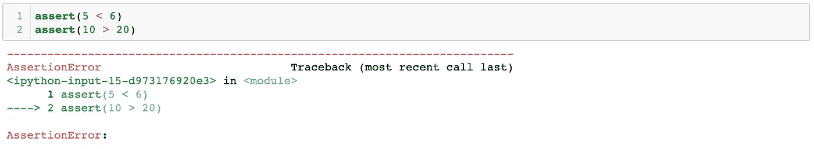
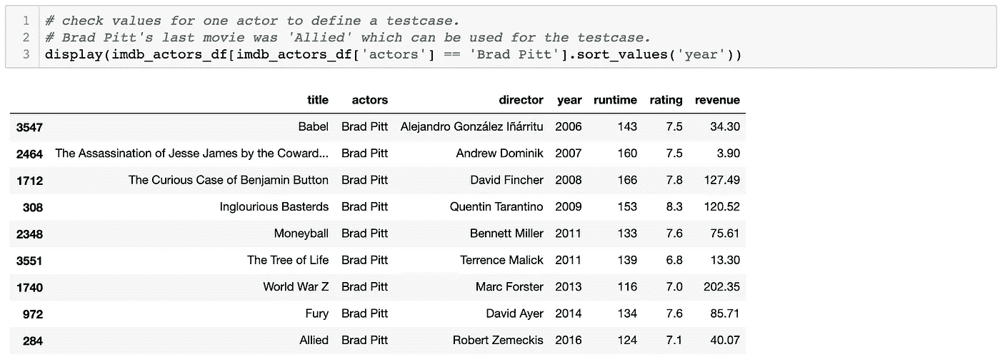
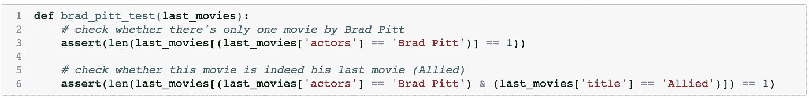
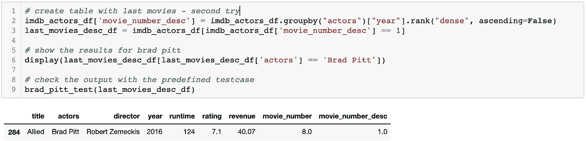
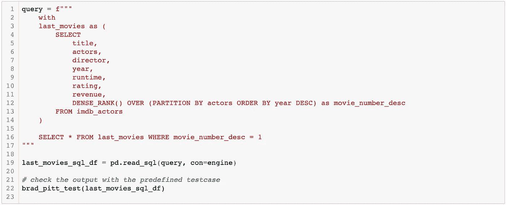
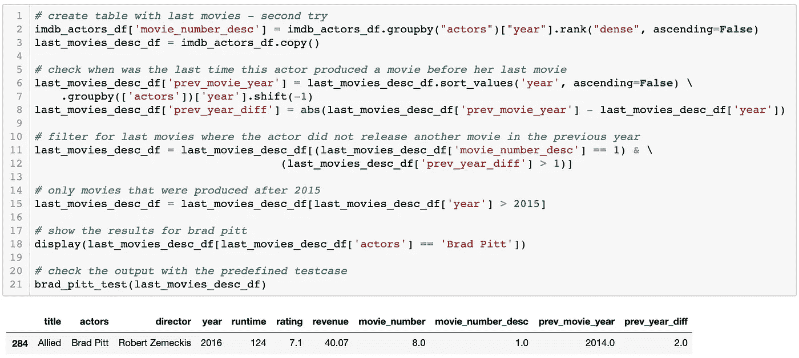

# 使用这个小 Python 语句提高您的分析质量和效率

> 原文：<https://towardsdatascience.com/improve-quality-and-efficiency-of-your-analysis-with-this-little-python-statement-d73ee434823f?source=collection_archive---------51----------------------->

[图片](https://unsplash.com/photos/-2vD8lIhdnw)由[jeeshots.com](https://unsplash.com/@jeshoots)在[上 Unsplash](https://unsplash.com/)

## 如何使用 assert 利用 Python 和 SQL 中的测试驱动开发的实际例子

曾经写过 SQL 查询或者操作过熊猫数据帧吗？那么你就知道犯一个小错误很容易导致完全错误的结果。如果只是更新和重新运行一个旧的查询，情况会更糟。这些偏见最终会导致错误的(商业)决策，从而产生巨大的影响。

> "你能快速重新运行你 6 个月前为我们做的分析吗？"-“嗯，好吧，我看看我是否能把它拼起来。”

与语法或语义错误不同，逻辑编程错误很难在分析结果中检测出来。但是幸运的是，使用 assert 语句可以大大降低产生这些错误的风险！

让我们快速看一下这个小陈述如何帮助提高你的分析质量和效率(以及对你的结果的信心)。

# 试驾开发快速入门

我在这篇文章中介绍的方法被广泛称为**测试驱动开发** (TDD)。根据我的经验，TDD(不幸的是)在数据科学中并不常见，至少在进行探索性分析时是这样。同时，它作为一种确保高质量代码的机制，在软件工程领域被广泛使用。

这种方法背后的思想是，首先从实现您想要编写的代码的测试开始。该测试基本上定义了您想要实现的输出。然后，您开始编写和重新定义代码，直到它通过预定义的测试。

TDD 迫使程序员在编写第一行代码之前坐下来思考想要的输出。这样，一个人被迫关注实际目标，这自动有助于提高效率。

[图片](https://unsplash.com/photos/rD2dc_2S3i0)由[克里斯·利维拉尼](https://unsplash.com/@chrisliverani)在 [Unsplash](https://unsplash.com/) 上拍摄

这种方法不仅有助于写作，也有助于**更新你的代码**。想象一下，你被要求重新进行一项半年前进行的分析。通常，您必须对您的旧代码进行一些修改。例如，可能需要更新一些参数，或者应该使用一些额外的指标来增强结果。再翻旧剧本总是一件麻烦事。所以更新脚本时很容易出错。但是您在第一次进行分析时定义的测试将帮助您快速识别那些错误，并确保您仍然产生相同的结果。

那么，在 Python 或 SQL 中进行分析时，TDD 到底可以如何使用呢？

# 什么是断言？

首先，Python 中有 pytest 这样的专用测试包。但是特别是当在笔记本上工作时，我认为 assert 是一种更轻量级和更直接的使用 TDD 的方法。

assert 语句测试条件是否为真。否则，它将引发 AssertionError。这使它成为调试代码的有益工具:

assert 语句引发 AssertionError。

因此，让我们看看在 Python 中处理数据时，如何将 assert 用于 TDD。

# 对 TDD 使用断言

为了展示如何将 assert 用于 TDD，我将使用一个实际的例子。我们有一个演员和他们出演的电影的表格(这是 Kaggle 的 2006-2016 年 IMDB 数据集)。目标是生成一个只包含每个演员的最后一部电影的表:

示例数据集的样本。

## 1.定义测试用例

首先要做的是定义我们想要获得的期望输出。因此，我们可以查看其中一个演员，并检查该演员制作的最后一部电影是哪部。对于布拉德·皮特来说，这个数据集中最新的电影是*联盟*:

布拉德·皮特的电影包含在按年份排序的数据集中。

现在我们知道我们的输出表必须包含一行，其中演员是布拉德·皮特，标题是*盟军*。此外，这必须是唯一一排有布拉德皮特作为演员。基于此，我们可以定义以下测试用例:

输出数据帧的测试用例。

这几行代码确保我们生成的数据帧满足定义的条件。如果没有，将引发 AssertionError 并停止笔记本的执行。

## 2.编写和验证代码

因此，让我们开始构建一个只包含每个演员的最后一部电影的表。为了做到这一点，我使用 Pandas 的 rank()函数按电影制作年份对每部电影进行排序，并按演员分组。然后用预定义的测试用例检查其输出:

测试函数抛出 AssertionError，因为输出表与定义的标准不匹配。

正如我们所看到的，生成的数据帧没有通过测试。布拉德·皮特似乎只有一部电影(这是第一个条件)，但这部电影是*巴贝尔*而不是*联盟*。

从之前的探索性分析我们知道*巴别塔*实际上是布拉德·皮特在数据集中的第*部*电影。所以电影的排名肯定有问题。记住，rank()默认情况下按升序排列电影，我们必须更改这个参数，以便电影按年份降序排列:

输出表满足测试用例中定义的标准。

在这个小小的更新之后，表通过了测试用例！当然，我们通常会定义一个有更多条件的更复杂的测试用例，但是我认为这个小案例已经帮助传达了这个想法。

## 在 SQL 中测试

所提出的方法对于在 Python 中测试 SQL 查询也非常有用。如果我们连接到一个数据库，任何查询的输出都可以很容易地用完全相同的方法进行测试:

用 Python 测试 SQL 查询。

# 结论

我们已经看到了 TDD 如何帮助我们在处理数据时关注我们想要达到的目标，并确保我们产生正确的结果。所有这些都可以通过 Pythons 内置的 assert 语句轻松实现。

将来，这个测试用例将确保我们在更新表格后仍然获得预定义的结果。因此，尽管数据工作可能变得更加复杂，测试功能仍然有助于确保我们代码的一定质量。如果有人拿起代码并开始添加更新，这将变得更加有用:

带有更多过滤标准的最后一个电影表。

我只能鼓励每个人习惯用这种方法测试你的查询。它可以成为救命稻草！

请在 Github 上我的[库中找到这个项目的代码。](https://github.com/denmei/data-science-projects/tree/master/AssertBlog)

喜欢这篇文章吗？那么你可能也会喜欢我的其他帖子:

 [## 社交网络中的 AB 测试挑战

### 脸书和他的同事如何在 AB 测试中克服互联用户的挑战。

towardsdatascience.com](/ab-testing-challenges-in-social-networks-e67611c92916)  [## Jupyter 笔记本电脑的版本控制

### 为什么版本控制笔记本不是直截了当的，以及如何使用 nbdime 这样的工具来克服这些问题。

treatwell .工程](https://treatwell.engineering/version-control-for-jupyter-notebooks-4012646d1662)