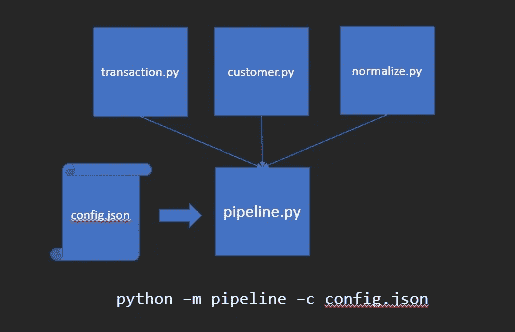
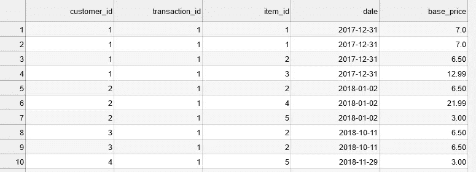
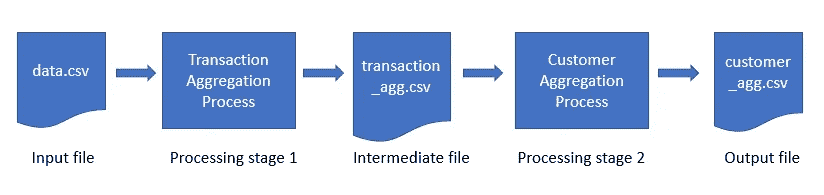

# 使用配置文件改善您的数据科学管道

> 原文：<https://towardsdatascience.com/improve-your-data-science-pipelines-with-config-files-3cadc1ac220d?source=collection_archive---------12----------------------->

在过去的几个月里，我一直在用 Python 编写数据管道，为一个机器学习项目准备训练数据。为了试验不同版本的数据，有必要通过将用户定义的参数传递到管道的不同步骤来使管道尽可能灵活。在本文中，我将向您展示更好地将参数传递到数据管道所需的步骤。

一个期望的功能是能够容易地使用管道来生成数据集的不同版本。这些版本通常在以下方面有所不同:

*   用于计算特征的操作
*   要包括在特征计算中的数据子集，以及
*   将包含最终特征值的目标文件或表。

管道的早期迭代面临一些挑战:

1.我如何轻松地指定要设置哪些参数，以确保我以最小的出错几率执行正确的操作？

2.一旦管道完成执行，我如何快速返回并检查哪个数据集是使用哪个参数创建的？

我很快意识到最重要的问题是无法跟踪传递给管道组成模块的大量硬编码参数。为了改进我们繁琐而低效的方法，我从软件工程师那里得到了启示(这在处理大规模数据科学项目时非常有用),并修改了管道设计以使用配置文件。

在本文的剩余部分，我将回答以下问题:

1.什么是配置文件？

2.如何将配置文件加载到 Python 脚本中？

3.我如何利用配置的内容？

通过遵循下面的例子并利用配置文件，您将拥有更健壮、更易于维护的代码。

# 树立一个榜样。

在我们深入技术细节之前，让我描述一下示例场景，它将阐明我们将要讨论的要点。假设我们有一个存储为 CSV 文件的数据集(参见 [Github](https://github.com/andrew-alberts/config-pipe/blob/master/data.csv) 中的数据),它详细描述了客户执行的交易，并按项目细分。

我们示例数据的前十行。

我们希望编写代码，将原始形式的数据处理成具有客户级别功能的记录；我们称之为*管道*。为了达到这个目标，我们有一些中间阶段。首先，我们需要在事务级别聚合所有项目。其次，我们需要将交易记录聚合到客户级别。

除了多个阶段，我们还预计每个阶段的处理会根据业务需求而有所不同。对于事务级别的聚合，我们希望能够过滤掉某个价格范围之外的项目。我们还想以可修改的税率计算这些商品的已付税款。对于客户级别的聚合，我们需要能够根据日期过滤交易。我们还希望能够试验如何通过交易总数或每个客户购买的商品数量来标准化商品的总成本。在管道的两个阶段，我们都需要能够指定源数据以及将结果保存到文件中。

上述两个阶段是作为 Python 函数实现的。对于交易阶段:

请注意，该代码包含日期范围的筛选器，并根据 tax_rate 计算 final_price。每个客户交易记录都有日期、总价和交易中购买的商品数量。

对于客户阶段:

在这里，计算诸如 max_price、total_price 和 num_items 之类的特征。为 total_price 选择规范化的逻辑也在这里。

调用管道的代码在脚本的末尾。请注意函数的硬编码参数:

# 什么是配置文件？

配置文件指定应用程序的参数。这些参数通常以键值对格式编写，本质上是在参数名和该参数的关联值之间创建一个赋值。将参数值放在一个文件中可以提供一个集中的、组织良好的位置来指定应该将什么参数传递给程序。我们希望在配置中包含的数据管道参数示例包括:

*   数据源位置
*   阈值和过滤值
*   要选择的列列表
*   特殊控制标志。

让我们以 [JSON](https://learnxinyminutes.com/docs/json/) 的格式描述这两个阶段，以便事务和客户级别的聚合将它们的参数指定为键值对:

我们将把这个文件保存为 config.json。

请注意，函数参数值与我们在配置中输入的值非常接近。除了 ***None*** 值变为 ***null*** 之外，其余参数保持其类型。

随着我们继续这个例子，我们将使用 JSON 格式的配置，但是您可以探索其他适合您需要的格式(例如 [YAML](https://learnxinyminutes.com/docs/yaml/) 或 [XML](https://learnxinyminutes.com/docs/xml/) )。

# 如何将配置文件加载到 Python 脚本中？

现在我们已经在配置中为我们的步骤指定了参数，我们将使用两个模块将数据从 JSON 文件中取出并放入程序中。为此，我们将导入两个 Python 库:

当我们通过命令行界面运行 Python 脚本时，argparse 库允许我们指定配置文件的名称。

json 库用于将我们的配置内容从 JSON 格式转换成 Python 对象。

在 __main__ 中，我们使用 argparse 来使用配置文件的绝对路径，并使用 json 来解码文件内容:

从配置中传递程序设置现在就像运行*python pipeline . py-c config . py*一样简单

# 我如何利用配置的内容？

此时，我们已经将 JSON 文件的内容作为 Python 字典加载了(在我们的代码中方便地称为“config”)。

回想一下，我们拆分了配置，这样管道的每一步都由一个字典来表示，该字典映射处理阶段的名称以及该阶段的相关参数。在管道的 Python 代码中，我们用一个函数来表示处理的每个阶段。请注意，配置中的阶段参数与函数参数名称相匹配。这很方便，因为对于配置中的每个阶段，我们可以使用**运算符提取每个处理阶段的参数:

这是一种过于简单的方法，但是您可以将这种设计扩展到更复杂的管道，这些管道可能跨越许多源文件。如果您的管道步骤需要运行多个 Python 脚本，您仍然可以使用统一的配置文件，但是只选择您在每个步骤中需要的配置部分。

在本文中，我们研究了一种利用配置文件设计 Python 管道的方法。尽管它很简单，但这一功能帮助我们更清楚地了解管道的处理过程，并让我们对训练模型所用的数据充满信心。查看本文的代码[这里](https://github.com/andrew-alberts/config-pipe)开始在您自己的数据科学管道中实施配置！