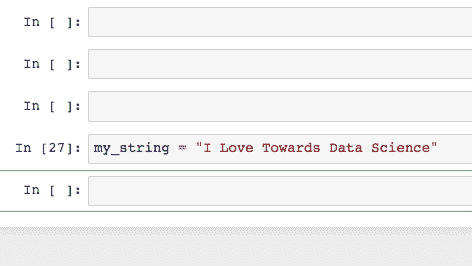
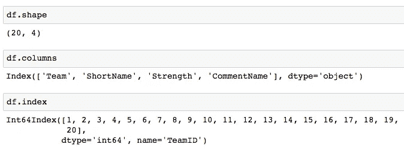
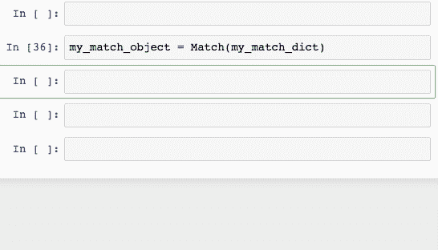
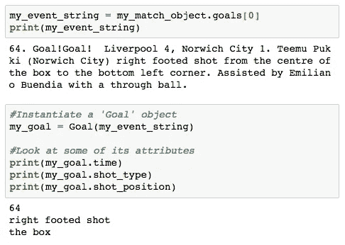
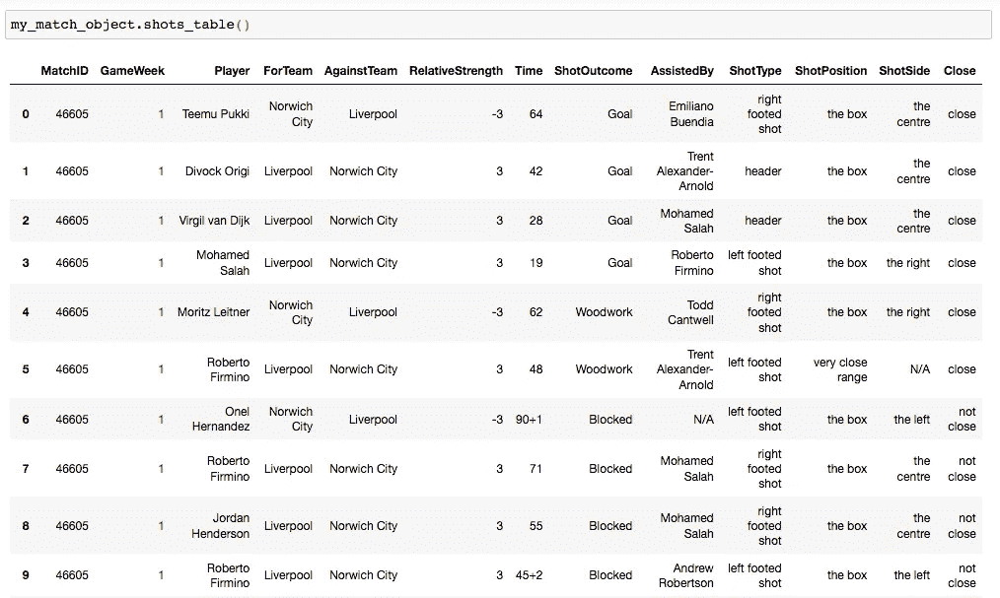

# 使用面向对象编程改善您的数据争论

> 原文：<https://towardsdatascience.com/improve-your-data-wrangling-with-object-oriented-programming-914d3ebc83a9?source=collection_archive---------6----------------------->

## [按目标](https://towardsdatascience.com/tagged/on-target)

## munging 和 OOP 令人惊讶的成功结合


“你永远不会孤独”(摄影:Pexels)

数据科学的一个肮脏秘密如下:

> *“你不会花时间去发现辉煌的新算法和开发尖端的神经网络，事实上，你会把大部分时间花在清理、管理和操纵数据上”*

这是一个简单而不可回避的事实的结果——现实世界中的数据通常不会被很好地包装在顶部有一个漂亮的蝴蝶结的熊猫数据帧中。由于更高质量的数据产生更高质量的模型，这是我们不能忽视的过程的一部分。

不久前，我写了一篇关于争论数据的技术的[博客](/worthless-in-seattle-9300b3594383)，尽管其中包含错误，但至少是在一个数据框架中构建的。但是如果你连那个都没有呢？回想一下我在 Target 上一篇来自 [*的博客——我们使用 Splinter 从英超网站上的*](https://towardsdatascience.com/tagged/on-target)*[比赛页面](https://www.premierleague.com/match/46858)中收集数据。*

[](/elevate-your-webscraping-with-splinter-a926eee7f7d9) [## 用 Splinter 提升你的网络抓取

### 通过自动化与网页的交互，从您的抓取中获得更好的数据

towardsdatascience.com](/elevate-your-webscraping-with-splinter-a926eee7f7d9) 

这为我们提供了我们想要进行的分析/建模所需的所有数据。但这不是最友好的格式——我编写的抓取代码将所有内容放入嵌套字典中，其模式看起来有点像这样:

```
**MATCH_DICTIONARY
-> MatchID** (str)
**-> GameWeek** (str)
**-> Events** (long list of strings)
**-> Stats**
   -> HomeStats (dictionary of team stats)
   -> AwayStats (dictionary of team stats)
**-> Players**
   -> HomeTeam
      -> TeamName (str)
      -> StartingPlayers (list of strings)
      -> Subs (list of strings)
   -> AwayTeam
      -> TeamName (str)
      -> StartingPlayers (list of strings)
      -> Subs (list of strings)
```

值得注意的是，首先收集这些数据作为字典并不是不合理的——每场比赛中的“事件”数量因游戏而异，所以我们不能很好地将它们存储在关系表中。此外，dictionary 方法意味着比赛数据与 MatchID 相关联，match id 是每个游戏的唯一标识符，在建模过程的后期非常重要。

无论如何，我们需要以某种方式获取这些数据，并将其转换成模型友好的格式。然而，操作嵌套字典的代码很快就会变得混乱，也许更危险的是，字典是可变的数据结构——也就是说，它们的内容可以被编辑。因此，以目前的字典形式保存数据可能会有风险。

幸运的是，还有另一种方法——面向对象编程(OOP)。

# 对象的简要介绍

在深入我们的具体示例之前，让我们后退一步，在更概念性的层面上考虑“对象”——尤其是在 Python 的上下文中。你可能熟悉 Python 是一种“面向对象的语言”，但这实际上意味着什么呢？

非常粗略地说，一个“对象”是 Python 中的一个*东西*，我们可以将它存储到我们的计算机内存中。所以这可能是一个字符串，或者一个列表，或者一个字典。它也可以是更抽象的东西，比如熊猫数据帧、matplotlib 图形或 scikit 学习模型。

大多数对象的一个关键特征是我们可以对它们执行“方法”。方法是内置的函数，对于特定类型的对象来说是*特有的*。例如，我们可以“调用”。lower()方法使字符串中的所有字符都变成小写:

```
**IN:** 'MyString'.lower()
**OUT:** 'mystring'
```

但是，如果我们尝试调用。lower()方法，那么我们会得到一个错误——这个方法在不是字符串的对象的上下文中没有意义。

这就把我们带到了“类”的概念上。在 Python 中，类是两件事的组合:

*   一种类型的对象。
*   我们可以在该类型的对象上调用的一系列“内置”方法。

“字符串”是 Python 中一个类的例子。我们可以创建“String”类型的单个对象(例如，“Hello World”、“MyString”或“我喜欢数据科学”)，并且我们有一系列可以调用它们的方法。重要的是，这些方法是“内置”在对象中的。



我们可以看到，这些方法是“内置”在对象中的——在 Jupyter notebook 的点击标签后，它会自动获取我们可以调用的可用方法。

同样值得注意的是，对象通常有属性(我们可以查找)。例如，熊猫数据帧有一个“形状”属性，它告诉我们它有多少行和列。类似地，它的列名和索引也是属性。当然，同一类的两个对象的属性可以不同(不同的数据帧可能有更多或更少的列和行)，但它仍然是一个我们可以对其调用相同方法的对象。



查找数据帧的一些属性

如果类比有帮助的话，你可以把我的宠物寿司想象成一个物体。特别是，她是‘猫’类的‘对象’。因此，她与同类的其他对象(例如，其他猫)共享一些内在特征，但是她具有与其他猫不同的属性，例如“毛发长度”或“眼睛颜色”。

重要的是，她还有一些我们可以在她身上执行的“内置”方法，例如。笔画()。feed()或。playfight()，我们也可以在其他猫身上进行。当然，如果我们试图在其他类的对象上调用这些方法，比如灯、自行车或饼干，那么我们会得到一个错误。

或者至少咨询心理医生。


寿司，一个“猫”类的对象，为分散数据科学工作的注意力而高度优化…

# 创建自定义类

这一切都很好，尽管您可能想知道这与数据争论到底有什么关系。

好了，事情变得有趣起来——Python 允许您创建自己的类。这意味着，如果您有本质上相似但略有不同的事物的数据表示(比如我们的嵌套字典包含所有匹配数据)，那么最好将它们转换成定制的 Python 对象。

假设我想创建一个新的类‘Match’。这个类的对象看起来像什么？如上所述，每个匹配对象都有一组属性:

*   每个队参加比赛的队员
*   该场比赛的统计数据(例如控球率、铲球次数等。)
*   这场比赛的解说

我们也可以定义方法(记住，这些只是特定于类的“函数”)。例如，我们可以有一个方法来输出一个数据帧，显示每个玩家的上场时间。

首先，我们必须以 Python 能够理解的方式定义所有这些。让我们一点一点地建立这个定义。

类定义总是以或多或少相同的方式开始:

```
**class Match(object):**
```

第一行告诉 Python 你正在定义一个类，就像‘def’告诉 Python 你正在定义一个独立的函数一样。给定所需的类名(标准格式指南建议您使用 [Pascal Case](https://wiki.c2.com/?PascalCase) 来实现)，然后将短语“object”放在括号中。

添加到这个类中的第一个东西就是所谓的“构造函数”。请记住，这样做的目的是将一个嵌套的字典(类型为“dictionary”)转换成一个新的对象(类型为“Match”)。构造函数是 Match 类中内置的函数，它将创建新的对象。

```
class Match(object):

 **def __init__(self, match):**
```

不管我们定义的是什么类，构造函数的语法都是一样的。它是用短语 __init__(两边有两个下划线)定义的，有两个变量:

*   self’(你可以把它想成一个虚拟变量，指的是我们将要创建的对象)。
*   match '(这只是一个占位符，用于创建新对象，在我们的例子中是匹配信息的嵌套字典)。

类别的建构函式会指派属性给新建立的物件。让我们开始为我们的“匹配”对象构建这些。每场比赛的两个基本属性是唯一的比赛 ID 和比赛发生在赛季的哪一周。这两个数据点都可以在我们的嵌套字典的第一层中找到:

```
class Match(object):

    def __init__(self, match):
 **self.match_id = match['MatchID']
        self.game_week = match['GameWeek']**
```

所以上面的代码只是告诉我们的构造函数，我们的新对象的 match_id 属性应该等于在输入字典的' MatchID '键下找到的值。构造函数可以非常灵活地分配属性:

```
class Match(object):

    def __init__(self, match):
        self.match_id = match['MatchID']
        self.game_week = match['GameWeek'] **self.home_team = match['Players']['HomeTeam']
        self.away_team = match['Players']['AwayTeam']** **self.teams = [self.home_team, self.away_team]**
```

注意我们是如何通过组合上面几行中定义的两个属性来创建“teams”属性的？通过这些属性定义，我们可以得到更多的信息——定义了“events”属性(从嵌套字典中提取注释字符串的列表)之后，我们可以通过过滤包含短语“Goal！”的注释字符串的列表来定义“goals”属性

```
class Match(object):

    def __init__(self, match):
        self.match_id = match['MatchID']
        self.game_week = match['GameWeek'] self.home_team = match['Players']['HomeTeam']
        self.away_team = match['Players']['AwayTeam'] self.teams = [self.home_team, self.away_team] **self.events = match['Events']
        self.goals = list(filter(lambda x: 'Goal!' in x, self.events))**
```

我们可以继续以同样的方式添加我们需要的所有不同的属性。

一旦我们完成了，我们就可以开始创建(或者用技术术语来说是“实例化”)我们实际的匹配对象。这非常简单—我们只需使用匹配字典并执行以下操作:

```
my_match_object = Match(my_match_dict)
```

完成这些后，我们可以看到我们的对象拥有我们所期望的所有内置属性和方法。



当我们第一次单独运行变量名时，我们可以看到它是一个匹配对象。然后，我们在句点后点击 Tab，以查看所有内置的属性和方法。

所以现在，我们不必通过一堆烦人的字典查找(甚至更糟)来从每个匹配字典中获取我们需要的数据，我们只需在 match 对象上调用一个简单的方法/属性查找。

# 管理对象

在这一点上，值得考虑我们如何存储这些对象。记住一个英超赛季有 760 场比赛，用它自己的变量存储每个比赛对象(正如我在上面的例子中所做的)是非常不切实际的。

具体采用什么样的对象管理策略取决于个人。就个人而言，将匹配对象存储在一个列表中就足够了——我能够使用简单的列表理解来创建它，因为匹配字典本身已经在一个列表中了。

```
match_object_list = [Match(i) for i in match_dict_list]
```

您还可以将它们存储在字典中，使用匹配 ID 作为关键字(使用字典理解)。

```
{Match(i).match_id : Match(i) for i in match_dict_list}
```

如果你觉得特别有趣，还可以将对象作为元素存储在熊猫数据帧中。

# 让事情更上一层楼

创建了我们的 Match 类之后，我们可以考虑创建另一个类——Events。请记住，我们比赛中的字符串是从英超联赛网站上的比赛评论中刮出来的。


这些事件字符串是相似的，因为它们描述了比赛中某个特定时刻发生的事情，并且描述了哪些球员/球队做了那些事情。但是同样，作为字符串，它们对数据分析不是特别有帮助。

如果有某种方法可以获取一个事件字符串，并自动查看它涉及哪个玩家，或者事件发生的时间，或者事件的结果是什么，这不是很好吗？好吧，OOP 可以做到这一点！在这种情况下，我们可以使用另一个技巧—子类。

子类是一种承认不同的类可以共享一些特征，但不能共享其他特征的方式。举个例子，让我们想想足球比赛中的不同事件——我们可能会有射门、犯规、角球、换人等等。这些事件都有一些共同的特征，例如，它们都有一个时间戳，告诉我们它们在比赛中发生的时间。因此，我们可以有一个以“时间”为属性的“事件”类。

然而，可能有一些特定于射门的特征(例如，球员从球场的哪个位置射门，或者射门是踢球还是头球)。显然，这些属性对“替代”事件没有意义。因此，我们可能需要一个“Shot”类来捕获这些附加信息。

类似地，有不同类型的射门——进球、扑救、失误等等，它们可能有特定的属性。因此，我们可能需要“目标”、“保存”和“错过”类。您会注意到，我们最终得到了一种相互关联的类树:

```
**-> Events**
    **-> Shots**
       -> Goals
       -> Misses
       -> Saves
    **-> Corners
    -> Fouls**
```

注意——在这个树中，虽然每个额外的“分支”增加了新的属性，但是它*保持了*上一层的属性。因此，“镜头”将保留我们在“事件”类中定义的属性，“目标”将保留我们在“镜头”类中定义的额外属性。

这有道理；每一个进球都是一种射门类型，每一次射门都是一种事件类型，所以合乎逻辑的是，进球至少与事件具有相同的属性。这种逻辑是“类继承”的本质，也是我们使用子类的关键动力之一。此外，我们可以很容易地实现这一点。考虑以下描述目标的事件字符串:

> "64.进球！进球！利物浦 4，诺维奇城 1。提姆·普基(诺维奇)从禁区中央右脚射门，球射向左下角。埃米利亚诺·布恩迪亚传球助攻。”

我们可以像以前一样声明我们的事件类，创建属性来返回原始事件文本(即上面的字符串)，以及它在匹配期间发生的时间:

```
class Event(object):

    def __init__(self, event_string):
        self.event_text = str(event_string)
        self.time = event_string.split('.')[0]
```

然后，我们可以创建一个子类“Shot”，这是一种特定类型的事件。注意，这一次，我们没有使用短语“object”，而是传递了希望新子类继承的“超类”的名称(即“Event”)。

```
class Shot(Event):

    def __init__(self, event_string):
        super().__init__(event_string)
```

**超级()。__init__** 短语只是告诉 Python，每当我们实例化一个新的“Shot”对象时，查看超类的所有属性，以及我们特别在新子类中定义的属性(我们将在同一个 **__init__** 构造函数中定义这些属性)。

当然，如果我们想创建一个' Goal '子类，我们可以再次这样做，用' Event '代替' Shot '(因为' Goal '将是' Shot '的子类)。

```
class Goal(***Shot***): def __init__(self, event_string):
        super().__init__(event_string)
```

> 注意:我在这里没有包括完整的 *Event* 类定义——这个单元运行了将近 200 行代码，其中的正则表达式比单个博客中通常认为的健康的要多…

# 将这一切结合在一起

回想一下前面的 gif，Match 类有一个属性‘goals’。这将返回一个字符串列表，每个字符串都是这场比赛中一个进球的注释。

假设我们使用 Match 对象中的一个目标来实例化一个 Goal 对象，使用我们新编码的“Goal”类—记住我们是这样做的:

```
my_goal = Goal(my_event_string)
```

然后我们看到，我们可以开始直接从目标对象中提取关于该目标的信息:



同样，这是一种比试图用特殊函数攻击数据更为简洁的处理数据的方式，特别是考虑到我们将不得不在这个项目中分析的目标数量！

这只是用 OOP 实现的数据管理的冰山一角。为了让你有个感觉，这是我为 Match 类做的一个方法。简单打电话。shots_table()在一个匹配对象上，它产生了一个详细的 pandas 数据帧，其中包含了匹配过程中拍摄的所有照片。



假设我已经有了一个匹配对象的列表，您可以看到，在用 OOP 进行了初步的调查后，我可以用几行代码创建一个记录本赛季英超联赛中每一次射门的数据帧:

```
df = pd.DataFrame()**for** match **in** match_object_list:
    df = pd.concat([df, match.shots_table()])
```

我们已经从嵌套字典列表中走了很长一段路！

> 这是我的博客专栏“[关于目标](https://towardsdatascience.com/tagged/on-target)”的最新文章，在这篇文章中，我将试图建立一个“赚钱”的梦幻英超联赛的模型。我很乐意听到关于这个博客的任何评论，或者这篇文章涉及的任何概念。欢迎在下面留言，或者通过 [LinkedIn](https://www.linkedin.com/in/callum-ballard/) 联系我。