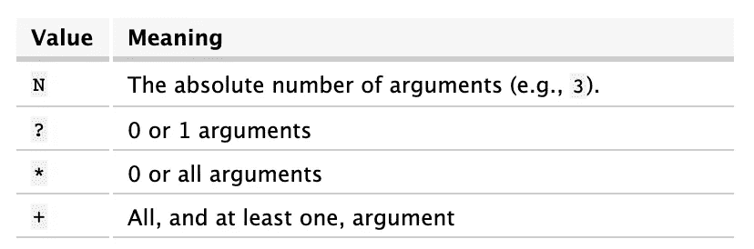

# 使用 argparse 改进您的 EC2 SSH 工作流

> 原文：<https://towardsdatascience.com/improve-your-ec2-ssh-workflow-using-argparse-ae831d1de754?source=collection_archive---------36----------------------->

## 端口转发、远程 jupyter 笔记本访问和 tmux 自动启动


由[比尔·杰伦](https://unsplash.com/@billjelen?utm_source=unsplash&utm_medium=referral&utm_content=creditCopyText)在 [Unsplash](https://unsplash.com/s/photos/boost?utm_source=unsplash&utm_medium=referral&utm_content=creditCopyText) 拍摄的照片

# 动机

数据科学工作通常需要针对巨大数据集使用高级大数据分析技术，以及并行或分布式计算来进行快速模型训练和调整。虽然大多数数据科学工作流(尤其是在探索和开发阶段)都可以在个人的笔记本电脑或台式机上执行，但由于本地开发环境在处理能力、内存和存储方面的限制，完全依赖本地开发环境通常是不切实际或不可能的。

在这一点上，云计算技术的作用，如亚马逊网络服务的弹性计算云(EC2)所提供的技术，从未像现在这样重要，特别是在将大数据应用大规模部署到生产环境中的情况下。随着此类服务的可用性改变了我们设计和实施 DS 架构的方式，它也促使数据科学家在其早期开发工作流程中更加依赖云计算的处理和存储能力。

如果你还没有使用过 EC2(或任何其他类似的云服务)，这个 DataCamp [教程](https://www.datacamp.com/community/tutorials/aws-ec2-beginner-tutorial)提供了一个很好的、激励人心的介绍。我每天都使用 EC2 实例，因为我相信你们中的许多人也一样，所以我想分享一个简单的 Python 脚本，它包含了一些使用`argparse`模块来改进 EC2 SSH 工作流和创建最佳 EC2 实例环境的巧妙技巧。当您通过 SSH 建立连接时，该脚本将允许您:

1.  每次自动启动`tmux`。
2.  在浏览器中本地访问远程运行的`jupyter`服务器。

# 剧本

如果你对`argparse`不熟悉，可以看看这篇温和的[介绍](https://docs.python.org/3/howto/argparse.html)或[杰夫·黑尔](https://medium.com/u/451599b1142a?source=post_page-----ae831d1de754--------------------------------)的[学习足够有用的 Python:arg parse](/learn-enough-python-to-be-useful-argparse-e482e1764e05)。

将这个脚本放在您的主目录`bin`中，例如`/Users/jlee/bin`。我将我的文件命名为`ec2`(为了方便起见，没有扩展名`.py`)。然后，通过运行以下命令将该文件标记为脚本:

```
chmod +x ~/bin/ec2
```

# 破解密码

## 1.位置参数:会话

```
# line 8 aboveparser.add_argument("session", nargs="?", help="tmux session name")
```

这一行添加了一个位置参数`session`，它将允许您在每次 SSH 到远程实例时启动一个新的 tmux 会话(或者附加到一个现有的会话，如果名称存在的话)。

换句话说，每次你想用一个特定的名字启动一个 tmux 会话时，不再需要键入/查找 tmux cheatsheet 来记住`tmux new -s new_session`。

如果您将`nargs`(参数数量)设置为`"?"`，参数定义将在被解析的命令行上消耗零个*或*一个参数。



可变参数列表

换句话说，不为`session`参数传入一个字符串名称将会给你一个选项，连接到你的 EC2 实例*而不用*一个 tmux 会话。用以下内容扩展原始`argv`列表(第 16-21 行):

```
# lines 24-25if args.session is not None:
     argv.extend(["-t", "tmux", "-2", "new-session", "-A", "-s", args.session])
```

## 2.可选参数:jupyter

```
# lines 9parser.add_argument('-j', '--jupyter', action='store_true', help='forward port to use remote jupyter')
```

`jupyter`是一个可选(相对于位置)参数，由前面的`--` (或其简称`-j`)表示。对于可选参数，我们指定了一个新的关键字`action`。如果我们给它赋值`'store_true'`，如果指定了选项，它将把值`True`设置为`args.jupyter` *。不指定它意味着`False`。*

因此，在下面的代码中，传递`jupyter`参数将使您的`localhost:8888`指向远程服务器的`8888`端口。因此，当您在 EC2 实例上运行`jupyter notebook`时，它会将*的*端口`8888`转发到本地机器的`8888`端口*，从而允许您从本地浏览器访问远程 jupyter 笔记本。*

```
# lines 22-23if args.jupyter:
  argv.extend(["-L", "8888:localhost:8888"])
```

现在，如果您从命令行运行`jupyter notebook`,它会显示如下内容:

```
Copy/paste this URL into your browser when you connect for the first time,
    to login with a token:
        [http://localhost:8888/?token=a2bc3def5g41234ed56s78zxfxc3vdfb&token=a2bc3def5g41234ed56s78zxfxc3vdfb](http://localhost:8888/?token=a7213f1213c009f4c7a6c2eddd2fded65d538e5b9ae37876&token=a7213f1213c009f4c7a6c2eddd2fded65d538e5b9ae37876)
```

只需将令牌 URL 复制并粘贴到您的本地浏览器中，您就可以立即访问您的远程 Jupyter 笔记本。

# 收尾

如果您想要定制您的 tmux，在您的主目录中创建一个名为`.tmux.conf`的配置文件。这是一个隐藏文件，所以你不会看到它，如果你`ls ~`)，但`tmux`将选择这个文件为当前用户。

将这几行添加到文件中，看看您对 tmux 的新外观有多喜欢:

```
# ~/.tmux.confset-window-option -g window-status-format " [#I] #W "
set-window-option -g window-status-current-format " [#I] #W "
set-window-option -g window-status-current-style fg=colour240,bold,bg=colour247
set -g default-terminal "screen-256color"
```

结果是 tmux 状态栏在终端底部以灰色显示当前窗口，与会话中的其他窗口(绿色)相区别:


查看这个[网站](https://www.hamvocke.com/blog/a-guide-to-customizing-your-tmux-conf/)获得更多 tmux 定制选项。

最后，这里有一些有用的键盘快捷键:

1.  在当前会话中创建一个新窗口:`Ctrl+b`，然后是`c`
2.  转到会话中的下一个窗口:`Ctrl+b`，然后是`n`
3.  转到会话中的上一个窗口:`Ctrl+b`，然后是`p`
4.  从当前会话中分离:`Ctrl+b`，后跟`d`

# 命令示例

综上所述，您现在可以尝试使用这些示例命令之一运行`ec2`脚本，每个命令都将创建一个 SSH 连接，但是结果略有不同:

```
(1) ec2 new_sesh -j
(2) ec2 -j
(3) ec2 new_sesh2
```

(1)将在 SSH 上创建(或附加到)一个名为`new_sesh`的 tmux 会话，结果是当您调用 jupyter notebook 时，它会将您的远程服务器的端口 8888 转发到您的本地机器的端口 8888。

(2)将使用端口转发将您 SSH 到您的 EC2 实例中，但不会启动 tmux(因为您没有为`session`提供名称)。

(3)将创建(或附加到)一个名为`new_sesh2`的 tmux 会话，但没有端口转发(即，您将无法从本地浏览器访问远程 jupyter 笔记本)。

最后，当然可以使用 bash 别名来达到(1)-(3)的效果。例如，将下面一行添加到您的`.bashrc`或`.bash_profile`脚本并运行`ssh-jlee`将启动一个名为`default`的 tmux 会话，并开始通过 SSH 连接进行`8888` → `8888`端口转发:

```
alias ssh-jlee='ssh -i ~/.ssh/mykey.pem ubuntu@10.999.9.999 -L 8888:localhost:8888 tmux new-session -A -s default'
```

然而，我认为使用`argparse.ArgumentParse`创建一个解析器对象并传递一系列字符串作为命令行参数，比使用多个硬编码(1)-(3)中所有变量行为的 bash 别名更灵活、透明、可控。