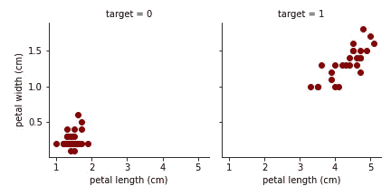
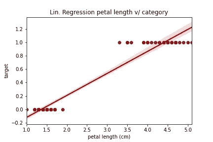
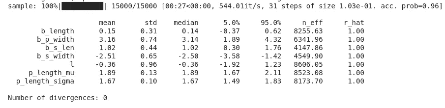
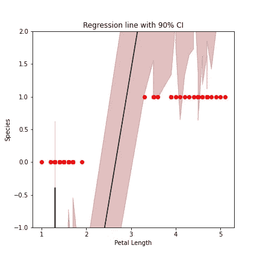

# 使用缺失数据改进您的模型|使用 NumPyro 进行插补

> 原文：<https://towardsdatascience.com/improve-your-model-with-missing-data-imputation-with-numpyro-dcb3c3376eff?source=collection_archive---------36----------------------->

## 用贝叶斯方法充分利用缺失数据。使用[蒙特卡罗方法](https://arxiv.org/pdf/1701.02434.pdf)提高模型性能并制定比较基准。


*一个丢失的框架随时准备把你从你的模型上扔下去。维尔莫斯·海姆在 Unsplash 上拍摄的照片。*

# 丑陋的数据

你如何处理丢失的数据、数据框中的间隙或有噪声的参数？
你花了几个小时在工作中，在实验室里或者在野外为一个有趣的研究问题或假设生成或管理一个数据集。可怕的是，您发现参数**的一些**测量值**丢失了**！
另一个可能让你困惑的情况是**意外噪声** e，它是在实验中的某个时刻引入的，它注定了你的一些测量结果是极端异常值**。
有时你不能仅仅因为有 25%的条目丢失就从你的分析中排除一大堆参数，你应该这样做吗？**

**不用担心，有一种方法可以让你充分利用你的数据集。
在本帖中，我们将使用[概率编程](https://www.cs.cornell.edu/courses/cs4110/2016fa/lectures/lecture33.html)【5】来填补你的模型可能会遇到的空白。**

## **模拟缺失数据**

**让我们从头开始构建一个问题。勤奋的读者很可能熟悉鸢尾花的数据集。它在某种程度上是 ML 社区中“hello-world”的一部分；紧挨着著名的 MNIST。我们使用 sklearn.datasets 获取数据，并将其放入熊猫数据框中。：**

```
iris_data = datasets.load_iris() 
iris_df = pd.DataFrame(data=np.c_[iris_data['data'], iris_data['target']],
                      columns=iris_data['feature_names'] + ['target'])
```

**为了让这个例子更加清晰易懂，我们只从给定的 3 个物种中选择 2 个。：**

```
iris_df["target"] = iris_df.target.astype("int")
iris_df = iris_df[iris_df.target.isin([0, 1])]
```

**现在你应该看到鸢尾花数据的 100 个测量值(行是我们的 **n** )。
我们现在**随机取出 50%的花瓣长度条目**，并赋予 **NaN** 值，带有一点数字和熊猫的魔力。**

```
random_vec = np_random(iris_df["petal length (cm)"].shape)<0.5 iris_df["petal length (cm)"] = iris_df["petal length (cm)"].where(random_vec, other=np.nan)
```

# **为什么要关心所有的尺寸？**

**当我们绘制数据时，我们可以清楚地看到花瓣长度和花瓣宽度可以帮助我们识别我们正在观察的物种(目标列)(见图 1)。**

****

***图 1:花瓣长度和宽度与花种 aka 的关系。目标列。我们可以清楚地识别出两个集群。***

**我们可以通过仅使用花瓣长度参数对组进行回归来进行更清晰的区分，我们之前已经残酷地对该参数进行了删减。**

****

***图 2:已识别物种(目标)上花瓣长度参数的回归。***

**糟糕的是大约一半的数据丢失了。那我们现在怎么办？**

# **不同深浅的思念**

**首先，至少有两种程度的缺失数据:**

> ***完全随机失踪(MCAR)和随机失踪(马尔)。***

***关于这方面的正式介绍，参见贝叶斯数据分析[1]第 18 章。***

**一个重要的区别是，MCAR 将您的缺失参数视为独立于您观察到的测量值(姑且称之为 **y** )。
在我们的例子中，我们相信我们的参数是随机丢失的**或被标记的**。这意味着我们不认为值丢失的可能性取决于参数属性*，但是*我们认为在我们的长度测量和目标物种之间存在潜在的某种关系。**

# **回归模型来统治它们**

**首先，让我们从目前掌握的数据中提取一些基本信息:**

```
>>> print("Petal Length μ = {}".format(iris_df["petal length (cm)"].mean()))
>>> Petal Length μ = 2.8072727272727267
>>> print("Petal Length σ^2 = {}".format(iris_df["petal length (cm)"].std()))
>>> Petal Length σ^2 = 1.4923079993698234
```

**现在我们建立模型来做插补。为此，我们使用工具 [NumPyro](https://github.com/pyro-ppl/numpyro) ，这是一个轻量级的概率库。NumPyro 为重型概率语言 [Pyro](https://pyro.ai/) 提供了一个类似 numpy 的后端。
这对于后期的模型拟合来说就派上用场了。我们将使用 [MCMC](https://en.wikipedia.org/wiki/Markov_chain_Monte_Carlo#:~:text=In%20statistics%2C%20Markov%20chain%20Monte,recording%20states%20from%20the%20chain.) 方法来执行贝叶斯推理，并在此过程中模拟缺失条目。
为了使其更适用于用例，我们将它与**贝叶斯回归模型**结合起来。这意味着我们想在给定所有已知参数的情况下模拟物种间的差异。因此，我们的变量是:**

```
sepal length := s_len, sepal width := s_width, petal width := p_width and, lastly petal length := **p_len**, which includes our **missing data**.
```

**为了简单起见，对于这些参数中的每一个，我们引入一个可学习的偏差，该偏差来自于一个规则的正态分布，即高斯分布。所以让我们开始吧。：**

```
def model(s_len, s_width, p_len, p_width, target=None):
    b_s_len = numpyro.sample("b_s_len", dist.Normal(0,1))
    b_s_width = numpyro.sample("b_s_width", dist.Normal(0,1))
    b_p_width = numpyro.sample("b_p_width", dist.Normal(0,1))
    ...
```

**人们可以对上面的偏差参数做一点调整，但是对于我们的初始运行，正态高斯工作得相当好。现在是微妙的部分。我们**引入分布**，我们假设它位于我们的半破坏参数下**。与许多事情一样，我们假设这是高斯分布，在我们的情况下，这是一个合理的假设。因此，我们使用之前计算的值 loc=μ (2.8 +/- 0.2)和 scale=σ (1.5+/-0.2)。****

```
...    
    len_mu = numpyro.sample("p_length_mu", dist.Normal(2.8, 0.2))
    len_sigma = numpyro.sample("p_length_sigma", dist.Normal(1.5, 0.2))
...
```

**有见识的读者清楚地看到μ和σ本身是我们在此过程中建模的概率参数。对于这两种情况，我们都假设为高斯分布，但也可以选择更严格的分布。现在让我们找到我们要建模的目标。我们用 numpy 函数定位向量中缺失的位置。**

```
...    
    len_is_nan = np.isnan(p_len)
    len_nan_idx = np.array(np.isnan(p_len).astype(int)).nonzero()[0]

    len_impute = numpyro.sample("len_impute", dist.Normal(len_mu[len_nan_idx],  len_sigma[len_nan_idx]).mask(False))
...
```

**此外，我们告诉 NumPyro 使**插补值(*len _ imput*)成为一个可学习的参数**，并用我们丢失的值填充尽可能多的零。
简而言之——注意给面具带来一些光亮:我们的模型有一个*预测模式*，当没有提供目标(又名物种)时发生。当我们调用预测功能时，我们使用采样μ和采样σ从引入的分布中进行采样。
*确保只在矢量中的 NaN 位置应用。***

```
numpyro.sample("len_impute", dist.Normal(len_mu[len_nan_idx], len_sigma[len_nan_idx])
```

**然后，我们将估算值放入正确的位置和样本，实际长度值作为我们的观察值。为此，我们使用 [JAX 库](https://jax.readthedocs.io/en/latest/notebooks/quickstart.html)和一些[有效的索引更新](https://jax.readthedocs.io/en/latest/_autosummary/jax.ops.index_update.html)——线性代数风格。：**

```
...    
   p_len = ops.index_update(p_len, len_nan_idx, len_impute)

   numpyro.sample("p_length", dist.Normal(len_mu, len_sigma), obs=p_len)
...
```

**在我们的长度采样中，我们将**实际长度测量值**作为过程中的**观察值**包括在内。**

# **把东西放在一起**

**我们继续将估算值放入回归模型。为了让贝叶斯模型起作用，我们必须**符合我们的目标 y** (物种)。
因为我们有两个类，所以我们通过调用**伯努利分布**来实现。因此，我们在伯努利过程中问，我们看到的是 y=0 还是 y = 1——两个类别，两种可能的结果。**

## **贝叶斯回归代码**

**我们引入两个参数，其中之一是长度参数的偏差项。**

```
...    
    l = numpyro.sample("l", dist.Normal(0, 1))
    b_len = numpyro.sample("b_length", dist.Normal(0, 1))
    logits = l + b_len * p_len

    logits = logits + b_s_len*s_len + b_s_width*s_width + b_p_width*p_width
...
```

**现在到了神奇的部分。我们将 **logit** 用于伯努利，它由我们放入模型的所有参数组成，与它们的偏差相互作用。这个过程中的观测值现在就是目标参数——我们的 y。**

```
numpyro.sample("target", dist.Bernoulli(logits=logits), obs=target)
```

## **完整的 NumPyro 模型**

```
def model(s_len, s_width, p_len, p_width, target=None):
    b_s_len = numpyro.sample("b_s_len", dist.Normal(0,1))
    b_s_width = numpyro.sample("b_s_width", dist.Normal(0,1))
    b_p_width = numpyro.sample("b_p_width", dist.Normal(0,1))

    # impute length
    len_mu = numpyro.sample("p_length_mu", dist.Normal(2.8, 0.2))
    len_sigma = numpyro.sample("p_length_sigma", dist.Normal(1.5, 0.2))
    len_is_nan = np.isnan(p_len)
    len_nan_idx = np.array(np.isnan(p_len).astype(int)).nonzero()[0]

   len_impute = numpyro.sample("len_impute", dist.Normal(len_mu[len_nan_idx],  len_sigma[len_nan_idx]).mask(False)) p_len = ops.index_update(p_len, len_nan_idx, len_impute)

    numpyro.sample("p_length", dist.Normal(len_mu, len_sigma), obs=p_len)

    l = numpyro.sample("l", dist.Normal(0, 1))
    b_len = numpyro.sample("b_length", dist.Normal(0, 1))
    logits = l + b_len * p_len

    logits = logits + b_s_len*s_len + b_s_width*s_width + b_p_width*p_width
    if target is None:
        # prediction case
        probs = expit(logits)
        numpyro.sample("probs", dist.Delta(probs)) numpyro.sample("target", dist.Bernoulli(logits=logits), obs=target)
```

# **运行它**

**为了拟合该模型，我们利用 MCMC 方法使用贝叶斯推理；具体的坚果取样器。**坚果采样器**的美妙之处在于它是一种无需干预的方法，因为它通过问题空间步进，自己调整**步长**。我们让它有 5000 次预热或老化运行，在这个过程中被丢弃，让它运行 10000 次迭代，只是为了确保安全。我们的推断以 0.96 或 96%的接受概率结束——太棒了！。接下来，我们来看看发生了什么事的摘要:**

```
mcmc = MCMC(NUTS(model=model), 5000, 10000, num_chains=1)
mcmc.run(random.PRNGKey(42), **iris_data)mcmc.print_summary()
```

****

***图 3:在 MCMC 之后的模型总结表明收敛和固体 R-hat 值为度量。***

**输出清楚地显示了我们在推理中采样的参数的收敛性。具体来说，R-hat 值都> = 1.0。**

**然后，我们抽取样本并可视化后验概率——我们再次依赖 JAX 的格式化魔法:**

```
samples = mcmc.get_samples()
posterior_mu = jnp.expand_dims(samples['l'], -1) + \
               jnp.expand_dims(samples['b_length'], -1)*iris_df["petal length (cm)"].values + \
               jnp.expand_dims(samples['b_s_len'], -1)*iris_df["sepal length (cm)"].values + \
               jnp.expand_dims(samples['b_s_width'], -1)*iris_df["sepal width (cm)"].values + \
               jnp.expand_dims(samples['b_p_width'], -1)*iris_df["petal width (cm)"].values
```

**我们可以看到后面的图。我们找到了。我们两个阶级之间的明显区别。在界限上下有相当多的抖动，但是回归线看起来更好。
公平地说，这也是因为与我们早期的单参数模型相比，我们在回归中使用了所有可用的参数。
上面的樱桃是回归线周围的 **90%置信区间**，取自我们的后验线。这让事情看得更清楚。**

****

***图 4:对具有 90%置信区间的 MCMC 样本的最终贝叶斯回归。***

***我们已经证明，我们可以通过 MCMC 采样来填补模型中的空白。***

**对于精通代码、好奇的读者来说，最终的笔记本可以在我的 github 和 Google-Colab 上找到。**

# **两个以上的类和分类数据？**

**这些问题也可以用 NumPyro 的工具包来回答:**

1.  **除了在模型中进行伯努利试验，您还可以使用多项式进行贝叶斯推断。**
2.  **我们也可以使用分类数据进行模型拟合。那看起来很不一样。我们不使用一维数组，而是依赖尽可能多的维度。**

****适合分类数据而不是连续数据的一个很好的例子**是关于*年龄插补*的优秀 Kaggle 笔记本，给出了 Titanic 数据集的其他参数:**

**[](https://www.kaggle.com/fehiepsi/bayesian-imputation-for-age) [## 年龄的贝叶斯插补

### 使用 Kaggle 笔记本探索和运行机器学习代码|使用《泰坦尼克号:灾难中的机器学习》中的数据

www.kaggle.com](https://www.kaggle.com/fehiepsi/bayesian-imputation-for-age) 

# 该做的和不该做的

> *请坚持你所拥有的！*

**不要捏造数据**。我怎么强调都不为过。我们在这里走的是一条很细的线。
如果你的实验产生的数据不足，或者你不得不丢弃一些数据，那么输入数值可能不是最好的办法。即使您的数据可能以这种方式呈现。当与客户或学术期刊交谈时，你不会因为以下几点而得分:我们将参数 X 和 Y 模拟为 85.3%——无论模型看起来有多好。
请**声明您使用了什么方法、分布和假设**来制作模型和估算，以获得最大的透明度。
一个建议是，你可以随时取出数据，在没有遗漏测量值的情况下拟合一个模型，并将其与最终有估算值的模型进行比较。这可以成为一个引人注目的故事。

# 结论

我们已经走过了数据插补的过程，从最初杂乱的数据框架到最终的贝叶斯推理过程和拟合后验分布。
我们已经展示了贝叶斯回归如何受益于估算向量，以及包括置信区间在内的输出结果。
概率编程可以成为你日常工作中的一个强有力的工具。

祝您的模型和分析好运！

# 参考

[1] A .盖尔曼、J.B .卡林等人。艾尔。、 [*贝叶斯数据分析*](http://www.stat.columbia.edu/~gelman/book/) 。第三版。
[2] R .麦克勒瑞斯。*统计学反思*。2016.CRC 出版社。
[3]优步技术公司。*使用 NumPyro 进行回归。* 2019。 [NumPyro 文档。](http://pyro.ai/numpyro/bayesian_regression.html)
【4】m .贝当古。*哈密尔顿蒙特卡罗概念介绍。* 2020 年上[ArXiv](https://arxiv.org/pdf/1701.02434.pdf)。
【5】CS 4110—编程语言与逻辑。*概率编程。* 2016 年。[康奈尔大学。](https://www.cs.cornell.edu/courses/cs4110/2016fa/lectures/lecture33.html)**