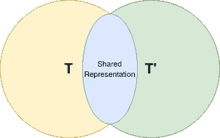
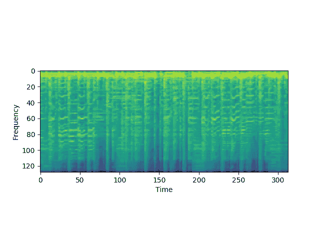
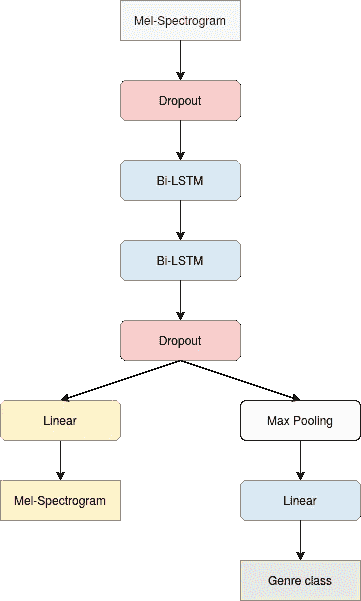
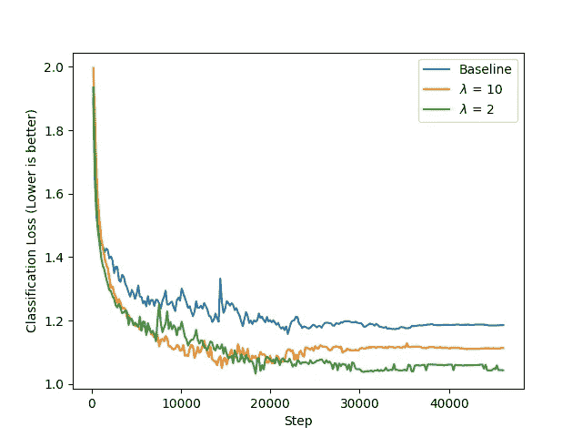
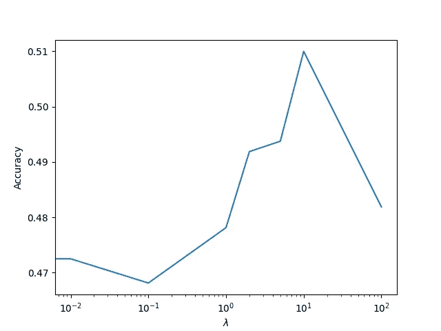

# 通过添加无监督的辅助损失来提高神经网络的泛化性能

> 原文：<https://towardsdatascience.com/improve-your-neural-networks-generalization-performance-by-adding-an-unsupervised-auxiliary-loss-4d58b2dead54?source=collection_archive---------29----------------------->

## 作为一种正则化形式的无监督重建损失。


Sebastien Gabriel 在 [Unsplash](https://unsplash.com/s/photos/valley?utm_source=unsplash&utm_medium=referral&utm_content=creditCopyText) 上的照片

深度神经网络有一个很大的过拟合问题，特别是在应用于少量标记数据时。研究人员设计了多种方法来解决这个问题，如 L1/L2 权重正则化、辍学、迁移学习和多任务学习。

在这个项目中，我们将重点关注使用多任务学习作为一种提高神经网络泛化性能的方法。这里实现的想法受到了三篇非常有趣的论文的启发:

*   [多任务学习。自主代理和多代理系统](http://www.cs.cornell.edu/~caruana/mlj97.pdf)
*   [深度神经网络中多任务学习概述](https://ruder.io/multi-task/)
*   [有监督的自动编码器:用无监督的正则化器提高泛化性能](https://papers.nips.cc/paper/7296-supervised-autoencoders-improving-generalization-performance-with-unsupervised-regularizers.pdf)

前两篇论文试图解释为什么多任务学习可以提高单个任务的表现，它们提供的一些可能的解释是:

**表征偏差:**



—作者图片

如果我们同时在任务 T 和 T '上训练一个网络，这个网络就会偏向服务于这两个任务的表征。这使得网络最有可能推广到新的任务。

**正规化:**

使用多任务学习使得网络不太可能过度适应来自训练数据的噪声，因为它减少了可能的解决方案的数量，因为 MTL 的解决方案需要同时对所有任务起作用。

**注意力聚焦:**

对多个相关任务的训练可以在什么是相关特征以及什么只是噪声上给模型更强的信号。

第三篇论文考虑了只有一个监督任务 T 的情况，因此作者增加了一个新的人工和非监督的重建输入的任务。他们在一个简化的设置中证明，增加重建损失提高了监督任务的泛化性能，并显示了一些支持他们假设的经验结果。

# 数据:

在接下来的实验中，我们使用免费音乐档案(FMA)小版本。这是一个包含 8000 首歌曲片段的数据集，分为 8 种类型:

```
{
    "International": 0,
    "Pop": 1,
    "Instrumental": 2,
    "Hip-Hop": 3,
    "Electronic": 4,
    "Experimental": 5,
    "Folk": 6,
    "Rock": 7
}
```

我们以 70%-10%-20%的比例将数据集分为 Train-Val-Test，并将原始音频波形转换为 Mel 频谱图，然后将它们馈送到网络。关于预处理的更多细节，你可以看看我以前的一个项目:

[**音乐流派分类:变形金刚 vs 递归神经网络**](/music-genre-classification-transformers-vs-recurrent-neural-networks-631751a71c58)



Mel 光谱图示例—作者提供的图像

# 型号:

我们沿着时间轴应用基于 LSTM 的神经网络来分类音乐流派。



音乐流派模型-作者图像

添加脱落图层作为额外的正则化，并使重建任务对模型来说更具挑战性。
我们使用 Pytorch Lightning 来实现这个模型，转发函数看起来是这样的:

```
**def** forward(self, x):
    x = self.do(x)

    x, _ = self.lstm1(x)
    x_seq, _ = self.lstm2(x)

    x, _ = torch.max(self.do(x_seq), dim=1)

    x = F.relu(self.do(self.fc1(x)))
    y_hat = self.fy(x)

    x_reconstruction = torch.clamp(self.fc2(self.do(x_seq)), -1.0, 1.0)

    **return** y_hat, x_reconstruction
```

现在我们将损失定义为分类损失和重建损失之间的加权和，如下所示:

> 损失=损失 _ 分类+ λ *损失 _ 重建

其中，λ是一个超参数，它有助于缓解两个损失的比例不同这一事实，同时还能更好地控制我们希望赋予辅助任务的重要性。损失定义如下:

```
**def** training_step(self, batch, batch_idx):
    x, y = batch

    y_hat, x_reconstruction = self(x)

    loss_y = F.cross_entropy(y_hat, y)
    loss_x = F.l1_loss(x, x_reconstruction)

    **return** loss_y + self.reconstruction_weight * loss_x
```

# 结果:

在实验中，我们尝试了多个λ值，以查看哪一个效果更好，基线为λ= 0，这意味着辅助损耗被忽略。



我们可以看到，与基线相比，增加重建损失(λ = 10 和λ = 2)会产生更好的性能。

就分类准确度而言，我们有:



*   **随机猜测:** 12.5%
*   **基线:**准确率= 47.5%
*   **λ =10** :精度= **51%**

当使用相同的分类体系结构时，增加重建损失给出了超过基线约 3%的精度改进。

# 结论:

在这个项目中，我们证明了向神经网络添加辅助的无监督任务可以通过作为正则化的附加形式来提高其泛化性能。添加重建损失的方法在 Pytorch Lightning 中很容易实现，但代价是我们需要优化新的超参数λ。

复制结果的代码在这里分享:[https://github.com/CVxTz/ReconstructionAuxLoss](https://github.com/CVxTz/ReconstructionAuxLoss)