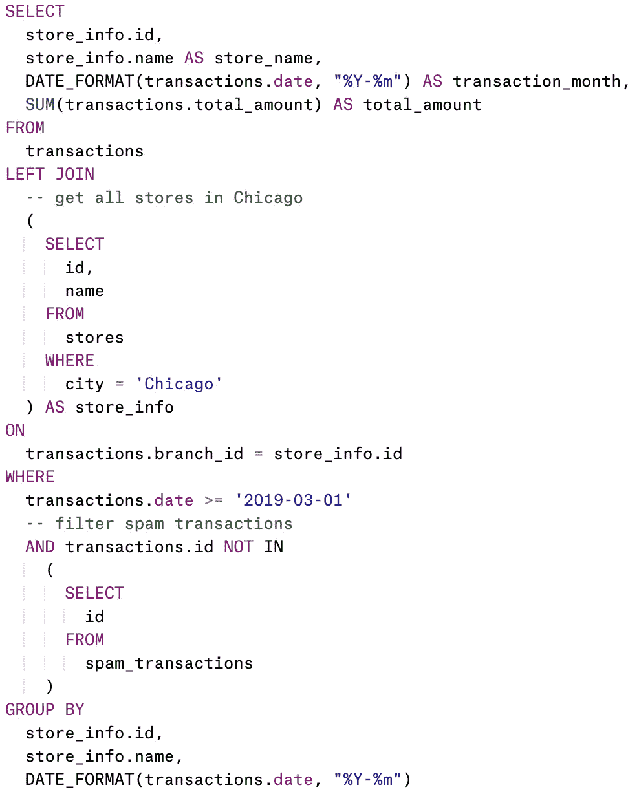

# 使用这些格式和文档模板改进您的 SQL

> 原文：<https://towardsdatascience.com/improve-your-sql-with-these-templates-for-formatting-and-documentation-f090a3259c89?source=collection_archive---------9----------------------->

## 使用更好的 SQL 格式和文档，减少代码审查和知识转移的痛苦。


艾萨克·史密斯在 [Unsplash](https://unsplash.com/s/photos/analysis?utm_source=unsplash&utm_medium=referral&utm_content=creditCopyText) 上拍摄的照片

# 介绍

您是否遇到过用于分析的复杂 SQL 查询？

你是否很难理解代码本身和其下的业务逻辑？

我做到了。而且有时候，是跟我过去的疑问！

为了节省阅读我的代码的每个人(包括我自己)的时间，我尝试将两个模板应用到我的查询中，并发现它们非常有帮助:

*   提高代码本身的质量
*   减少代码审查时间
*   并改善知识转移

# 你能期待什么

在本文中，我将与您分享我使用的这两个模板。

**模板#1:** 记录 SQL 查询中的上下文和假设

**模板#2** :格式化 SQL 查询

为了演示它们的用法，我将通过一个使用 MySQL 的例子来总结新冠肺炎前后的销售情况。

希望这些模板能派上用场！尤其是在新冠肺炎启动后，远程工作成为我们的新常态，这增加了过度沟通的重要性，以确保每个人都在同一页面上。

# 模板# 1:SQL 查询中的文档上下文和假设

## 1.模板

在编写查询之前，请列出这些信息:

1.  此查询的重要业务上下文
2.  对查询结果的期望
3.  对业务逻辑和数据的任何假设

```
/* 
CONTEXT: 
- add a brief description of why we need this queryRESULT EXPECTATION
- add a brief description of your expectations for the query resultASSUMPTION:
- add assumption about business logic
- add assumption about data
*/
```

## 2.行动中的模板

将此模板应用于我们的销售总结示例:

```
/*  
CONTEXT:  
- Our company wants to understand if COVID has any impact on sales in stores around Chicago.RESULT EXPECTATION: 
- This query returns total sales (in USD) for each of our stores in Chicago every month before and after COVID, starting from 2019-03-01.ASSUMPTION:
- Dates before 2020-03-01 are considered "Before COVID"
- Each transaction has a unique id, so we do not expect duplications in our transaction table
- There are some spam transactions we have identified after COVID, so we will filter these out
*/
```

## 3.利益

在我们进行查询之前，对业务环境、结果预期和假设进行简要描述有很多好处:

1.  它让我们在编写查询时专注于查询的主要目标
2.  它帮助读者快速建立对我们的查询的价值和期望的高层次理解
3.  它帮助代码评审员根据期望为查询创建初始测试

记住，这一步是一个迭代过程。在编写查询时，我们可能不得不反复修改文档。

# 模板#2:格式化 SQL 查询

## 1.模板规则

格式化 SQL 查询有许多规则。简单来说，这些是我遵循的主要规则:

1.  使用大写字母突出显示保留的关键字(例如 SELECT，WHERE)
2.  使用缩进清楚地显示查询或子查询的开始和结束位置
3.  对于长而复杂的查询，在任何主要的子查询或上下文连接之前包含一个注释
4.  请给出列的来源及其源表或描述性表别名

## 2.行动中的模板

*此查询仅用于演示*



## 3.利益

这种查询格式对可读性有很多好处。以下是一些例子:

*   理解查询的整体结构(即选择了哪些列，有多少个连接，应用了哪些过滤器)
*   节省时间来确定测试子查询的开始和结束，因为我们可以在同一条垂直线中看到子查询的开始和结束括号
*   避免迷失在复杂的查询中，在整个查询中都有注释

# 组合模板#1 和模板#2

在我们的例子中，结合这两个模板，我们将得到:

```
/* 
CONTEXT: 
- Our company wants to understand if COVID has any impact on sales in stores
around Chicago.RESULT EXPECTATION
- This query returns total sales (in USD) for each of our stores in Chicago
every month before and after COVID, starting from 2019-03-01.ASSUMPTION:
- Dates before 2020-03-01 are considered "Before COVID"
- Each transaction has a unique id, so we do not expect duplications
in our transaction table
- There are some spam transactions we have identified after COVID,
so we will filter these out
*/SELECT 
  store_info.id,
  store_info.name AS store_name,
  DATE_FORMAT(transactions.date, "%Y-%m") AS transaction_month,
  SUM(transactions.total_amount) AS total_amount
FROM 
  transactions
LEFT JOIN 
  -- get all stores in Chicago
  (
    SELECT 
      id,
      name
    FROM 
      stores
    WHERE
      city = 'Chicago'
  ) AS store_info
ON 
  transactions.branch_id = store_info.id
WHERE
  transactions.date >= '2019-03-01'
  -- filter spam transactions
  AND transactions.id NOT IN 
    (
      SELECT 
        id 
      FROM 
        spam_transactions
    )
GROUP BY 
  store_info.id,
  store_info.name,
  DATE_FORMAT(transactions.date, "%Y-%m")
```

# 额外小费

这些模板并不是唯一的模板。找出最适合你和你的团队的方法是一个反复试验的过程。

最终确定格式样式后，手动设置每个查询的样式可能会很累。许多 SQL IDE 都有一个选项可以自动完成这个过程。然而，如果它仍然不能满足您的需要，还有其他的工具。尝试使用这些关键字进行搜索:“SQL 格式化程序”

对于 Python 用户，我一直在摆弄 *sqlparse* 。你可以在这里获得更多[的信息。](https://sqlparse.readthedocs.io/en/latest/intro/)

感谢您通读整篇文章！希望这些模板对你有帮助。我很想知道您的想法和任何其他技巧，以使 SQL 查询更具可读性。欢迎在下面留言，或者在 [LinkedIn](https://www.linkedin.com/in/hanhatdinh/) 上联系我。