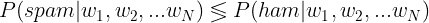

# 改进的朴素贝叶斯分类器解决文本分类问题。

> 原文：<https://towardsdatascience.com/improved-na%C3%AFve-bayes-classifier-to-solve-classification-problems-a34d7a32e863?source=collection_archive---------32----------------------->

## [入门](https://towardsdatascience.com/tagged/getting-started)


斯蒂芬·菲利普斯-Hostreviews.co.uk 在 [Unsplash](https://unsplash.com?utm_source=medium&utm_medium=referral) 上的照片

本文致力于解释最经典的机器学习分类器之一——朴素贝叶斯。在这个故事中，我将解释朴素贝叶斯和**背后的理论，最重要的是**将呈现这个模型的一个简单的从零开始的 ***实现*** 。对于进入机器学习领域的人来说，这篇文章将会非常有用和有趣。我也相信有 ML 经验的读者也会学到新的东西。所以，事不宜迟，让我们开始吧。

正如艾萨克·纽敦曾经说过的那样:“*如果我比别人看得更远，那是因为我站在巨人的肩膀上*”，这是我自己相信的事情，就好像你想创造新的东西，你必须了解以前已经做过的事情。这可以让你不要在发明的东西上浪费时间，或者寻找机会来改进以前的方法和挑战现状。

因此，我想谈谈如何使用朴素贝叶斯来解决文本分类问题，但不会触及最新的深度学习方法。这将使大多数读者能够跟踪和理解这篇文章，无论其教育背景如何。

如果你是自然语言处理(NLP)领域的新手，我建议你在阅读这篇文章之前，先看看我的[上一篇文章，在那里我讨论了我们如何使用简单的概率规则来执行文本生成](/text-generation-using-n-gram-model-8d12d9802aa0)。

在本文中，我们将从头开始使用朴素贝叶斯分类器**创建一个垃圾邮件过滤器，而不使用任何******外部库**。首先，我想介绍一些理论，然后我们将讨论实现部分。**

****

**照片由[汉尼斯·约翰逊](https://unsplash.com/@hannes?utm_source=medium&utm_medium=referral)在 [Unsplash](https://unsplash.com?utm_source=medium&utm_medium=referral) 上拍摄**

# **理论。**

## **贝叶斯公式。**

**有很多文章讨论了朴素贝叶斯以及它在概念上是如何工作的，所以我不打算深入进行理论解释，而是讨论最基本和最重要的部分。**

**我们都知道贝叶斯公式是这样的:**

****

**在我们的 NLP 设置中，我们想要计算什么是 *P(垃圾邮件|文本)*和什么是 *P(非垃圾邮件|文本)*。**

> **对于常用的术语，我将把“非垃圾邮件”称为“火腿”。**

**众所周知，任何电子邮件的文本通常由单词组成。因此，我们有兴趣计算 *P(spam | word1，word2，…，wordN)* 。以贝叶斯公式的形式来说:**

****

**当我们计算类似的概率时，但是对于*火腿*的情况，我们将得到以下公式:**

****

**如您所见，分母 *P(w1，w2，…，wN)* 【也称为**归一化**】在两种情况下是相同的，因为我们的任务是确定哪个概率更高(而不是确切的值)，所以我们可以去掉归一化部分。推理如下所示:**

****

**奇怪的符号表示不确定左侧(LHS)是大于还是小于右侧(RHS)。**

****

**取消分母，因为我们知道概率是非负的。**

****

**所以最终，在贝叶斯分类中，我们得到了以下简化:**

****

> **旁注:标准化部分在大多数情况下被忽略，不仅因为它是多余的，而且因为从数据中计算通常是非常复杂的，所以不必处理它简化了我们的生活！**

## **我们为什么幼稚？**

**概括地说，为了判断电子邮件是否是垃圾邮件，我们需要查看哪个值更高 *P(spam|w1，…，wN)* 或 *P(ham|w1，…，wN)* 。**

****

**为了计算 *P(spam|w1，…，wN)* ，我们需要:**

1.  ***P(垃圾邮件)–*很容易找到，因为它只是我们数据集中**垃圾邮件** **电子邮件**与**所有电子邮件**的比率。**
2.  ***P(w1，…，wN | spam)*–直接计算有点困难，所以让我们使用“天真”的假设，即文本中的单词是独立的，这样我们可以将这个术语简化为:**

****

**所以最后为了计算 *P(spam|w1，…，wN)* 我们会做:**

****

**看起来很简单，但是，让我们不要犯一个会破坏我们结果的错误。考虑一下，如果我们需要检查一个单词 *w_i* 但它从未出现在垃圾邮件中，会发生什么？**

****

**我们如何计算一般情况下的概率？**

**换句话说: *P(w_i|spam) = 0。***

**显然，在这种情况下，由于乘法运算，我们最终会得到 *P(spam|w1，…，wN) = 0* ，这可能会导致错误的结论，因为我们永远无法假设拥有包含所有单词的完美训练数据。也有可能一个单词包含了错别字，因此系统显然不知道它。(还要考虑这个词从未在*垃圾邮件*和*火腿*邮件中出现的情况，那么我们该如何对包含这个词的邮件进行分类呢？)**

**为了解决这个问题，使用了一种**平滑**方法，确保我们将*非零*概率分配给任何项:**

****

**这里α ( *alpha* )是一个平滑参数，应该是一个非负数。**

## **提高效率——使用对数。**

**正如我们之前所看到的，为了计算概率，我们将不得不进行大量的乘法运算**(与我们要评估的电子邮件中的单词一样多的次数):****

********

****问题是所有的概率都小于 1，一般来说都很小。众所周知，2 个小值 0 < *a，b* < 1 的乘积会产生一个更小的数。因此，在朴素贝叶斯方法的情况下，我们将受到我们计算机的浮点精度的限制(因为在某些情况下，spam 和 ham 方程将会收敛到零，只是因为计算机在处理非常小的数字时的限制)。****

****我们该怎么办？我们需要把我们的计算转移到能够记录非常小的数字的超级计算机上吗？幸运的是，这是不需要的，对数来帮助！而且我们会用对数的**乘积法则**。****

********

****我们使用对数的另一个原因是:****

********

****这意味着如果 A > B，则 log(A) > log(B)，反之亦然****

```
**Hence, **if** *log(P(spam|text)) > log(P(ham|text))* **then**  *P(spam|text) > P(ham|text)***
```

****所以对于我们来说，用对数来计算概率会容易得多，对数的形式如下:****

********

# ****实施。****

********

****照片由 [Alexander Sinn](https://unsplash.com/@swimstaralex?utm_source=medium&utm_medium=referral) 在 [Unsplash](https://unsplash.com?utm_source=medium&utm_medium=referral) 拍摄****

****理论说够了，让我们把理论带入生活。正如我之前提到的，我将从头开始实现朴素贝叶斯分类器，并且不会使用任何 python 的外部库，因为它允许实现多种功能:****

1.  ****它帮助我们更好地理解朴素贝叶斯背后的理论。对于刚接触机器学习领域的读者来说是非常有益的。****
2.  ****它允许我们有一些灵活性并改进标准方法。在本文中，我们将同时使用单字和双字(如果你不知道什么是双字，请阅读本文)。****

****完整的代码和数据集可以在我的 [github 库](https://github.com/olegborisovv/NaiveBayesSpamClassifier)上找到。****

****数据集包含原始格式的电子邮件，因此为了处理电子邮件数据，我们必须使用 python 的`email`库。****

****现在，让我们看看**支持功能**:****

****第一个是记号化器，在你的修改中可以随意使用任何其他方法，但是这里这个方法记号化方法工作得足够好(你会看到我们的精度会有多好)。****

****下面你可以看到我们将用来计算垃圾邮件的对数概率的函数。****

****如前所述，我将在这里使用 unigrams **和** bigrams 来识别电子邮件是否是垃圾邮件，因此我们正在计算****

*****P(spam|token_1，token_2，… token_n)* ，其中 *token_i* 可以由一元或二元表示。**这比只在单词(单字)层面上工作要好，因为我们变得不那么幼稚**(因为我们接受文本中单词的某种依赖性)。****

****除了我们在理论部分讨论的内容，我还介绍了一些特殊的标记，如`<UNK>`，如果我们偶然发现在训练集中没有见过的*未知*单词，我们将在推理部分使用这些标记。****

****除此之外，我创建了一个记号`<LONG_W>`，它对应于大于 12 个字符的长单词*和*，其概率的计算与所有其他记号类似。****

## ****垃圾邮件过滤器类别。****

****现在让我们转到垃圾邮件过滤器类的实现:****

****该类的初始化需要大约 10 秒钟，因为我们需要遍历所有垃圾邮件和业余邮件，并计算所有词类相关概率。****

****`is_spam`函数完成所有的推理工作，并负责根据文本中出现的标记判断电子邮件是否是垃圾邮件。因为这个函数确实做了我们在理论部分讨论过的事情，所以我不打算提供实现的详细解释。****

****现在，让我们创建主函数，并测试我们的解决方案有多好。****

****结果我们得到:****

```
**done with initialization!    9.24 s
spam errors: 1 
ham errors: 1
correct identified: 0.995**
```

****99.5%的准确率，只有 1 个假阴性和 1 个假阳性，这是一个**非常** **骄人的成绩**！****

****随意改变一些参数，比如平滑，或者不使用二元模型，而只使用一元模型，看看模型的准确性降低了多少。在这里，我已经提出了达到完美效果的最佳模型。****

****正如您从本文中看到的，朴素贝叶斯是一个非常简单且易于实现的机器学习模型，它能够在语言分类任务中实现一些令人难以置信的结果。****

****最不可思议的是，我们只用了 10 秒钟就训练好了模型，并且达到了非常好的精度。将其与深度学习方法进行比较，深度学习方法需要几个小时的训练，并且很可能只能达到与我们的朴素贝叶斯相似的性能。****

****如果你想让我在下一篇文章中涉及一些 ML 话题，请在评论中告诉我。****

****敬请关注更多关于人工智能和自然语言处理的文章。****