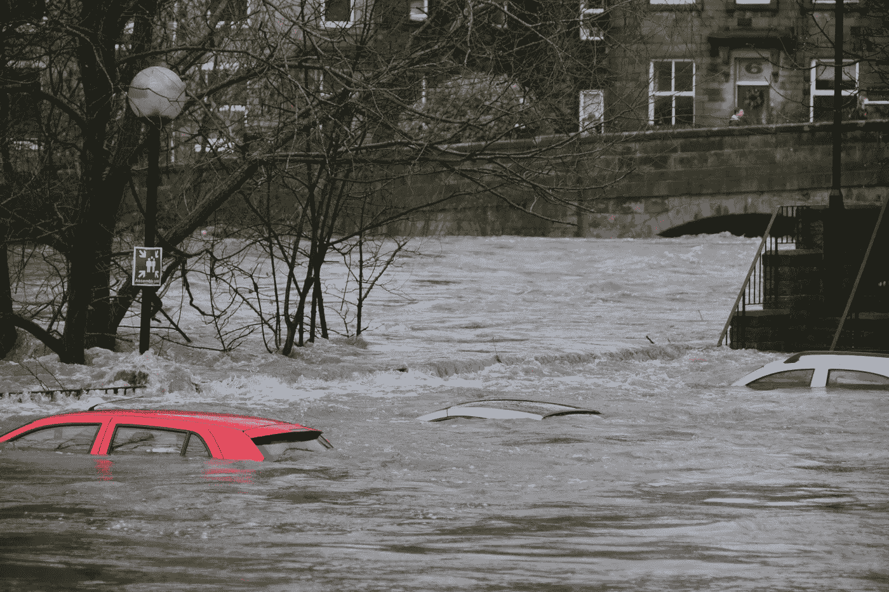
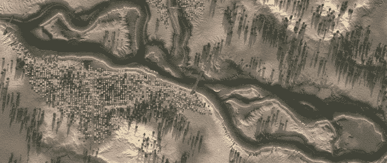
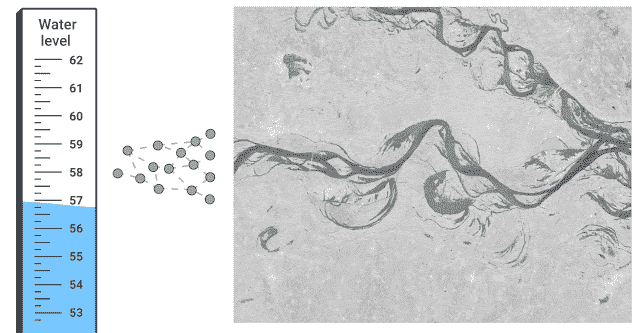
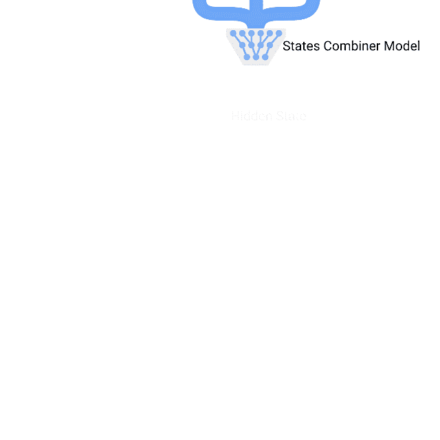

# 洪水预报的改进

> 原文：<https://towardsdatascience.com/improvements-in-flood-forecasting-aa0d4c1d9ddc?source=collection_archive---------48----------------------->

照片由 [@chriswebdog](https://unsplash.com/@chriswebdog)

## 随着气候恶化，我们预测灾难性事件的责任

谷歌人工智能的研究人员写了一篇名为[的文章，发表于 2020 年 9 月 3 日星期四，这是我们最近改进洪水预报](http://ai.googleblog.com/2020/09/the-technology-behind-our-recent.html)背后的技术。

关于洪水，你可能不知道的几件事:

1.  洪水是地球上最常见的自然灾害。
2.  它影响着全球数亿人的生活。
3.  每年造成约 100 亿美元的损失。

谷歌在[前几年](https://ai.googleblog.com/2019/09/an-inside-look-at-flood-forecasting.html)一直致力于洪水预报。

他们最近努力提高印度和孟加拉国的洪水预报。

通过这样做，他们将覆盖范围扩大到 2 . 5 亿多人，并提供了前所未有的前置时间、准确性和清晰度。

谷歌人工智能可视化

他们想出了解决这个问题的新方法。

即 ***形态学淹没模型*** *:* 将*基于物理的建模*与*机器学习(ML)* 相结合，以在现实世界设置中创建更精确和可扩展的淹没模型。

他们将此与 ***警报定位模型相结合:****“…允许使用端到端的机器学习模型和全球公开可用的数据来识别面临前所未有规模洪水风险的地区。”*

他们有洪水预报系统，叫做**(在今年的 [ICLR 人工智能地球科学](https://ai4earthscience.github.io/iclr-2020-workshop/)和 [EGU](https://meetingorganizer.copernicus.org/EGU2020/EGU2020-4135.html) 上展示)。**

**它们描述了几个重要的方面:**

*   ****预测水位**:预计河流是否会发生洪水。**

***“一旦预测河流将达到洪水位，生成可操作警报的下一步是将河流水位预测转换为洪泛区将如何受到影响的预测。”***

*   ****形态淹没建模**:[在之前的工作](https://ai.googleblog.com/2019/09/an-inside-look-at-flood-forecasting.html)中，我们开发了基于卫星图像的高质量高程图，并运行基于物理的模型来模拟水流穿过这些数字地形。”**

**根据谷歌人工智能的说法，这样做可以在数据匮乏的地区以[前所未有的分辨率和准确性发出警告。](https://arxiv.org/abs/1910.05006)**

**他们提到洪水建模面临三个重大挑战。**

1.  ***“由于此类模型所涉及的面积和所需的分辨率较大，因此它们必然具有较高的计算复杂性。***
2.  ***此外，大多数全球高程图不包括河床水深测量，而河床水深测量对于精确建模至关重要。***
3.  ***最后，需要了解并纠正现有数据中的错误，可能包括仪表测量错误、立面图中缺失的特征等。”***

**他们对高程图的形态进行计算修改，允许人们使用简单的物理原理来模拟洪水，例如那些描述[流体静力系统](https://en.wikipedia.org/wiki/Hydrostatics)的原理。**

**他们训练模型使用它正在接收的数据来实时直接推断洪水地图。**

****

**谷歌人工智能可视化**

**“下面的动画展示了 HydroNets 中信息的结构和流动……网络迭代的输出将传递给下游模型，以此类推。”**

****

**谷歌人工智能可视化**

**看到谷歌人工智能取得的进步令人着迷。**

**这项工作肯定有助于拯救数百万人的生命。**

**这里是#500daysofAI，您正在阅读的是第 469 条。500 天来，我每天都在写一篇关于或与人工智能相关的新文章。**