# 使用变换改进 CNN 深度学习模型时做什么和不做什么

> 原文：<https://towardsdatascience.com/improves-cnn-performance-by-applying-data-transformation-bf86b3f4cef4?source=collection_archive---------12----------------------->


迪伦·麦克劳德的图片

## PyTorch 和 Torchvision 中的一个实验，用于在计算机视觉中诊断您的神经元网络性能

# 转换技术概述📋

根据维基百科[1]

> **数据转换**是将数据从一种格式或结构转换成另一种格式或结构的过程。

在计算机视觉中，数据增强对于规范你的网络和增加你的训练集的规模非常重要。有许多**数据转换技术**(旋转、翻转、裁剪等……)可以改变图像的像素值，但仍然保留图像的几乎全部信息，因此人们很难分辨它是否被增强。这迫使模型在图像内的对象变化较大时更加灵活，较少考虑位置、方向、大小、颜色……通过数据扩充训练的模型通常概括得更好，但剩下的问题是**数据转换**可以在多大程度上提高 CNN 模型在图像数据集上的性能。

让我们来看看 Pytorch 在 [Torchvision](https://pytorch.org/docs/stable/torchvision/transforms.html) 中支持的一些**数据转换**技术，可以帮助你对ơn 图像进行增强。我还提供了一个真实图像数据集的实验，以显示应用不同方法时的性能。

*   *torch vision . transforms . center crop(size)*:类似于**放大**图像中心。它将给定的图像裁剪到所需的输出大小和位置(大小可以是正方形或长方形)。

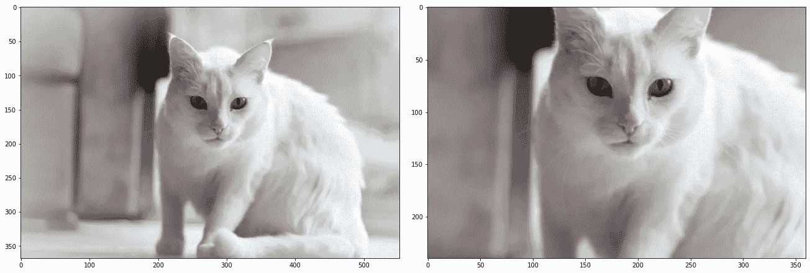

*   *torch vision . transforms . pad(padding)*:相当于**缩小**图像。它将在给定图像的所有边上用某个值创建一个填充。

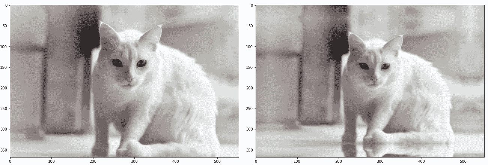

*   torch vision . transforms . random crop(size，padding):这个函数将在随机位置裁剪给定的图像，以创建一组用于训练的图像。

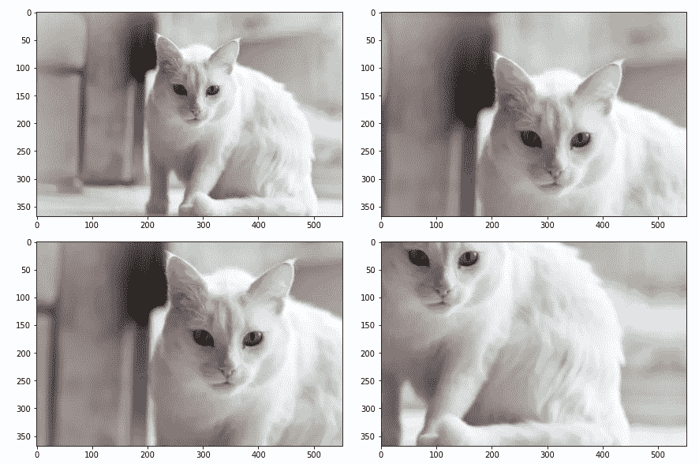

*   *torch vision . transforms . randomhorizontal flip(p)*:该函数将按照给定的概率随机水平翻转给定的图像。

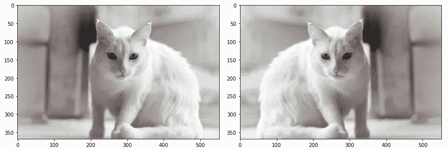

*   *torch vision . transforms . randomverticalflip(p)*:这个函数会以给定的概率随机垂直翻转给定的图像。

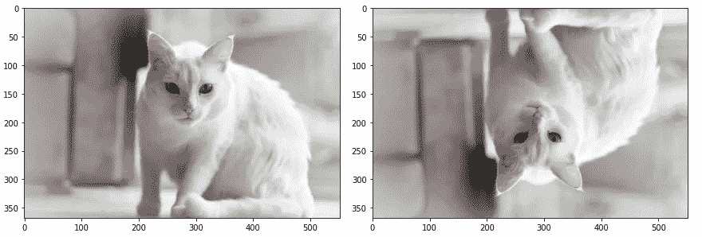

*   *torch vision . transforms . random perspective(distortion _ scale，p)* :该函数将对随机给定概率的给定图像进行透视变换。它通过扭曲整个图像来降低模型学习的透视效果。

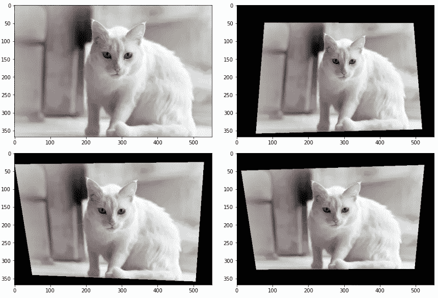

*   *torch vision . transforms . gray(num _ output _ channels)*:将图像转换为灰度。这有时有助于 CNN 模型使用单通道进行更快的训练，并且更容易地学习图像的模式。

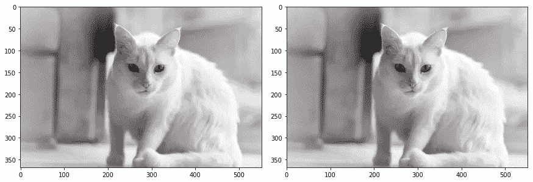

*   *torch vision . transforms . color jitter(亮度、对比度、饱和度、色调):I* 可以随机改变图像的亮度、对比度和饱和度

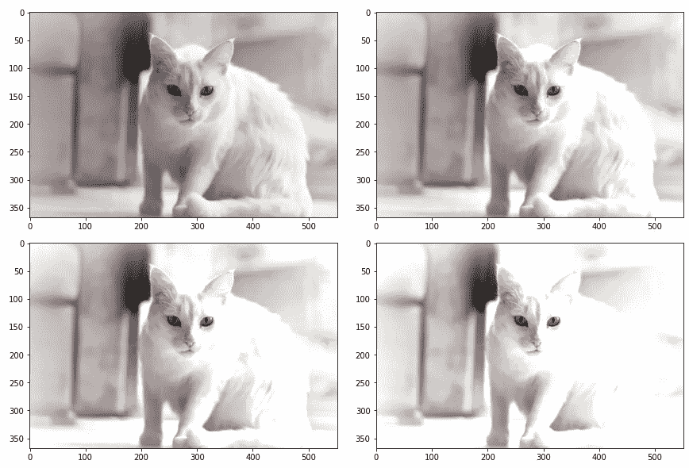

*   *torch vision . transforms . Normalize(mean，std):* 用均值和标准差归一化张量图像。它将有助于 CNN 模型轻松转换到全局最小值或快速减少损失。如果你想知道为什么数据规范化是必不可少的，以及如何进行规范化以提高机器学习模型的性能，你可以参考下面的博客。

[](/push-the-accuracy-of-machine-learning-model-with-numerical-variable-transformation-in-pytorch-9f56c56203fd) [## 用 Pytorch 中的数值变量转换提高机器学习模型的精度

### 这个故事提供了在 Pytorch 中实现转换技术和提高代码准确性的完整指南

towardsdatascience.com](/push-the-accuracy-of-machine-learning-model-with-numerical-variable-transformation-in-pytorch-9f56c56203fd) 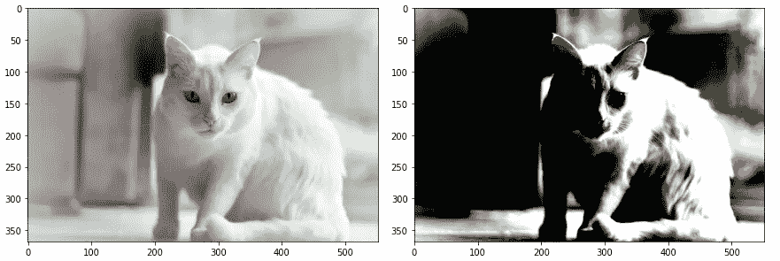

*   torch vision . transforms . random erasing(p，scale，ratio，value)在图像中随机选择一个矩形区域并擦除其像素。该方法对 CNN 模型进行惩罚，有助于防止训练时的过拟合现象。

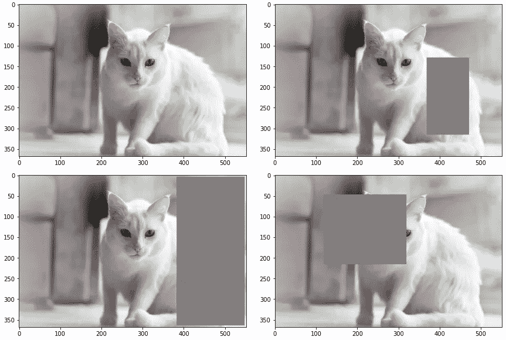

增强也可以应用于 NLP 以提高性能。例如:在句子中随意插入、调换、替换单词；在翻译中使用中间语言(反向翻译)，打乱句子。

有几个库提供了优秀的增强模块，如白蛋白，NLPAug...下面是一篇来自 neptune.ai 的很棒的进一步探索的文章。

[](https://neptune.ai/blog/data-augmentation-nlp) [## NLP 中的数据扩充:来自 Kaggle Master 的最佳实践

### 在自然语言处理中有许多任务，从文本分类到问题回答，但是无论你做什么，数据的数量…

海王星. ai](https://neptune.ai/blog/data-augmentation-nlp) 

# 在 CNN 模型上评估转换技术📄

让我们讨论变换技术对 CNN 模型的影响。本实验中使用的数据集是来自 [Kaggle](https://www.kaggle.com/c/dog-breed-identification/overview) 竞赛的**犬种识别**，该竞赛提供了 [ImageNet](https://www.kaggle.com/c/imagenet-object-detection-challenge) 的严格犬子集，以便练习细粒度的图像分类。该数据集包括 120 个品种的狗，总共有 10，222 张图像。我们以 0.8/0.2 的比率将数据分割为训练/有效。

在本文中，预训练的 ResNet [2](残差网络)模型将被用作分类 CNN 模型的主干。ResNet 是 SOTA 预训练模型之一，在广泛的计算机视觉任务中显示出良好的结果。ResNet 的主要思想不是用函数 H(x)(多层感知器网络的堆叠)直接学习图像的输入特征，而是提供一个残差函数，它可以重构 H(x) = F(x)+x，其中 F(x)和 x 分别表示堆叠的非线性层和恒等函数(输入=输出)。这种思想可以解决深层神经元网络(消失梯度)的退化问题，因为它比原始映射函数更容易优化残差映射函数 F(x)。

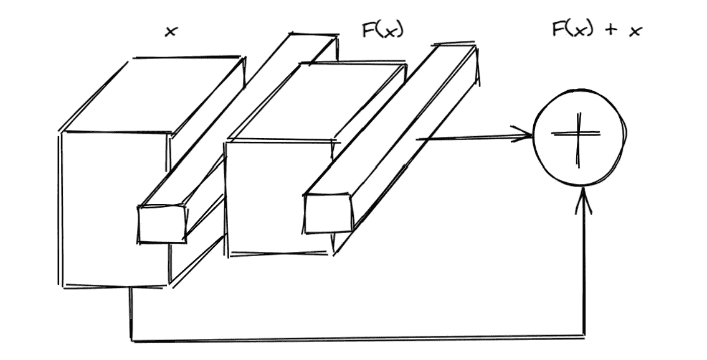

首先，我们将加载原始数据。

```
# Create a custom Dataset class to read in data from dataframe
class BreedDogDataset(Dataset):
    def __init__(self, dataframe, root_dir, transform=None):
        self.dataframe = dataframe
        self.root_dir = root_dir
        self.transform = transform

    def __len__(self):
        return (len(self.dataframe))

    def __getitem__(self, idx):
        img_name = os.path.join(self.root_dir,
                  self.dataframe.iloc[idx, 0])
        image = Image.open(img_name)
        target = self.dataframe.iloc[idx, 1]
        target_processed = breeds_processed_dict[target]
        if self.transform:
            image = self.transform(image)
        sample = (image, target_processed)
        return sampletransform = transforms.Compose([transforms.Resize((255, 255)),
                                transforms.ToTensor()])train_ds = BreedDogDataset(df_train,TRAIN_DIR, transform=transform)
val_ds = BreedDogDataset(df_val,TRAIN_DIR, transform=transform)
```

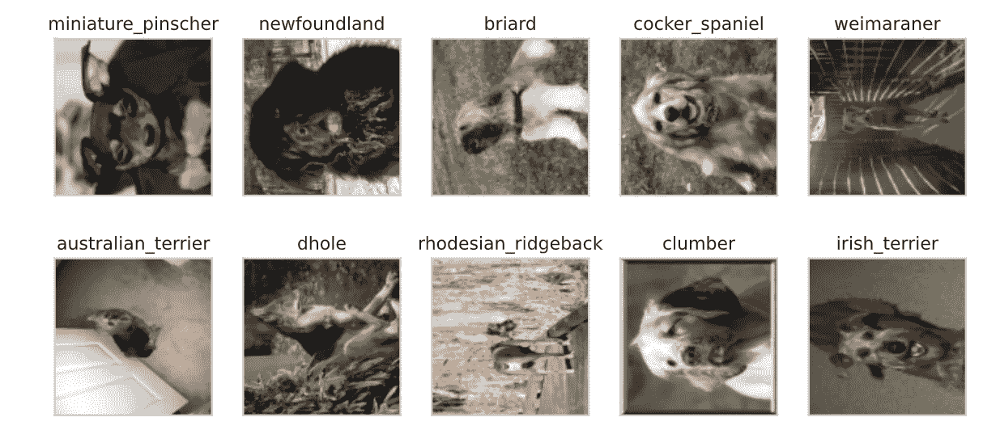

然后我们创建一个这样的结构模型:

```
# load pre-trained model
conv_base = models.resnet50(pretrained=True)# create a new model class
class Model(nn.Module):
    def __init__(self, base_model, output):
        super(Model, self).__init__()
        self.base_model = base_model
        self.output = output
        self.fc1 = nn.Linear(n_outs, 512)
        self.fc2 = nn.Linear(512, output)
        self.dropout = nn.Dropout(0.5)

    def forward(self, image):
        x = self.base_model(image)
        x = self.dropout(x)
        x = F.relu(self.fc1(x))
        x = self.dropout(x)
        outs = self.fc2(x)
        return outs
```

在深度学习模型中要调整的最重要的超参数之一是学习速率。选择正确的学习率非常重要，如果学习率太高，模型将面临发散问题，但如果学习率太低，模型将需要很长时间才能收敛。这个想法是，我们可以通过数百次迭代训练模型来找到一个好的学习率，然后基于学习曲线，我们获得一个好的学习率。学习率调度技术有很多，例如，功率调度、指数调度、1 周期调度、常数调度……在这个实验中，我们将应用**1 周期调度**。在 Leslie Smith 的[论文](https://arxiv.org/abs/1803.09820?source=post_page---------------------------)中，这项技术被证明可以显著提高训练时间。你可以看看这个博客了解更多的解释。

[](/finding-good-learning-rate-and-the-one-cycle-policy-7159fe1db5d6) [## 找到好的学习率和一个周期的政策。

### 介绍

towardsdatascience.com](/finding-good-learning-rate-and-the-one-cycle-policy-7159fe1db5d6) 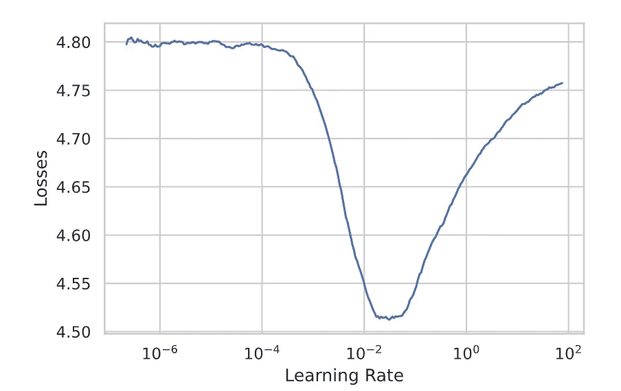

模型的学习曲线

根据上面的学习曲线结果，它显示下限是 0.9E-04，I 取整值为 1.0E-03。现在，我可以通过使用经验法则定义学习速率的范围来微调新图像数据集上的预训练 ResNet50:从比损失最小的学习速率低一个数量级的速率开始，到“安全”速率 1E-03 结束。

经过 5 个历元的训练，有效集的正确率为 83.284 %

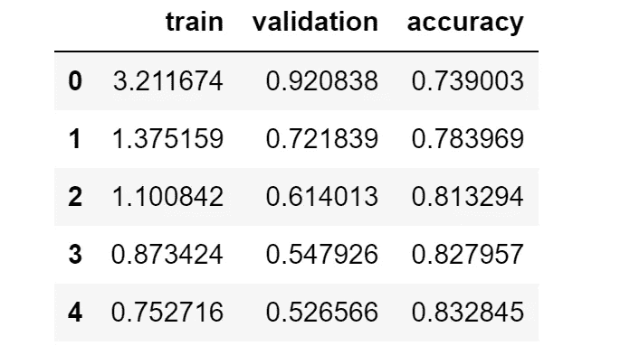

列车损失和有效损失如下所示。可以看到两个值都降低了。从第 4 代到第 5 代，损失和准确性几乎是恒定的。这意味着模型已经从数据中学习了相对的一切，所有帮助模型区分品种狗的好信息都被捕捉到了。

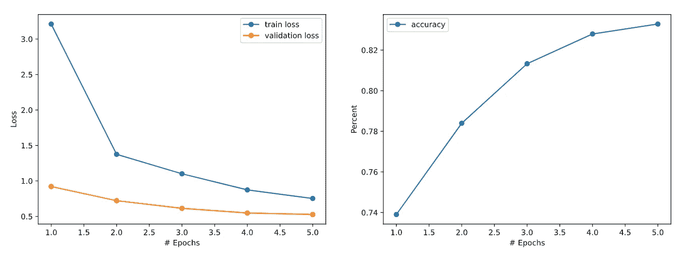

然后，我们检查前 6 个损失最高的图像。我们可以看到，模型对一些图像进行错误分类的原因之一是，狗的品种预测与其他不同品种的样本相似，这甚至是人类无法区分它们。为了解决这个问题，转换技术非常有希望帮助模型深入学习每个品种的模式。另一个问题是，一些图片有 2 只不同的狗，但标签上只显示一只。错误的标签也是另一个问题。这些问题无法解决，这似乎是一个异常情况。

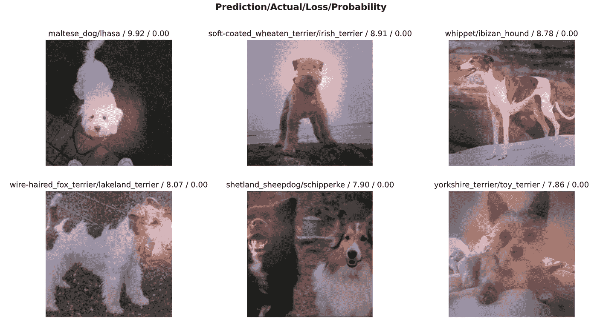

让我们在这个数据集中应用一些转换技术。

```
mean = [0.4766, 0.4527, 0.3926]
std = [0.2275, 0.2224, 0.2210]# define transform function
transforms_train = transforms.Compose([
    transforms.Pad(25, padding_mode='symmetric'),
    transforms.RandomHorizontalFlip(), 
    transforms.RandomRotation(10),
    transforms.ToTensor(),
    transforms.Normalize(mean, std),
    transforms.RandomErasing(p=0.75,scale=(0.02, 0.1),value=1.0, inplace=False)
])transforms_val = transforms.Compose([
    transforms.Resize((255, 255)),
    transforms.ToTensor(),
    transforms.Normalize(mean, std)
])

# load in the temporary dataset from the original dataframe with transform
train_ds = BreedDogDataset(df_train,TRAIN_DIR, transform=transforms_train)val_ds = BreedDogDataset(df_val,TRAIN_DIR, transform=transforms_val)
```

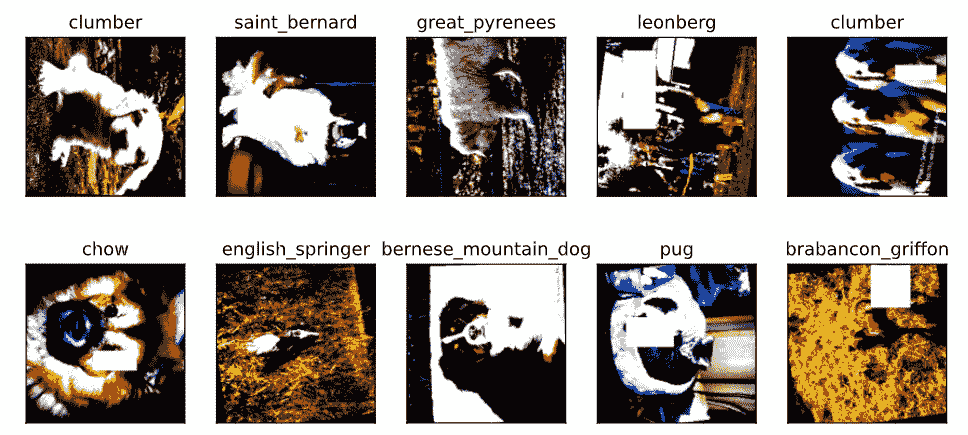

转换后的训练数据集

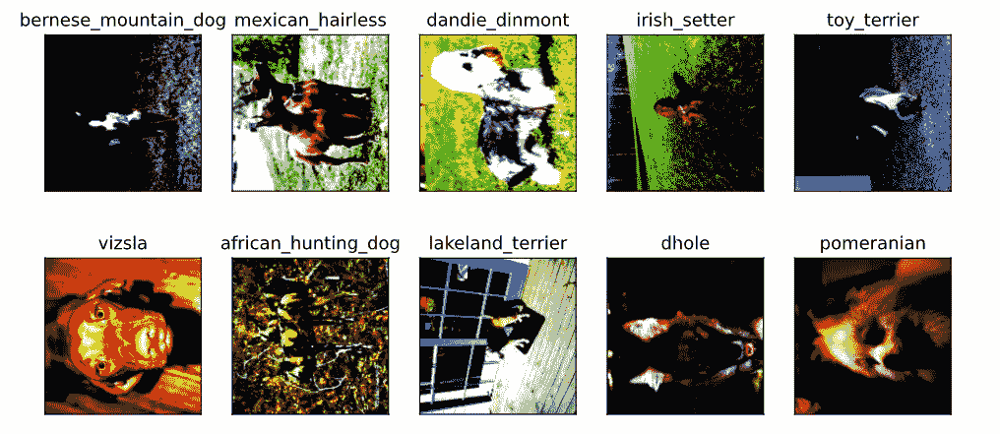

转换后的有效数据集

在变换后的数据集上用 5 个历元进行训练后，我们得到有效集的准确率达到 0.817，与原始图像相比略有下降。

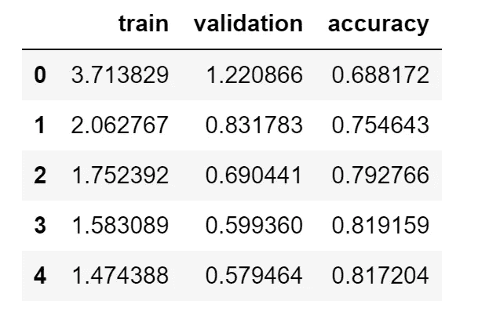

新的列车损失和有效损失如下所示。与上述模型相比，列车损失和有效损失之间的距离增加，而第 4 和第 5 个时期的精度略有下降。这表明新模型面临着不匹配的问题。通常，转换确实有助于模型防止过度拟合问题。然而，在这种情况下，因为先前的模型没有过拟合问题，并且训练损失甚至高于有效损失，所以当应用变换时，没有改善。

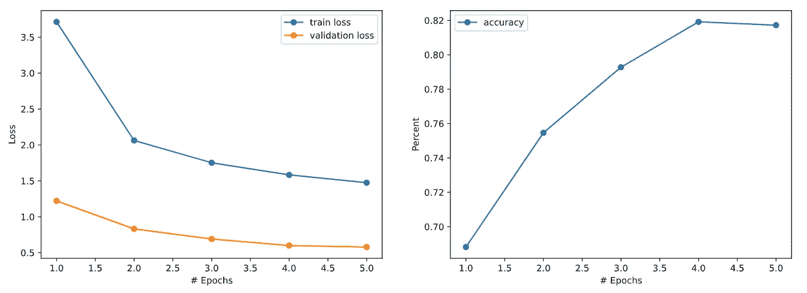

让我们看看损失最大的前 6 张图片。我们可以看到一些混乱的图像现在可以被分类，但有些还没有。然而，这个问题无法解决，一些异常值仍然会影响模型的性能。

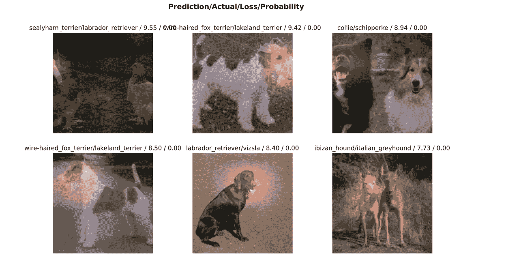

# 最后的想法📕

这个博客的主要目的是介绍一些转换图像的技术。从根本上说，这将有助于避免过拟合问题，以及增加 CNN 模型的训练数据的数量。但这并不意味着变换总是会提高模型的精度，它必须依赖于输入图像(卫星、细菌、动物、物体、..)和模型结构。许多 Deep-ML 实践者遇到了这个问题，他们通常在检查他们的模型可以从他们的原始图像学习到什么程度之前进行转换。如果模型不符合原始图像，转换数据无助于解决问题，换句话说，它会降低模型的准确性。因此，我们必须一步一步地诊断我们的模型，并通过最坏的预测来分析可视化的结果。

如果你想进一步讨论，可以联系我。这是我的 LinkedIn

尽情享受吧！！！👦🏻

# 参考

[1]https://en.wikipedia.org/wiki/Data_transformation

[2] [何](https://arxiv.org/search/cs?searchtype=author&query=He%2C+K)、[、](https://arxiv.org/search/cs?searchtype=author&query=Zhang%2C+X)、【邵青任、[、](https://arxiv.org/search/cs?searchtype=author&query=Sun%2C+J)，深度残差学习用于图像识别，2015。