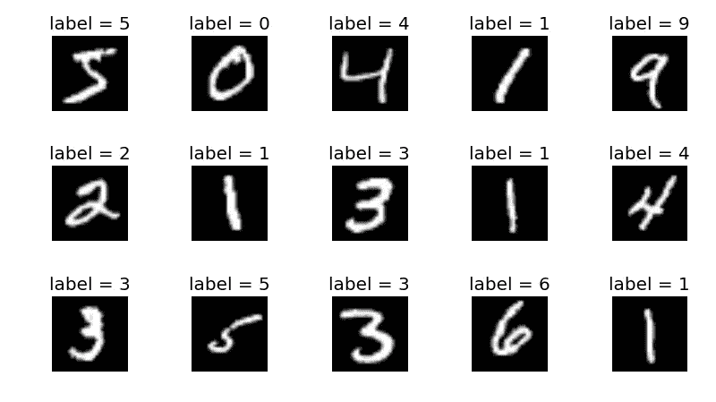
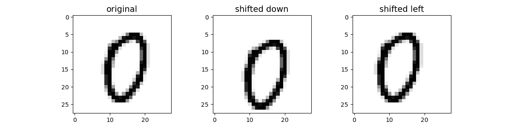

# 机器学习:使用数据扩充提高 MNIST 的分类精度

> 原文：<https://towardsdatascience.com/improving-accuracy-on-mnist-using-data-augmentation-b5c38eb5a903?source=collection_archive---------9----------------------->

## 增加训练数据集的简单方法

**MNIST** 数据集有被称为**你好世界**的图像分类。每个机器学习工程师迟早都会处理这个数据集。

# **数据集**

MNIST 是一组手写数字的小图像。请看下图，其中有一些例子。

MNIST 数据集

> 共有**70000 张图像**，每张图像有 **784 个特征**。这是因为每幅图像都是 28 x 28 像素，每个特征代表一个像素的强度，从 0 到 255。

有许多分类算法(SGD，SVM，RandomForest 等)可以在这个数据集上训练，包括深度学习算法(CNN)。

# 培训和评估

我们以 **RandomForest** 分类器为例，在上面的数据集上对其进行训练，并进行评估。

在**测试集**上评估或建模后，我们得到的准确度分数是 **0.9705**

# 我们能提高准确性吗？

我们可以通过**调整算法的超参数**或者尝试**不同的算法**来改进。但是我们能对数据集做些什么吗？

是的，我们可以！(是的，我们也会打败新冠肺炎)

有时算法需要更多的数据集来提高预测功能，我们可以使用相同的数据集本身来扩展数据集。

## 如何扩展数据集？

正如我们之前所讨论的，数据集的每个实例只不过是( *784* )个像素值的向量。(这实际上是一个代表 *28x28* 图像)

如果我们把图像向两边移动两个像素会怎么样？请看下面的例子。

增强图像

这些图像会聚在一起，对吗？如果我们生成这样的图像，并将其添加到我们的训练集中，然后再次训练模型，会怎么样呢？我们可能会得到更准确的预测。

## 履行

我们可以编写一个方法，按照给定的顺序在四个方向上移动图像。

我们将把图像向四个方向移动一个像素，并从一幅图像中再生成四幅图像。结果数据集现在将包含 ***3，00，000 张*** 图像( *60000 x 5* )。

我们可以为每一次移位增加 **60，000** 个实例。

让我们在这个新数据集上训练模型并进行评估。

瞧啊。！！精度得分现在是 ***0.9803*** 。

我们将精度提高了 ***~0.01%*** 。这太棒了。

## 结论

*   我们已经从现有的数据集扩展了我们的数据集，使用“**数据扩充**”技术，通过简单地改变像素顺序。
*   在这个更大的数据集上进行训练，我们的准确率提高了 0.01%

请在下面的 GitHub 位置找到完整的代码

 [## 阿卡什 1712/毫升-阿卡什

### 机器学习的注释和代码:https://akashp1712.github.io/ml-akash-阿卡什 1712/ml-阿卡什

github.com](https://github.com/akashp1712/ml-akash/tree/master/Articles/data-augmentation) 

# 更多想法？

*   你能增加更多的数据集吗？(**提示**:对角移动图像)
*   尝试其他算法，而不是随机森林，比如 **KNeighborsClassifier** 或 **SVM**

> 当你纠结于一个问题的时候，就是你理解它的时候——埃隆·马斯克